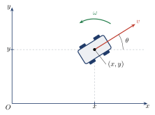
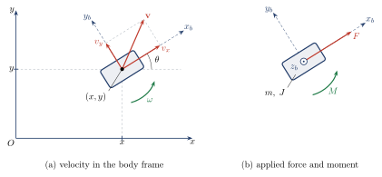
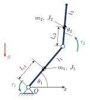
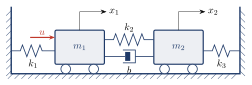

# ME404: Dynamics and Control of Mechanical Systems, Fall 2026
## Problem Set \#1: Modeling and Dynamics

**Due Date**: 3:30 PM, Tuesday, September 29, 2026

### Problem \#1

#### (Part A) Dubin's Kinematics (**NO AI**)
A wheeled cart moves in a horizontal plane. Let $(x,y)$ be the position of the cart's center in a fixed inertial frame, and let $\theta$ be the vehicle heading, measured counterclockwise from the $x$-axis. The cart is driven forward along its heading with speed $v(t)$ and turns with angular rate $\omega(t)$. Assume the wheels roll without slipping, so the cart's velocity is always directed along its heading — it cannot translate sideways.

Taking the state to be $q=(x,y,\theta)$ and the inputs to be $u=(v,\omega)$, derive the differential equations $\dot q = f(q,u)$ that describe the kinematics of the cart.

#### (Part B) Dubin's Dynamics (**NO AI**)
The vehicle of Part A is now free to slip sideways — model it as a rigid body of mass $m$ moving in a horizontal plane, with moment of inertia $J$ about the vertical axis through its center of mass.

Attach a body frame at the center of mass: the $x_b$-axis points forward along the heading, the $y_b$-axis points to the vehicle's left, and the $z_b$-axis points out of the plane, forming a right-handed triad. As before, $\theta$ is the heading measured counterclockwise from the inertial $x$-axis, and $\omega = \dot\theta$. Let $(v_x, v_y)$ be the vehicle's velocity **expressed in the body frame**.

The vehicle is driven by a force $F(t)$ applied at the center of mass along the body $x_b$-axis, and a moment $M(t)$ about the body $z_b$-axis. Neglect friction and aerodynamic drag.

**(a)** Apply Newton's and Euler's laws to derive differential equations for $v_x$, $v_y$, and $\omega$. Be careful: the body frame *rotates*, so the inertial acceleration is not simply the time derivative of the body-frame velocity components.

**(b)** Combine your result with the kinematics of Part A to write a full state model $\dot q = f(q,u)$, with state $q = (x,y,\theta,v_x,v_y,\omega)$ and input $u = (F,M)$.

### Problem \#2 (**NO AI**)
A two-link planar arm moves in a **vertical** plane under gravity $g$, as shown. Link 1 is pinned to a fixed base at $O$; link 2 is pinned to the far end of link 1.

Let $\theta_1$ be the angle of link 1, measured counterclockwise from the horizontal, and let $\theta_2$ be the angle of link 2 **measured counterclockwise from link 1**, so that $\theta_2 = 0$ means the two links are collinear.

Link $i$ ($i=1,2$) has length $l_i$ and mass $m_i$, and its center of mass lies a distance $l_{ci}$ from the joint at its base. Let $J_i$ be the moment of inertia of link $i$ about its own center of mass. A motor at each joint applies torque $\tau_1$ at the base and $\tau_2$ at the elbow. Neglect joint friction.

**(a)** Write the positions of both centers of mass in terms of $\theta_1$ and $\theta_2$, differentiate to obtain their velocities, and form the total kinetic energy $T$ and potential energy $V$ of the arm.

**(b)** Using Lagrange's equations, derive the nonlinear equations of motion. Arrange them in the standard form
$$M(\theta)\,\ddot\theta + C(\theta,\dot\theta)\,\dot\theta + g(\theta) = \tau,$$
where $\theta = (\theta_1,\theta_2)^T$ and $\tau = (\tau_1,\tau_2)^T$, and identify the inertia matrix $M(\theta)$, the velocity-coupling matrix $C(\theta,\dot\theta)$, and the gravity vector $g(\theta)$.

**(c)** Identify which terms in your result are responsible for the nonlinearity, and explain physically what the off-diagonal entries of $M(\theta)$ represent. Verify that $M(\theta)$ is symmetric.

**(d)** Verify that $\theta_1 = \pi/2$, $\theta_2 = 0$ — both links pointing vertically upward — is an equilibrium of the system with $\tau = 0$. Introducing the deviation coordinates $\varphi_1 = \theta_1 - \pi/2$ and $\varphi_2 = \theta_2$, linearize your equations of motion about this equilibrium to obtain $$M_0\,\ddot\varphi + K\,\varphi = \tau,$$ and give $M_0$ and $K$ explicitly in terms of the link parameters. What becomes of the $C(\theta,\dot\theta)\dot\theta$ term, and why?

**(e)** Use your linearized model from (d) and determine the _four_ transfer functions (one for each pair of inputs and outputs). What is the characteristic polynomial? 

### Problem \#3 (**AI ONLY ALLOWED ON PARTS E and F**)
The system shown below consists of two carts of mass $m_1$ and $m_2$ rolling without friction on a horizontal surface; the rollers are massless. Cart 1 is connected to the left wall by a spring $k_1$, cart 2 to the right wall by a spring $k_3$, and the carts are connected to each other by a spring $k_2$ in parallel with a viscous damper $b$. A force $u(t)$ acts on cart 1 in the positive direction.

Let $x_1$ and $x_2$ be the cart displacements, measured positive to the right from the configuration in which all three springs are at their natural lengths. The springs are linear, the damper is linear viscous, and the damper is the only source of dissipation.

**(a)** Draw a free-body diagram for each cart and derive the two coupled equations of motion. Explain why $b$ and $k_2$ appear in *both* equations, and why they appear only through the difference $x_1 - x_2$.

**(b)** Take Laplace transforms of both equations with zero initial conditions, and solve the resulting pair of algebraic equations for $X_1(s)$ and $X_2(s)$. Report the two transfer functions $X_1(s)/U(s)$ and $X_2(s)/U(s)$, and the characteristic polynomial $\Delta(s)$, in terms of the physical parameters. Identify the zeros of each transfer function and explain physically why $X_2/U$ has only one zero while $X_1/U$ has two.

**(c)** Take $m_1 = m_2 = 1$ kg, $k_1 = k_3 = 10$ N/m, $k_2 = 5$ N/m, $b = 0.5$ N·s/m. Show that $\Delta(s)$ factors into two quadratics, and find the natural frequency and damping ratio of each. What is unusual about one of them?

**(d)** Now let $u \equiv 0$ and allow nonzero initial displacements $x_1(0) = a_1$, $x_2(0) = a_2$, with both initial velocities zero. Re-transform the equations of motion, *retaining the initial-condition terms*, and solve for $X_1(s)$ and $X_2(s)$. Using the parameters of part (c), evaluate your expressions for each of these three cases and simplify completely:
1. $a_1 = a_2 = 1$ m
2. $a_1 = 1$ m, $a_2 = -1$ m
3. $a_1 = 1$ m, $a_2 = 0$

Something notable happens in cases 1 and 2. What is it, and what does it tell you about which modes each initial condition excites?

**(e)** (**AI OKAY**) Invert your transforms from part (d) to obtain $x_1(t)$ and $x_2(t)$ in closed form for all three cases, and plot them over $0 \le t \le 30$ s. Account physically for the behavior in case 1 — what is the damper doing? Verify that case 3 is the superposition you would expect from cases 1 and 2.

**(f)** (**AI OKAY**) Repeat cases 1 and 3 for $b = 0$, $b = 2$, and $b = 10$ N·s/m, and then again with $m_2$ changed to $3$ kg (keeping $b = 0.5$). Describe how each response changes. Why does breaking the symmetry overturn the conclusion you reached in part (e)?

**(g)** With $m_2 = 3$ kg and the other parameters as in part (c), use the final value theorem on $X_1(s)/U(s)$ and $X_2(s)/U(s)$ to predict the steady-state displacements under a unit step force. Verify both predictions by a static force balance on the two carts, and confirm them against a simulated step response.

