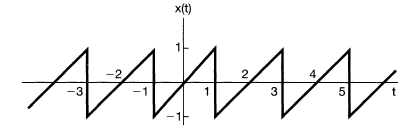
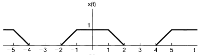
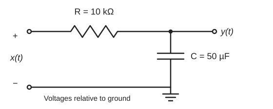
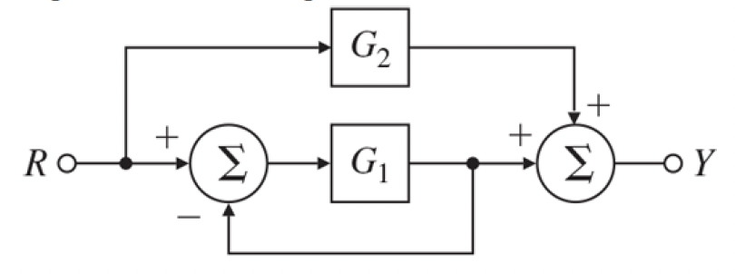
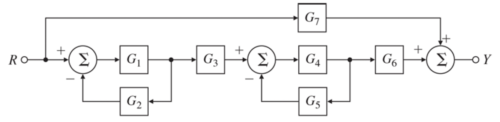
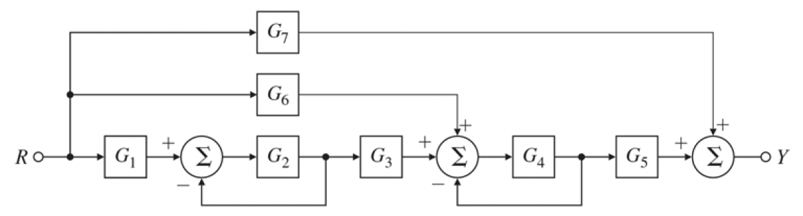
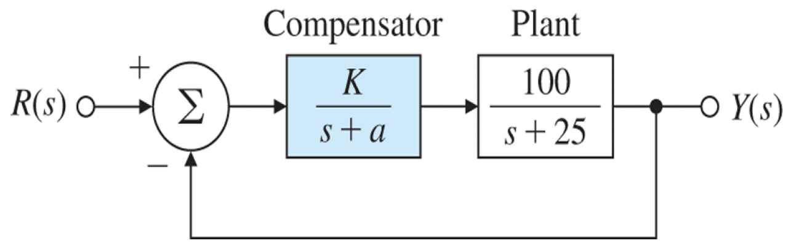

# ME404: Dynamics and Control of Mechanical Systems, Fall 2026
## Problem Set \#2: Signals and Systems

~~**Due Date**: 11:59 PM, Thursday, October 8, 2026~~
**Due Date**: 11:59 PM, Thursday, October 15, 2026

### Problem \#1 (**AI ONLY ALLOWED ON PARTS A(iii), B(iii), AND D(ii)**)
*Source: adapted from Oppenheim, Willsky, and Nawab, Signals and Systems, 2nd ed., Problem 3.22.*

In this problem, we will use _Fourier series_ to express two periodic signals as sums of complex exponentials, then use those harmonics to predict the output of an RC filter. The piecewise-smooth periodic signals considered here have Fourier series that converge to the signal at every continuity point and to the average of the left- and right-hand limits at a jump. The value assigned to the signal at an individual jump does not affect its Fourier coefficients.

For these signals, with period $T>0$, we write the representation at continuity points as
$$
x(t) = \displaystyle\sum_{k=-\infty}^{\infty} c_k e^{j2\pi kt/T}.
$$

Here $j^2=-1$, $k\in\mathbb{Z}$ is the harmonic index, and the $c_k$ are the (generally complex) _Fourier coefficients_. The fundamental angular frequency is $\omega_0=2\pi/T$, where $T$ is the fundamental period.

> Finding the complex exponential representation of each signal amounts to finding its Fourier coefficients.

The Fourier coefficients can be found by evaluating the following integral for each $k\in\mathbb{Z}$:
$$
c_k = \frac{1}{T}\int_{t_0}^{t_0+T} x(t)e^{-j2\pi kt/T} dt.
$$

The integral is evaluated over a _single period_ of the signal.

> Choose any starting time $t_0$ and integrate from $t_0$ to $t_0+T$. Some choices simplify the calculation. Keep the time origin shown in the figure fixed: changing the integration interval does not shift the signal.

For each waveform, choose a convenient interval of length $T$ and split your expression wherever the slope changes or the signal jumps. State that the expression repeats periodically outside this interval.

For the input reconstructions in Parts A and B, use the partial sum
$$
x_N(t)=\sum_{k=-N}^{N}c_k e^{j2\pi kt/T},
\qquad N=3,10,50.
$$
Here $N$ is the highest harmonic retained, so the sum includes $2N+1$ coefficient slots, including $c_0$; some coefficients may be zero. Overlay the original signal and each approximation over at least two periods, using labeled axes and a legend. You may use MATLAB or Python; include your code with your plots.

AI use in this problem is limited to the plotting parts A(iii), B(iii), and D(ii). There, an AI assistant may help you turn the coefficient formulas you derived by hand into summation and plotting code. It may not derive, check, or correct the coefficients themselves, and all other parts are to be completed without AI. The plots are your own check of the hand derivation: if a reconstruction does not approach the waveform as $N$ grows, revisit your integral.

For reference, see [Signals Built from Exponentials, §3](../../book-notes/signals-fourier_student.md#section-3) for Fourier coefficients, conjugate pairs, and convergence at jumps.

#### (Part A) Sawtooth Wave
For the sawtooth wave below:

**(i)** Identify the fundamental period $T$ and write an expression for $x(t)$ over a single period. (Hint: placing the jump at a boundary of your interval simplifies the expression.)

**(ii)** Before integrating, predict the mean value and identify any even or odd symmetry about $t=0$, ignoring the values assigned at jumps. What does this symmetry imply about the real and imaginary parts of the coefficients? Then compute $c_0$ separately and derive a formula for $c_k$ for all nonzero integers $k$. Check your results against your predictions.

**(iii)** (**AI OKAY**) Plot the partial sums specified above. Verify that $c_{-k}=\overline{c_k}$ and explain why pairing the positive and negative harmonics makes the reconstruction real.

#### (Part B) Slew-Rate Limited Wave
For the slew-rate limited square wave below, the transitions have finite slopes rather than instantaneous jumps:

**(i)** Identify the fundamental period $T$ and write a piecewise expression for $x(t)$ over a single period.

**(ii)** Before integrating, predict the mean value and identify any even or odd symmetry about $t=0$. What does this symmetry imply about the real and imaginary parts of the coefficients? Then compute $c_0$ separately and derive a formula for $c_k$ for all nonzero integers $k$. Check your results against your predictions.

**(iii)** (**AI OKAY**) Plot the partial sums specified above. Verify that $c_{-k}=\overline{c_k}$, so the reconstruction is real.

#### (Part C) Comparing the Reconstructions

In a short paragraph, compare the two reconstructions at the same value of $N$. Relate the decay of the nonzero coefficient magnitudes to jumps in the signal versus jumps in its slope. Explain why the behavior near a sawtooth jump differs from the behavior near a corner of the continuous waveform as $N$ increases. See the discussion of the _Gibbs phenomenon_ in [§3.5 of the notes](../../book-notes/signals-fourier_student.md#section-3-5).

#### (Part D) Passing the Sawtooth Through an RC Filter

Apply the sawtooth from Part A as the input voltage $x(t)$ to the circuit below, interpreting its vertical axis in volts and its time axis in seconds. A resistor $R=10\,\mathrm{k\Omega}$ connects the ideal voltage source to a capacitor $C=50\,\mu\mathrm{F}$ connected to ground. The output $y(t)$ is the voltage across the capacitor, measured without drawing current. Assume ideal components.

The resistor current is $(x-y)/R$, and the capacitor current is $C\dot y$. Equating them gives the model below; the transfer function is defined with zero initial capacitor voltage:
$$
RC\dot y+y=x,
\qquad
G(s)=\frac{Y(s)}{X(s)}=\frac{1}{RCs+1},
\qquad
\tau=RC=0.5\ \mathrm{s}.
$$
Here $X(s)$ and $Y(s)$ denote voltage transforms; $c_k$ and $d_k$ below denote Fourier coefficients. This is an RC _low-pass filter_: it attenuates higher-frequency components more strongly than lower-frequency components. See [Convolution and Impulse Response, §3.5](../../book-notes/convolution-impulse-response_student.md#section-3-5) for the circuit model.

**(i)** Let $d_k$ be the Fourier coefficients of the periodic steady-state output. Using the response to a complex exponential, explain why
$$
d_k=G(jk\omega_0)c_k,
\qquad \omega_0=\frac{2\pi}{T}.
$$
Substitute the RC transfer function to express $d_k$ in terms of your sawtooth coefficients. Why must each harmonic use $G$ evaluated at its own frequency? Check that $d_{-k}=\overline{d_k}$, so the output reconstruction is real.

**(ii)** (**AI OKAY**) Reuse your Fourier-sum code to construct
$$
y_{ss,N}(t)=\sum_{k=-N}^{N}d_k e^{jk\omega_0t}
$$
with $N=50$. Make one figure with two panels: (1) the original sawtooth input and the reconstructed output over at least two periods, with voltage and time axes labeled; (2) stem plots comparing $|c_k|$ and $|d_k|$ for $k=1,\ldots,10$. These are magnitudes of individual complex coefficients, not the amplitudes of the real sinusoids obtained by pairing positive and negative harmonics.

**(iii)** Use the coefficient comparison to explain the smoother output. For large $|k|$, how does the decay rate of $|d_k|$ compare with that of $|c_k|$ and with the coefficients of the slew-rate limited waveform in Part B? Relate the continuity of the output voltage to the capacitor equation. Finally, explain why the harmonic sum describes the periodic steady state rather than, in general, the complete response immediately after the source is switched on. See [Signals Built from Exponentials, §4](../../book-notes/signals-fourier_student.md#section-4).

### Problem \#2 (**NO AI**)

Solve the following initial-value problems for $t\ge0$ using the unilateral Laplace transform. Show the initial-condition terms explicitly when transforming derivatives. Use partial fractions where needed, applying the _cover-up method_ to simple poles and coefficient matching or completing the square where appropriate. Invert using standard transform pairs, and give each solution as a real-valued expression for $t\ge0$.

For each of parts (a)–(c):

1. **Predict:** Before finding the inverse transform, identify the natural poles from the homogeneous equation and predict whether its response decays, persists, or grows. Distinguish these poles from any additional poles introduced into $Y(s)$ by the forcing.
2. **Solve:** Show the transformed equation, your expression for $Y(s)$, and the steps used to invert it.
3. **Verify:** Check both initial conditions and substitute your solution into the original ODE. Explain how the result agrees with your prediction, accounting for the forcing when present.

For guidance, see [Convolution and Impulse Response, §7.2](../../book-notes/convolution-impulse-response_student.md#section-7-2) for partial fractions and [§7.3](../../book-notes/convolution-impulse-response_student.md#section-7-3) for initial-value problems. A repeated pole requires all relevant powers of its denominator factor; the simple-pole cover-up rule alone does not determine every coefficient.

**(a)** $\ddot{y}(t) + \dot{y}(t) + 3y(t) = 0; y(0) = 1, \dot{y}(0) = 2$

**(b)** $\ddot{y}(t) + \dot{y}(t) = \sin(t); y(0) = 1, \dot{y}(0) = 2$

**(c)** $\ddot{y}(t) + y(t) = t; y(0) = 1, \dot{y}(0) = -1$

**(d) Comparing initial-condition effects.** For which of these systems do all effects of the initial conditions eventually decay to zero? For each remaining system, describe what kind of initial-condition effect can persist. Is a positive coefficient multiplying $\dot y$ sufficient to make every initial-condition effect decay? Explain using the natural poles and homogeneous responses.

*Hint:* Compare two solutions of the same ODE with the same forcing but different initial conditions. Their difference satisfies the homogeneous equation.

**(e) Optional — final values.** For each solution, determine whether a finite final value exists. Check the conditions of the Final Value Theorem using the poles of $sY(s)$ before applying it. In part (b), also calculate the formal limit $\lim_{s\to0}sY(s)$ and explain why the existence of that limit alone is not sufficient to establish a final value in time. See [§8.1 of the notes](../../book-notes/convolution-impulse-response_student.md#section-8-1).

### Problem \#3 (**NO AI**)

Consider a causal linear time-invariant (LTI) system, initially at rest, with impulse response
$$
h(t)=\begin{cases}1,&0\le t\le 2,\\0,&\text{otherwise}.\end{cases}
$$

Let $u(t)$ denote the input and $y(t)$ the output. Use $1(t)$ for the unit step: $1(t)=0$ for $t<0$ and $1(t)=1$ for $t\ge0$. In parts (a)–(c), the input is $u(t)=1(t)$.

**(a)** Using the convolution integral, find the _unit-step response_ $y(t)$. For each of the ranges $t<0$, $0\le t<2$, and $t\ge2$, identify the interval of the integration variable $\tau$ on which $u(\tau)h(t-\tau)$ is nonzero. Show how this overlap determines the integration limits. Give your answer as a piecewise function and sketch it, labeling the values at $t=0$ and $t=2$ and the final value.

For help setting up the integral, see [Convolution and Impulse Response, §2.4](../../book-notes/convolution-impulse-response_student.md#section-2-4). The [worked-example video](https://www.youtube.com/watch?v=zoRJZDiPGds) provides additional practice with convolution.

**(b)** Find the transfer function $H(s)=\mathcal L\{h(t)\}$ by evaluating the Laplace-transform integral.

**(c)** Use $H(s)$ and the Laplace transform of the unit step to find $Y(s)$, then invert it to recover $y(t)$. Give your answer both in terms of ramps multiplied by unit steps and as a piecewise function. Verify that it agrees with part (a). Explain why $y(t)$ is continuous at $t=2$ even though its slope changes there.

*Hint:* Use the time-delay property in [§6 of the notes](../../book-notes/convolution-impulse-response_student.md#section-6). When a ramp is delayed, both its argument and the time at which it switches on must shift.

### Problem \#4 (**NO AI**)

For each diagram, find the transfer function $T(s)=Y(s)/R(s)$ in terms of the blocks $G_i(s)$. Assume scalar LTI blocks, zero initial conditions, and well-defined interconnections. Label intermediate signals and show either the signal equations or successive block reductions used to obtain your result. For part (c), use both methods and check that they agree.

For each check below, first predict the surviving signal paths directly from the diagram, then confirm that your transfer function reduces to the expected expression. Setting a block to zero removes its contribution; it does not replace the block with a direct connection.

See [Block Diagrams and Pole Locations, §§2–3](../../book-notes/block-diagrams_student.md#section-2) for feedback reduction and elimination of intermediate signals.

**(a)**

Find $T(s)$, then check the case $G_2(s)=0$.

**(b)**

Find $T(s)$, then check the case $G_7(s)=0$.

**(c)**

Find $T(s)$ by block reduction and independently by writing and eliminating intermediate-signal equations. Check the case $G_3(s)=0$. Explain why the contribution through $G_6$ is affected by the feedback around $G_4$, while the contribution through $G_7$ is not.

### Problem \#5 (**AI ONLY ALLOWED ON PART D**)

Consider the unity negative-feedback system below, with compensator $C(s)=K/(s+a)$ and plant $P(s)=100/(s+25)$. The system is initially at rest and the reference is a unit step. Find **one acceptable pair** $K>0$, $a>0$ such that the closed-loop response has:

- Percent overshoot of no more than $25\%$.
- A $1\%$ settling time of no more than $0.1$ s.

Measure overshoot relative to the actual final output $y_\infty=\lim_{t\to\infty}y(t)$. The settling time is the earliest time after which the output remains within $y_\infty\pm0.01|y_\infty|$. Do not assume that $y_\infty=1$ simply because the feedback is unity.

*Source: adapted from Franklin, Powell, and Emami-Naeini, Feedback Control of Dynamic Systems, 8th ed., Problem 3.26 (7th ed., Problem 3.27).*

**(a)** Derive the closed-loop transfer function $T(s)=Y(s)/R(s)$. Match its denominator to $s^2+2\zeta\omega_n s+\omega_n^2$ to express $\omega_n$ and $\zeta$ in terms of $K$ and $a$. Also find the decay rate $\sigma=\zeta\omega_n$ and the DC gain $T(0)$.

**(b)** For an underdamped design, use the second-order overshoot formula to obtain a lower bound on $\zeta$. Use $t_s\approx4.6/(\zeta\omega_n)$ to obtain an initial constraint on $\sigma$. Sketch the corresponding approximate design region for the closed-loop poles in the $s$-plane. Distinguish the exact overshoot constraint from the approximate settling-time constraint.

**(c)** Select $K$ and $a$, show how you chose them, and report the resulting closed-loop poles. State the compensator pole location and its DC gain $C(0)$ separately from the parameter $K$. Many designs are acceptable; you do not need to find an optimal one. If you choose a critically damped or overdamped design, use the corresponding response rather than the underdamped formulas to assess it.

**(d)** (**AI OKAY**) Verify your design using MATLAB or Python. Plot the complete unit-step response, marking the reference value, the actual final output, the peak, and the $1\%$ settling band. Report the measured percent overshoot and settling time, and compare them with your predictions. Explicitly use a $1\%$ criterion in any software calculation. Use a sufficiently fine time grid and a long enough time interval to capture the peak and establish that the response stays within the band. If either specification is violated, revise the design and verify it again. Include your code.

An AI assistant may help with the simulation, the plot, and the settling-time measurement in this part. Choosing the revised $K$ and $a$ is a design step: make that choice yourself using your analysis from parts (b) and (c), and use AI only for the re-simulation.

The estimate $4.6/(\zeta\omega_n)$ is not a guaranteed upper bound on settling time. See [Time-Domain Specifications, §2.4](../../book-notes/time-domain-specs_student.md#section-2-4) for the distinction between the estimate, an envelope bound, and the actual settling time, and [§3](../../book-notes/time-domain-specs_student.md#section-3) for the pole-location design region.

**(e)** Compute the steady-state tracking error $e_\infty=1-y_\infty$ for your final design. Does meeting the overshoot and settling-time requirements guarantee that the output closely tracks the unit reference? Explain the distinction between settling near the final output and settling near the commanded value.
