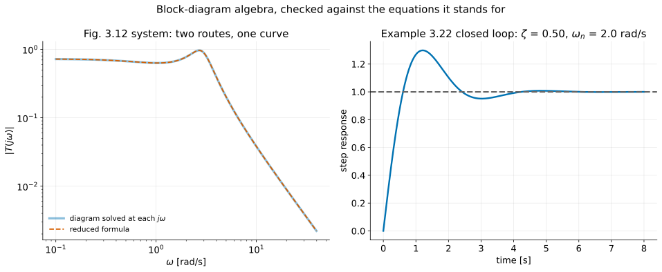
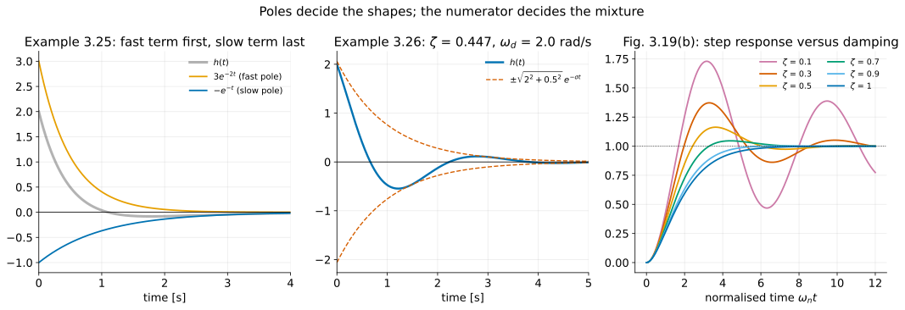
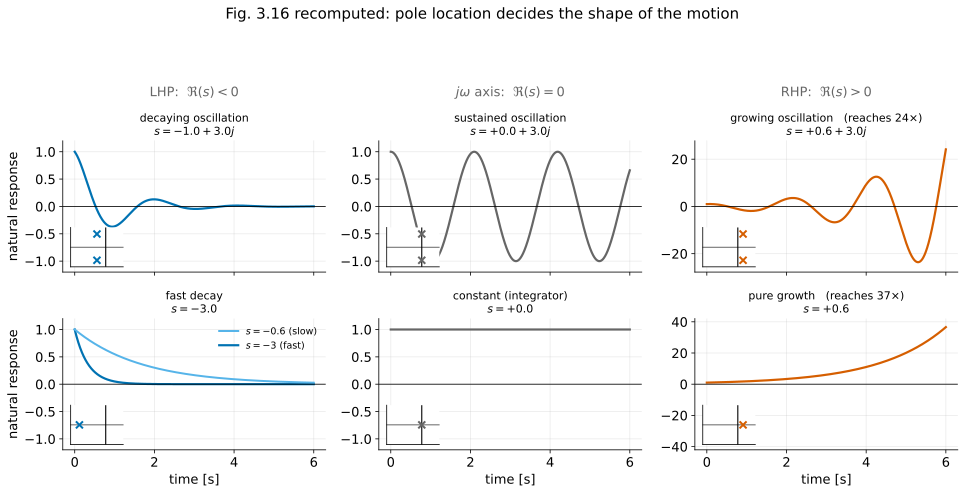

# Dynamic Response II — Block Diagrams and the Effect of Pole Locations
## FPE 8th ed., Sections 3.2 and 3.3

**Audience:** Fourth-year undergraduate mechanical engineering (ME 404)

**Source:** Franklin, Powell & Emami-Naeini, *Feedback Control of Dynamic Systems*, 8th ed., §§3.2–3.3. Worked examples and figure numbers are the book's. Additions of my own are marked **[beyond the book]**.

**Prerequisites:** L1 of this series (§3.1: convolution, $Y=HU$, poles and zeros) and the earlier lecture [From Physical Models to the Laplace Transform](modeling-and-dynamics_instructor.md), cited below as *(0.0.8 §n)*.

**Earlier-lecture shorthand:** “0.0.8 §n” below refers to section n of the linked prerequisite, whose current filename is `modeling-and-dynamics_instructor.md`.

**Duration:** 75 minutes.

**Book figures:** figure numbers refer to the source chapter at

```text
references/documents/Franklin, Powell, Emami-Naeimi - 8th Ed./3 - Dynamic Response.pdf
```

Page cues below use the PDF viewer's 1-based page numbers (202 pages). Project the figures directly from this PDF; extracted image files are not supplied. **[beyond the book]** Classroom checks and teaching prompts are instructor additions. Demo paths are relative to `demos/`; the demonstration index lists the scripts.

**Notation:**

| Symbol | Meaning |
|---|---|
| $R(s),\ Y(s)$ | reference (input) and output transforms |
| $G_i(s)$ | transfer function of one block |
| $T(s)$ | closed-loop transfer function $Y/R$ |
| $\sigma$ | **minus** the real part of a pole: a stable pole is $s=-\sigma\pm j\omega_d$ with $\sigma>0$ |
| $\tau=1/\sigma$ | time constant of a first-order pole |
| $\zeta,\ \omega_n$ | damping ratio and undamped natural frequency |
| $\omega_d=\omega_n\sqrt{1-\zeta^2}$ | damped natural frequency |
| $\theta=\sin^{-1}\zeta$ | angle of the pole from the imaginary axis (Fig. 3.18) |

> **The $\sigma$ warning, again.** In §3.1 the book wrote $s=\sigma_1+j\omega$. From §3.3 onward $\sigma$ is defined so that it is *positive for a stable pole*. Today's lecture uses the second convention throughout. Write it on the board once and leave it there.

---

# Part 0 — Planning

## 1. Teaching strategy

Two halves, joined by one idea.

**The first half (§3.2)** says a block diagram is not a picture attached to the equations. It *is* the equations. Reducing a diagram is eliminating variables — Gaussian elimination with boxes. Once students believe that, block algebra stops being a set of rules to memorise.

**The second half (§3.3)** is the single highest-value picture in the course: Fig. 3.16, the map from pole location to time response. Everything after this chapter — root locus, frequency response, state feedback — is about *moving poles*, and this is where students learn what moving them buys.

The joint is worth saying out loud:

> **Block-diagram algebra is how you find out where the poles are. Section 3.3 is why you wanted to know.**

Three moments to protect:

1. **§6** — the six-block reduction of Example 3.23, done once carefully. It is the only genuinely fiddly algebra in the chapter.
2. **§9** — Fig. 3.16, drawn on the board, one waveform at a time.
3. **§10.1** — the geometry of Fig. 3.18: $\zeta$ is the sine of an angle, $\omega_n$ is a radius, $\sigma$ is a distance from the imaginary axis. Lecture 3 depends on this geometry.

---

## 2. Learning objectives

By the end of this lecture students should be able to:

1. Write the equations a block diagram represents, and recover the diagram from the equations.
2. Reduce series, parallel and feedback connections, and state the single-loop rule: forward gain over one plus loop gain.
3. Move a pickoff point or a summing junction without changing the relationships, and convert a loop to unity feedback.
4. Reduce a multi-loop diagram with a nested positive-feedback loop (Example 3.23).
5. Use `series`, `parallel` and `feedback` (or their equivalents) to do the same job numerically, and say where Mason's rule fits.
6. Identify the impulse response as the natural response, and read the time constant $\tau=1/\sigma$ off a first-order pole.
7. Explain what the numerator contributes to a partial-fraction expansion, and what the denominator contributes (Example 3.25).
8. Reproduce Fig. 3.16 from memory: location in the $s$-plane $\rightarrow$ shape of the natural response.
9. Convert between $(\sigma,\omega_d)$ and $(\zeta,\omega_n)$, and place a pole by radius and angle.
10. Write down the impulse and step responses of the standard second-order system, and sketch the exponential envelope (Example 3.26).

---

## 3. Suggested lecture flow (75 minutes)

| Time | Topic | Section |
|---:|---|---|
| 0–4 min | Recap: $Y=HU$; today, where $H$ comes from and what it means | §4 |
| 4–14 min | Three elementary diagrams; the feedback rule; sign conventions | §5 |
| 14–22 min | Block algebra; Example 3.22 | §5.3–§6.1 |
| 22–32 min | Example 3.23, the six-block reduction | §6.2 |
| 32–36 min | Computer tools; Mason's rule pointer | §7 |
| 36–44 min | Impulse response as natural response; first-order poles and $\tau$ | §8 |
| 44–52 min | Example 3.25; fast and slow poles | §9.1 |
| 52–62 min | **Fig. 3.16 on the board** | §9.2 |
| 62–72 min | Complex poles: $\zeta$, $\omega_n$, the Fig. 3.18 geometry, the response families | §10.1–§10.2 |
| 72–75 min | Example 3.26 as a prepared result; bridge to specifications | §10.3–§12 |

**Prepare as slides:** Figs. 3.9 and 3.10 (the block algebra catalogue), Figs. 3.11–3.13 (the two examples), Figs. 3.14, 3.19, 3.20 and 3.21 (response families and envelopes). Reserve the board for the feedback-rule derivation, the Example 3.23 elimination, and Fig. 3.16.

**If you are short of time:** compress §7 to a single slide and assign Example 3.23 as reading. Do not compress §9.2.

### Runnable demonstrations

```
cd demos
uv run python ch3/l2_demo1_block_reduction.py
uv run python ch3/l2_demo2_pole_locations.py --show
```

**Run Demo 1 live** right after the Example 3.23 algebra, while the result is still on the board. Demo 2 belongs beside the Fig. 3.16 board work. Demo 3 is a slide.


### Teaching scope

Use the demos for the selected live examples; the accompanying checks also work on the board. For a 75-minute session, select the protected examples in §1; assign the remaining worked examples and optional computations as follow-up reading. Do not try to present every figure and derivation live.

---

# Part I — The lecture

## 4. Opening

### Instructor script

> Last time we ended with $Y(s)=H(s)U(s)$ and the claim that a designer reads the answer off the poles and zeros of $Y$ without ever inverting the transform.
>
> That claim leaves two obvious holes, and today fills both.
>
> First, real systems are not one box. They are a controller driving an amplifier driving a motor driving a load, with a sensor feeding something back. How do we get one transfer function out of that?
>
> Second, suppose we have it. What does a pole at $-2$ actually look like? What changes if it moves to $-2\pm3j$? If we are going to design by moving poles, we had better know what we are buying.

---

## 5. Block diagrams (§3.2.1)

### 5.1 Three elementary connections

> **[ FIG 3.9 ]** — PDF p. 68 *(slide)*

| Connection | Diagram | Transfer function |
|---|---|---|
| Series | $G_1$ then $G_2$ | $G_2G_1$ |
| Parallel | $G_1$ and $G_2$ share the same input; outputs added | $G_1+G_2$ |
| Feedback | $G_1$ forward, $G_2$ returned and subtracted | $\dfrac{G_1}{1+G_1G_2}$ |

The first two need only one line each. Write $U$ for the input and $Y$ for the output.

- **Series.** The intermediate signal is $V=G_1U$, and $Y=G_2V=G_2G_1U$. For scalar transfer functions the order does not matter, but writing $G_2G_1$ keeps the signal-flow order, which matters for matrices later.
- **Parallel.** $Y=G_1U+G_2U=(G_1+G_2)U$.

### 5.2 Deriving the feedback rule

Assume zero initial conditions and a well-posed scalar interconnection. These algebraic identities compute input-output transfer functions; they do not establish internal stability.

Do this one on the board, because it is the only one students get wrong.

The diagram says three things:

$$
U_1(s)=R(s)-Y_2(s),
\qquad
Y_2(s)=G_2(s)G_1(s)U_1(s),
\qquad
Y_1(s)=G_1(s)U_1(s).
$$

Here $U_1$ is the error signal leaving the summing junction and $Y_2$ is the signal fed back.

*Step 1: eliminate $Y_2$.* Substitute the second equation into the first:

$$
U_1=R-G_2G_1U_1 .
$$

*Step 2: solve for the error.* Collect the $U_1$ terms:

$$
(1+G_1G_2)U_1=R
\qquad\Longrightarrow\qquad
U_1=\frac{R}{1+G_1G_2} .
$$

*Step 3: substitute into the output equation.* $Y_1=G_1U_1$, so

$$
\boxed{
Y_1(s)=\frac{G_1(s)}{1+G_1(s)G_2(s)}\,R(s)
\tag{3.58}
}
$$

In words, the rule the book asks students to memorise:

$$
\boxed{
\text{closed-loop gain}=\frac{\text{forward gain}}{1+\text{loop gain}}
}
$$

For **positive** feedback the first equation becomes $U_1=R+Y_2$. Step 2 then gives $(1-G_1G_2)U_1=R$, so the denominator is $1-\text{loop gain}$.

#### Ask the class

> If the loop gain is very large, what is the closed-loop gain?

Divide the numerator and denominator by $G_1G_2$:

$$
\frac{G_1}{1+G_1G_2}=\frac{1/G_2}{1/(G_1G_2)+1}\ \longrightarrow\ \frac{1}{G_2}
\qquad\text{when } |G_1G_2|\gg1 .
$$

**[beyond the book]** At frequencies where $|G_1G_2|\gg1$, the closed-loop transfer is approximately $1/G_2$ and becomes less sensitive to the forward path. This is useful only when the interconnection is stable; increasing gain does not by itself guarantee stability or good transients.

### 5.3 Moving things around

> **[ FIG 3.10 ]** — PDF p. 71 *(slide)*
>
> **Show:** panel (a), moving a pickoff point; panel (b), moving a summing junction; panel (c), converting to unity feedback.
> **Say:** "Each of these is an identity, not a trick. Move a pickoff point past a block and whatever you take off must be corrected by that block — which is why you will see a $1/G$ appear."

The governing principle, in the book's words: *block-diagram reduction is a pictorial way to solve equations by eliminating variables.* Everything in this section is legal because the underlying equations are unchanged.

**Board check:** if $v=Gu$, taking off $u$ after the block requires $v/G$, while taking off $v$ before it requires $Gu$. Likewise, $G(u+d)=Gu+Gd$: moving an input-side sum to the output multiplies its side input by $G$. These are algebraic rearrangements for nonzero $G$; $1/G$ may be unstable or improper and need not be physically implementable.

For nonzero $G_2$, a nonunity feedback loop has $Y/R=(1/G_2)[G_1G_2/(1+G_1G_2)]$. In the original diagram the error is $e=R-G_2Y$. In the equivalent diagram of Fig. 3.10(c), a prefilter $1/G_2$ precedes a unity-feedback loop around $G_1G_2$: its error is $e'=R/G_2-Y=e/G_2$, and $Y=G_1G_2e'=G_1e$. Thus $Y/R$ is unchanged, but the signal at the summing junction is rescaled. Canceling $G_2$ in the overall transfer function recovers Eq. (3.58).

---

## 6. Two worked reductions

### 6.1 Example 3.22

> **[ FIG 3.11 ]** — PDF p. 72 (a), PDF p. 72 (b)

The forward path is a gain of 2 in parallel with $4/s$, followed by an integrator $1/s$, all inside unity negative feedback. Reduce in two steps:

$$
\text{parallel: } 2+\frac4s=\frac{2s+4}{s},
\qquad
\text{series: } \frac{2s+4}{s}\cdot\frac1s=\frac{2s+4}{s^2},
$$

then the feedback rule with $G_1=(2s+4)/s^2$ and unity feedback, $G_2=1$. Multiply the numerator and denominator by $s^2$ to clear the inner fractions:

$$
\boxed{
T(s)=\frac{Y(s)}{R(s)}
=\frac{(2s+4)/s^2}{1+(2s+4)/s^2}
=\frac{2s+4}{s^2+(2s+4)}
=\frac{2s+4}{s^2+2s+4}
}
$$

For unity feedback this is $G/(1+G)$, which is the numerator of $G$ over its numerator plus its denominator. That is a useful shortcut to point out.

#### Ask the class

> Where are the closed-loop poles, and what were the poles of the forward path?

The forward path had a double pole at the origin, from $s^2=0$. For the closed loop, solve $s^2+2s+4=0$:

$$
s=\frac{-2\pm\sqrt{4-16}}{2}=-1\pm j\frac{\sqrt{12}}{2}=-1\pm j\sqrt3 .
$$

Say it plainly: **feedback moved the poles.** That single sentence is the reason Chapter 5 exists. In the second-order language of §10 below, match $s^2+2s+4$ to $s^2+2\zeta\omega_ns+\omega_n^2$. This gives $\omega_n^2=4$, so $\omega_n=2$ rad/s, and $2\zeta\omega_n=2$, so $\zeta=0.5$. Check: $\sigma=\zeta\omega_n=1$ and $\omega_d=2\sqrt{1-0.25}=\sqrt3$, matching the roots. It also has a zero at $-2$, so the zero-free overshoot formula from L3 does not apply directly.

### 6.2 Example 3.23

> **[ FIG 3.12 ]** — PDF p. 73 (a), PDF p. 74 (b), PDF p. 74 (c)

Six blocks, a nested **positive** feedback loop through $G_3$, an outer loop through $G_4$, and a feedforward path through $G_6$ that takes off before $G_2$.

**Step 1: the inner loop (Fig. 3.12a → b).** The loop runs from the inner summing junction through $G_1$, then back through $G_3$, and enters the junction with a $+$ sign. Let $e$ be the signal arriving at the inner junction from the outer one. Then $a=G_1(e+G_3a)$, so $(1-G_1G_3)a=G_1e$. This is the positive-feedback form of Eq. (3.58):

$$
\frac{a}{e}=\frac{G_1}{1-G_1G_3}.
$$

**Source correction [beyond the book]:** the book's solution text (PDF p. 74) says the feedback loop involving "$G_1$ and $G_2$". The figure shows the loop is $G_1$ and $G_3$, and the result $G_1/(1-G_1G_3)$ confirms it.

**Step 2: move the pickoff (Fig. 3.12b → c).** $G_6$ takes its input from $a$, before $G_2$. After the move it takes its input from $b=G_2a$. To deliver the same signal $G_6a$, the block must become $G_6/G_2$, because $(G_6/G_2)\,b=(G_6/G_2)G_2a=G_6a$. The output is now two parallel blocks acting on $b$:

$$
\frac{Y}{b}=G_5+\frac{G_6}{G_2}.
$$

**Step 3: the outer loop, then the series connection.** The outer loop has forward path $\dfrac{G_1}{1-G_1G_3}\cdot G_2$ from the outer error to $b$, and feedback $G_4$ from $b$ with a $-$ sign. By Eq. (3.58),

$$
\frac{b}{R}=\frac{\dfrac{G_1G_2}{1-G_1G_3}}{1+\dfrac{G_1G_2}{1-G_1G_3}G_4} .
$$

Multiply the numerator and denominator by $1-G_1G_3$ to clear the nested fraction:

$$
\frac{b}{R}=\frac{G_1G_2}{(1-G_1G_3)+G_1G_2G_4} .
$$

The parallel pair from Step 2 is in series with this loop:

$$
T(s)=\frac{Y}{R}=\frac{b}{R}\cdot\frac{Y}{b}
=\frac{G_1G_2}{1-G_1G_3+G_1G_2G_4}\left(G_5+\frac{G_6}{G_2}\right) .
$$

Distribute $G_1G_2$ over the bracket. The $G_2$ cancels in the second term: $G_1G_2\cdot G_6/G_2=G_1G_6$. So

$$
\boxed{
T(s)=\frac{G_1G_2G_5+G_1G_6}{1-G_1G_3+G_1G_2G_4}
}
$$

**Read the answer [beyond the book].** The numerator lists the two forward paths from $R$ to $Y$, which are $G_1G_2G_5$ and $G_1G_6$. The denominator is $1$ minus the positive loop gain $G_1G_3$, plus the negative loop gain $G_1G_2G_4$. Both loops pass through $G_1$, so they touch and no product of loop gains appears. This is Mason's rule in miniature; see §7.

### The same thing as equations **[beyond the book]**

Write the diagram's three node equations beside the reduction, because this is the point of the whole section. With $a$ the output of $G_1$ and $b$ the output of $G_2$:

$$
a=G_1\left[(R-G_4b)+G_3a\right],
\qquad
b=G_2a,
\qquad
Y=G_5b+G_6a .
$$

The first equation is the outer junction ($R-G_4b$), then the inner junction ($+G_3a$), then $G_1$. Eliminate in three moves:

1. Substitute $b=G_2a$ into the first equation: $a=G_1R-G_1G_2G_4a+G_1G_3a$.
2. Collect the $a$ terms: $a(1-G_1G_3+G_1G_2G_4)=G_1R$, so $a=\dfrac{G_1R}{1-G_1G_3+G_1G_2G_4}$.
3. Substitute into the output equation: $Y=G_5G_2a+G_6a=(G_2G_5+G_6)a$, which gives
   $$
   \frac YR=\frac{G_1(G_2G_5+G_6)}{1-G_1G_3+G_1G_2G_4},
   $$
   which is the boxed result exactly.

**The three reduction steps are three eliminations.** Collecting the $G_3a$ term is the inner loop, writing $G_6a$ in terms of $b$ is the pickoff move, and collecting the $G_4b$ term is the outer loop.

> **[ DEMO 1 ]** — `ch3/l2_demo1_block_reduction.py` *(live, ~15 s)*
>
> **Teaching check [beyond the book]:** Choose nonzero numerical values for the six blocks and solve the three node equations. Compare $Y/R$ with the reduced formula, then reverse the inner-feedback sign and repeat. Agreement at sample points is a useful error check; the symbolic elimination establishes the identity.



---

## 7. Doing it by computer (§3.2.2, §3.2.3)

Example 3.24 repeats Example 3.22 with three Matlab commands:

```matlab
s = tf('s');
sysG1 = 2;                       % the gain path
sysG2 = 4/s;                     % the integral path
sysG3 = parallel(sysG1,sysG2);
sysG4 = 1/s;
sysG5 = series(sysG3,sysG4);
sysG6 = 1;
sysCL = feedback(sysG5,sysG6,-1);
```

which returns $(2s+4)/(s^2+2s+4)$, as before.

**Mason's rule** is §3.2.3, and the eighth edition moves it to the online Appendix W3.2.3. Mention what it is for — a formula that reads a transfer function off a signal-flow graph without step-by-step reduction, useful when the topology is tangled — and tell students where to find it. Do not teach it today.

#### Say out loud

> The feedback-dependent factor is $1-G_1G_3+G_1G_2G_4$. Substitute the block transfer functions into the full expression for $T(s)$, combine the fractions, and check for cancellations before identifying its input-output poles. Dynamic blocks $G_5$ and $G_6$ can contribute additional poles even though they lie outside the loops. Internal modes can also be hidden by cancellations; the reduced $Y/R$ alone does not establish internal stability. The opposite signs of the two loop terms do not imply that increasing those gains moves every pole in opposite directions.

---

## 8. The natural response, and first-order poles (§3.3)

### 8.1 The impulse response is the natural response

For $H(s)=b(s)/a(s)$ with no common factors, the roots of $a$ are the poles and the roots of $b$ the zeros. Since the impulse response is the inverse transform of $H$ itself, the book gives it a name:

$$
\boxed{\text{the impulse response is the }\textbf{natural response}\text{ of the system}}
$$

The poles say which exponentials appear; the numerator says how much of each.

Here “natural response” follows the book's terminology and means the modes excited by an impulse. More generally, natural (or zero-input) response means motion due to initial conditions with the input set to zero. For a strictly proper system, the motion after the impulse is unforced, but its modal coefficients need not match an arbitrary initial-state response. Modes hidden from the input-output transfer function need not appear in the impulse response at all. A proper system with direct feedthrough also has an impulse at $t=0$.

### 8.2 One pole, one exponential

$$
H(s)=\frac1{s+\sigma}
\qquad\Longrightarrow\qquad
h(t)=e^{-\sigma t}1(t)
$$

with

$$
\boxed{\tau=\frac1\sigma}
\tag{3.59}
$$

the **time constant**, for $\sigma>0$: the time at which the response has fallen to $1/e$ of its initial value, since $h(\tau)=e^{-\sigma/\sigma}=e^{-1}$.

**The step response, derived.** With $U=1/s$, cover-up gives

$$
Y(s)=\frac{1}{s(s+\sigma)}=\frac{1/\sigma}{s}-\frac{1/\sigma}{s+\sigma}
\qquad\Longrightarrow\qquad
y(t)=\frac1\sigma\left(1-e^{-\sigma t}\right),\quad t\ge0 .
$$

The residues are $\left.\frac1{s+\sigma}\right|_{s=0}=\frac1\sigma$ and $\left.\frac1s\right|_{s=-\sigma}=-\frac1\sigma$. The final value is $1/\sigma$, so the percentages below are fractions of $1/\sigma$. Multiplying $H$ by $\sigma$ makes that final value unity: $\sigma/(s+\sigma)$ has DC gain 1.

**The tangent-line construction.** The unit-DC-gain step response $1-e^{-t/\tau}$ has initial slope $\frac{d}{dt}(1-e^{-t/\tau})\big|_{t=0}=1/\tau$. A line with that slope starting from 0 reaches the final value 1 at $t=\tau$. For the decaying impulse response $e^{-t/\tau}$, the tangent at the origin, $1-t/\tau$, reaches zero at the same time.

> **[ FIG 3.14 ]** — PDF p. 82 (a), PDF p. 83 (b) *(slide)*
>
> **Show:** panel (a) with the tangent line at the origin, which reaches zero at $t=\tau$. Then panel (b), the step response with the percentages marked.
> **Point at:** 63% at one time constant, and within 1% of the final value by five. “Settled” always needs a tolerance; the final value is approached asymptotically.

The percentages follow by evaluating $1-e^{-t/\tau}$. For example, $e^{-1}=0.368$, so $1-0.368=0.632$:

| $t/\tau$ | $1-e^{-t/\tau}$ |
|---:|---:|
| 1 | 63.2% |
| 2 | 86.5% |
| 3 | 95.0% |
| 4 | 98.2% |
| 5 | 99.3% |

**Stability, stated for the first time.** If $\sigma>0$ the pole is at $-\sigma$ in the left half plane and the response decays: stable. If $\sigma<0$ the pole is on the right and the response grows: unstable. Lecture 4 makes this precise; today it is a reading of the picture.

---

## 9. Reading a response off the poles

### 9.1 Example 3.25: two real poles

$$
H(s)=\frac{2s+1}{s^2+3s+2}
\tag{3.60}
$$

*Poles and zero.* The denominator factors as $s^2+3s+2=(s+1)(s+2)$, since $1\cdot2=2$ and $1+2=3$. This gives poles at $s=-1$ and $s=-2$. The numerator $2s+1=0$ gives one finite zero at $s=-\tfrac12$.

> **[ FIG 3.15 ]** — PDF p. 86 *(slide: poles as crosses, zeros as circles)*

*Expand.* The numerator has degree 1 and the denominator has degree 2, so $H$ is strictly proper with distinct poles:

$$
H(s)=\frac{2s+1}{(s+1)(s+2)}=\frac{C_1}{s+1}+\frac{C_2}{s+2} .
$$

Cover up each factor:

$$
C_1=\left.\frac{2s+1}{s+2}\right|_{s=-1}=\frac{-2+1}{-1+2}=-1,
\qquad
C_2=\left.\frac{2s+1}{s+1}\right|_{s=-2}=\frac{-4+1}{-2+1}=3 .
$$

*Check:* $\dfrac{-1}{s+1}+\dfrac{3}{s+2}=\dfrac{-(s+2)+3(s+1)}{(s+1)(s+2)}=\dfrac{2s+1}{(s+1)(s+2)}$ ✓.

*Invert* with $1/(s+a)\leftrightarrow e^{-at}$:

$$
\boxed{
h(t)=-e^{-t}+3e^{-2t},\qquad t\ge0
\tag{3.61}
}
$$

> **[ FIG 3.17 ]** — PDF p. 90 *(slide)*
>
> **Point at:** the early part of the curve, dominated by $3e^{-2t}$, and the tail, where $-e^{-t}$ is all that is left.

#### Instructor script

> Two poles, two exponentials. That much came from the denominator alone.
>
> With the denominator fixed, the numerator set the two coefficients, $-1$ and $+3$. Move the zero and those numbers change while the exponential rates do not. If the zero lands exactly on a pole, that term disappears from the input-output response through cancellation.
>
> And notice the vocabulary the book introduces here. The pole at $-2$ is *faster* than the pole at $-1$ — not higher frequency, just quicker to die. Farther left means faster. That is the whole meaning of "fast pole" and "slow pole" in this course.

> **[ DEMO 3 ]** — `ch3/l2_demo3_second_order.py` *(slide)*
>
> **Teaching check [beyond the book]:** The two modal contributions have equal magnitude when $3e^{-2t}=e^{-t}$. Dividing by $e^{-2t}$ gives $e^{t}=3$, so $t=\ln3\approx1.10$ s. At this time the contributions cancel and the impulse response crosses zero. Separately, $h(0^+)=-1+3=2$, as the initial-value theorem $h(0^+)=\lim_{s\to\infty}sH(s)=2$ requires. This equals the leading numerator coefficient here because the denominator is monic and its degree is exactly one greater than the numerator's.



### 9.2 The board that matters: Fig. 3.16

> **[ FIG 3.16 ]** — PDF p. 88
>
> Project it, but **draw it as well**. Build it one location at a time, sketching the waveform beside each cross. This is the ten minutes of the lecture that students will still have in their heads in April.

```text
                            Im(s)
                              ^
        STABLE                |                UNSTABLE
                              |
      decaying         x      |      x        growing
      oscillation             |               oscillation
                              x  sustained
                              |  oscillation
   ---x----------x------------+------------x---------------> Re(s)
     fast        slow         |         pure growth
     decay       decay        |
                              x
                              |
                       x      |      x
                              |
    <------- LHP: decay ------|------ RHP: growth ------->
```

Walk this table, sketching as you go:

| Location | Natural response | Phrase to use |
|---|---|---|
| Far left, real axis | Fast decay, no ringing | "small time constant" |
| Near the origin, negative real axis | Slow decay, no ringing | "large time constant" |
| Left half plane, complex pair | Decaying oscillation | "rings, then settles" |
| On the imaginary axis, simple pair | Constant-amplitude oscillation | "neutrally stable" |
| Right half plane, complex pair | Growing oscillation | "unstable" |
| Right, real axis | Pure growth | "runs away" |
| At the origin | Constant | "an integrator remembers" |

This table describes simple modes. Repeated poles add polynomial factors in time: a double pole at zero gives a ramp, and a repeated imaginary-axis pole can give growing oscillations. “Neutral” describes bounded free motion with all other modes decaying; it does not mean BIBO stable (L4).

> **[ DEMO 2 ]** — `ch3/l2_demo2_pole_locations.py` *(live, ~10 s, projected beside the board)*
>
> **Teaching check [beyond the book]:** Compare poles at $-3$ and $-0.6$: their decay time constants are $1/3$ s and $5/3$ s. Then sketch poles at $\pm j$ and $+0.5\pm j$: equal oscillation frequency, different amplitude evolution. These are modal shapes, not claims about arbitrary-input boundedness.



---

## 10. Complex poles: the standard second-order form

A conjugate pair at $s=-\sigma\pm j\omega_d$ has denominator

$$
a(s)=(s+\sigma-j\omega_d)(s+\sigma+j\omega_d)=(s+\sigma)^2+\omega_d^2 .
\tag{3.62}
$$

The product is a difference of squares, $(x-jy)(x+jy)=x^2-(jy)^2=x^2+y^2$, with $x=s+\sigma$ and $y=\omega_d$.

The book's standard form, which recurs for the rest of the course:

$$
\boxed{
H(s)=\frac{\omega_n^2}{s^2+2\zeta\omega_ns+\omega_n^2}
\tag{3.63}
}
$$

Expand Eq. (3.62) and match it to the denominator of Eq. (3.63) coefficient by coefficient:

$$
s^2+2\sigma s+(\sigma^2+\omega_d^2)\ \equiv\ s^2+2\zeta\omega_ns+\omega_n^2 .
$$

$$
s^1:\ 2\sigma=2\zeta\omega_n\ \Rightarrow\ \sigma=\zeta\omega_n;
\qquad
s^0:\ \sigma^2+\omega_d^2=\omega_n^2\ \Rightarrow\ \omega_d^2=\omega_n^2-\zeta^2\omega_n^2=\omega_n^2(1-\zeta^2).
$$

Therefore

$$
\boxed{
\sigma=\zeta\omega_n,
\qquad
\omega_d=\omega_n\sqrt{1-\zeta^2}
\tag{3.64}
}
$$

The real-frequency geometry and sinusoidal formulas below apply to $0\le\zeta<1$ with $\omega_n>0$. At $\zeta=1$ use the limiting critically damped formulas; for $\zeta>1$, the poles are real and unequal.

### 10.1 The geometry — do this on the board

> **[ FIG 3.18 ]** — PDF p. 94 *(slide, alongside the board sketch)*

$$
\boxed{
\begin{array}{ll}
\omega_n & \text{distance from the origin to the pole (a radius)}\\[3pt]
\sigma=\zeta\omega_n & \text{distance from the imaginary axis}\\[3pt]
\omega_d & \text{height above the real axis}\\[3pt]
\theta=\sin^{-1}\zeta & \text{angle measured from the imaginary axis}
\end{array}}
$$

**Why each entry holds.** The upper pole sits at horizontal distance $\sigma$ from the imaginary axis and height $\omega_d$ above the real axis. Draw the right triangle from the origin to that pole.

- *Radius:* by Pythagoras, the distance from the origin is $\sqrt{\sigma^2+\omega_d^2}=\sqrt{\omega_n^2}=\omega_n$, using the $s^0$ match above. The pole's magnitude is $\omega_n$.
- *Angle:* measured from the imaginary axis, the side opposite $\theta$ is the horizontal leg $\sigma$ and the hypotenuse is $\omega_n$. So $\sin\theta=\sigma/\omega_n=\zeta\omega_n/\omega_n=\zeta$.
- *Height:* similarly, $\cos\theta=\omega_d/\omega_n=\sqrt{1-\zeta^2}$, consistent with $\sin^2\theta+\cos^2\theta=1$.

#### Ask the class

> Where do the poles go as $\zeta$ runs from 0 to 1, with $\omega_n$ held fixed?

Around a circle of radius $\omega_n$, from the imaginary axis to the real axis, meeting there at $\zeta=1$. This is exactly the constant-magnitude arc derived from the physical parameters in *(0.0.8 §7.4)* — same picture, now in the book's $\zeta,\omega_n$ language. Students who saw that demonstration should recognise it immediately.

$$
\zeta=0 \ \Rightarrow\ \theta=0,\ \omega_d=\omega_n
\qquad\qquad
\zeta=1 \ \Rightarrow\ \theta=90^\circ,\ \omega_d=0
$$

**Footnote worth mentioning:** filter engineers write the same system with a quality factor $Q=1/(2\zeta)$. Students will meet it in electronics.

### 10.2 The response families

Rewriting Eq. (3.63) so the table can be used directly,

$$
H(s)=\frac{\omega_n^2}{(s+\zeta\omega_n)^2+\omega_n^2(1-\zeta^2)},
\tag{3.65}
$$

which is Eq. (3.62) with $\sigma=\zeta\omega_n$ and $\omega_d^2=\omega_n^2(1-\zeta^2)$ substituted. The table pair needed is

$$
\mathcal L\{e^{-\sigma t}\sin\omega_dt\,1(t)\}=\frac{\omega_d}{(s+\sigma)^2+\omega_d^2},
$$

which is the sine transform of L1 §8.2 with the frequency shift $s\to s+\sigma$ (property 4). The numerator of $H$ is $\omega_n^2$, not $\omega_d$, so multiply and divide by $\omega_d$:

$$
H(s)=\frac{\omega_n^2}{\omega_d}\cdot\frac{\omega_d}{(s+\sigma)^2+\omega_d^2}
\qquad\Longrightarrow\qquad
h(t)=\frac{\omega_n^2}{\omega_d}e^{-\sigma t}\sin\omega_dt .
$$

Finally, $\omega_n^2/\omega_d=\omega_n^2/(\omega_n\sqrt{1-\zeta^2})=\omega_n/\sqrt{1-\zeta^2}$, so the impulse response is

$$
\boxed{
h(t)=\frac{\omega_n}{\sqrt{1-\zeta^2}}\,e^{-\sigma t}\sin(\omega_dt)\,1(t)
\tag{3.66}
}
$$

> **[ FIG 3.19 ]** — PDF p. 96 (a, impulse), PDF p. 97 (b, step) *(slide)*
> **[ FIG 3.20 ]** — PDF p. 98 *(the three pole locations that produced them)*
> **[ FIG 3.21 ]** — PDF p. 99 *(the exponential envelope)*
>
> **Show:** Fig. 3.19(a) and Fig. 3.20 side by side, so each curve is tied to a pole angle.
> **Point at:** the time axis, normalised to $\omega_nt$. Holding $\zeta$ fixed while changing $\omega_n$ stretches time; changing $\zeta$ changes the response shape as well. The impulse amplitude also scales with $\omega_n$.
> **Then:** Fig. 3.19(b). The step response is the integral of the impulse response; its phase, amplitudes, and final value differ.
> **Finally:** Fig. 3.21. The real part sets the exponential decay rate; the full envelope includes a coefficient.

For the same zero-free standard pair, integrating $h(t)$ gives

$$
y_{\rm step}(t)=1-e^{-\sigma t}\left(\cos\omega_dt+\frac{\sigma}{\omega_d}\sin\omega_dt\right),\qquad t\ge0.
$$

**Derivation [beyond the book].** In $s$ this is $Y=H/s$. The residue at the origin is $H(0)=\omega_n^2/\omega_n^2=1$. Subtract it and simplify the remainder using $\sigma^2+\omega_d^2=\omega_n^2$:

$$
\frac{\omega_n^2}{s[(s+\sigma)^2+\omega_d^2]}-\frac1s
=\frac{\omega_n^2-(s^2+2\sigma s+\omega_n^2)}{s[(s+\sigma)^2+\omega_d^2]}
=-\frac{s+2\sigma}{(s+\sigma)^2+\omega_d^2} .
$$

Split $s+2\sigma=(s+\sigma)+\sigma$ to match the shifted cosine and shifted sine entries:

$$
Y(s)=\frac1s-\frac{s+\sigma}{(s+\sigma)^2+\omega_d^2}-\frac{\sigma}{\omega_d}\cdot\frac{\omega_d}{(s+\sigma)^2+\omega_d^2},
$$

which inverts term by term to the formula above. *Checks:* $y(0)=1-1=0$. Differentiating gives $\dot y=h$ from Eq. (3.66); the cosine and sine terms combine using $\sigma^2+\omega_d^2=\omega_n^2$.

For $0<\zeta<1$, the step response tends to 1. At $\zeta=0$, the same formula gives $y_{\rm step}(t)=1-\cos\omega_nt$, which oscillates indefinitely and has no final value despite $H(0)=1$.

At critical damping, $\zeta=1$, the denominator is $(s+\omega_n)^2$. Then $H=\omega_n^2/(s+\omega_n)^2$, and the repeated-pole pair $1/(s+a)^2\leftrightarrow te^{-at}$ gives $h(t)=\omega_n^2t e^{-\omega_nt}$. For the step, $\dfrac{\omega_n^2}{s(s+\omega_n)^2}=\dfrac1s-\dfrac1{s+\omega_n}-\dfrac{\omega_n}{(s+\omega_n)^2}$, so $y_{\rm step}(t)=1-(1+\omega_nt)e^{-\omega_nt}$. To check the expansion, recombine over a common denominator: $(s+\omega_n)^2-s(s+\omega_n)-\omega_ns=\omega_n^2$ ✓. The underdamped formulas with $\sqrt{1-\zeta^2}$ in a denominator must not be used directly at $\zeta=1$.

> **[ DEMO 3, continued ]** — right-hand panel of `l2_demo3_second_order.py`
>
> **Teaching check [beyond the book]:** For the zero-free standard pair, the overshoot formula in L3 gives 72.92% at $\zeta=0.1$, 16.30% at 0.5, and 4.60% at 0.7. The formula is $M_p=e^{-\pi\zeta/\sqrt{1-\zeta^2}}$, from evaluating $y_{\rm step}$ at the first peak, $\omega_dt=\pi$. The exponents are $\pi(0.1)/0.99499=0.3157$, $\pi(0.5)/0.86603=1.8138$, and $\pi(0.7)/0.71414=3.0794$. Keep the numerator fixed when comparing this family.

### 10.3 Example 3.26

$$
H(s)=\frac{2s+1}{s^2+2s+5}
\tag{3.67}
$$

Read the parameters off the denominator first:

$$
\omega_n^2=5 \Rightarrow \omega_n=\sqrt5=2.24\ \text{rad/s},
\qquad
2\zeta\omega_n=2 \Rightarrow \zeta=\frac{1}{\omega_n}=\frac1{\sqrt5}=0.447,
$$

$$
\sigma=\zeta\omega_n=1,
\qquad
\omega_d=\omega_n\sqrt{1-\zeta^2}=\sqrt5\sqrt{1-\tfrac15}=\sqrt4=2 .
$$

*Check with the quadratic formula:* $s=\dfrac{-2\pm\sqrt{4-20}}{2}=-1\pm2j$, so $\sigma=1$ and $\omega_d=2$ ✓. The zero is at $s=-\tfrac12$, as in Example 3.25.

*Predict before computing:* moderately damped, so expect a brief oscillatory transient near 2 rad/s with decay rate $e^{-t}$, consistent with the book's description of little oscillatory motion (PDF p. 101).

Now invert. The poles are complex, so rather than using complex residues, match table entries 19 and 20:

$$
e^{-\sigma t}\cos\omega_dt\ \leftrightarrow\ \frac{s+\sigma}{(s+\sigma)^2+\omega_d^2},
\qquad
e^{-\sigma t}\sin\omega_dt\ \leftrightarrow\ \frac{\omega_d}{(s+\sigma)^2+\omega_d^2} .
$$

*Step 1: complete the square.* $s^2+2s+5=(s^2+2s+1)+4=(s+1)^2+2^2$, so $\sigma=1$ and $\omega_d=2$.

*Step 2: rewrite the numerator in terms of $s+1$.* $2s+1=2(s+1)-1$. The cosine entry needs $s+1$ on top. The sine entry needs $\omega_d=2$ on top, so write $-1=-\tfrac12\cdot2$:

$$
H(s)=\frac{2(s+1)-1}{(s+1)^2+2^2}
=2\,\frac{s+1}{(s+1)^2+2^2}-\frac12\,\frac{2}{(s+1)^2+2^2} .
$$

*Step 3: invert term by term.*

$$
\boxed{
h(t)=\left(2e^{-t}\cos2t-\tfrac12e^{-t}\sin2t\right)1(t)
}
$$

*Checks.* $h(0)=2$, which equals $\lim_{s\to\infty}sH(s)=2$, as in Example 3.25. Combining the two sinusoids, $2\cos2t-\tfrac12\sin2t=\tfrac{\sqrt{17}}{2}\cos(2t+\phi)$ with $\phi=\tan^{-1}(1/4)\approx14.0^\circ$. This is the "small phase shift" to point at in Fig. 3.22.

> **[ FIG 3.22 ]** — PDF p. 103 *(slide)*
>
> **Point at:** the envelope, the dominance of the $2\cos2t$ term, and the small phase shift the $-\tfrac12\sin2t$ term produces.

**Compare with Example 3.25 deliberately.** Same numerator, $2s+1$. Changing the denominator moved the poles and changed a sum of two decays into a decaying oscillation. Its amplitude envelope is $\sqrt{4+1/4}\,e^{-t}=\tfrac{\sqrt{17}}{2}e^{-t}\approx2.06e^{-t}$; $e^{-t}$ alone gives the decay rate.

---

## 11. What this buys, and what is still missing

$$
\boxed{
\text{denominator} \rightarrow \text{which exponentials}
\qquad
\text{numerator} \rightarrow \text{how much of each}
}
$$

#### Ask the class

> We can now look at a pole-zero map and describe the response in words: fast or slow, ringing or not, growing or decaying. What can we still not do?

Put numbers on it. *How much* overshoot? Settled by *when*? That is Section 3.4, and it is the next lecture.

---

## 12. Closing script

> We started with a diagram of boxes and arrows and wrote its simultaneous equations. Eliminating the internal variables gave the same result as block reduction.
>
> Out of that reduction comes one rational function, and its denominator gives the poles.
>
> Then we spent the rest of the hour on what a pole means. Far left: fast decay. Near the origin: slow. Off the real axis: ringing at $\omega_d$ inside an envelope set by $\sigma$. Right half plane: it runs away.
>
> And we gave the stable complex pair its standard names, which are geometric. $\omega_n$ is how far the pole is from the origin. $\zeta$ is the sine of its angle from the imaginary axis. $\sigma=\zeta\omega_n$ is how far it is from that axis.
>
> Next time we attach numbers to those three: rise time to $\omega_n$, overshoot to $\zeta$, settling time to $\sigma$. Then a specification becomes a region on this plane, and design becomes putting poles inside it.

---

# Part II — Materials

## 13. One-board summary

```text
   BLOCK DIAGRAM  ==  simultaneous equations in R, Y and the internal signals

     series    G2 G1
     parallel  G1 + G2
     feedback  G1 / (1 + G1 G2)      <- minus sign becomes PLUS in the denominator
                                        (positive feedback: 1 - loop gain)

     reduction == elimination of variables.  Nothing else is going on.

   POLE LOCATION  ->  NATURAL RESPONSE

     H = 1/(s + sigma)         h = e^{-sigma t},     tau = 1/sigma
                               63% of the step in one tau, within 1% in five

     complex pair at -sigma +/- j omega_d:
         (s + sigma)^2 + omega_d^2  =  s^2 + 2 zeta wn s + wn^2

         wn      = radius from the origin
         zeta    = sin(theta), theta measured from the imaginary axis
         sigma   = zeta wn   = distance from the imaginary axis  = decay rate
         omega_d = wn sqrt(1 - zeta^2) = ringing frequency

     denominator -> WHICH exponentials      numerator -> HOW MUCH of each
```

## 14. Discussion questions

1. Example 3.22 has a forward path with a double pole at the origin and a closed loop with a well-damped pair. How does the feedback denominator $D+N$, for $G=N/D$, create new pole locations? Compare this with series and parallel connections of fixed blocks, whose poles come from the component poles, possibly with cancellations.
2. Moving a pickoff point introduced $G_6/G_2$. If $G_2$ has a RHP zero, why can the algebra remain valid while a separate physical realisation of $1/G_2$ is problematic?
3. The impulse response is called the natural response. In what sense is a system's response to being hit "natural" when a step response is not?
4. For $H_1(s)=2/[(s+1)(s+2)]$ and $H_2(s)=200/[(s+10)(s+20)]$, what is the same about their step responses and what differs? Why was specifying the numerators necessary?
5. A pole pair sits at $\omega_n=10$ rad/s with $\zeta=0.05$. Describe the impulse response in one sentence without computing anything.
6. Fig. 3.16 says nothing about zeros. What would you expect a zero to change, given Example 3.25?

## 15. Homework and follow-up problems

| Problem | Topic | Why this one |
|---|---|---|
| 3.18 | Transfer function from a block diagram with symbolic coefficients | Forces the elimination view rather than pattern matching. |
| 3.19, 3.20 | Transfer functions of several diagrams | The core drill; assign two or three, not all. |
| 3.21 | $R$ to $Y$ through a multi-loop diagram | Nested loops, like Example 3.23. |
| 3.22, 3.23 | The same diagrams by Mason's rule | Optional; pair with the online appendix. |
| 3.16 | DC gain and unit-step final value of a second-order system | Review L1; add pole and damping calculations as an instructor extension. |
| 3.36 | Initial-condition response and logarithmic decrement | Connects complex poles to observed decay; extension after §10. |
| 3.41 | Sketch a step response from poles and zeros, then compare with Matlab | Extends Fig. 3.16 using the zero effects taught in L3; assign after that lecture. |

**Suggested additional exercise [beyond the book]:** deliberately reverse the inner-loop sign in Example 3.23. Use both elimination and a numerical substitution to identify which term changes.

*Answer key.* The inner-junction term becomes $-G_3a$, so step 2 of the elimination gives $a(1+G_1G_3+G_1G_2G_4)=G_1R$ and

$$
T(s)=\frac{G_1G_2G_5+G_1G_6}{1+G_1G_3+G_1G_2G_4} .
$$

Only the sign of the $G_1G_3$ term in the denominator changes. The numerator does not change, because the forward paths are the same. Numerical check with $G_1=G_2=G_4=G_5=G_6=1$ and $G_3=1/2$: the original gives $2/(1-1/2+1)=4/3$ and the reversed sign gives $2/(1+1/2+1)=4/5$. These values also keep the isolated inner loop well posed. Setting every block to 1 would still give a solvable full set of node equations, but the intermediate reduction $G_1/(1-G_1G_3)$ would be undefined.

## 16. Instructor cautions

1. **The $\sigma$ convention flips at §3.3.** Stable now means $\sigma>0$. Students carrying $s=\sigma_1+j\omega$ over from §3.1 will read every stability statement backwards.
2. **Positive feedback in Example 3.23.** The inner loop is positive, so its denominator is $1-G_1G_3$. It is the single most common error in this example; write the sign in colour.
3. **"Fast pole" means far left, not high frequency.** A pole at $-0.1\pm 50j$ oscillates quickly and decays slowly. Ask about it explicitly.
4. **Fig. 3.19 uses normalised time.** The horizontal axis is $\omega_nt$. Students who read settling times straight off the figure will be wrong by a factor of $\omega_n$.
5. **$\theta=\sin^{-1}\zeta$ is measured from the imaginary axis**, not from the negative real axis. Draw the angle, do not just write the formula.
6. **Do not let the computer tools eat the section.** The point of §3.2 is that the diagram is the equations. `feedback(...)` returns an answer that teaches nothing about which parameter moves which pole.
7. **The zero in Examples 3.25 and 3.26 is doing real work** — the coefficients $-1$ and $+3$ are not obvious — but its systematic effect is Lecture 3. Flag it and hold the line.

## 17. Demonstration index

| # | Script | Section | What it settles | Use |
|---|---|---|---|---|
| 1 | `l2_demo1_block_reduction.py` | §6 | The reduced formula agrees with the diagram solved as a linear system at 2000 random $s$, to floating-point precision. | **live** |
| 2 | `l2_demo2_pole_locations.py` | §9.2 | Fig. 3.16 recomputed, with the first-order time-constant percentages. | **live** |
| 3 | `l2_demo3_second_order.py` | §9.1, §10 | Examples 3.25 and 3.26 verified against numerical impulse responses; the overshoot family measured. | slide |

## 18. Where this lecture sits

| Lecture | Book sections | Content |
|---|---|---|
| L1 | 3.1 | Convolution, transfer functions, frequency response, partial fractions, final value, poles and zeros |
| **This lecture (L2)** | **3.2, 3.3** | **Block diagrams, Mason's rule pointer, effect of pole locations** |
| L3 | 3.4, 3.5 | Time-domain specifications, effects of zeros and extra poles |
| L4 | 3.6–3.9 | Stability, Routh's criterion, system identification, scaling, history |
