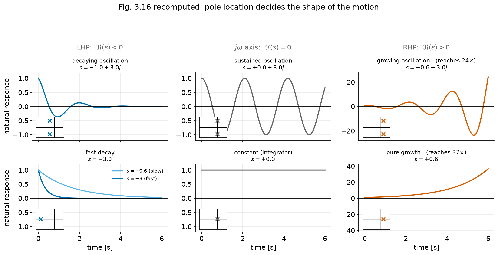

# Dynamic Response II — Block Diagrams and the Effect of Pole Locations

**Student lecture notes — FPE 8th ed., Sections 3.2 and 3.3**

A block diagram is a set of simultaneous equations. Eliminating its internal signals gives a transfer function; the poles of that function describe the rates and oscillations visible in the response. This lecture connects block reduction to the geometry of the complex $s$-plane.

**Prerequisites:** [L1: Convolution and transfer functions](lecture_ch3_L1_laplace-and-transfer-functions_student.md).

**Source:** Franklin, Powell & Emami-Naeini, *Feedback Control of Dynamic Systems*, 8th ed. Example and equation numbers follow the textbook. Numbered sections and § references refer to these notes unless labelled as textbook sections.

## Learning objectives

After studying this lecture, you should be able to:

1. Write the equations a block diagram represents, and recover the diagram from the equations.
2. Reduce series, parallel and feedback connections, and state the single-loop rule: forward gain over one plus loop gain.
3. Move a pickoff point or a summing junction without changing the relationships, and convert a loop to unity feedback.
4. Reduce a multi-loop diagram with a nested positive-feedback loop (Example 3.23).
5. Use `series`, `parallel` and `feedback` (or their equivalents) to do the same job numerically, and say where Mason's rule fits.
6. Explain how an impulse excites natural modes, and read the time constant $\tau=1/\sigma$ off a first-order pole.
7. Explain what the numerator contributes to a partial-fraction expansion, and what the denominator contributes (Example 3.25).
8. Relate location in the $s$-plane $\rightarrow$ shape of the natural response.
9. Convert between $(\sigma,\omega_d)$ and $(\zeta,\omega_n)$, and place a pole by radius and angle.
10. Write down the impulse and step responses of the standard second-order system, and sketch the exponential envelope (Example 3.26).

## Notation and assumptions

| Symbol | Meaning |
|---|---|
| $R(s),\ Y(s)$ | reference (input) and output transforms |
| $G_i(s)$ | transfer function of one block |
| $T(s)$ | closed-loop transfer function $Y/R$ |
| $\sigma$ | **minus** the real part of a pole: a stable pole is $s=-\sigma\pm j\omega_d$ with $\sigma>0$ |
| $\tau=1/\sigma$ | time constant of a first-order pole |
| $\zeta,\ \omega_n$ | damping ratio and undamped natural frequency |
| $\omega_d=\omega_n\sqrt{1-\zeta^2}$ | damped natural frequency |
| $\theta=\sin^{-1}\zeta$ | angle of the pole from the imaginary axis |

Unless stated otherwise, transfer functions describe causal LTI systems from zero initial state. Add the zero-input response for nonzero initial conditions. LHP and RHP mean the left and right half planes.

The decay rate $\sigma$ is positive for a stable pole: $s=-\sigma\pm j\omega_d$. It is the negative of the pole’s real part.

---

## 1. From components to response {#section-1}

Real feedback systems contain several components: controller, actuator, plant, and sensor. Block reduction combines their equations into one input-output transfer function. The resulting pole locations then show whether its visible modes decay, oscillate, or grow.

---

## 2. Block diagrams {#section-2}

### 2.1 Three elementary connections {#section-2-1}

| Connection | Diagram | Transfer function |
|---|---|---|
| Series | $G_1$ then $G_2$ | $G_2G_1$ |
| Parallel | $G_1$ and $G_2$ share the same input; outputs added | $G_1+G_2$ |
| Feedback | $G_1$ forward, $G_2$ returned and subtracted | $\dfrac{G_1}{1+G_1G_2}$ |

### 2.2 Deriving the feedback rule {#section-2-2}

Assume zero initial conditions and a well-posed scalar interconnection. These algebraic identities compute input-output transfer functions; they do not establish internal stability.

Eliminate the internal signals to derive the feedback formula.

The diagram says three things:

$$
U_1(s)=R(s)-Y_2(s),
\qquad
Y_2(s)=G_2(s)G_1(s)U_1(s),
\qquad
Y_1(s)=G_1(s)U_1(s).
$$

Substitute the second into the first, then the result into the third:

$$
\boxed{
Y_1(s)=\frac{G_1(s)}{1+G_1(s)G_2(s)}\,R(s)
\tag{3.58}
}
$$

For negative feedback,

$$
\boxed{
\text{closed-loop gain}=\frac{\text{forward gain}}{1+\text{loop gain}}
}
$$

and for **positive** feedback the denominator is $1-\text{loop gain}$.

#### Check your understanding

> If the loop gain is very large, what is the closed-loop gain?

$$
\frac{G_1}{1+G_1G_2}\ \longrightarrow\ \frac{1}{G_2}
\qquad\text{when } |G_1G_2|\gg1 .
$$

At frequencies where $|G_1G_2|\gg1$, the closed-loop transfer is approximately $1/G_2$ and becomes less sensitive to the forward path. This is useful only when the interconnection is stable; increasing gain does not by itself guarantee stability or good transients.

### 2.3 Moving things around {#section-2-3}

The governing principle, in the book's words: *block-diagram reduction is a pictorial way to solve equations by eliminating variables.* Everything in this section is legal because the underlying equations are unchanged.

**Signal identities:** if $v=Gu$, taking off $u$ after the block requires $v/G$, while taking off $v$ before it requires $Gu$. Likewise, $G(u+d)=Gu+Gd$: moving an input-side sum to the output multiplies its side input by $G$. These are algebraic rearrangements; $1/G$ may be unstable or improper and need not be physically implementable. A nonunity feedback loop has $Y/R=(1/G_2)[G_1G_2/(1+G_1G_2)]$ algebraically, but the signal compared with $R$ is still the measured output $G_2Y$.

---

## 3. Two worked reductions {#section-3}

### 3.1 Example 3.22 {#section-3-1}

The forward path is a gain of 2 in parallel with $4/s$, followed by an integrator $1/s$, all inside unity negative feedback. Reduce in two steps:

$$
\text{parallel: } 2+\frac4s=\frac{2s+4}{s},
\qquad
\text{series: } \frac{2s+4}{s}\cdot\frac1s=\frac{2s+4}{s^2},
$$

then the feedback rule:

$$
\boxed{
T(s)=\frac{Y(s)}{R(s)}
=\frac{(2s+4)/s^2}{1+(2s+4)/s^2}
=\frac{2s+4}{s^2+2s+4}
}
$$

#### Check your understanding

> Where are the closed-loop poles, and what were the poles of the forward path?

The forward path had a double pole at the origin; the closed loop has $s=-1\pm j\sqrt3$. **Feedback moved the poles.** In the second-order notation of §7, $\omega_n=2$ rad/s and $\zeta=0.5$. The zero at $-2$ means that L3’s zero-free overshoot formula does not apply directly.

### 3.2 Example 3.23 {#section-3-2}

Six blocks, a nested **positive** feedback loop through $G_3$, an outer loop through $G_4$, and a feedforward path through $G_6$ that takes off before $G_2$.

**Step 1.** Reduce the inner loop. It is positive feedback, so the denominator carries a minus sign:

$$
\frac{G_1}{1-G_1G_3}.
$$

**Step 2.** Move the pickoff point that precedes $G_2$ to its output. The $G_6$ path must then be divided by $G_2$, giving two parallel blocks $G_5$ and $G_6/G_2$ at the output.

**Step 3.** Apply the negative-feedback rule to the outer loop and multiply by the parallel pair:

$$
T(s)
=\frac{\dfrac{G_1G_2}{1-G_1G_3}}{1+\dfrac{G_1G_2G_4}{1-G_1G_3}}\left(G_5+\frac{G_6}{G_2}\right)
$$

$$
\boxed{
T(s)=\frac{G_1G_2G_5+G_1G_6}{1-G_1G_3+G_1G_2G_4}
}
$$

### The same thing as equations

The same reduction follows from three node equations. Let $a$ be the output of $G_1$ and $b$ the output of $G_2$:

$$
a=G_1\left[(R-G_4b)+G_3a\right],
\qquad
b=G_2a,
\qquad
Y=G_5b+G_6a .
$$

Eliminating $a$ gives $a(1-G_1G_3+G_1G_2G_4)=G_1R$, and substituting into the third equation reproduces the boxed result exactly. **The three reduction steps are three eliminations, in the same order.**

**Worked check:** Choose nonzero numerical values for the six blocks and solve the three node equations. Compare $Y/R$ with the reduced formula, then reverse the inner-feedback sign and repeat. Agreement at sample points is a useful error check; the symbolic elimination establishes the identity.

---

## 4. Doing it by computer {#section-4}

Example 3.24 repeats Example 3.22 with three Matlab commands:

```matlab
s = tf('s');
sysG1 = 2;                       % the gain path
sysG2 = 4/s;                     % the integral path
sysG3 = parallel(sysG1,sysG2);
sysG4 = 1/s;
sysG5 = series(sysG3,sysG4);
sysG6 = 1;
sysCL = feedback(sysG5,sysG6,-1);
```

which returns $(2s+4)/(s^2+2s+4)$, as before.

**Mason’s rule** computes a transfer function directly from a signal-flow graph and can be useful for complicated interconnections. The textbook gives it in online Appendix W3.2.3.

For Example 3.23, the characteristic expression is $1-G_1G_3+G_1G_2G_4=0$. Clear block denominators while retaining the actual internal dynamics before checking stability. Opposite signs in this expression do not imply that changing the two gains moves every pole in opposite directions.

---

## 5. The natural response, and first-order poles {#section-5}

### 5.1 The impulse response is the natural response {#section-5-1}

For $H(s)=b(s)/a(s)$ with no common factors, the roots of $a$ are the poles and the roots of $b$ the zeros. Since the impulse response is the inverse transform of $H$ itself, the book gives it a name:

$$
\boxed{\text{the impulse response is the }\textbf{natural response}\text{ of the system}}
$$

The poles say which exponentials appear; the numerator says how much of each.

Here “natural response” means the modes excited by an impulse. For a strictly proper system, the motion after that impulse is unforced, but its modal coefficients need not match an arbitrary initial-state response. A proper system with direct feedthrough also has an impulse at $t=0$.

### 5.2 One pole, one exponential {#section-5-2}

$$
H(s)=\frac1{s+\sigma}
\qquad\Longrightarrow\qquad
h(t)=e^{-\sigma t}1(t)
$$

with

$$
\boxed{\tau=\frac1\sigma}
\tag{3.59}
$$

the **time constant**, for $\sigma>0$: the time at which the response has fallen to $1/e$ of its initial value. For this $H(s)$ the step response is $(1-e^{-\sigma t})/\sigma$, so the percentages below are fractions of its final value $1/\sigma$. Multiplying $H$ by $\sigma$ makes that final value unity.

The percentages follow by evaluating $1-e^{-t/\tau}$:

| $t/\tau$ | $1-e^{-t/\tau}$ |
|---:|---:|
| 1 | 63.2% |
| 2 | 86.5% |
| 3 | 95.0% |
| 4 | 98.2% |
| 5 | 99.3% |

**Stability:** If $\sigma>0$ the pole is at $-\sigma$ in the left half plane and the response decays: stable. If $\sigma<0$ the pole is on the right and the response grows: unstable. L4 distinguishes free-response stability from bounded-input stability.

---

## 6. Reading a response off the poles {#section-6}

### 6.1 Example 3.25: two real poles {#section-6-1}

$$
H(s)=\frac{2s+1}{s^2+3s+2}
\tag{3.60}
$$

Poles at $s=-1$ and $s=-2$; one finite zero at $s=-\tfrac12$.

Cover-up gives the residues, and hence

$$
\boxed{
h(t)=-e^{-t}+3e^{-2t},\qquad t\ge0
\tag{3.61}
}
$$

The denominator supplies the rates $-1$ and $-2$, while the numerator sets the coefficients $-1$ and $3$. Moving the zero changes the coefficients without changing the rates. A farther-left pole decays faster; a higher imaginary part instead means a higher oscillation frequency.

**Worked check:** The two modal contributions have equal magnitude when $3e^{-2t}=e^{-t}$, at $t=\ln3\approx1.10$ s. At that instant the impulse response crosses zero. This separates fast initial motion from the slow tail.

### 6.2 Pole locations and modal shapes {#section-6-2}



*Modal shapes:* the real part sets decay or growth; the imaginary part sets oscillation frequency. These curves illustrate simple free modes, not boundedness under every possible input.

For simple modes, pole locations give the following response shapes:

| Location | Natural response | Interpretation |
|---|---|---|
| Far left, real axis | Fast decay, no ringing | "small time constant" |
| Near the origin, real axis | Slow decay, no ringing | "large time constant" |
| Left half plane, complex pair | Decaying oscillation | "rings, then settles" |
| On the imaginary axis, simple pair | Constant-amplitude oscillation | "neutrally stable" |
| Right half plane, complex pair | Growing oscillation | "unstable" |
| Right, real axis | Pure growth | "runs away" |
| At the origin | Constant | "an integrator remembers" |

This table describes simple modes. Repeated poles add polynomial factors in time: a double pole at zero gives a ramp, and a repeated imaginary-axis pole can give growing oscillations. “Neutral” describes bounded free motion with all other modes decaying; it does not mean BIBO stable (L4).

**Worked check:** Compare poles at $-3$ and $-0.6$: their decay time constants are $1/3$ s and $5/3$ s. Then sketch poles at $\pm j$ and $+0.5\pm j$: equal oscillation frequency, different amplitude evolution. These are modal shapes, not claims about arbitrary-input boundedness.

---

## 7. Complex poles: the standard second-order form {#section-7}

A conjugate pair at $s=-\sigma\pm j\omega_d$ has denominator

$$
a(s)=(s+\sigma-j\omega_d)(s+\sigma+j\omega_d)=(s+\sigma)^2+\omega_d^2 .
\tag{3.62}
$$

The book's standard form, which recurs for the rest of the course:

$$
\boxed{
H(s)=\frac{\omega_n^2}{s^2+2\zeta\omega_ns+\omega_n^2}
\tag{3.63}
}
$$

Matching coefficients,

$$
\boxed{
\sigma=\zeta\omega_n,
\qquad
\omega_d=\omega_n\sqrt{1-\zeta^2}
\tag{3.64}
}
$$

The real-frequency geometry and sinusoidal formulas below apply to $0\le\zeta<1$ with $\omega_n>0$. At $\zeta=1$ use the limiting critically damped formulas; for $\zeta>1$, the poles are real and unequal.

### 7.1 Pole geometry {#section-7-1}

$$
\boxed{
\begin{array}{ll}
\omega_n & \text{distance from the origin to the pole (a radius)}\\[3pt]
\sigma=\zeta\omega_n & \text{distance from the imaginary axis}\\[3pt]
\omega_d & \text{height above the real axis}\\[3pt]
\theta=\sin^{-1}\zeta & \text{angle measured from the imaginary axis}
\end{array}}
$$

#### Check your understanding

> Where do the poles go as $\zeta$ runs from 0 to 1, with $\omega_n$ held fixed?

Around a circle of radius $\omega_n$, from the imaginary axis to the negative real axis, where the two poles meet at $\zeta=1$. For the upper pole, $\sin\theta=\sigma/\omega_n=\zeta$. Conversely,

$$
\omega_n=\sqrt{\sigma^2+\omega_d^2},
\qquad
\zeta=\frac{\sigma}{\sqrt{\sigma^2+\omega_d^2}}.
$$

$$
\zeta=0 \ \Rightarrow\ \theta=0,\ \omega_d=\omega_n
\qquad\qquad
\zeta=1 \ \Rightarrow\ \theta=90^\circ,\ \omega_d=0
$$

Another common notation is the quality factor $Q=1/(2\zeta)$ for $\zeta>0$.

### 7.2 The response families {#section-7-2}

Rewriting Eq. (3.63) so the table can be used directly,

$$
H(s)=\frac{\omega_n^2}{(s+\zeta\omega_n)^2+\omega_n^2(1-\zeta^2)},
\tag{3.65}
$$

so the impulse response is

$$
\boxed{
h(t)=\frac{\omega_n}{\sqrt{1-\zeta^2}}\,e^{-\sigma t}\sin(\omega_dt)\,1(t)
\tag{3.66}
}
$$

For the same zero-free standard pair, integrating $h(t)$ gives

$$
y_{\rm step}(t)=1-e^{-\sigma t}\left(\cos\omega_dt+\frac{\sigma}{\omega_d}\sin\omega_dt\right),\qquad t\ge0.
$$

At critical damping, $h(t)=\omega_n^2t e^{-\omega_nt}$ and $y_{\rm step}(t)=1-(1+\omega_nt)e^{-\omega_nt}$. The underdamped formulas with $\sqrt{1-\zeta^2}$ in a denominator must not be used directly at $\zeta=1$.

**Worked check:** For the zero-free standard pair, the overshoot formula in L3 gives 72.92% at $\zeta=0.1$, 16.30% at 0.5, and 4.60% at 0.7. Keep the numerator fixed when comparing this family.

### 7.3 Example 3.26 {#section-7-3}

$$
H(s)=\frac{2s+1}{s^2+2s+5}
\tag{3.67}
$$

Read the parameters off the denominator first:

$$
\omega_n^2=5 \Rightarrow \omega_n=2.24\ \text{rad/s},
\qquad
2\zeta\omega_n=2 \Rightarrow \zeta=\frac1{\sqrt5}=0.447,
\qquad
\sigma=1,
\qquad
\omega_d=2 .
$$

*Predict before computing:* moderately damped, so expect a brief oscillatory transient near 2 rad/s with decay rate $e^{-t}$.

Now complete the square and split the numerator to match table entries 19 and 20:

$$
H(s)=\frac{2s+1}{(s+1)^2+2^2}
=2\,\frac{s+1}{(s+1)^2+2^2}-\frac12\,\frac{2}{(s+1)^2+2^2}
$$

$$
\boxed{
h(t)=\left(2e^{-t}\cos2t-\tfrac12e^{-t}\sin2t\right)1(t)
}
$$

Examples 3.25 and 3.26 have the same numerator, $2s+1$. Changing the denominator replaces two real decays with a decaying oscillation. The amplitude envelope here is $\sqrt{4+1/4}\,e^{-t}$; $e^{-t}$ gives only its decay rate.

---

## 8. What this buys, and what is still missing {#section-8}

$$
\boxed{
\text{denominator} \rightarrow \text{which exponentials}
\qquad
\text{numerator} \rightarrow \text{how much of each}
}
$$

#### Check your understanding

> We can now look at a pole-zero map and describe the response in words: fast or slow, ringing or not, growing or decaying. What can we still not do?

Put numbers on it. *How much* overshoot? Settled by *when*? That is textbook §3.4, and it is the next lecture.

---

## 9. Looking ahead {#section-9}

Block reduction determines the transfer function. Pole locations describe its visible natural rates, while the numerator sets modal amplitudes. L3 attaches quantitative specifications to this geometry: rise time, overshoot, and settling time.

---

## Review questions

1. Example 3.22 has a forward path with a double pole at the origin and a closed loop with a well-damped pair. Which of the three elementary connections moved the poles, and why can that one do it when the others cannot?
2. Moving a pickoff point introduced $G_6/G_2$. If $G_2$ has a RHP zero, why can the algebra remain valid while a separate physical realisation of $1/G_2$ is problematic?
3. The impulse response is called the natural response. In what sense is a system's response to being hit "natural" when a step response is not?
4. For $H_1(s)=2/[(s+1)(s+2)]$ and $H_2(s)=200/[(s+10)(s+20)]$, what is the same about their step responses and what differs? Why was specifying the numerators necessary?
5. A pole pair sits at $\omega_n=10$ rad/s with $\zeta=0.05$. Describe the impulse response in one sentence without computing anything.
6. The modal-shape table in §6.2 says nothing about zeros. What would you expect a zero to change, given Example 3.25?

## Optional practice

Optional practice from FPE, 8th edition; these are study suggestions, not an assignment.

| Problem | Topic |
|---|---|
| 3.18 | Transfer function from a block diagram with symbolic coefficients |
| 3.19, 3.20 | Transfer functions of several diagrams |
| 3.21 | $R$ to $Y$ through a multi-loop diagram |
| 3.22, 3.23 | The same diagrams by Mason's rule |
| 3.16 | DC gain and unit-step final value of a second-order system |
| 3.36 | Initial-condition response and logarithmic decrement |
| 3.41 | Sketch a step response from a transfer function |

## Chapter 3 student notes

- [L1: Convolution and transfer functions](lecture_ch3_L1_laplace-and-transfer-functions_student.md)
- [L2: Block diagrams and pole locations](lecture_ch3_L2_block-diagrams-and-pole-locations_student.md)
- [L3: Specifications and zeros](lecture_ch3_L3_specifications-and-zeros_student.md)
- [L4: Stability and Routh’s criterion](lecture_ch3_L4_stability-and-routh_student.md)
