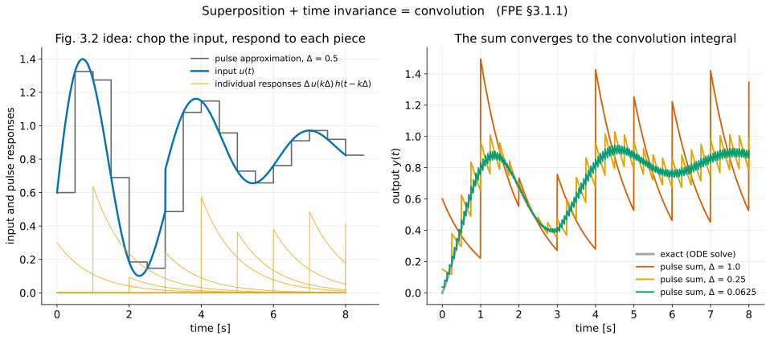
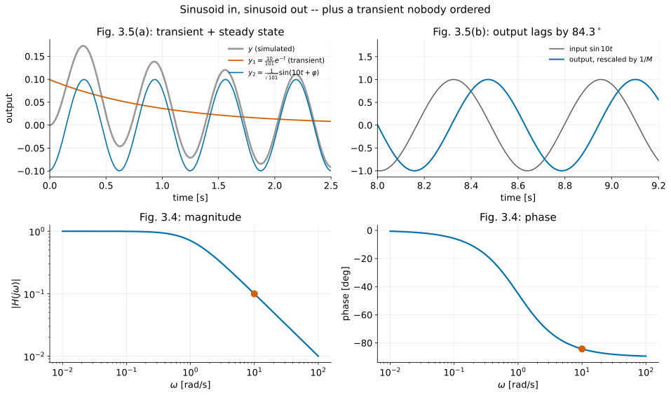
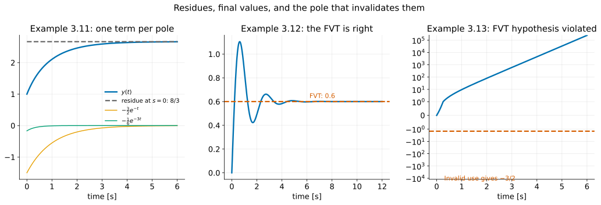
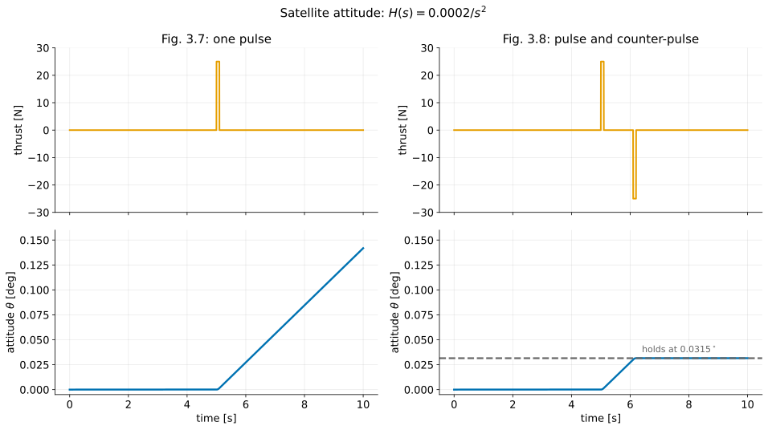

# Dynamic Response I — Convolution, Transfer Functions, and the Laplace Toolkit

**Student lecture notes — FPE 8th ed., Section 3.1**

The impulse response describes how a linear time-invariant system responds from rest. Convolution builds the response to a general input from shifted impulse responses; the Laplace transform turns that convolution into multiplication. This lecture develops the transform tools needed to calculate and interpret responses.

**Prerequisites:** [Modeling and solving ODEs](modeling-and-dynamics-poles_student.md), [transfer functions and zeros](modeling-and-dynamics-zeroes_student.md), and [signals built from exponentials](signals-fourier_student.md).

**Source:** Franklin, Powell & Emami-Naeini, *Feedback Control of Dynamic Systems*, 8th ed. Example and equation numbers follow the textbook. Numbered sections and § references refer to these notes unless labelled as textbook sections.

## Learning objectives

After studying this lecture, you should be able to:

1. Test a differential equation for linearity and time invariance, as in Examples 3.1 and 3.2, and say what each property buys.
2. Build the convolution integral from a train of short pulses, and state the sifting property of the impulse.
3. Compute the impulse response of a first-order system by integrating across $t=0$ (Example 3.3).
4. Derive $y(t)=H(s)e^{st}$ for an exponential input, and give the three equivalent definitions of the transfer function: exponential gain, ratio of transforms at zero initial conditions, and transform of the impulse response.
5. Write down a transfer function by inspection from a constant-coefficient ODE (Eq. 3.26).
6. Obtain amplitude ratio and phase from $H(j\omega)$, and separate the steady-state sinusoid from the switch-on transient (Examples 3.6, 3.7).
7. State the $\mathcal L_-$ definition, explain the $0^-$ lower limit, and derive the transforms of the step, ramp, impulse and sinusoid.
8. Apply the transform properties of textbook §3.1.4, especially differentiation, integration, time delay and convolution.
9. Expand a rational $Y(s)$ with distinct poles by the cover-up method and invert it from the table (Example 3.11).
10. Apply the Final Value Theorem, state its hypothesis, and identify cases where it fails (Examples 3.12–3.14).
11. Solve an initial-value problem by transform, splitting the answer into zero-input and zero-state parts (Examples 3.15–3.17).
12. Define poles and zeros of a rational transfer function, count zeros at infinity, and explain why a pole-zero cancellation deserves suspicion.

## Notation and assumptions

| Symbol | Meaning |
|---|---|
| $1(t)$ | unit step: $0$ for $t<0$, $1$ for $t\ge0$ |
| $\delta(t)$ | unit impulse, defined by Eqs. (3.9)–(3.11) |
| $h(t)$ | unit impulse response |
| $H(s)$, $G(s)$ | transfer function; $H(s)=\mathcal L\{h(t)\}$ |
| $u(t),\ y(t)$ | input and output signals; $U(s),\ Y(s)$ their transforms |
| $s=\sigma_1+j\omega$ | the complex transform variable |
| $*$ | convolution |
| $\mathcal L$ | the one-sided ($\mathcal L_-$) transform, lower limit $0^-$ |

Unless stated otherwise, transfer functions describe causal LTI systems from zero initial state. Add the zero-input response for nonzero initial conditions. LHP and RHP mean the left and right half planes.

Here $s=\sigma_1+j\omega$ uses $\sigma_1=\Re(s)$. In L2–L3, a stable pole is written $s=-\sigma\pm j\omega_d$ with $\sigma>0$, so the decay-rate convention has the opposite sign.

---

## 1. Linearity and time invariance {#section-1}

Linearity gives superposition: known responses can be scaled and added. Time invariance means a delayed input gives the same response delayed by the same amount. Together, these properties let one impulse response determine every response from rest within the LTI model. With nonzero initial conditions, add the free response.

### 1.1 Superposition (Example 3.1) {#section-1-1}

**Standing assumption:** transfer functions and convolution describe the **zero-state** response of a causal LTI system. With nonzero initial conditions, add the zero-input response. Superposition holds for input/initial-state pairs; fixing the same nonzero initial state for every input generally gives an affine, rather than linear, input-output map.

Take the first-order system

$$
\dot y+ky=u .
$$

Let $u=\alpha_1u_1+\alpha_2u_2$ and try $y=\alpha_1y_1+\alpha_2y_2$. Substituting,

$$
\alpha_1\dot y_1+\alpha_2\dot y_2+k(\alpha_1y_1+\alpha_2y_2)=\alpha_1u_1+\alpha_2u_2,
$$

which regroups as

$$
\boxed{
\alpha_1\left(\dot y_1+ky_1-u_1\right)+\alpha_2\left(\dot y_2+ky_2-u_2\right)=0 .
\tag{3.1}
}
$$

If $y_1$ solves the equation with input $u_1$ and $y_2$ with $u_2$, both brackets vanish and the combination is a solution.

#### Check your understanding

> Where in that argument did we use the fact that $k$ is constant?

Nowhere. Superposition survives a time-varying $k(t)$. That is the point of the next example.

### 1.2 Time invariance (Example 3.2) {#section-1-2}

Now allow $k=k(t)$, delay the input by $\tau$, and ask whether the output is simply delayed too. Let $y_1$ solve the original equation,

$$
\dot y_1(t)+k(t)y_1(t)=u_1(t),
\tag{3.2}
$$

and assume the response to $u_2(t)=u_1(t-\tau)$ is $y_2(t)=y_1(t-\tau)$. By the chain rule, $\dot y_2(t)=\dot y_1(t-\tau)$, so substituting into $\dot y_2+k(t)y_2=u_1(t-\tau)$ gives

$$
\dot y_1(t-\tau)+k(t)y_1(t-\tau)=u_1(t-\tau).
$$

With $\eta=t-\tau$, so that $t=\eta+\tau$,

$$
\frac{dy_1(\eta)}{d\eta}+k(\eta+\tau)y_1(\eta)=u_1(\eta).
\tag{3.3}
$$

Eq. (3.2) evaluated at time $\eta$ says $dy_1/d\eta+k(\eta)y_1(\eta)=u_1(\eta)$. Subtracting it from Eq. (3.3):

$$
\left[k(\eta+\tau)-k(\eta)\right]y_1(\eta)=0 .
$$

For a nonzero response, invariance under **every** time shift $\tau$ therefore requires

$$
\boxed{k(\eta+\tau)=k(\eta)=k,\quad\text{a constant.}}
$$

So: **linearity gives superposition; constant coefficients give shift invariance.** Both are needed for what follows.

---

## 2. The impulse response and the convolution integral {#section-2}

### 2.1 Chopping the input into pulses {#section-2-1}

Define the unit-area pulse

$$
p_\Delta(t)=
\begin{cases}
\dfrac1\Delta, & 0\le t\le\Delta\\[4pt]
0,&\text{elsewhere}
\end{cases}
\tag{3.4}
$$

and let $h_\Delta(t)$ be the system's response to it. Scaling by $\Delta u(k\Delta)$ and shifting by $k\Delta$, superposition gives the total response

$$
\boxed{
y_\Delta(t)=\sum_{k=0}^{\infty}\Delta\,u(k\Delta)\,h_\Delta(t-k\Delta)
\tag{3.5}
}
$$

Here $y_\Delta$ is the exact response to the staircase approximation of the input, not yet the exact response to $u$. Now let $\Delta\to0$. The pulse becomes taller and narrower at constant area; its impulse limit is a distributional limit, not pointwise convergence to an ordinary function:

$$
\lim_{\Delta\to0}p_\Delta(t)=\delta(t),
\qquad
\lim_{\Delta\to0}h_\Delta(t)=h(t),
\tag{3.6, 3.7}
$$

and the sum becomes an integral:

$$
\boxed{
y(t)=\int_0^\infty u(\tau)h(t-\tau)\,d\tau
\tag{3.8}
}
$$

**Numerical approximation:** The sum $\sum_k\Delta u(k\Delta)h(t-k\Delta)$ approximates convolution using weighted impulses. At finite $\Delta$, it differs from Eq. (3.5), which uses the exact finite-pulse response $h_\Delta$. Refining $\Delta$ improves this quadrature approximation; it does not turn each finite impulse sample into an exact finite-pulse response.

*Convolution example:* $\dot y+y=u$ from rest, with $u(t)=0.6+e^{-0.3t}\sin2t+0.25\,1(t-3)$ for $t\ge0$ and zero input before zero. The plotted sums use weighted impulses and $h(t)=e^{-t}1(t)$; smaller $\Delta$ brings them closer to the numerical ODE solution. At finite $\Delta$, these are not exact responses to the staircase input.

### 2.2 The impulse and its sifting property {#section-2-2}

Dirac's definition:

$$
\delta(t)=0\ \ (t\ne0),
\qquad
\int_{-\infty}^{\infty}\delta(t)\,dt=1 .
\tag{3.9, 3.10}
$$

The property that does the work:

$$
\boxed{
\int_{-\infty}^{\infty}f(\tau)\delta(t-\tau)\,d\tau=f(t)
\tag{3.11}
}
$$

An impulse models a force or signal concentrated into a very short interval while retaining its total area. For example, a brief bat–ball contact changes the ball’s momentum by the force impulse. The sifting property expresses a signal as a continuous sum of shifted impulses; superposition then builds its response.

### 2.3 Example 3.3: the impulse response by integrating across zero {#section-2-3}

Take $\dot y+ky=\delta(t)$ with $y(0^-)=0$. Integrate from just before zero to just after:

$$
\int_{0^-}^{0^+}\dot y\,dt+k\int_{0^-}^{0^+}y\,dt=\int_{0^-}^{0^+}\delta(t)\,dt .
$$

The middle term is the integral of a bounded function over a vanishing interval, so it is zero. The rest gives

$$
y(0^+)-y(0^-)=1
\qquad\Longrightarrow\qquad
y(0^+)=1 .
$$

For $t>0$ the equation is homogeneous, $\dot y+ky=0$. Substituting $y=Ae^{st}$ gives $(s+k)Ae^{st}=0$, so $s=-k$. Then $y(0^+)=A=1$ — exactly the argument of the prerequisite notes. Since $y=0$ for $t<0$, the result is

$$
\boxed{
h(t)=e^{-kt}1(t)
}
$$

#### Check your understanding

> The impulse did not change the shape of the response. What did it change?

The initial condition. **An impulse can set an initial state.** For this first-order system, its subsequent motion is a free response. In a higher-order system one input impulse excites a particular combination of states, not every possible initial state. Direct feedthrough can also put an impulse in the output at $t=0$.

### 2.4 Causality and the limits of integration {#section-2-4}

For a time-invariant system the general input gives

$$
y(t)=\int_{-\infty}^{\infty}u(\tau)h(t-\tau)\,d\tau
=\int_{-\infty}^{\infty}h(\tau)u(t-\tau)\,d\tau .
\tag{3.12, 3.13}
$$

If $h(\tau)\ne0$ for $\tau<0$, the response can begin before the input does. Such systems are called **non-causal**. For a causal system, $h(t)=0$ for $t<0$. With an input that also vanishes before zero and zero initial state, this gives

$$
\boxed{
y(t)=\int_0^t u(\tau)h(t-\tau)\,d\tau
\tag{3.15}
}
$$

---

## 3. From convolution to the transfer function {#section-3}

### 3.1 The one-line consequence {#section-3-1}

Put $u(t)=e^{st}$ into Eq. (3.13):

$$
y(t)=\int_{-\infty}^{\infty}h(\tau)e^{s(t-\tau)}\,d\tau
=e^{st}\underbrace{\int_{-\infty}^{\infty}h(\tau)e^{-s\tau}\,d\tau}_{\textstyle H(s)} .
$$

Therefore

$$
\boxed{
u(t)=e^{st}
\quad\Longrightarrow\quad
y(t)=H(s)e^{st},
\qquad
H(s)=\int_{-\infty}^{\infty}h(\tau)e^{-s\tau}\,d\tau
\tag{3.17, 3.18}
}
$$

Shifting an exponential only rescales it: $e^{s(t-\tau)}=e^{st}e^{-s\tau}$. Thus the exponential factors out of convolution, leaving the complex gain $H(s)$. This calculation uses an input defined for all time and requires convergence; a switched exponential generally also excites a transient.

**Qualification:** the convolution eigenfunction statement holds where the integral converges. Algebraic substitution also gives a particular solution when $s$ is not a pole, but it need not be an attracting steady state. At a pole, the trial form fails and resonance introduces factors such as $te^{st}$. For an exponential switched on at zero, include the switch-on transient.

### 3.2 Example 3.4 {#section-3-2}

For $\dot y+ky=u=e^{st}$, assume $y=H(s)e^{st}$, so $\dot y=sH(s)e^{st}$ and

$$
sH(s)e^{st}+kH(s)e^{st}=e^{st}
\qquad\Longrightarrow\qquad
\boxed{H(s)=\frac1{s+k}} .
$$

Substitution of the exponential trial solution gives $H(s)$ directly from the differential equation, without evaluating the transform integral.

### 3.3 Three definitions of the same object {#section-3-3}

These are three descriptions of the same transfer function, with the qualifications on exponential inputs stated above:

$$
\boxed{
\begin{array}{ll}
\textbf{1. Exponential gain} & u=e^{st}\ \Rightarrow\ y=H(s)e^{st}\\[4pt]
\textbf{2. Ratio of transforms} & \dfrac{Y(s)}{U(s)}=H(s)\ \ \text{with all initial conditions zero}\\[8pt]
\textbf{3. Transform of }h & H(s)=\mathcal L\{h(t)\}
\end{array}}
$$

Definition 3 follows because $\mathcal L\{\delta\}=1$: feed in an impulse and $Y(s)=H(s)\cdot1$.

For causal inputs from rest, taking the transform of the convolution gives $Y=HU$ directly (property 7 in §6). Definition 1 uses the convergence/particular-solution qualification above; it does not say every switched exponential produces only one exponential.

### 3.4 Writing a transfer function by inspection {#section-3-4}

For

$$
\frac{d^3y}{dt^3}+a_1\ddot y+a_2\dot y+a_3y=b_1\ddot u+b_2\dot u+b_3u ,
\tag{3.24}
$$

transform with zero initial conditions — each $d/dt$ becomes an $s$ — to get

$$
(s^3+a_1s^2+a_2s+a_3)Y(s)=(b_1s^2+b_2s+b_3)U(s),
$$

so

$$
\boxed{
H(s)=\frac{b_1s^2+b_2s+b_3}{s^3+a_1s^2+a_2s+a_3}=\frac{b(s)}{a(s)}
\tag{3.26}
}
$$

**The output-side differential operator gives the denominator; the input-side operator gives the numerator.** After removing common factors, the roots of the numerator are the finite zeros.

### 3.5 Example 3.5: the RC circuit {#section-3-5}

Consider a resistor $R$ in series with a capacitor $C$, with input voltage $u$ across the combination and output voltage $y$ across the capacitor. The same current flows through both elements. Kirchhoff’s voltage law around the loop is $u=Ri+y$. The capacitor current is $i=C\dot y$, so

$$
RC\dot y+y=u .
$$

Transform using property 5 of §6, $\mathcal L\{\dot y\}=sY(s)-y(0^-)$, with $y(0^-)=0$:

$$
RC\,sY(s)+Y(s)=U(s)
\quad\Longrightarrow\quad
(RCs+1)Y(s)=U(s)
\qquad\Longrightarrow\qquad
\boxed{H(s)=\frac{1}{RCs+1}}
$$

To invert, divide the numerator and denominator by $RC$ so the denominator has leading coefficient 1:

$$
H(s)=\frac{1/(RC)}{s+1/(RC)} .
$$

Since $\mathcal L\{e^{-at}1(t)\}=1/(s+a)$, which is the step transform with the frequency shift of property 4, the impulse response is

$$
h(t)=\frac1{RC}e^{-t/(RC)}1(t) .
$$

The time constant is $\tau=RC$. The same first-order form appears in thermal and mechanical models; the physical parameters change, but the response calculation is the same.

---

## 4. Frequency response {#section-4}

### 4.1 Two exponentials make a cosine {#section-4-1}

Euler's relation splits a cosine into exponentials, and each one is a case of Eq. (3.17):

$$
A\cos\omega t=\frac A2\left(e^{j\omega t}+e^{-j\omega t}\right)
\quad\Longrightarrow\quad
y(t)=\frac A2\left[H(j\omega)e^{j\omega t}+H(-j\omega)e^{-j\omega t}\right].
\tag{3.27}
$$

For a real system, write $H(j\omega)=M(\omega)e^{j\varphi(\omega)}$. The two terms are conjugates, so their sum is real. For a stable system the switch-on transient decays and the resulting steady-state output is

$$
\boxed{
y(t)=AM\cos(\omega t+\varphi),
\qquad
M=|H(j\omega)|,
\qquad
\varphi=\angle H(j\omega)
\tag{3.28}
}
$$

Complex-conjugate terms combine into a real response. The magnitude of $H(j\omega)$ gives the amplitude ratio, and its angle gives the phase shift.

### 4.2 Examples 3.6 and 3.7 {#section-4-2}

**Example 3.6.** For $H(s)=1/(s+k)$, set $s=j\omega$:

$$
H(j\omega)=\frac1{k+j\omega} .
$$

The magnitude of a quotient is the quotient of the magnitudes, and its angle is the difference of the angles. The numerator is $1$, with magnitude $1$ and angle $0$. The denominator has magnitude $\sqrt{k^2+\omega^2}$ and angle $\tan^{-1}(\omega/k)$, since $k>0$ puts it in the right half plane. Therefore

$$
M=|H(j\omega)|=\frac1{\sqrt{\omega^2+k^2}},
\qquad
\varphi=\angle H(j\omega)=0-\tan^{-1}(\omega/k)=-\tan^{-1}(\omega/k) .
$$

Equivalently, multiply by the conjugate: $H(j\omega)=\dfrac{k-j\omega}{k^2+\omega^2}$. The real part is positive and the imaginary part is negative, so the phase lies between $0$ and $-90^\circ$. The textbook plots these two curves with $k=1$.

**Example 3.7.** Now, with $k=1$, switch the input on at $t=0$: $u(t)=\sin(10t)1(t)$, with the system at rest. From the table in §5.2, $U(s)=10/(s^2+100)$, so

$$
Y(s)=H(s)U(s)=\frac{1}{s+1}\cdot\frac{10}{s^2+100}=\frac{10}{(s+1)(s^2+100)} .
$$

*Step 1: set up the expansion.* The quadratic has complex roots $\pm10j$. To keep the arithmetic real, give it a first-order numerator:

$$
\frac{10}{(s+1)(s^2+100)}=\frac{A}{s+1}+\frac{Bs+C}{s^2+100} .
$$

*Step 2: cover-up for the real pole.*

$$
A=\left.\frac{10}{s^2+100}\right|_{s=-1}=\frac{10}{101} .
$$

*Step 3: match coefficients for $B$ and $C$.* Multiply through by $(s+1)(s^2+100)$:

$$
10=A(s^2+100)+(Bs+C)(s+1)=(A+B)s^2+(B+C)s+(100A+C) .
$$

$$
s^2:\ A+B=0\ \Rightarrow\ B=-\frac{10}{101};
\qquad
s^0:\ 100A+C=10\ \Rightarrow\ C=10-\frac{1000}{101}=\frac{10}{101};
\qquad
s^1:\ B+C=0\ \checkmark
$$

The $s^1$ equation is left over as a check. Hence

$$
Y(s)=\frac{10}{101}\left[\frac{1}{s+1}-\frac{s}{s^2+100}+\frac1{10}\cdot\frac{10}{s^2+100}\right].
$$

*Step 4: invert term by term.* Use $e^{-t}\leftrightarrow1/(s+1)$, $\cos10t\leftrightarrow s/(s^2+100)$ (derived in §5.2), and $\sin10t\leftrightarrow10/(s^2+100)$:

$$
y(t)=\frac{10}{101}e^{-t}+\frac{1}{101}\left(\sin10t-10\cos10t\right),\qquad t\ge0 .
$$

*Step 5: combine the sinusoids.* Write $a\sin\theta+b\cos\theta=\sqrt{a^2+b^2}\,\sin(\theta+\varphi)$ with $\cos\varphi=a/\sqrt{a^2+b^2}$ and $\sin\varphi=b/\sqrt{a^2+b^2}$. Here $a=1$ and $b=-10$. The amplitude is $\sqrt{101}/101=1/\sqrt{101}$. Also $\cos\varphi>0$ and $\sin\varphi<0$, so $\varphi$ is in the fourth quadrant and $\varphi=-\tan^{-1}(10)$:

$$
\boxed{
y(t)=\underbrace{\tfrac{10}{101}e^{-t}}_{\text{transient}}
+\underbrace{\tfrac{1}{\sqrt{101}}\sin(10t+\varphi)}_{\text{steady state}}},
\qquad
\varphi=-\tan^{-1}(10)\approx-84.29^\circ .
$$

The steady-state part matches Eq. (3.28): $M(10)=1/\sqrt{101}$ and $\varphi(10)=-\tan^{-1}10$, from Example 3.6 with $\omega=10$ and $k=1$.

**Textbook correction:** The phase in Example 3.7 is $-84.29^\circ$, not the printed $-8.42^\circ$.

**Worked check:** For $u(t)=\sin(10t)1(t)$, predict amplitude $1/\sqrt{101}=0.099504$ and phase $-\tan^{-1}(10)=-84.29^\circ$. Verify the complete expression gives $y(0)=0$. The transient coefficient is $10/101$; it is absent from the steady-state frequency-response calculation.

#### Check your understanding

> Both the amplitude ratio and the phase can be measured experimentally with a signal generator and an oscilloscope. What does that let you do that a model does not?

Identify a system you have not modeled. That is textbook §3.7, and it is why the frequency response matters even to people who never draw a Bode plot.

---

## 5. The $\mathcal L_-$ transform and four transform pairs {#section-5}

### 5.1 The definition and why the lower limit is $0^-$ {#section-5-1}

$$
\boxed{
F(s)\triangleq\int_{0^-}^{\infty}f(t)e^{-st}\,dt,
\qquad
s=\sigma_1+j\omega
\tag{3.32}
}
$$

The lower limit and convergence region matter:

- **Why one-sided.** Eq. (3.30) integrates from $-\infty$; Eq. (3.32) starts at $t=0^-$. In control we switch things on, and we want initial conditions to appear in the algebra.
- **Why $0^-$ and not $0^+$.** So that an impulse at the origin is inside the interval (Example 3.9). Initial conditions in the derivative formulas are consequently taken at $0^-$.
- **Convergence.** The factor $e^{-\sigma_1 t}$ is a built-in convergence aid: if $f$ grows no faster than exponentially, the integral converges for $\sigma_1$ large enough.

The inversion integral

$$
f(t)=\frac1{2\pi j}\int_{\sigma_c-j\infty}^{\sigma_c+j\infty}F(s)e^{st}\,ds
\tag{3.33}
$$

reconstructs $f$ under the usual inversion conditions, with the vertical line $\Re(s)=\sigma_c$ inside the region of convergence. At a jump of an ordinary piecewise-smooth signal, inversion gives the midpoint of the one-sided limits. For the rational examples here, transform pairs and partial fractions are simpler than evaluating this integral.

### 5.2 Four basic transform pairs (Examples 3.8–3.10) {#section-5-2}

| $f(t)$, $t\ge0$ | $F(s)$ | Region |
|---|---|---|
| $a\,1(t)$ | $a/s$ | $\Re(s)>0$ |
| $b\,t\,1(t)$ | $b/s^2$ | $\Re(s)>0$ |
| $\delta(t)$ | $1$ | all $s$ |
| $\sin\omega t\,1(t)$ | $\dfrac{\omega}{s^2+\omega^2}$ | $\Re(s)>0$ |
| $\cos\omega t\,1(t)$ | $\dfrac{s}{s^2+\omega^2}$ | $\Re(s)>0$ |

The step follows by direct integration, the ramp by parts, the impulse by the sifting property, and the sinusoid by Euler's relation. Each one uses Eq. (3.32) directly.

**Example 3.8, step.** For $\Re(s)>0$, $e^{-st}\to0$ as $t\to\infty$, so

$$
\mathcal L\{a\,1(t)\}=\int_{0^-}^{\infty}a\,e^{-st}\,dt=a\left[-\frac{e^{-st}}{s}\right]_{0^-}^{\infty}=a\left(0+\frac1s\right)=\frac as .
$$

**Example 3.8, ramp.** Integrate by parts, $\int u\,dv=uv-\int v\,du$, with $u=t$ and $dv=e^{-st}dt$. Then $du=dt$ and $v=-e^{-st}/s$:

$$
\mathcal L\{b\,t\,1(t)\}=b\int_{0^-}^{\infty}t\,e^{-st}\,dt
=b\left[-\frac{t\,e^{-st}}{s}\right]_{0^-}^{\infty}+\frac bs\int_{0^-}^{\infty}e^{-st}\,dt
=0+\frac bs\cdot\frac1s=\frac b{s^2} .
$$

The boundary term vanishes at the upper limit because $te^{-\sigma_1t}\to0$ for $\sigma_1>0$, and it vanishes at the lower limit because $t=0$.

**Example 3.9, impulse.** The interval $[0^-,\infty)$ contains the impulse at $t=0$. The sifting property, Eq. (3.11), picks out $e^{-s\cdot0}=1$:

$$
\int_{0^-}^{\infty}\delta(t)e^{-st}\,dt=1 .
\tag{3.34}
$$

The $0^-$ lower limit includes the full impulse at the origin. Starting at $0^+$ would omit it and give zero for its transform.

**Example 3.10, sinusoid.** Substitute $\sin\omega t=(e^{j\omega t}-e^{-j\omega t})/(2j)$. Each exponential integrates like the step, with $s$ replaced by $s\mp j\omega$, and converges for $\Re(s)>0$:

$$
\mathcal L\{\sin\omega t\,1(t)\}
=\frac1{2j}\int_{0^-}^{\infty}\left(e^{-(s-j\omega)t}-e^{-(s+j\omega)t}\right)dt
=\frac1{2j}\left(\frac1{s-j\omega}-\frac1{s+j\omega}\right)
=\frac1{2j}\cdot\frac{2j\omega}{s^2+\omega^2}
=\frac{\omega}{s^2+\omega^2} .
\tag{3.35}
$$

**The cosine, needed in §4.2 and §7.3.** This pair is not among the textbook's worked examples. Either repeat the calculation with $\cos\omega t=(e^{j\omega t}+e^{-j\omega t})/2$, or use the differentiation property (property 5 in §6). Since $\cos\omega t=\frac1\omega\frac{d}{dt}\sin\omega t$ for $t>0$ and $\sin0=0$:

$$
\mathcal L\{\cos\omega t\,1(t)\}=\frac1\omega\left[s\cdot\frac{\omega}{s^2+\omega^2}-\sin 0\right]=\frac{s}{s^2+\omega^2} .
$$

**A remark on the regions:** the rational expressions can be continued algebraically beyond their regions of convergence, except at poles. That continuation does not make the defining integral converge there. In particular, interpreting $H(j\omega)$ as a settled sinusoidal response requires decaying transients and no pole at the forcing frequency.

---

Useful additional pairs for inversion are

| Causal signal | Transform |
|---|---|
| $e^{-at}1(t)$ | $1/(s+a)$ |
| $\cos\omega t\,1(t)$ | $s/(s^2+\omega^2)$ |
| $e^{-at}\cos\omega t\,1(t)$ | $(s+a)/[(s+a)^2+\omega^2]$ |
| $e^{-at}\sin\omega t\,1(t)$ | $\omega/[(s+a)^2+\omega^2]$ |

For real $a$ and $\omega$, the exponential and damped-sinusoid pairs converge for $\Re(s)>-a$; the undamped cosine converges for $\Re(s)>0$.

## 6. The properties table {#section-6}

These properties apply where the transforms exist. Differentiation must include initial conditions; time delay and time scaling use the stated causal conventions.

| # | Property | Statement |
|---|---|---|
| 1 | Superposition | $\mathcal L\{\alpha f_1+\beta f_2\}=\alpha F_1+\beta F_2$ |
| 2 | **Time delay** | $\mathcal L\{f(t-\lambda)1(t-\lambda)\}=e^{-s\lambda}F(s)$ for ordinary causal $f$ and $\lambda\ge0$ |
| 3 | Time scaling | $\mathcal L\{f(at)\}=\frac1aF(s/a)$, $a>0$ |
| 4 | Shift in frequency | $\mathcal L\{e^{-at}f(t)\}=F(s+a)$ |
| 5 | **Differentiation** | $\mathcal L\{\dot f\}=sF(s)-f(0^-)$ |
| 6 | **Integration** | $\mathcal L\left\{\int_{0^-}^t f(\tau)\,d\tau\right\}=\frac1sF(s)$, zero initial integrator state |
| 7 | **Convolution** | $\mathcal L\{f_1*f_2\}=F_1F_2$ |
| 8 | Time product (optional) | $\mathcal L\{f_1f_2\}=\frac1{2\pi j}\int_{c-j\infty}^{c+j\infty}F_1(p)F_2(s-p)\,dp$, when the contour and convergence conditions permit |
| 9 | Multiplication by $t$ | $\mathcal L\{tf(t)\}=-\dfrac{d}{ds}F(s)$ |

Property 8 is a complex contour integral, not ordinary real-axis convolution in $s$; see textbook Appendix A for details. Negative time scaling reverses time and is not covered by the one-sided scaling rule. Repeated differentiation gives

$$
\boxed{
\mathcal L\{\ddot f\}=s^2F(s)-sf(0^-)-\dot f(0^-)
\tag{3.42}
}
$$

For an $n$th derivative, repeated application gives

$$
\mathcal L\{f^{(n)}\}
=s^nF(s)-\sum_{k=0}^{n-1}s^{n-1-k}f^{(k)}(0^-).
$$

Convolution in time becomes multiplication in $s$. Time delay becomes a factor $e^{-s\lambda}$. With zero initial conditions, integration contributes $1/s$ and differentiation contributes $s$.

---

## 7. Inverting: partial fractions and the standard procedure {#section-7}

### 7.1 The five-step procedure {#section-7-1}

Use the following procedure:

1. Find $H(s)$ — transform the equations of motion and solve the resulting algebra.
2. Transform the input, $U(s)$.
3. Multiply for zero initial state: $Y(s)=H(s)U(s)$. If the initial state is nonzero, add its response as in §7.3.
4. Expand $Y(s)$ in partial fractions.
5. Invert term by term from the table.

> **Hand inversion is often deferred during design.** Pole-zero locations guide a candidate design; a numerical time response then checks its actual performance. Pole locations alone do not determine amplitudes or certify specifications.

L2 develops the connection between pole locations and response shapes.

### 7.2 The cover-up method {#section-7-2}

For a strictly proper rational function with distinct poles,

$$
F(s)=\frac{C_1}{s-p_1}+\cdots+\frac{C_n}{s-p_n},
\qquad
\boxed{C_i=\left.(s-p_i)F(s)\right|_{s=p_i}}
\tag{3.51, 3.53}
$$

and each term inverts to $C_ie^{p_it}1(t)$.

**Why the cover-up rule works.** Multiply the expansion by $(s-p_i)$:

$$
(s-p_i)F(s)=C_i+(s-p_i)\sum_{k\ne i}\frac{C_k}{s-p_k} .
$$

At $s=p_i$ every other term is multiplied by zero, and only $C_i$ is left. "Cover up" the factor $(s-p_i)$ in the denominator and evaluate what remains at $s=p_i$.

**Example 3.11.** Take

$$
Y(s)=\frac{(s+2)(s+4)}{s(s+1)(s+3)}=\frac{C_1}{s}+\frac{C_2}{s+1}+\frac{C_3}{s+3} .
$$

The numerator has degree 2 and the denominator has degree 3, so $Y$ is strictly proper and no polynomial term appears. The poles $0,-1,-3$ are distinct. Cover up each factor in turn:

$$
C_1=\left.\frac{(s+2)(s+4)}{(s+1)(s+3)}\right|_{s=0}=\frac{(2)(4)}{(1)(3)}=\frac83,
$$

$$
C_2=\left.\frac{(s+2)(s+4)}{s(s+3)}\right|_{s=-1}=\frac{(1)(3)}{(-1)(2)}=-\frac32,
$$

$$
C_3=\left.\frac{(s+2)(s+4)}{s(s+1)}\right|_{s=-3}=\frac{(-1)(1)}{(-3)(-2)}=-\frac16 .
$$

Invert with $1/s\leftrightarrow1(t)$ and $1/(s+a)\leftrightarrow e^{-at}1(t)$, so

$$
\boxed{
y(t)=\frac83\,1(t)-\frac32e^{-t}1(t)-\frac16e^{-3t}1(t) .
}
$$

In Matlab this is `[r,p,k] = residue(num,den)`, and the book prints the result to show it agrees.

**Worked check:** Recombine the three fractions of Example 3.11 over a common denominator. Also check $y(0^+)=1$ and $y(\infty)=8/3$. These checks catch residue sign errors without a simulation.

**Repeated poles:** a pole of multiplicity $m$ requires terms through $1/(s-p)^m$. The inverse pair is

$$
\mathcal L^{-1}\left\{\frac1{(s-p)^k}\right\}
=\frac{t^{k-1}}{(k-1)!}e^{pt}1(t).
$$

Thus a double pole contributes $(A+Bt)e^{pt}$. Complex-conjugate terms combine into real sines and cosines. See textbook Appendix A for further inversion examples.

### 7.3 Solving differential equations (Examples 3.15–3.17) {#section-7-3}

These examples distinguish free motion, forcing with a nonzero initial state, and forcing from rest.

All three use the same recipe:

1. Transform each term. Derivatives of $y$ use Eqs. (3.41)–(3.42), which carry the initial conditions: $\mathcal L\{\dot y\}=sY-y(0^-)$ and $\mathcal L\{\ddot y\}=s^2Y-sy(0^-)-\dot y(0^-)$.
2. Collect the $Y(s)$ terms on the left and move everything else to the right.
3. Solve for $Y(s)$.
4. Expand in partial fractions.
5. Invert from the table.

In these examples, $y(0)$ and $\dot y(0)$ mean the values at $0^-$. No input impulse acts at $t=0$, so they equal the $0^+$ values.

**Example 3.15, homogeneous.** $\ddot y+y=0$, $y(0)=\alpha$, $\dot y(0)=\beta$.

*Transform.* By Eq. (3.42), $\mathcal L\{\ddot y\}=s^2Y(s)-s\,y(0)-\dot y(0)=s^2Y-\alpha s-\beta$. The right side transforms to 0:

$$
s^2Y-\alpha s-\beta+Y=0 .
$$

*Solve for $Y$.* Collect the $Y$ terms: $(s^2+1)Y=\alpha s+\beta$, so

$$
Y(s)=\frac{\alpha s+\beta}{s^2+1}=\alpha\,\frac{s}{s^2+1}+\beta\,\frac{1}{s^2+1} .
$$

*Invert.* No partial fractions are needed, because the split above already matches two table entries with $\omega=1$ (§5.2): $s/(s^2+1)\leftrightarrow\cos t$ and $1/(s^2+1)\leftrightarrow\sin t$. Hence

$$
y(t)=[\alpha\cos t+\beta\sin t]1(t).
$$

*Check.* $y(0)=\alpha$, $\dot y=-\alpha\sin t+\beta\cos t$ gives $\dot y(0)=\beta$, and $\ddot y=-\alpha\cos t-\beta\sin t=-y$, so $\ddot y+y=0$. The poles $\pm j$ give the undamped oscillator's natural frequency of 1 rad/s.

**Example 3.16, forced with initial conditions.** $\ddot y+5\dot y+4y=3$ for $t\ge0$, with $y(0)=\alpha$, $\dot y(0)=\beta$.

*Transform.* The constant forcing is the step $3\cdot1(t)$, which transforms to $3/s$. Term by term:

$$
\underbrace{s^2Y-\alpha s-\beta}_{\mathcal L\{\ddot y\}}
+5\underbrace{\left(sY-\alpha\right)}_{\mathcal L\{\dot y\}}
+4Y=\frac3s .
$$

*Collect.*

$$
(s^2+5s+4)Y=\alpha s+\beta+5\alpha+\frac3s .
$$

*Solve for $Y$.* Factor $s^2+5s+4=(s+1)(s+4)$, because the roots of $s^2+5s+4=0$ are $s=\frac{-5\pm\sqrt{25-16}}{2}=-1,\,-4$. Multiply the numerator and denominator by $s$ to clear the $3/s$:

$$
Y(s)=\frac{s(s\alpha+\beta+5\alpha)+3}{s(s+1)(s+4)} .
$$

*Expand.* The numerator has degree 2 and the denominator has degree 3, and the poles $0,-1,-4$ are distinct. Write $Y=\dfrac{C_1}{s}+\dfrac{C_2}{s+1}+\dfrac{C_3}{s+4}$ and cover up each factor:

$$
C_1=\left.\frac{s(s\alpha+\beta+5\alpha)+3}{(s+1)(s+4)}\right|_{s=0}=\frac{0+3}{(1)(4)}=\frac34,
$$

$$
C_2=\left.\frac{s(s\alpha+\beta+5\alpha)+3}{s(s+4)}\right|_{s=-1}
=\frac{(-1)(-\alpha+\beta+5\alpha)+3}{(-1)(3)}
=\frac{-(4\alpha+\beta)+3}{-3}
=\frac{4\alpha+\beta-3}{3},
$$

$$
C_3=\left.\frac{s(s\alpha+\beta+5\alpha)+3}{s(s+1)}\right|_{s=-4}
=\frac{(-4)(-4\alpha+\beta+5\alpha)+3}{(-4)(-3)}
=\frac{3-4\alpha-4\beta}{12} .
$$

*Invert.*

$$
y(t)=\frac34+\frac{\beta+4\alpha-3}{3}e^{-t}+\frac{3-4\alpha-4\beta}{12}e^{-4t},\qquad t\ge0.
$$

**Initial-condition check:** at $t=0$,

$$
y(0)=\frac{9+(16\alpha+4\beta-12)+(3-4\alpha-4\beta)}{12}=\frac{12\alpha}{12}=\alpha,
$$

$$
\dot y(0)=-\frac{4\alpha+\beta-3}{3}-4\cdot\frac{3-4\alpha-4\beta}{12}=\frac{-4\alpha-\beta+3-3+4\alpha+4\beta}{3}=\beta .
$$

As $t\to\infty$, $y\to3/4$. That matches setting $\ddot y=\dot y=0$ in the ODE, $4y=3$, and it anticipates the Final Value Theorem of §8.

**Zero-input and zero-state split.** The transformed equation separates $Y$ into two pieces. The initial conditions contribute $Y_{zi}=\dfrac{\alpha s+\beta+5\alpha}{(s+1)(s+4)}$. By cover-up, its residues are $\dfrac{-\alpha+\beta+5\alpha}{3}=\dfrac{4\alpha+\beta}{3}$ at $s=-1$ and $\dfrac{-4\alpha+\beta+5\alpha}{-3}=-\dfrac{\alpha+\beta}{3}$ at $s=-4$. The input contributes $Y_{zs}=H(s)U(s)=\dfrac{3}{s(s+1)(s+4)}$. Its residues are $\dfrac{3}{4}$ at $s=0$, $\dfrac{3}{(-1)(3)}=-1$ at $s=-1$, and $\dfrac{3}{(-4)(-3)}=\dfrac14$ at $s=-4$. Therefore

$$
y_{zi}(t)=\frac{4\alpha+\beta}{3}e^{-t}-\frac{\alpha+\beta}{3}e^{-4t},
\qquad
y_{zs}(t)=\frac34-e^{-t}+\frac14e^{-4t},
$$

and the sum reproduces the full answer term by term. The zero-state part alone satisfies $y_{zs}(0)=\dot y_{zs}(0)=0$.

In Example 3.15, the unit-step notation denotes the post-zero solution only. Example 3.16 states $t\ge0$ explicitly for the same reason. Extending a nonzero initial value as zero for $t<0$ introduces distributions when the signal is differentiated.

**Example 3.17, zero initial conditions.** $\ddot y+5\dot y+4y=2e^{-2t}1(t)$, $y(0)=\dot y(0)=0$.

*Transform.* With zero initial conditions, $\ddot y\to s^2Y$ and $\dot y\to sY$. The input transforms by the step and the frequency shift of property 4: $\mathcal L\{2e^{-2t}1(t)\}=2/(s+2)$. Then

$$
(s^2+5s+4)Y=\frac{2}{s+2}
\qquad\Longrightarrow\qquad
Y(s)=\frac{2}{(s+2)(s+1)(s+4)} .
$$

This is $Y=HU$ with $H(s)=1/[(s+1)(s+4)]$ and $U(s)=2/(s+2)$, which is step 3 of the five-step procedure in §7.1.

*Expand.* The three poles are distinct. Cover up each one:

$$
C_{-2}=\left.\frac{2}{(s+1)(s+4)}\right|_{s=-2}=\frac{2}{(-1)(2)}=-1,
\qquad
C_{-1}=\left.\frac{2}{(s+2)(s+4)}\right|_{s=-1}=\frac{2}{(1)(3)}=\frac23,
$$

$$
C_{-4}=\left.\frac{2}{(s+2)(s+1)}\right|_{s=-4}=\frac{2}{(-2)(-3)}=\frac13,
$$

so

$$
Y(s)=-\frac1{s+2}+\frac{2/3}{s+1}+\frac{1/3}{s+4}
\quad\Longrightarrow\quad
y(t)=\left(-e^{-2t}+\tfrac23e^{-t}+\tfrac13e^{-4t}\right)1(t).
$$

*Check.* $y(0)=-1+\tfrac23+\tfrac13=0$, and $\dot y(0)=2-\tfrac23-\tfrac43=0$, as zero initial conditions require. The book's Matlab `residue(2, poly([-2;-1;-4]))` returns `r = [0.3333 -1 0.6667]` for `p = [-4 -2 -1]`, which agrees.

#### Check your understanding

> In Example 3.17 the input contributed the term $e^{-2t}$ and the system contributed $e^{-t}$ and $e^{-4t}$. Which of those is a pole of the transfer function?

Only the last two. **For zero initial state, the poles of $Y=HU$ come from the plant and the input, subject to cancellation; coincident poles can increase multiplicity.** The Final Value Theorem checks the poles of the resulting $sY(s)$, not just those of $H(s)$.

---

## 8. The Final Value Theorem {#section-8}

### 8.1 Statement {#section-8-1}

$$
\boxed{
\text{If all poles of }sY(s)\text{ are strictly in the LHP, then}
\quad
\lim_{t\to\infty}y(t)=\lim_{s\to0}sY(s)
\tag{3.54}
}
$$

For a rational $Y(s)$, partial fractions explain the theorem. Terms associated with LHP poles decay. RHP poles produce growth and imaginary-axis pairs produce persistent oscillation. A simple pole at zero contributes a constant; multiplying by $s$ and taking $s\to0$ extracts its residue. If there is no pole at zero and all modes decay, the final value is zero.

#### Why it works: multiplying by $s$ differentiates

Start from a fact you already accept. Where a signal ends up is where it started plus everything it changed along the way:

$$
y(\infty)=y(0^-)+\int_{0^-}^{\infty}\dot y(t)\,dt .
$$

Now look at $sY(s)$. By the differentiation property (property 5 in §6), $sY(s)$ is almost exactly the transform of the derivative:

$$
sY(s)=\mathcal L\{\dot y\}+y(0^-)=y(0^-)+\int_{0^-}^{\infty}\dot y(t)\,e^{-st}\,dt .
$$

Put the two lines side by side. They differ only by the weight $e^{-st}$ inside the integral. As $s\to0$ that weight tends to 1 at every time, so the second line becomes the first:

$$
\boxed{
\lim_{s\to0}sY(s)
=y(0^-)+\underbrace{\int_{0^-}^{\infty}\dot y(t)\,dt}_{\text{total change}}
=y(\infty)
}
$$

That is the whole theorem. **$sY(s)$ is (up to the starting value) the transform of the rate of change, and at $s=0$ a transform just adds up its signal over all time.** Adding up the rate of change gives the total change, and the starting value plus the total change is the final value. The $0^-$ convention (§5.1) makes this bookkeeping exact: any jump at $t=0$, such as an impulse in $\dot y$, is counted in the integral rather than lost.

**What "$s\to0$" means in time.** The weight $e^{-st}$ with small positive $s$ is a very long, slowly fading window. It is close to 1 up to times of order $1/s$ before cutting off. Letting $s\to0$ stretches that window over the entire future. Small $s$ looks at long times, which is why a limit at $s=0$ can say anything about $t\to\infty$. The same reasoning in reverse gives the initial value theorem: as $s\to\infty$ the window shrinks onto $t=0^+$, and $\lim_{s\to\infty}sY(s)=y(0^+)$.

**Where the hypothesis comes in.** Replacing $e^{-st}$ by 1 inside the integral is legal only if the plain integral $\int_0^\infty\dot y\,dt$ settles to a finite value, that is, only if $y$ actually stops changing. The pole condition on $sY(s)$ is the checkable version of that requirement. The two failures below are exactly the two ways the total change can fail to exist:

- **Growth (Example 3.13).** For $y=-\tfrac32+\tfrac32e^{2t}$, the derivative $\dot y=3e^{2t}$ grows, so the area under it is infinite. Its transform $\int_0^\infty 3e^{2t}e^{-st}\,dt=3/(s-2)$ converges only for $\Re(s)>2$. The limit $s\to0$ walks outside the region where the integral means anything. The algebra still returns a number, $-3/2$, but no longer a statement about the signal.
- **Oscillation.** For $y=\sin t$ (poles of $sY$ at $\pm j$), $\dot y=\cos t$ and $\int_0^\infty\cos t\,dt$ never settles; its running value $\sin t_f$ keeps swinging between $-1$ and $1$. The formula gives $\lim_{s\to0}s\cdot\frac{1}{s^2+1}=0$, the *average* of the oscillation, even though $y$ has no limit.

**A one-line check.** For $y=(1-e^{-t})1(t)$, $\dot y=e^{-t}$ and the total change is $\int_0^\infty e^{-t}\,dt=1$. In $s$: $Y=\dfrac1{s(s+1)}$, so $sY=\dfrac1{s+1}\to1$. Same number, and for the same reason.

The derivative argument explains *why* $sY(s)$ at $s=0$ is a final value; the partial-fraction argument above explains *which* poles let that final value exist.

### 8.2 Example 3.12: used correctly {#section-8-2}

$$
Y(s)=\frac{3(s+2)}{s(s^2+2s+10)} .
$$

*Step 1: check the hypothesis.* Multiplying by $s$ cancels the pole at the origin:

$$
sY(s)=\frac{3(s+2)}{s^2+2s+10} .
$$

Its poles are the roots of $s^2+2s+10=0$:

$$
s=\frac{-2\pm\sqrt{4-40}}{2}=-1\pm3j .
$$

Both have real part $-1<0$, so they are strictly in the LHP and the theorem applies.

*Step 2: take the limit.*

$$
y(\infty)=\lim_{s\to0}sY(s)=\frac{3(0+2)}{0+0+10}=\frac{6}{10}=0.6 .
$$

**Cross-check by cover-up:** the residue of $Y$ at $s=0$ is exactly this $sY(s)|_{s=0}$. The other two terms carry $e^{-t}$ and die out, which is the partial-fraction argument of §8.1.

### 8.3 Example 3.13: used incorrectly {#section-8-3}

$$
Y(s)=\frac{3}{s(s-2)} .
$$

Applying the formula blindly gives

$$
\lim_{s\to0}sY(s)=\lim_{s\to0}\frac{3}{s-2}=-\frac32 .
$$

*The step that was skipped:* $sY(s)=3/(s-2)$ has a pole at $s=+2$, in the RHP, so the hypothesis fails. To see what the formula threw away, expand by cover-up:

$$
C_0=\left.\frac{3}{s-2}\right|_{s=0}=-\frac32,
\qquad
C_2=\left.\frac{3}{s}\right|_{s=2}=\frac32,
\qquad
Y(s)=\frac{-3/2}{s}+\frac{3/2}{s-2} .
$$

Inverting, the true signal is

$$
y(t)=\left(-\frac32+\frac32e^{2t}\right)1(t),
$$

which is unbounded. The formula returned the residue $C_0$, the constant term, and silently discarded the growing $C_2e^{2t}$ term.

**Worked check:** For Example 3.13, evaluate $y(6)=\tfrac32(e^{12}-1)\approx244131$. The formal limit $\lim_{s\to0}sY(s)=-1.5$ is only the constant term; the growing mode prevents a final value.

### 8.4 DC gain (Example 3.14) {#section-8-4}

Feed a unit step, $U=1/s$:

For a stable proper transfer function, the final value exists and

$$
\boxed{
\text{DC gain}=\lim_{s\to0}sG(s)\frac1s=\lim_{s\to0}G(s)=G(0)
\tag{3.55}
}
$$

For $G(s)=\dfrac{3(s+2)}{s^2+2s+10}$, first check stability. The poles are $-1\pm3j$, as in Example 3.12, so they are in the LHP. The step response $Y(s)=G(s)/s$ therefore satisfies the hypothesis of Eq. (3.54), and

$$
\text{DC gain}=G(0)=\frac{3(0+2)}{0+0+10}=\frac{6}{10}=0.6 .
$$

Example 3.12 computes the limit of a specified signal. Example 3.14 interprets the same calculation as a system’s unit-step final value.

---

## 9. Poles and zeros {#section-9}

Two equivalent forms of a rational transfer function are

$$
H(s)=\frac{b_1s^m+\cdots+b_{m+1}}{s^n+a_1s^{n-1}+\cdots+a_n}=\frac{N(s)}{D(s)}
=K\frac{\prod_{i=1}^m(s-z_i)}{\prod_{i=1}^n(s-p_i)} .
\tag{3.56, 3.57}
$$

$K$ is the **transfer-function gain**, generally different from $H(0)$; $z_i$ are the **finite zeros**; $p_i$ are the **poles**. Define these for the reduced rational function, after cancelling common factors. Keep the full characteristic polynomial separately when checking internal modes.

$$
\boxed{H(z_i)=0}
\qquad\qquad
\boxed{|H(s)|\to\infty \text{ as } s\to p_i}
$$

Four consequences are useful:

1. **Poles give visible natural modes.** They set exponential rates and oscillation frequencies. L2 develops the pole-location picture.
2. **Zeros block transmission.** Drive with $u=u_0e^{s_0t}$ where $s_0=z_i$ and the output is identically zero, for a compatible initial state. Hence *transmission zeros*.
3. **Zeros at infinity.** If $m<n$, the book counts $n-m$ zeros at infinity. Standard finite-dimensional causal state-space models have proper transfer functions ($m\le n$). Ideal differentiators and some idealised choices of physical input/output can produce improper models; these are not bounded-bandwidth realisations.
4. **Cancellation is a warning sign.** A common numerator/denominator factor disappears from the reduced transfer function. If it represents a mode of the physical realisation, that internal mode remains. The transfer function alone cannot tell whether such a hidden mode is physically present. Lecture 4 makes this distinction concrete.

### The book's tent-pole picture

Imagine plotting $|H(s)|$ as a surface above the $s$-plane. A pole acts like a tent pole, with the magnitude growing without bound nearby; a zero acts like a peg bringing the surface to zero.

---

## 10. Computer tools {#section-10}

The following models illustrate how transfer functions encode physical dynamics. Polynomial root and partial-fraction tools can check these calculations.

| Example | System | Transfer function | What to notice |
|---|---|---|---|
| 3.18 | Cruise control | $\dfrac{0.001}{s^2+0.05s}$ | Poles $0$ and $-0.05$, no zeros. The pole at the origin is the integration from speed to position. |
| 3.19 | DC motor, angle | $\dfrac{100}{s(s^2+10.1s+101)}$ | Poles $0$, $-5.05\pm8.6889j$. Measuring speed instead of angle cancels the pole at the origin. |
| 3.20 | $\ddot y+6\dot y+25y=9u+3\dot u$ | $\dfrac{3s+9}{s^2+6s+25}$ | Written down by inspection, using §3.4. Zero at $-3$, poles at $-3\pm4j$, gain 3. |
| 3.21 | Satellite attitude | $\dfrac{0.0002}{s^2}$ | A double pole at the origin and nothing else. |

**The pole and zero locations, by hand.** Check these before trusting the software output.

- **3.18:** $s^2+0.05s=s(s+0.05)$, so the poles are $s=0$ and $s=-0.05$. The numerator is a constant, so there are no finite zeros.
- **3.19:** $s(s^2+10.1s+101)$ gives $s=0$ together with
  $$
  s=\frac{-10.1\pm\sqrt{10.1^2-4(101)}}{2}=-5.05\pm\frac{\sqrt{102.01-404}}{2}=-5.05\pm j\frac{\sqrt{301.99}}{2}=-5.05\pm8.6889j .
  $$
- **3.20:** Transform with zero initial conditions: $(s^2+6s+25)Y=(3s+9)U$. The zero is at $3s+9=0$, so $s=-3$. The poles are $s=\frac{-6\pm\sqrt{36-100}}{2}=-3\pm4j$. In the form of Eq. (3.57), $H=3\,\dfrac{s+3}{s^2+6s+25}$, so $K=3$. By contrast, $H(0)=9/25$. This is the "$K$ is generally different from $H(0)$" remark of §9 in action.
- **3.21:** $s^2=0$ is a double pole at the origin, and the numerator is a constant.

**Changing the measured output:** With zero initial state, the speed transfer function is $s$ times the angle transfer function, so the pole at the origin cancels. A constant angular offset is invisible in the speed output: the position mode is unobservable from that measurement, although position remains a physical state.

**Worked check:** For Example 3.21, use the book's moment arm $d=1$ m and inertia $I=5000$ kg·m$^2$. A 25 N pulse on $5\le t<5.1$ s supplies 2.5 N·s of force impulse, hence 2.5 N·m·s of angular impulse and a rate change of $0.0005$ rad/s ($0.02865^\circ$/s). An equal negative pulse on $6.1\le t<6.2$ s stops the drift and leaves $0.00055$ rad ($0.03151^\circ$). One pulse leaves unbounded angle; two balanced pulses leave a finite angle.

*Working.* During a pulse the angular acceleration is $\ddot\theta=Fd/I=25/5000=0.005$ rad/s$^2$. Track $\theta$ and $\dot\theta$ through each phase with constant-acceleration kinematics:

| Interval | Duration | $\dot\theta$ at end (rad/s) | $\Delta\theta$ (rad) | $\theta$ at end (rad) |
|---|---|---|---|---|
| $5\to5.1$ s, $+$pulse | 0.1 s | $0.005(0.1)=0.0005$ | $\tfrac12(0.005)(0.1)^2=0.000025$ | $0.000025$ |
| $5.1\to6.1$ s, coast | 1.0 s | $0.0005$ | $0.0005(1.0)=0.0005$ | $0.000525$ |
| $6.1\to6.2$ s, $-$pulse | 0.1 s | $0.0005-0.0005=0$ | $0.0005(0.1)-\tfrac12(0.005)(0.1)^2=0.000025$ | $0.00055$ |

Converting, $0.0005\times180/\pi=0.02865^\circ$/s and $0.00055\times180/\pi=0.03151^\circ$. In transform terms, each pulse is a step minus a delayed step (property 2 of §6), so

$$
s^2\Theta(s)=\frac{0.005}{s}\left[\left(e^{-5s}-e^{-5.1s}\right)-\left(e^{-6.1s}-e^{-6.2s}\right)\right].
$$

The $1/s^2$ of the plant integrates the net impulse into a rate and then into an angle.

---

## 11. Summary {#section-11}

$$
\boxed{
\text{LTI}
\rightarrow
\text{superposition + time invariance}
\rightarrow
y=h*u
\rightarrow
Y(s)=H(s)U(s)
}
$$

$$
\boxed{
H(s)=\mathcal L\{h\}
=\frac{Y(s)}{U(s)}\Big|_{\text{zero i.c.}}
=\text{the gain applied to }e^{st}
}
$$

$$
\boxed{
\text{poles } D(s)=0 \ \Rightarrow\ \text{the modes}
\qquad
\text{zeros } N(s)=0 \ \Rightarrow\ \text{blocked transmission}
}
$$

The impulse response determines the zero-state response through convolution, and transforms replace convolution with multiplication. Partial fractions recover individual modes; the Final Value Theorem extracts a limit only after its pole condition is checked. Pole-zero locations guide response predictions, while the complete time response checks amplitudes and performance.

---

## Review questions

1. Superposition held in Example 3.1 even with $k$ time varying, but time invariance did not. Which parts of this lecture survive for a linear time-varying system, and which collapse?
2. The convolution integral needs $h(t)$ for all $t\ge0$. The transfer function is one function of $s$. Have we lost information?
3. Why does the impulse response deserve the name *natural response*? What does an impulse do to a system that an initial condition does not?
4. Eq. (3.17) describes an input that has been running since $t=-\infty$. Why does the answer still matter for a system we switch on this morning?
5. A colleague computes $\lim_{s\to0}sY(s)$ for a signal and reports the number as the steady-state value. What must you check before believing it, and what does the number mean if the check fails?
6. Example 3.19 loses a pole when the output changes from angle to speed. Is that the same kind of event as a pole-zero cancellation between a controller and a plant?

## Optional practice

Optional practice from FPE, 8th edition; these are study suggestions, not an assignment.

| Problem | Topic |
|---|---|
| 3.2, 3.3 | Transforms of elementary time functions |
| 3.5 | Transforms involving convolution |
| 3.6 | Transform of modified $f(t)$ |
| 3.7, 3.8 | Inverse transforms |
| 3.9 | Solving ODEs by transform |
| 3.10, 3.11 | Step response by convolution |
| 3.1 | Complex conjugate residues |
| 3.13, 3.14 | Motor transfer functions from data and a motor-position model |

## Chapter 3 student notes

- [L1: Convolution and transfer functions](convolution-impulse-response_student.md)
- [L2: Block diagrams and pole locations](block-diagrams_student.md)
- [L3: Specifications and zeros](time-domain-specs_student.md)
- [L4: Stability and Routh’s criterion](stability_student.md)
