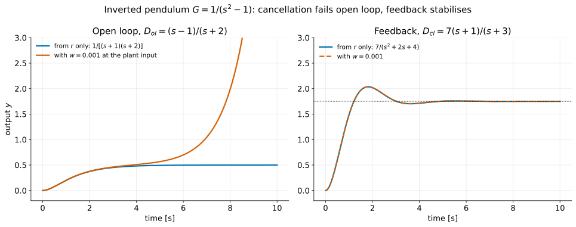
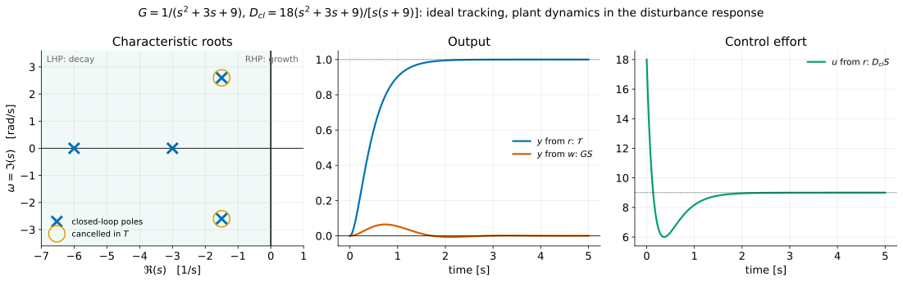
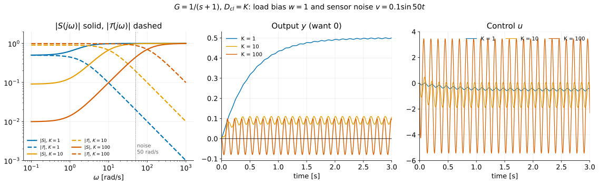
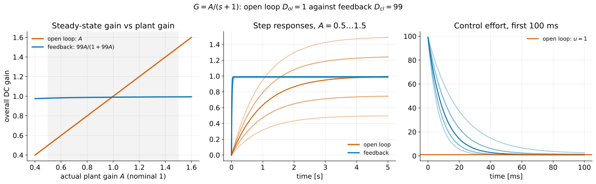

# A First Analysis of Feedback I — The Basic Equations of Control

**Student lecture notes — FPE 8th ed., Chapter 4 opening and Section 4.1**

Closing a loop around a plant changes what the system can do. These notes compare open-loop and feedback control against four objectives: stability, tracking, regulation and sensitivity. Every result comes from one block diagram and three equations. Two functions, the sensitivity $S$ and the complementary sensitivity $\mathcal T$, measure both what feedback buys and what it costs, and they always sum to one.

**Prerequisites:** the Chapter 3 notes, especially [Block Diagrams](block-diagrams_student.md) (the feedback formula) and [Stability](stability_student.md) (Routh's criterion and the cancellation trap).

**Source:** Franklin, Powell & Emami-Naeini, *Feedback Control of Dynamic Systems*, 8th ed. Example, exercise, figure and equation numbers follow the textbook. Numbered sections and § references refer to these notes unless labelled as textbook sections. Material on the cost of feedback supplements the textbook from Åström & Murray, *Feedback Systems*, §12.1.

## Learning objectives

After studying this lecture, you should be able to:

1. Derive the output, control and error of the unity-feedback loop (Fig. 4.2) as superpositions of the responses to $R$, $W$ and $V$, Eqs. (4.5)–(4.11).
2. Explain why an open-loop controller cannot stabilise an unstable plant or reject disturbances, and why cancelling a RHP pole fails in both structures.
3. Form the closed-loop characteristic equation $a(s)d(s)+b(s)c(s)=0$ and use it to stabilise the inverted pendulum, Eq. (4.17).
4. State the three caveats on open-loop tracking by plant inversion, and solve the book's pole-placement exercise.
5. Explain the conflict between disturbance rejection and noise rejection, and how frequency separation resolves it.
6. Show that an integrator in the controller removes the steady error to a constant disturbance, while one in the plant does not.
7. Derive the sensitivity $S^{T}_{G}=1/(1+GD_{cl})$ and use it to estimate the effect of a plant-gain change.
8. State $S+\mathcal{T}=1$, and use $|E(j\omega)|=|S(j\omega)||R(j\omega)|$ for sinusoidal inputs.
9. List the costs of feedback: a sensor, noise injected into the actuator, larger control effort, and the possibility of instability.

## Notation and assumptions

| Symbol | Meaning |
|---|---|
| $G(s)=b(s)/a(s)$ | plant transfer function; $a$, $b$ its denominator and numerator polynomials |
| $D_{ol}(s)$, $D_{cl}(s)=c(s)/d(s)$ | open-loop and feedback controllers; from [PID control](pid-control_student.md) on, the feedback controller is written $D_c$, as FPE does from §4.2 |
| $R,\ W,\ V$ | reference, plant-input disturbance, sensor noise |
| $Y,\ U,\ E$ | output, control, error $E=R-Y$ |
| $L=GD_{cl}$ | loop gain (open-loop transfer function around the loop) |
| $S=1/(1+L)$ | sensitivity function, Eq. (4.23) |
| $\mathcal{T}=L/(1+L)$ | complementary sensitivity = closed-loop transfer function, Eq. (4.24) |
| $S^{T}_{G}$ | sensitivity of $T$ to $G$: fractional change in $T$ per fractional change in $G$ |

Plant and controller are assumed linear, time-invariant and single-input single-output, so every block is a scalar transfer function. LHP and RHP mean the left and right half planes.

---

## 1. What feedback is for {#section-1}

A controller can compute the plant input from the reference alone (**open loop**), or from the reference and a measurement of the output (**feedback**, or closed loop). The textbook compares the two against four objectives:

| Objective | Open loop, Fig. 4.1 | Feedback, Fig. 4.2 |
|---|---|---|
| **Stability** | cannot move plant poles; an unstable plant stays unstable | poles are roots of $ad+bc$: they can be moved |
| **Tracking** | possible by inversion, with three caveats | possible; $E=SR$ |
| **Regulation** | controller has no effect on $W$ or $V$ | $W$ attenuated by $GS$, but $V$ passed by $\mathcal T$ |
| **Sensitivity** | $S=1$: a 10% plant error is a 10% output error | multiplied by $S=1/(1+L)$: reduced where $\lvert S\rvert<1$, e.g. at low frequency with large $L$ |

The right-hand column is tied together by one identity, $S+\mathcal T=1$ (§7), which is why feedback design involves trade-offs.

---

## 2. The two structures and the basic equations {#section-2}

### 2.1 Open loop {#section-2-1}

*Fig. 4.1: open-loop system with reference $R$, control $U$, disturbance $W$ and output $Y$.*

With the disturbance at the plant input,

$$
Y_{ol}=GD_{ol}R+GW,
\tag{4.1}
$$

$$
E_{ol}=R-Y_{ol}=[1-GD_{ol}]R-GW .
\tag{4.4}
$$

The open-loop transfer function from $R$ to $Y$ is $\mathcal{T}_{ol}=GD_{ol}$. The controller does not appear in the disturbance term at all.

### 2.2 Feedback {#section-2-2}

*Fig. 4.2: closed-loop system with reference $R$, control $U$, disturbance $W$, output $Y$ and sensor noise $V$.*

| Input | Where it enters | What we want |
|---|---|---|
| $R$ | summing junction | the output should **track** it |
| $W$ | plant input | the output should **ignore** it (regulation) |
| $V$ | sensor | the controller should **ignore** it |

The controller acts on the *measured* error $R-(Y+V)$. The error the specifications care about, $E=R-Y$, is never measured directly.

**Derivation.** The loop is

$$
U=D_{cl}\,[R-(Y+V)],\qquad Y=G\,(U+W).
$$

Substituting the first into the second gives $Y=GD_{cl}R-GD_{cl}Y-GD_{cl}V+GW$, so $(1+GD_{cl})Y=GD_{cl}R+GW-GD_{cl}V$:

$$
Y_{cl}=\frac{GD_{cl}}{1+GD_{cl}}R+\frac{G}{1+GD_{cl}}W-\frac{GD_{cl}}{1+GD_{cl}}V .
\tag{4.5}
$$

Substituting $Y=G(U+W)$ into the first equation instead gives $(1+GD_{cl})U=D_{cl}R-GD_{cl}W-D_{cl}V$:

$$
U=\frac{D_{cl}}{1+GD_{cl}}R-\frac{GD_{cl}}{1+GD_{cl}}W-\frac{D_{cl}}{1+GD_{cl}}V .
\tag{4.6}
$$

For $E=R-Y$, the $R$ coefficient is $1-\frac{GD_{cl}}{1+GD_{cl}}=\frac{1}{1+GD_{cl}}$:

$$
E_{cl}=\frac{1}{1+GD_{cl}}R-\frac{G}{1+GD_{cl}}W+\frac{GD_{cl}}{1+GD_{cl}}V .
\tag{4.8}
$$

All of these share the denominator $1+GD_{cl}$. Define

$$
\boxed{
S=\frac{1}{1+GD_{cl}},
\qquad
\mathcal{T}=\frac{GD_{cl}}{1+GD_{cl}}
}
\tag{4.12, 4.13}
$$

and the equations become

$$
\boxed{
\begin{aligned}
Y_{cl}&=\mathcal{T}R+GSW-\mathcal{T}V\\
U&=D_{cl}SR-\mathcal{T}W-D_{cl}SV\\
E_{cl}&=SR-GSW+\mathcal{T}V
\end{aligned}}
\tag{4.9–4.11}
$$

Only four distinct transfer functions appear. Åström and Murray call them the **Gang of Four**:

| Transfer function | From → to | Name |
|---|---|---|
| $\mathcal T=L/(1+L)$ | $R\to Y$, $V\to Y$ (with a minus sign) | complementary sensitivity |
| $S=1/(1+L)$ | $R\to E$ | sensitivity |
| $GS$ | $W\to Y$ | load sensitivity |
| $D_{cl}S$ | $R\to U$, $V\to U$ | noise sensitivity |

A design can look good in one of these and poor in another (§4.2), so all four should be checked. If you read Åström and Murray §12.1, note that they write $P$ and $C$ for plant and controller, and use $v$ for the load disturbance and $w$ for measurement noise, the reverse of FPE's letters. Their $PS$ and $CS$ are our $GS$ and $D_{cl}S$.

Noise reaches the output through $\mathcal T$, the same transfer function that makes the output follow the reference. The controller cannot distinguish a change in $R$ from an equal and opposite change in $V$, because it sees only their difference with $Y$.

---

## 3. Stability {#section-3}

### 3.1 Open loop cannot move a pole {#section-3-1}

Write $G=b/a$ and $D_{ol}=c/d$. Then $GD_{ol}=bc/(ad)$, and the poles of Eq. (4.1) are the roots of $a(s)$ and $d(s)$. The plant's poles remain poles of the open-loop system whatever the controller.

Placing a zero of $c(s)$ on an unstable root of $a(s)$ removes it from $GD_{ol}$, but not from the $GW$ term or from the physical plant; any disturbance excites the growing mode. Cancelling a RHP plant zero with a controller pole makes the controller itself unstable.

$$
\boxed{\text{An open-loop structure cannot stabilise an unstable plant.}}
$$

As in the stability notes, "no roots in the RHP" must be read as *no roots in the closed RHP*: roots on the imaginary axis are also excluded.

### 3.2 Feedback can {#section-3-2}

From Eq. (4.8) the closed-loop poles are the roots of $1+GD_{cl}=0$. Multiply through by $a(s)d(s)$:

$$
1+GD_{cl}=0
\quad\Longrightarrow\quad
1+\frac{b(s)c(s)}{a(s)d(s)}=0
\quad\Longrightarrow\quad
\boxed{a(s)d(s)+b(s)c(s)=0}
\tag{4.14–4.16}
$$

The controller polynomials now enter the characteristic equation *added* to the plant's, which is what allows the poles to move. Two cautions remain:

- A RHP root of $a$ cancelled by a root of $c$ is a common factor of $ad$ and $bc$, so it is still a root of Eq. (4.16): the unstable pole remains a closed-loop pole.
- A cancellation of a *stable* pole is legitimate. The cancelled pole stays in the characteristic equation, but it decays.

### 3.3 The inverted pendulum {#section-3-3}

For simple values the pendulum is

$$
G(s)=\frac{1}{s^2-1},\qquad b=1,\quad a=(s+1)(s-1).
$$

With $D_{cl}=K\dfrac{s+\gamma}{s+\delta}$, Eq. (4.16) gives

$$
(s+1)(s-1)(s+\delta)+K(s+\gamma)=0 .
\tag{4.17}
$$

Routh's criterion could give conditions on $K$, $\gamma$, $\delta$. A shortcut: choose $\gamma=1$, so $(s+1)$ is a factor of both terms,

$$
(s+1)\big[(s-1)(s+\delta)+K\big]=0 .
$$

The factor $(s+1)$ is a stable closed-loop pole, and the bracket is a quadratic that can be placed anywhere.

**Textbook exercise.** Force the bracket to equal $s^2+2\zeta\omega_ns+\omega_n^2$. Expanding, $(s-1)(s+\delta)+K=s^2+(\delta-1)s+(K-\delta)$, so

$$
\delta-1=2\zeta\omega_n,\qquad K-\delta=\omega_n^2
\qquad\Longrightarrow\qquad
\boxed{\delta=1+2\zeta\omega_n,\qquad K=\omega_n^2+2\zeta\omega_n+1}
$$

**Worked check:** $\zeta=0.5$, $\omega_n=2$ gives $\delta=3$ and $K=7$, so $D_{cl}=7(s+1)/(s+3)$. The full characteristic polynomial is $(s+1)(s-1)(s+3)+7(s+1)=(s+1)(s^2+2s+4)$, with roots $-1$ and $-1\pm1.732j$. From $R$, the $(s+1)$ cancels and $\mathcal T=7/(s^2+2s+4)$, whose DC gain is $7/4=1.75$. The loop is stable but not yet an accurate tracker. With $\zeta=0.5$ the overshoot is 16.3%, so the step response peaks at $1.163\times1.75=2.035$.

**Comparison with open loop.** The open-loop "fix" $D_{ol}=(s-1)/(s+2)$ gives $GD_{ol}=1/[(s+1)(s+2)]$ from the reference, which settles at 0.5. A disturbance bias $w=0.001$ at the plant input gives $Y=GW=0.001/[s(s-1)(s+1)]$. By partial fractions, $\dfrac{1}{s(s-1)(s+1)}=-\dfrac1s+\dfrac{1/2}{s-1}+\dfrac{1/2}{s+1}$, so $y=0.001(\cosh t-1)$: 0.073 at 5 s and 11.0 at 10 s. With feedback, the same bias contributes $GS\,W=\dfrac{s+3}{(s+1)(s^2+2s+4)}\cdot\dfrac{0.001}{s}$, which settles at $\tfrac34\times0.001=0.00075$.

### 3.4 Feedback can also destabilise {#section-3-4}

The stable plant $G=1/(s+1)^3$ with $D_{cl}=K$ has characteristic equation

$$
(s+1)^3+K=s^3+3s^2+3s+(1+K)=0 .
$$

The Routh $s^1$ entry is $\dfrac{3\cdot3-(1+K)}{3}=\dfrac{8-K}{3}$, so the loop is stable only for $-1<K<8$. At $K=8$ the polynomial factors as $(s+3)(s^2+3)$, with an imaginary pair at $\pm j\sqrt3$. Too much gain around a stable plant produces sustained oscillation.

---

## 4. Tracking {#section-4}

### 4.1 Open loop, by inversion {#section-4-1}

If the plant is stable with no RHP poles or zeros, an open-loop controller can in principle cancel $G$ and substitute a desired transfer function, $D_{ol}=\mathcal T_{\text{desired}}/G$. Three caveats apply:

1. **Properness.** The controller must have no more zeros than poles, so the desired $\mathcal T$ must roll off at least as fast as $G$.
2. **Actuator limits.** A fast $\mathcal T$ demands large inputs, and a real actuator saturates; the linear analysis is then no longer valid.
3. **Sensitivity.** Cancelling a pole barely inside the LHP is risky: when the plant drifts, the cancellation becomes imperfect and a slow, lightly damped residue appears.

Plant inversion returns as *feedforward* (see [PID tuning and implementation](pid-tuning_student.md)), where it is combined with feedback rather than used alone.

### 4.2 The pole-placement exercise {#section-4-2}

The textbook's exercise uses

$$
G(s)=\frac{1}{s^2+3s+9},
\qquad
D_{cl}(s)=\frac{c_2s^2+c_1s+c_0}{s(s+d_1)} ,
$$

and requires the closed-loop characteristic equation $(s+6)(s+3)(s^2+3s+9)=0$. Equation (4.16) with $a=s^2+3s+9$, $b=1$, $d=s(s+d_1)$, $c=c_2s^2+c_1s+c_0$ gives

$$
s(s+d_1)(s^2+3s+9)+c_2s^2+c_1s+c_0=(s+6)(s+3)(s^2+3s+9).
$$

Since $(s+6)(s+3)=s^2+9s+18$, the right side is $(s^2+3s+9)(s^2+9s+18)$, and the left side is $(s^2+3s+9)(s^2+d_1s)+(c_2s^2+c_1s+c_0)$. Matching,

$$
d_1=9,
\qquad
c_2s^2+c_1s+c_0=18\,(s^2+3s+9)
\quad\Longrightarrow\quad
\boxed{c_2=18,\ c_1=54,\ c_0=162,\ d_1=9}
$$

so

$$
D_{cl}(s)=\frac{18\,(s^2+3s+9)}{s(s+9)} .
$$

**The controller's zeros cancel the plant's poles exactly.** The requested characteristic polynomial contains the plant denominator, so cancellation is the only way to obtain it. The cancelled pair ($\omega_n=3$, $\zeta=0.5$, roots $-1.5\pm2.598j$) is stable, so the design is legitimate. The four transfer functions are

$$
\begin{aligned}
L=GD_{cl}&=\frac{18}{s(s+9)}, &
\mathcal T&=\frac{18}{(s+3)(s+6)},\\[4pt]
S&=\frac{s(s+9)}{(s+3)(s+6)}, &
GS&=\frac{s(s+9)}{(s+3)(s+6)(s^2+3s+9)},\\[4pt]
D_{cl}S&=\frac{18\,(s^2+3s+9)}{(s+3)(s+6)} ,
\end{aligned}
$$

and $S+\mathcal T=\dfrac{s^2+9s+18}{(s+3)(s+6)}=1$ ✓.

- $\mathcal T$ has only the two requested poles: an overdamped tracker with no overshoot.
- $GS$ still contains the plant's $\zeta=0.5$ pair: a load disturbance excites poles the reference cannot.
- $D_{cl}S$ is biproper: for a unit reference step the control jumps to $u(0^+)=18$, twice its final value $1/G(0)=9$.

**Worked check:** a unit reference step gives an output rising to 1 with no overshoot. A unit step disturbance produces an output bump peaking at 0.0646 near $t=0.74$ s, undershooting to $-0.0070$, and returning to zero. The control for a unit reference step starts at 18, dips to 6.00 at $t=0.37$ s, and settles at 9.

A reference step response alone would suggest a perfect design. The cancelled poles are still closed-loop poles, and they appear as soon as the plant is disturbed. This is the stable counterpart of the cancellation trap in the stability notes.

### 4.3 Zero steady-state error to a step {#section-4-3}

With $W=V=0$, $E=SR$, and in polynomial form

$$
S=\frac{1}{1+bc/(ad)}=\frac{a\,d}{a\,d+b\,c} .
$$

Here $d(s)=s(s+9)$ vanishes at the origin, so $S(0)=0$. The closed loop is stable, so for a step of amplitude $A$ the Final Value Theorem gives

$$
e_{ss}=\lim_{s\to0}s\,S(s)\frac{A}{s}=A\,S(0)=0 .
$$

An integrator in the controller makes $S$ vanish at zero frequency. [Steady-state error and system type](system-type_student.md) develops this into system type.

---

## 5. Regulation {#section-5}

### 5.1 Open loop has no effect {#section-5-1}

Regulation means keeping the error small when the reference is at most constant and disturbances are present. In Fig. 4.1 the controller lies on no path from $W$ to $Y$, so an open-loop controller cannot reject disturbances.

### 5.2 Disturbance against noise {#section-5-2}

From Eq. (4.8), the unwanted terms in the error are

$$
-\frac{G}{1+GD_{cl}}\,W
\qquad\text{and}\qquad
+\frac{GD_{cl}}{1+GD_{cl}}\,V .
$$

Making $D_{cl}$ large shrinks the first, since $G/(1+GD_{cl})\approx1/D_{cl}$, but drives the second towards $V$ itself: sensor noise passes straight through. Both terms depend on frequency, and the two inputs usually occupy different frequency ranges:

| Signal | Typical frequency content |
|---|---|
| plant disturbance $W$ | low; the commonest case is a **bias**, all at zero frequency |
| sensor noise $V$ | a good sensor has little low-frequency error; its noise is at **high** frequency |

The resolution is to make the loop gain **large at low frequency and small at high frequency**. Choosing where the transition happens is the central decision of frequency-response design.

**Example.** Plant $G=1/(s+1)$, proportional control $D_{cl}=K$, $r=0$, a load bias $w=1$ and sensor noise $v=0.1\sin50t$. Then $y=GS\,w-\mathcal T v$ and $u=-\mathcal T w-D_{cl}Sv$, with $GS(0)=1/(1+K)$, $\mathcal T=K/(s+1+K)$ and $D_{cl}S=K(s+1)/(s+1+K)$.

| $K$ | bias left in $y$: $1/(1+K)$ | $\lvert\mathcal T(j50)\rvert$ | noise amplitude in $y$ | noise amplitude in $u$ |
|---:|---:|---:|---:|---:|
| 1 | 0.500 | 0.020 | 0.002 | 0.100 |
| 10 | 0.091 | 0.195 | 0.020 | 0.977 |
| 100 | 0.0099 | 0.887 | 0.089 | 4.44 |

For $K=100$: $|\mathcal T(j50)|=100/|101+50j|=100/112.7=0.887$, and $|D_{cl}S(j50)|=100\times|1+50j|/|101+50j|=100\times50.01/112.7=44.4$, so the actuator carries a noise sinusoid of amplitude 4.44. A pure gain has the same value at every frequency, so it cannot be large at DC and small at 50 rad/s; a dynamic controller is needed.

### 5.3 Rejecting a constant bias {#section-5-3}

**Textbook exercise.** Show that a constant bias $w_0$ produces zero error if $D_{cl}$ has a pole at $s=0$, but not if only $G$ has one.

The disturbance term of the error is $-GS\,W$ with $W=w_0/s$, and

$$
GS=\frac{b/a}{1+bc/(ad)}=\frac{b\,d}{a\,d+b\,c} .
$$

For a stable loop, $e_{ss}=-w_0\,GS(0)=-w_0\dfrac{b(0)d(0)}{a(0)d(0)+b(0)c(0)}$.

- **Integrator in the controller**, $d(0)=0$: the numerator vanishes and $e_{ss}=0$.
- **Integrator only in the plant**, $a(0)=0$ and $d(0)\ne0$: $GS(0)=\dfrac{b(0)d(0)}{b(0)c(0)}=\dfrac{1}{D_{cl}(0)}$, so

$$
e_{ss}=-\frac{w_0}{D_{cl}(0)}\neq0 .
$$

If both have integrators, $d(0)=0$ and the error is again zero. What matters is where the integrator sits relative to where the disturbance enters: an integrator after the disturbance, in $G$, cannot produce the constant control needed to cancel it.

**Worked check:** DC motor position, $G=1/[s(\tau s+1)]$, with $D_{cl}=K$ and a constant load torque $w_0$ at the plant input gives $e_{ss}=-w_0/K$. The plant integrator removes the error to a step *reference*, but not to a step *disturbance*.

---

## 6. Sensitivity {#section-6}

### 6.1 Definition {#section-6-1}

Suppose a plant designed with gain $G$ becomes $G+\delta G$ in service, a fractional change $\delta G/G$. The sensitivity of the overall gain $\mathcal T$ to $G$ is the ratio of fractional changes:

$$
\boxed{
S^{\mathcal T}_{G}=\frac{\delta\mathcal T/\mathcal T}{\delta G/G}=\frac{G}{\mathcal T}\frac{\delta\mathcal T}{\delta G}
}
\tag{4.18, 4.19}
$$

The textbook evaluates it at zero frequency; the algebra holds at any frequency.

### 6.2 Open loop {#section-6-2}

With $\mathcal T_{ol}=GD_{ol}$ and $D_{ol}$ fixed, $\delta\mathcal T_{ol}=D_{ol}\,\delta G$ and

$$
\frac{\delta\mathcal T_{ol}}{\mathcal T_{ol}}=\frac{D_{ol}\,\delta G}{D_{ol}\,G}=\frac{\delta G}{G}
\qquad\Longrightarrow\qquad
S^{\mathcal T_{ol}}_{G}=1 .
\tag{4.20}
$$

A 10% plant error becomes a 10% error in the overall gain.

### 6.3 Feedback {#section-6-3}

With $\mathcal T_{cl}=\dfrac{GD_{cl}}{1+GD_{cl}}$, the quotient rule gives

$$
\frac{d\mathcal T_{cl}}{dG}=\frac{(1+GD_{cl})D_{cl}-D_{cl}(GD_{cl})}{(1+GD_{cl})^2}=\frac{D_{cl}}{(1+GD_{cl})^2} .
$$

Multiplying by $G/\mathcal T_{cl}=(1+GD_{cl})/D_{cl}$,

$$
\boxed{
S^{\mathcal T_{cl}}_{G}=\frac{1}{1+GD_{cl}}
}
\tag{4.21, 4.22}
$$

This is the same $S$ as in Eq. (4.12), which explains its name. Feedback reduces the sensitivity of the overall gain to plant-gain variations by the factor $S=1/(1+GD_{cl})$ compared with open-loop control. With $1+GD_{cl}=100$, a 10% change in $G$ changes the steady-state gain by about 0.1%. At DC with large loop gain this is a large reduction. At other frequencies the sensitivity is multiplied by $S(j\omega)$, and it is reduced only where $|S(j\omega)|<1$. A stable loop can amplify it: $L=4/(s+1)^3$ gives the stable closed loop $s^3+3s^2+3s+5$, yet at $\omega=\sqrt3$, $L=-1/2$ and $|S|=2$, so plant variations at that frequency are *doubled*. Part V returns to this trade-off.

The textbook's accompanying phrase "loop gain of 100" refers to $1+GD_{cl}=100$, so strictly the loop gain $GD_{cl}$ is 99. Bode defined sensitivity as $1+GD_{cl}$, the reciprocal of the textbook's choice, and some references use his convention.

### 6.4 Large changes {#section-6-4}

The derivative gives a first-order estimate. For a change $\epsilon=\delta G/G$ of any size, with $L=GD_{cl}$, the ratio of new to old gain is $\dfrac{(1+\epsilon)(1+L)}{1+L+\epsilon L}$. Subtracting 1 leaves $\epsilon/(1+L+\epsilon L)$, and dividing through by $1+L$ gives

$$
\frac{\delta\mathcal T}{\mathcal T}=\frac{\epsilon\,S}{1+\mathcal T\epsilon} .
$$

**Example.** Plant $G=A/(s+1)$ with nominal $A=1$ but actual $0.5\le A\le1.5$. Open loop uses $D_{ol}=1$; feedback uses $D_{cl}=99$, so $1+GD_{cl}(0)=100$.

| $A$ | $\delta G/G$ | open-loop gain | closed-loop gain $99A/(1+99A)$ | $\delta\mathcal T/\mathcal T$ | first-order $S\,\delta G/G$ |
|---:|---:|---:|---:|---:|---:|
| 0.5 | −50% | 0.500 | 0.98020 | −0.990% | −0.50% |
| 0.75 | −25% | 0.750 | 0.98671 | −0.332% | −0.25% |
| 1.0 | 0 | 1.000 | 0.99000 | 0 | 0 |
| 1.25 | +25% | 1.250 | 0.99198 | +0.200% | +0.25% |
| 1.5 | +50% | 1.500 | 0.99331 | +0.334% | +0.50% |

For $\pm10\%$ the exact changes are $+0.0910\%$ and $-0.1110\%$, close to the first-order $\pm0.1\%$. For a 50% loss of plant gain the first-order estimate is optimistic by a factor of two, because losing plant gain also reduces the loop gain that provides the protection: $(-0.5)(0.01)/(1-0.495)=-0.990\%$.

The feedback loop's pole is near $-100$ rad/s instead of $-1$, and its control starts at $u(0^+)=99$ instead of 1. Both the insensitivity and the speed are paid for with loop gain, which means actuator effort.

**Not insensitive to everything.** With large $L$, $\mathcal T\approx1$ because the output is forced to equal *what the sensor reports*. A sensor-gain error of $\epsilon$ gives $y/r\to1/(1+\epsilon)$ however large the loop gain: about an equal and opposite output error for small $\epsilon$ (+10% in the sensor gives −9.1% in the output). Feedback moves the demand for precision from the actuator and plant to the sensor.

---

## 7. $S+\mathcal T=1$, sinusoids, and the cost of feedback {#section-7}

### 7.1 The fundamental identity {#section-7-1}

$$
S\triangleq\frac{1}{1+GD_{cl}},
\qquad
\mathcal T\triangleq\frac{GD_{cl}}{1+GD_{cl}}=1-S ,
\tag{4.23, 4.24}
$$

so that

$$
\boxed{S(s)+\mathcal T(s)=1}
\tag{4.25}
$$

at every $s$, including every frequency $s=j\omega$. Tracking and disturbance rejection require $S$ small; noise rejection requires $\mathcal T$ small. At a single frequency both cannot be small. The identity is between complex numbers, so $|S|+|\mathcal T|\ge1$, and near the loop's crossover frequency both magnitudes can be of order one. In the regulation example at $K=100$ and $\omega=100$ rad/s, $|S|=|\mathcal T|=0.70$.

### 7.2 Sinusoidal inputs {#section-7-2}

For a stable loop with a sinusoidal reference at $\omega_o$, the steady-state error amplitude is

$$
|E(j\omega_o)|=|R(j\omega_o)|\,\left|\frac{1}{1+G(j\omega_o)D_{cl}(j\omega_o)}\right|=|R|\,|S(j\omega_o)| .
\tag{4.26}
$$

A 1% error requires $|1+GD_{cl}|\ge100$, effectively $|GD_{cl}|\gtrsim100$ (by the triangle inequality, $|L|\ge101$ guarantees it). The textbook applies this to a high-fidelity audio amplifier over $2\pi\cdot60\le\omega\le2\pi\cdot15{,}000$ rad/s. If the loop gain falls off like an integrator, $L=\omega_c/s$, then $\omega_c/\omega\ge100$ at 15 kHz requires $\omega_c\ge2\pi\cdot1.5\times10^6$ rad/s: unity loop gain at 1.5 MHz. The usual statement of the audible range is about 20 Hz to 20 kHz; the textbook's band is narrower.

With a reference prefilter $F(s)$ and sensor dynamics $H(s)$, the equations must be re-derived (textbook Appendix W4.1.4.1). [Steady-state error and system type](system-type_student.md) uses the version with sensor dynamics.

### 7.3 The cost of feedback {#section-7-3}

| Feedback buys | Feedback costs |
|---|---|
| Stabilisation of an unstable plant (§3.3) | A **sensor**, and the output is only as good as the sensor (§6.4) |
| Disturbance rejection by $GS$ (§5) | **Noise injection**: $V$ reaches $Y$ through $\mathcal T$ and the actuator through $D_{cl}S$ (§5.2) |
| Insensitivity to the plant by $S$ (§6) | **Control effort**: large loop gain means large $u$, and saturation (§4.2, §6.4) |
| Tracking without an exact plant model | **Possible instability**: a stable plant can be destabilised by too much gain (§3.4) |

The control-signal cost does not appear in an output plot. In the regulation example at $K=100$ the output is only slightly noisy, while the actuator is driven by a 4.4-amplitude, 50 rad/s sinusoid that does no useful work. At high frequency, where $L\to0$, $D_{cl}S\to D_{cl}$: sensor noise reaches the actuator multiplied by the controller's high-frequency gain. This is why the derivative term of a PID controller must be filtered.

---

## 8. Looking ahead {#section-8}

Every benefit of feedback is measured by $S=1/(1+L)$, and making $S$ small at a frequency makes $\mathcal T$ close to one there. The PID controller of [PID control](pid-control_student.md) uses its three terms to shape $L$: the proportional term raises it, the integral term makes it infinite at zero frequency (removing the bias error of §5.3), and the derivative term adds damping but must be filtered because of the noise cost of §7.3.

---

## Review questions

1. The controller acts on $R-Y-V$, but the textbook's error is $E=R-Y$. Which one do specifications concern, and which one can the controller drive to zero?
2. In the pendulum design, the $(s+1)$ cancellation is harmless. Under what physical change to the pendulum would it stop being harmless?
3. The pole-placement exercise forced a cancellation by requiring $s^2+3s+9$ as a closed-loop factor. Choose a fourth-order target with no factor in common with $a(s)$ and predict what changes in $GS$.
4. A pure gain cannot be large at DC and small at 50 rad/s. Sketch the magnitude of a controller that could, and say what kind of element it contains.
5. Feedback makes the output insensitive to the actuator but not to the sensor. What does that imply about where to spend money in a precision positioning stage?
6. The audio example needs loop gain 100 at 15 kHz. What would limit how far a real amplifier can push its crossover?
7. Give three advantages and two disadvantages of feedback (textbook Review Questions 4.1 and 4.2).

## Optional practice

Optional practice from FPE, 8th edition; these are study suggestions, not an assignment.

| Problem | Topic |
|---|---|
| 4.1 | Show $S+\mathcal T=1$ |
| 4.2 | Sensitivity of three amplifier topologies |
| 4.3 | Two structures compared for sensitivity to amplifier gain |
| 4.4 | Sensitivity of $A/[s(s+a)]$ to $A$, $a$ and a feedback gain |
| 4.5 | System error with sensor dynamics |
| §4.1 exercises | Pendulum placement (try $\zeta=0.7$, $\omega_n=3$); pole placement; bias rejection |

## Chapter 4 student notes

- [The basic equations of control](feedback-properties_student.md)
- [The three-term controller: P, I, D, PI and PID](pid-control_student.md)
- [Steady-state error and system type](system-type_student.md)
- [Tuning, realising and feeding forward the PID](pid-tuning_student.md)
