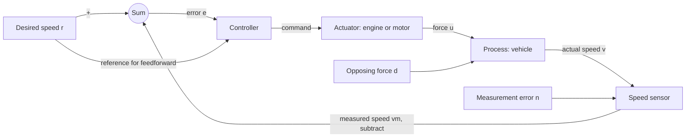

# Introduction to Control
## Feedback, physical models, and the control-design problem

**Audience:** Fourth-year undergraduate mechanical engineering (ME 404).

**Prerequisites:** Calculus and basic ordinary differential equations. Assume no previous control theory, Laplace transforms, or block-diagram algebra.

**Duration:** 75 minutes. The core lecture is §§4–12 below; §13 is optional follow-up material and §14 supplies complete review answers.

**Student companion:** [Introduction to Control](introduction_student.md).

**Student reading:** Franklin, Powell & Emami-Naeini, *Feedback Control of Dynamic Systems*, 8th ed. (FPE), §§1.1–1.3. Optional: §1.4 for history and §1.5 for the roadmap. Students need no other textbook and no figures from the other sources.

**Instructor sources:** FPE provides the main narrative. Åström & Murray contribute feedback properties, feedforward, and controller forms; Dorf & Bishop contribute the iterative design process; Khalil supplies the physical cruise-control comparison; Nise emphasizes transient response, steady-state accuracy, and stability; Ogata contributes terminology, system boundaries, and performance specifications. The verified chapter/section map appears in §15.

**Adaptations:** The cruise-control law and steady-state error formulas are adapted from Khalil, Chapter 1, Example 1-1, Eqs. (1.2)–(1.5), with force used directly as the control input instead of throttle angle. The numerical parameters, design exercise, classroom questions, and teaching scripts are additions for this lecture, marked collectively here as **[beyond the book]**. The cruise calculation is an adaptation of Khalil's example, not a numbered FPE example. All section references below refer to these instructor notes unless a textbook or the student notes are explicitly named.

---

# Part 0 — Planning

## 1. Teaching strategy

Build the lecture around one physical question: how can a car maintain its speed when the load changes?

Start with an action students understand: keeping the accelerator fixed. Name the components only after the need for a correction is apparent. Derive the model from Newton's law, then compare the same vehicle under two control laws. End by using the calculation to expose the limits of the model and the decisions a designer must make.

Three moments to protect:

1. **§5:** distinguish actual speed from measured speed, and disturbance from measurement error.
2. **§9:** substitute the controller into the physical ODE. Students should see precisely how feedback changes both the equilibrium error and the time constant.
3. **§11:** explain why a favorable formula is insufficient evidence for an arbitrarily large gain.

The central board sequence is

$$
\text{desired behavior}
\;\longrightarrow\;m\dot v=u-bv-d
\;\longrightarrow\;u=\hat b r+K(r-v)
\;\longrightarrow\;\text{performance and limitations}.
$$

Avoid introducing a transfer-function formula before students have a reason to want one. Every calculation today uses algebra, Newton's law, or a familiar first-order ODE.

## 2. Learning objectives

By the end of the lecture, students should be able to:

1. Identify a reference, controlled output, control input, disturbance, sensor, actuator, and controller.
2. Distinguish open-loop control, feedback, and feedforward by the information each uses.
3. Explain tracking, regulation, transient response, steady-state error, stability, and robustness.
4. Derive a simple cruise-control ODE and compare open-loop and feedback performance.
5. Explain why feedback can reduce disturbance and model-error effects without guaranteeing perfect control.
6. Describe limitations imposed by sensors, actuator capacity, and neglected dynamics.
7. Turn a control objective into a model, measurable requirements, and a sequence of design decisions.

## 3. Suggested lecture flow (75 minutes)

| Time | Topic | Instructor sections | Student sections |
|---:|---|---|---|
| 0–5 min | Fixed accelerator versus fixed speed; tracking and regulation | §4 | §1 |
| 5–14 min | Components, measurements, disturbances, system boundaries | §5 | §2 |
| 14–21 min | Open loop, feedback, feedforward | §6 | §3 |
| 21–29 min | Force balance, equilibrium, exponential response | §7 | §4 |
| 29–36 min | Open-loop calibration and its errors | §8 | §5.1 |
| 36–50 min | Feedback derivation and numerical hill example | §9 | §§5.2–5.3 |
| 50–58 min | Stability, transients, accuracy, robustness | §10 | §6 |
| 58–66 min | Actuator capacity, sensing, neglected dynamics | §11 | §7 |
| 66–72 min | Design process and two quantitative requirements | §12 | §8 |
| 72–75 min | Exit questions and bridge to modeling | §14.4 | §10.4 |

**Prepare:** The component diagram, the §9.2 numerical table, and the §12 design inequalities. Use the board for the force balance, substitution of the controller, and response sketches. No software demonstration is required.

**If time runs short:** Show the general mismatch formulas as prepared results and derive only $b=\hat b$. Give the numerical table instead of calculating each entry in class. Retain the controller substitution and the limitations discussion. Assign the sensor-bias calculation, the reference-step actuator check, and §13 as reading.

**Scope:** The notes include complete answers and optional extensions for preparation and student review. Do not present every review problem live. Integral action in §13 is not part of the 75-minute budget.

### Board notation

| Symbol | Meaning | Units |
|---|---|---|
| $r$ | Desired speed | m/s |
| $v$ | Actual vehicle speed; the generic output $y$ | m/s |
| $v_m=v+n$ | Measured speed, including measurement error $n$ | m/s |
| $e=r-v_m$ | Measured error available to the controller | m/s |
| $u$ | Applied tractive force under an ideal actuator assumption | N |
| $d$ | Additional opposing force, positive uphill | N |
| $m$ | Vehicle mass, $m>0$ | kg |
| $b$ | Actual resistance coefficient, $b>0$ | N·s/m |
| $\hat b$ | Nominal resistance coefficient | N·s/m |
| $K$ | Proportional gain, $K\geq0$ | N·s/m |
| $\tau$ | Time constant | s |

Initially take $n=0$. Call $r-v$ the **actual tracking error** whenever measurement error is present. The steady-state errors in §§8–9 use exact sensing, so measured and actual error agree. Use lowercase time-domain signals throughout.

---

# Part I — The lecture

## 4. Opening: a fixed action does not guarantee a fixed output

### Instructor script

> You are driving at twenty meters per second on a level road. You keep the accelerator in exactly the same position as the road begins to climb. What happens to your speed?
>
> The accelerator sets an action. Speed is the outcome of that action together with the vehicle and its environment. Today we will decide what to measure and how to change the action when the outcome is wrong.

Give students a few seconds to answer before drawing anything. Expected answer: the car slows because the opposing force increases. The premise is a vehicle whose engine command stays fixed, with no active speed controller.

Introduce two tasks:

- **Tracking:** follow a changing desired speed or a robot's planned joint motion.
- **Regulation:** maintain a fixed speed or room temperature despite changing loads.

Do not present them as mutually exclusive machine types. Cruise control does both when the driver changes the setpoint and when the road changes.

**Check:** “If I watch the speedometer and adjust the pedal myself, where is the controller?”

**Answer:** The driver is the controller; vision provides the measurement path and the pedal/engine provides the actuation path. Manual versus automatic and open versus closed loop are separate classifications.

## 5. Draw the components and declare the boundary

Start with the vehicle, then add the engine, controller, speed sensor, and reference. Finish with the two unwanted inputs: opposing load and measurement error.



| Component or signal | Explain it as | Cruise-control realization |
|---|---|---|
| Reference | Desired behavior | Desired speed |
| Process | Physical system being influenced | Translating vehicle |
| Controller | Rule that computes an action | Computation using reference and speed measurement |
| Actuator | Device that supplies the physical action | Engine or motor and drivetrain |
| Sensor | Device that produces a measurement | Speed sensor |
| Disturbance | An input we do not choose to perform the task | Grade or additional wind load |
| Measurement error | Difference between sensed and actual output | Speed calibration error or noise |

**FPE terminology:** In §1.1 and Fig. 1.2, the actuator and process together are called the plant. Khalil's introductory diagram calls the vehicle body the plant and draws the engine separately. Neither choice changes the physics. Tell students which boundary is being modeled. In §§7–9, $u$ is force, so the engine dynamics have been replaced by an ideal force actuator.

Write

$$
v_m=v+n,\qquad e=r-v_m.
$$

**Board prompt:** “Measured speed is too low. Which way should the force change?”

**Expected answer:** Increase it. With $K>0$, $K(r-v_m)$ makes that correction. Call this negative feedback, then say that its dynamic consequences still need analysis.

Signals must be comparable before subtraction. A speed in m/s cannot be directly subtracted from a voltage. Calibration or reference scaling belongs somewhere in the signal path.

**Sensor-location check:** A thermostat beside a warm oven can regulate its local temperature while another room is cold. The sensor must represent the variable of interest. This example develops FPE §1.1 without requiring the book's figure.

**Optional FPE visual:** Fig. 1.2, diagram on **PDF p. 9** of the chapter file in §15 (caption begins on p. 8). Point out the plant boundary and distinct disturbance/noise arrows. The custom diagram above contains everything required for the lecture.

## 6. Three ways to choose an action

### 6.1 Open loop

Compute the action without using the controlled output to correct it. A calibrated force command is sufficient under the conditions for which it was calibrated. Unexpected loads and parameter errors remain uncorrected.

Avoid “open loop is always inaccurate” or “open loop is always stable.” Its suitability depends on the plant and task. It introduces no feedback-induced instability, but an unstable physical process remains unstable without appropriate stabilization.

### 6.2 Feedback

Use the output measurement to correct the action. It is unnecessary to measure the hill directly if its effect appears in a reliable speed measurement.

**Question:** “A data logger records speed, but nothing uses that value to adjust force. Have we closed the loop?”

**Answer:** No. The information must affect the control action.

### 6.3 Feedforward

Use a model and the reference or a measured disturbance to compute an action. A known grade can support a predicted force correction before the speed has changed much. This needs sufficiently accurate information and modeling.

Write

$$
u=u_{\mathrm{ff}}+Ke.
$$

Feedforward and feedback often work together. In our example, $u_{\mathrm{ff}}=\hat b r$ supplies the predicted level-road force. It does not contain advance knowledge of the hill. The feedback term supplies correction from the measured error.

**Teaching caution:** A timer does not establish the classification of every subsystem. A timed machine may contain a closed-loop motor-speed controller. Ask which variable and which loop are under discussion.

## 7. From Newton's law to a response

### 7.1 Force balance

Draw a forward arrow $u$, a backward arrow $bv$, and a backward arrow $d$ on a vehicle of mass $m$:

$$
\boxed{m\dot v=u-bv-d.}
$$

State the assumptions aloud:

- Constant positive mass and resistance coefficient.
- Linear speed-dependent resistance used as a limited-range approximation.
- Immediate delivery of the requested force; no actuator dynamics or saturation yet.
- Additional opposing load represented by $d$, without double-counting $bv$.

For a grade, $d$ includes $mg\sin\theta$. The distinction between parameter uncertainty and an external input is useful even though a disturbance can depend on a physical parameter such as mass.

**Unit check:** $m\dot v$, $u$, $bv$, and $d$ all have units of newtons. $K$ will have the same units as $b$, not be a dimensionless number.

### 7.2 Equilibrium and the ODE solution

Hold $u,d$ constant. Setting $\dot v=0$ gives

$$
v_\infty=\frac{u-d}{b}.
$$

Subtract the equilibrium equation from the ODE:

$$
m\frac{d}{dt}(v-v_\infty)=-b(v-v_\infty).
$$

Students know the resulting solution:

$$
\boxed{v(t)=v_\infty+[v(0)-v_\infty]e^{-bt/m},
\qquad \tau_{\mathrm{OL}}=\frac{m}{b}.}
$$

**Board sketch:** Mark the initial value, final value, and the remaining deviation at $t=\tau$. At one time constant, $e^{-1}\approx0.37$ of the initial deviation remains; at three, about $5\%$ remains.

Keep equilibrium and stability distinct: setting a derivative to zero finds a candidate constant solution. The negative exponential proves convergence for this model.

**Check:** Doubling mass with $u,d,b$ fixed doubles the time constant without changing equilibrium. If instead the same road angle is held fixed, the load $mg\sin\theta$ must also change.

## 8. Calibrate an open-loop controller

For constant desired speed $r$, use a nominal coefficient $\hat b$ and choose

$$
u_{\mathrm{OL}}=\hat b r.
$$

With $b=\hat b$ and $d=0$, the final speed is correct. With model error or an additional opposing force,

$$
m\dot v+bv=\hat b r-d,
\qquad v_{\infty,\mathrm{OL}}=\frac{\hat b r-d}{b},
$$

$$
\boxed{e_{\infty,\mathrm{OL}}=r-v_{\infty,\mathrm{OL}}
=\frac{(b-\hat b)r+d}{b}.}
$$

Circle the two numerator terms and label them **model mismatch** and **disturbance**. The controller uses $\hat b$, while the physical vehicle obeys $b$.

Start the numerical example:

$$
m=1000\,\mathrm{kg},\quad b=\hat b=50\,\mathrm{N\,s/m},
\quad r=20\,\mathrm{m/s}.
$$

The calibrated force is $1000\,\mathrm N$. A $100\,\mathrm N$ opposing load gives

$$
v_{\infty,\mathrm{OL}}=18\,\mathrm{m/s},\qquad
e_{\infty,\mathrm{OL}}=2\,\mathrm{m/s},\qquad \tau_{\mathrm{OL}}=20\,\mathrm s.
$$

**Transition:** “We do not know the extra force, but we can measure the speed loss. Let us use that measurement to add force.”

## 9. Close the loop and repeat the calculation

### 9.1 Controller substitution: the essential derivation

Take exact sensing and use

$$
\boxed{u_{\mathrm{CL}}=\hat b r+K(r-v).}
$$

Highlight the reference-to-controller feedforward arrow in the earlier component sketch and write the two-term law beside the controller. The controller uses both $r$ and $e$; the direct reference input supplies $\hat b r$.

Ask a student to supply the substitution:

$$
\begin{aligned}
m\dot v&=\hat b r+K(r-v)-bv-d,\\
m\dot v+(b+K)v&=(\hat b+K)r-d.
\end{aligned}
$$

No new solution method is needed. For constant reference and disturbance,

$$
v_{\infty,\mathrm{CL}}=\frac{(\hat b+K)r-d}{b+K},
$$

$$
\boxed{e_{\infty,\mathrm{CL}}=\frac{(b-\hat b)r+d}{b+K},
\qquad \tau_{\mathrm{CL}}=\frac{m}{b+K}.}
$$

**Board comparison:** Underline the unchanged numerator and circle the new denominator. If $L=K/b$, then

$$
e_{\infty,\mathrm{CL}}=\frac{1}{1+L}e_{\infty,\mathrm{OL}}.
$$

$L$ is dimensionless. This is a constant-input result for the particular controllers and model, not a general stability theorem or an arbitrary-frequency formula.

### 9.2 Numerical comparison

Choose $K=450\,\mathrm{N\,s/m}$, so $L=9$ and $b+K=500\,\mathrm{N\,s/m}$. Before the hill, both systems are at $20\,\mathrm{m/s}$. At $t=0$, set $d=100\,\mathrm N$.

| Quantity | Open loop | Feedforward plus feedback |
|---|---:|---:|
| Final speed | $18\,\mathrm{m/s}$ | $19.8\,\mathrm{m/s}$ |
| Final speed error | $2\,\mathrm{m/s}$ | $0.2\,\mathrm{m/s}$ |
| Time constant | $20\,\mathrm s$ | $2\,\mathrm s$ |
| Final force | $1000\,\mathrm N$ | $1090\,\mathrm N$ |

Write the complete responses, with $t$ in seconds and speeds in m/s:

$$
v_{\mathrm{OL}}(t)=18+2e^{-t/20},
\qquad
v_{\mathrm{CL}}(t)=19.8+0.2e^{-t/2}.
$$

Sketch both on a shared speed axis. Both start at 20; both have initial slope $-0.1\,\mathrm{m/s^2}$. The open-loop response falls farther. The closed-loop response bends toward a final value much closer to the target.

Do not sketch the proportional controller returning all the way to 20. That would contradict the model and blur the reason for later introducing integral action.

**Questions and expected answers:**

- “Why are the initial slopes identical?” At the instant the unmeasured load appears, the speed and error have not changed, so both controllers still apply $1000\,\mathrm N$.
- “Why is the feedback equilibrium force $1090\,\mathrm N$?” The speed error contributes $450(0.2)=90\,\mathrm N$; resistance plus hill load is $50(19.8)+100=1090\,\mathrm N$.
- “Why is there a residual error?” This proportional correction needs nonzero error to supply the extra force.
- “Which is better: a fast response or an accurate final speed?” They are separate requirements; a design must address both.

### 9.3 Reconcile the calculation with FPE

FPE §1.2 compares open and closed loop using a static throttle-to-speed model. This lecture uses Newton's law so that the same example also explains transient behavior. The force-input formulation adapts Khalil's Chapter 1, Example 1-1: his actuator relation is $T=au$; here the ideal controller directly commands force.

Our feedback law also retains nominal feedforward. FPE's proportional-only law requires an error even on a level road. For our plant with $u=K(r-v)$ alone,

$$
e_\infty=\frac{br+d}{b+K}.
$$

With the nominal numbers this is $2\,\mathrm{m/s}$ on level ground and $2.2\,\mathrm{m/s}$ with the hill. Keeping $\hat b r$ supplies the nominal level-road force independently of error. State this difference explicitly so the student does not think the two sources disagree.

## 10. Define good behavior before choosing a controller

Use the numerical responses to introduce the performance vocabulary.

| Concept | Teaching point |
|---|---|
| Tracking accuracy | Does actual output agree with the command? |
| Transient response | How quickly and smoothly does the output change? |
| Steady-state error | What mismatch remains after the transient for this constant-input case? |
| Disturbance rejection | How strongly does an external load alter the output? |
| Robustness | Are the requirements satisfied over a stated range of model uncertainty? |
| Control effort | Are force, power, and rates within physical limits? |
| Stability | Do small perturbations remain small, and do they decay? |

For equilibrium stability, distinguish **stable** (small perturbations remain small) from **asymptotically stable** (they also decay to zero). In our system,

$$
\delta v=v-v_\infty,\qquad
\delta\dot v=-\frac{b+K}{m}\delta v.
$$

Since $m>0$ and $b+K>0$, deviations decay. The equilibrium is asymptotically stable even when it is not at the desired speed. Avoid defining stability as “zero tracking error.”

For contrast, write $\dot x=ax$ with $a>0$, which produces growth, and $\dot x=0$, which preserves an initial offset. We are discussing equilibrium behavior; formal input-output and internal stability distinctions come later.

**Transient vocabulary:** Overshoot is an excursion beyond the final value. Settling time requires a tolerance band and a specified center. A response can settle around an incorrect final value without entering a tight band around the desired reference. Do not identify time constant with settling time.

**Oscillation check:** Bounded thermostat cycling is not the same as a growing oscillation. A decaying oscillation can be compatible with asymptotic stability. Shape and amplitude evolution matter.

**Robustness check:** A smaller error than open loop does not establish compliance with a specification across uncertain parameters. The worked uncertainty problem in §14.2 demonstrates that distinction.

## 11. Limits: what our formula leaves out

### 11.1 Available force

Suppose the actuator can deliver at most $1500\,\mathrm N$. From rest with $r=20$, the ideal control law asks for

$$
u(0)=50(20)+450(20)=10000\,\mathrm N.
$$

The actuator saturates. Neither the unrestricted exponential formula nor the limited-range cruising model establishes the actual response from rest.

At the desired speed on a $600\,\mathrm N$ hill, force balance requires $1600\,\mathrm N$. That equilibrium is unavailable with this actuator. Increasing gain cannot supply missing force.

### 11.2 The controller trusts its sensor

With $v_m=v+n$,

$$
m\dot v+(b+K)v=(\hat b+K)r-d-Kn.
$$

For constant bias $n$,

$$
\boxed{r-v_\infty=\frac{(b-\hat b)r+d+Kn}{b+K}.}
$$

For an exact resistance model on level ground, the actual speed error tends to $n$ as gain grows. More feedback cannot remove an unknown sensor bias without additional information. Fast noise also changes the force command; its effect on motion depends on the dynamic response. Do not use the bias formula as a blanket result for all noise frequencies.

**If short of time:** Give the sensor argument verbally, leaving the derivation and the $0.5\,\mathrm{m/s}$ worked bias example to the student notes.

### 11.3 Dynamics and intended sign

The ideal first-order model remains asymptotically stable for every nonnegative $K$. Do not claim it predicts high-gain instability. Real feedback paths add sensor lag, actuator dynamics, computational delay, and sometimes flexible motion. A delayed correction can reinforce a changing deviation; increasing gain can then cause oscillation or instability.

An incorrect sign already suffices in the simple model. With $u=\hat b r+K(v-r)$, subtract an equilibrium to obtain

$$
m\delta\dot v=(K-b)\delta v.
$$

For $K>b$, the deviation grows. At $K=b$, the deviation equation is neutral; an equilibrium of the forced system need not exist. Keep the discussion at $K>b$ in class.

**Closing line for this section:** “Feedback lets us change the dynamics. That is why it is useful, and why we must analyze the resulting dynamics.”

## 12. Make the design task concrete

Use the distinction emphasized by Dorf, Nise, and Ogata: analysis predicts the behavior of a specified system; design chooses a structure and parameters to achieve requirements.

1. Define the task and controlled output.
2. Specify operating range, disturbances, accuracy, transients, and actuation limits.
3. Choose sensing, actuation, and a controller structure.
4. Develop and check a physical or experimentally identified model.
5. Analyze and adjust the design.
6. Simulate, test, compare against requirements, and iterate.

### A two-requirement design

For the nominal cruise model, require at most $0.25\,\mathrm{m/s}$ steady-state loss under a constant $100\,\mathrm N$ load, and a time constant no larger than $2\,\mathrm s$:

$$
\frac{100}{50+K}\leq0.25
\quad\Longrightarrow\quad K\geq350\,\mathrm{N\,s/m},
$$

$$
\frac{1000}{50+K}\leq2
\quad\Longrightarrow\quad K\geq450\,\mathrm{N\,s/m}.
$$

Our $K=450$ meets both nominal requirements. Ask what has not yet been checked: reference changes, available force, sensor error, parameter variations, neglected dynamics, and agreement with the real plant.

The time-constant requirement has no margin: with the same mass and gain but $b=40\,\mathrm{N\,s/m}$, $\tau=1000/(40+450)\approx2.04\,\mathrm s$, exceeding the $2\,\mathrm s$ limit.

**Prepared follow-up calculation:** On level ground, change $r$ from 20 to $21\,\mathrm{m/s}$ while $v=20$. Then

$$
u(0^+)=50(21)+450(1)=1500\,\mathrm N.
$$

The command just reaches the assumed force limit. This separate test leaves no extra force margin at the initial instant. Smoothing the reference, revising the controller, or changing hardware may be necessary when the operating envelope expands.

The gain calculation is a first design iteration. A physically meaningful acceptance decision needs a stated uncertainty range and tests against all requirements.

---

# Part II — Follow-up and instructor reference

## 13. Optional preview: a controller can remember error

**Outside the core time budget.** Source idea: Åström & Murray §1.6; the calculations below are lecture adaptations. This material is fully explained in student §9.

Proportional feedback needs persistent error to generate persistent corrective force. Introduce a controller state $z$:

$$
\dot z=r-v,\qquad
u=\hat b r+K(r-v)+K_I z.
$$

Since $z$ integrates speed error, it has units of meters and $K_I$ has units N/m. At a constant unsaturated equilibrium, $\dot z=0$ requires $v=r$. The remaining force balance gives

$$
K_I z_\infty=(b-\hat b)r+d.
$$

The integral term can hold the extra force after the error vanishes. For the exact nominal model and the example hill, this term is $100\,\mathrm N$.

**Instructor-only check:** With constant $r,d$, exact sensing, and no saturation, differentiate the speed equation to obtain

$$
m\ddot v+(b+K)\dot v+K_I(v-r)=0.
$$

For $m>0$, $b+K>0$, and $K_I>0$, the associated second-order characteristic polynomial has roots with negative real parts. This validates the equilibrium claim for this ideal model, but do not introduce that stability test during the introductory lecture. Real added dynamics and actuator limits require further analysis.

If the actuator saturates while $z$ continues to accumulate, windup can produce a poor recovery. Integral action also cannot identify an unknown sensor bias; with biased sensing it drives measured error toward zero. Avoid the unqualified statement that integral action always eliminates true tracking error.

Briefly name PID if useful: proportional action responds to present error, integral action accumulates it, and derivative action responds to a rate of change. Tuning and noise filtering belong later.

## 14. Review questions and complete answers

### 14.1 Identify a second loop

**Prompt:** A tank-level controller measures height and adjusts an inlet valve while outlet flow changes. Identify the loop components and distinguish disturbance from measurement error.

**Answer:** Reference: desired height. Output: actual height. Sensor: level transducer. Controller: computation from measured height and setpoint. Actuator: valve mechanism. Physical control input: inlet flow. Process: liquid in the tank. Disturbance: outlet-flow variation. Measurement error: sensor offset or noise. The valve and tank can be grouped as the plant under the FPE convention.

### 14.2 Uncertain resistance

**Prompt:** Keep $\hat b=50$, $r=20$, $K=450$, and $d=100$, but actual $b=60\,\mathrm{N\,s/m}$. Compute the two final errors.

**Answer:** The common numerator is $(60-50)20+100=300\,\mathrm N$:

$$
e_{\infty,\mathrm{OL}}=5\,\mathrm{m/s},
\qquad e_{\infty,\mathrm{CL}}=\frac{300}{510}\approx0.588\,\mathrm{m/s}.
$$

Feedback improves accuracy but no longer meets the nominal $0.25\,\mathrm{m/s}$ requirement. This is a useful distinction between improvement and guaranteed performance over uncertainty.

### 14.3 Biased speed sensor

**Prompt:** On level ground, return to $b=\hat b=50$, $K=450$, $r=20$. Let the sensor read $0.5\,\mathrm{m/s}$ high.

**Answer:** The actual error is $450(0.5)/500=0.45\,\mathrm{m/s}$. Actual speed is $19.55\,\mathrm{m/s}$; measured speed is $20.05\,\mathrm{m/s}$. Measured error is $-0.05\,\mathrm{m/s}$. The resulting $977.5\,\mathrm N$ command equals the resistance $50(19.55)$.

Emphasize that measured and actual error even have different signs here. The controller's calibration term continues to supply force while the small negative feedback correction reduces it.

### 14.4 Exit questions and next lecture

Use two questions in the final three minutes:

1. **Why can feedback reject an unmeasured hill but fail to correct a sensor bias?** A hill changes actual motion, which an accurate sensor reports. A biased sensor corrupts the information used to define the correction. This controller has no independent way to distinguish bias from actual speed error.
2. **What else must be checked when a controller has a small calculated steady-state error?** Stability, transient response, available actuation, measurement quality, uncertainty, and adequacy of the model.

### Closing script

> We started with Newton's law and chose a rule for the force. Substituting that rule changed both the speed error and the rate of response. The next step is to build models of other physical systems and learn how to read their behavior from the equations. Those models will let us predict which corrections improve a response and which ones cause trouble.

Next lecture: [From Physical Models to the Laplace Transform](modeling-and-dynamics_instructor.md). Student continuation: [From Physical Models to the Laplace Transform](modeling-and-dynamics-poles_student.md).

## 15. Source map and reading guidance

All sources below were consulted in the local chapter PDFs. **PDF pages are 1-based viewer pages within the named chapter file**, not pages within `complete.pdf`; FPE's digital chapter pagination does not match its printed pagination. Chapter and section labels are the preferred student reading references.

| Source | Consulted sections / chapter-PDF pages | Contribution to this lecture |
|---|---|---|
| Franklin, Powell & Emami-Naeini, *Feedback Control of Dynamic Systems*, 8th ed. | §§1.1–1.3, PDF pp. 6–23; §§1.4–1.5 for reading context | Components and plant boundary; thermostat and static cruise control; stability, tracking, disturbance rejection, robustness |
| Åström & Murray, *Feedback Systems*, local 2nd-edition material | §§1.1–1.3, PDF pp. 1–6; §§1.5–1.6, pp. 13–20 | Feedback versus feedforward; shaping dynamics and uncertainty response; noise and complexity; proportional and integral action |
| Dorf & Bishop, *Modern Control Systems*, 13th ed. | §§1.4–1.5, PDF pp. 18–21 | Design as an iterative process; measurable specifications; sensor/actuator selection and model validation |
| Khalil, local *Introduction*, Chapter 1 | PDF pp. 2–6; Example 1-1, pp. 3–5 | Physical cruise model, nominal feedforward plus feedback, parameter-error and disturbance comparison, input and sensor limitations |
| Nise, *Control Systems Engineering*, 7th ed. | §§1.4–1.5, PDF pp. 9–18 | Distinct goals for transient response, steady-state accuracy, and stability; analysis versus design |
| Ogata, *Modern Control Engineering*, 5th ed. | §1–1 definitions, PDF p. 3; §§1–3 and 1–4, pp. 7–10 | Controlled versus manipulated variables; open/closed-loop distinctions; specifications and compensation |

Local files, relative to the repository root:

```text
references/documents/Franklin, Powell, Emami-Naeimi - 8th Ed./1 - An Overview and Brief History.pdf
references/documents/Astrom, Murray - 2nd Ed./1 - Introduction.pdf
references/documents/Dorf, Bishop - 13th Ed./1 - Introduction to Control Systems.pdf
references/documents/Khalil/1 - Introduction.pdf
references/documents/Nise - 7th Ed./1 - Introduction.pdf
references/documents/Ogata - 5th Ed./1 - Introduction to Control Systems.pdf
```

**Reading assignment:** FPE §§1.1–1.3 plus the student notes. FPE §§1.4–1.5 are optional context. Do not assign other books' figures, exercises, or readings as prerequisites. The student version reproduces the necessary explanations in original prose and supplies complete solutions to the lecture's adapted examples.

**Figure use:** The only suggested textbook projection is FPE Fig. 1.2 on chapter-PDF p. 9, visually checked in the local file. All other required diagrams and numerical responses are specified directly in these notes. No extracted textbook images are needed.

**Synthesis cautions:** Textbooks use different plant boundaries and different controller structures. Keep those choices explicit. Avoid broad introductory shortcuts such as “open loop has no stability problem,” “feedback removes all disturbances,” “all oscillations are unstable,” or “a large gain is always better.” The equations and assumptions in this lecture establish narrower, checkable claims.
