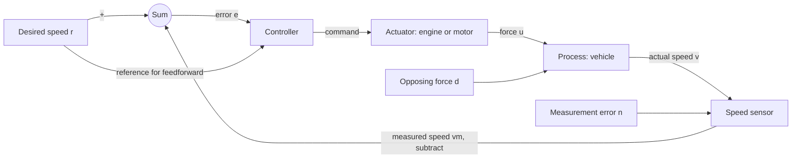

# Introduction to Control

**Student lecture notes — a 75-minute introduction to feedback control**

Control engineering is about choosing actions that make a system behave as desired, even when its environment and our model of it are imperfect. A car maintaining its speed on a hill will be our running example. We will describe the components, derive a model using Newton's law, and use a differential equation to compare control strategies.

**Prerequisites:** Calculus and basic ordinary differential equations. No previous control theory or Laplace transforms are assumed.

**Reading:** Franklin, Powell & Emami-Naeini, *Feedback Control of Dynamic Systems*, 8th ed. (FPE), §§1.1–1.3. Read §1.4 for historical context and skim §1.5 for the course roadmap. These notes contain all the additional material needed for this lecture.

**Sources and examples:** The presentation synthesizes FPE with introductory material from Åström & Murray, Dorf & Bishop, Khalil, Nise, and Ogata. You do not need access to those additional books. The cruise-control law and steady-state error formulas are adapted from Khalil, Chapter 1, Example 1-1, Eqs. (1.2)–(1.5), with force used directly as the control input. The numerical values and exercises are chosen for this lecture. FPE §1.2 uses a different, static model and different numbers.

## Learning objectives

After studying this lecture, you should be able to:

1. Identify a reference, controlled output, control input, disturbance, sensor, actuator, and controller.
2. Distinguish open-loop control, feedback, and feedforward by the information each uses.
3. Explain tracking, regulation, transient response, steady-state error, stability, and robustness.
4. Derive a simple cruise-control ODE and compare open-loop and feedback performance.
5. Explain why feedback can reduce disturbance and model-error effects without guaranteeing perfect control.
6. Describe limitations imposed by sensors, actuator capacity, and neglected dynamics.
7. Turn a control objective into a model, measurable requirements, and a sequence of design decisions.

## Notation and assumptions

| Symbol | Meaning | Units in the cruise-control example |
|---|---|---|
| $t$ | Time | s |
| $r(t)$ | Reference or desired speed | m/s |
| $y(t)=v(t)$ | Controlled output: actual vehicle speed | m/s |
| $v_m(t)$ | Measured speed | m/s |
| $n(t)$ | Additive measurement error, so $v_m=v+n$ | m/s |
| $e(t)=r(t)-v_m(t)$ | Error available to the controller | m/s |
| $u(t)$ | Applied tractive force in the ideal actuator model | N |
| $d(t)$ | Additional opposing force; positive on an uphill slope | N |
| $m$ | Vehicle mass | kg |
| $b$ | Actual coefficient of speed-dependent resistance | N·s/m |
| $\hat b$ | Nominal estimate of $b$ used by the controller | N·s/m |
| $K$ | Proportional feedback gain | N·s/m |
| $\tau$ | Time constant of an exponential response | s |

The measured error $r-v_m$ equals the actual tracking error $r-v$ only when the measurement is exact. We initially set $n=0$. Assume $m>0$, $b>0$, and $K\geq0$. Initial calculations neglect actuator limits and delay; we then examine why those assumptions matter.

---

## 1. What are we trying to control? {#section-1}

Suppose you drive at $20\,\mathrm{m/s}$ on a level road and hold the accelerator fixed as the road starts to climb. Gravity adds an opposing force. The vehicle slows down. A fixed accelerator setting specifies an action; it does not guarantee a speed.

A cruise controller measures speed and adjusts the driving force. It needs a desired speed, a measurement, a rule for deciding what to do, and a way to exert force.

The same structure appears in many systems:

| Application | Desired output | Adjustable action | Disturbance |
|---|---|---|---|
| Cruise control | Vehicle speed | Engine or motor command | Road grade, wind |
| Room heating | Room temperature | Heat input | Outdoor temperature, open door |
| Robot joint | Joint angle | Motor torque | Changing payload, contact force |
| Tank level | Liquid height | Inlet flow | Outlet-flow changes |

**Tracking** means making an output follow a reference that may change: a robot follows a planned motion, or a vehicle accelerates to a new speed setting. **Regulation** emphasizes holding an output near a fixed setpoint despite disturbances: cruise control encounters a hill without a change in desired speed. One controller can serve both purposes.

Manual versus automatic control is a separate distinction. A driver watching the speedometer and adjusting the pedal closes a feedback loop. An automatic timer that applies a fixed action does not necessarily use feedback.

### Check your understanding

**Is the accelerator position the controlled output in cruise control?** No. Speed is the output we want to regulate. Accelerator position is an intermediate command used to influence it.

---

## 2. The components of a feedback loop {#section-2}

A **process** is the physical system whose behavior we want to influence. A **controller** computes an action; an **actuator** converts that command into a physical input; a **sensor** measures a quantity used by the controller.

Following FPE §1.1, we can group the actuator and process together as the **plant**. Other books sometimes call the process alone the plant. Always state the boundary: for the ODE below, the input is already force, and the modeled process is the moving vehicle.

Arrows identify signals and their direction of influence. A box may represent a device, a computation, or a dynamic relationship. An arrow does not mean the response is instantaneous. The direct reference-to-controller arrow supplies the feedforward term introduced in §3 and used in §5.2; the controller receives both the reference and the measured error.

The comparator forms

$$
e(t)=r(t)-v_m(t).
$$

For a controller with positive gain, a measured speed below the reference produces a positive error and an increase in driving force. This is **negative feedback**: the correction tends to oppose the deviation. Whether the resulting motion is stable also depends on the dynamics.

Signals being subtracted must have compatible units and calibration. A real sensor may output voltage or digital counts; the controller must convert them into speed units, or convert the reference into the matching sensor units.

**Disturbance versus measurement error:** A hill changes the vehicle's force balance. A faulty speed reading changes the controller's information. Feedback can turn the second problem into a real motion error by acting on that faulty information.

### Check your understanding

**A thermostat is next to a warm oven, while another room is cold. Is the controller necessarily broken?** No. It may regulate the temperature at the sensor correctly while the sensor location poorly represents the temperature we care about. Choosing and placing the sensor is part of control design.

---

## 3. Open loop, feedback, and feedforward {#section-3}

**Open-loop control** computes an action without using the controlled output to correct that action. For example, a calibrated force setting might maintain a particular vehicle speed on a level road. It can work well when conditions are sufficiently predictable, but it does not detect a speed error caused by an unexpected hill.

**Feedback control** uses a measurement of the output to adjust the action. The controller can respond to the effect of a hill without measuring the hill itself.

**Feedforward** uses a model together with the reference or a measured disturbance to calculate an appropriate action. A grade measurement could tell a controller to increase force before appreciable speed loss occurs. Its accuracy depends on the model and the available information.

Feedforward and feedback can be combined:

$$
\boxed{u=u_{\mathrm{ff}}+K(r-v_m).}
$$

The feedforward term supplies a predicted force; feedback corrects the remaining measured error. Here $K$ converts speed error into force, so it has units $\mathrm{N}/(\mathrm{m/s})$.

| Strategy | Uses actual speed to correct force? | Main limitation |
|---|---|---|
| Calibrated open-loop force | No | Unmodeled loads and calibration errors remain uncorrected |
| Proportional feedback | Yes | Finite gain generally leaves some error; measurements and dynamics matter |
| Feedforward plus feedback | Yes, through the feedback term | Model-based prediction and feedback both have limits |

The classification depends on the particular output and system boundary. A machine can have a timed operating sequence and still contain a motor-speed feedback loop.

### Check your understanding

**A vehicle logs speed but never uses the logged value to change its command. Is its speed control closed loop?** No. Measuring or recording an output is not sufficient; the measurement must influence the control action.

---

## 4. A model of cruise control {#section-4}

### 4.1 Newton's law

Take forward motion as positive. The applied force is $u$, the modeled resistance is $bv$, and the additional opposing load is $d$. Newton's second law gives

$$
\boxed{m\dot v=u-bv-d.}
$$

For a road angle $\theta$, the gravity contribution to $d$ is $mg\sin\theta$. Wind or other additional loads can contribute too. Do not count the same resistance in both $bv$ and $d$.

This is a deliberately simple model. Real aerodynamic drag is not generally proportional to speed, and actual engine force depends on operating conditions. We use a linear resistance approximation over a limited range, a constant mass, and an actuator that delivers the requested force immediately. Later calculations should be checked against a more detailed model and measurements.

Every term on the right is a force. The model also explains why speed cannot jump when force changes: a finite net force produces a finite acceleration.

### 4.2 Equilibrium and transient motion

For constant $u$ and $d$, an **equilibrium** is a constant speed $v_\infty$ satisfying $\dot v=0$:

$$
v_\infty=\frac{u-d}{b}.
$$

Subtracting this constant solution from the ODE gives

$$
m\frac{d}{dt}(v-v_\infty)=-b(v-v_\infty).
$$

The solution is

$$
\boxed{v(t)=v_\infty+[v(0)-v_\infty]e^{-t/\tau},
\qquad \tau=\frac{m}{b}.}
$$

The constant term is the steady-state value. The exponential term is the transient contribution for this constant-input problem. After one time constant, about $37\%$ of the initial deviation from equilibrium remains; after three, about $5\%$ remains.

Solving $\dot v=0$ finds a candidate equilibrium. The decaying exponential establishes that this model approaches it. In other systems an equilibrium can exist without being stable.

### Check your understanding

**If the mass doubles but the forces and $b$ stay fixed, what changes?** The final speed is unchanged, but $\tau=m/b$ doubles. More mass slows the response. If a disturbance itself depends on mass, as a hill force does, its value must also be updated.

---

## 5. What feedback changes {#section-5}

### 5.1 A calibrated open-loop controller

Let $r$ be constant. Using the nominal resistance coefficient $\hat b$, choose

$$
u_{\mathrm{OL}}=\hat b r.
$$

If the model is exact and $d=0$, the equilibrium speed is $r$. With actual coefficient $b$ and constant disturbance $d$,

$$
m\dot v+ bv=\hat b r-d,
\qquad
v_{\infty,\mathrm{OL}}=\frac{\hat b r-d}{b}.
$$

The actual steady-state tracking error is

$$
\boxed{e_{\infty,\mathrm{OL}}
=r-v_{\infty,\mathrm{OL}}
=\frac{(b-\hat b)r+d}{b}.}
$$

The two numerator terms reveal two distinct problems: model error and an additional load.

### 5.2 Add proportional feedback

Keep the calibrated force and add a correction based on exact speed measurement:

$$
\boxed{u_{\mathrm{CL}}=\hat b r+K(r-v).}
$$

Substitute this law into Newton's equation:

$$
\begin{aligned}
m\dot v&=\hat b r+K(r-v)-bv-d,\\
m\dot v+(b+K)v&=(\hat b+K)r-d.
\end{aligned}
$$

For constant $r$ and $d$,

$$
v_{\infty,\mathrm{CL}}=\frac{(\hat b+K)r-d}{b+K},
$$

$$
\boxed{e_{\infty,\mathrm{CL}}=\frac{(b-\hat b)r+d}{b+K},
\qquad \tau_{\mathrm{CL}}=\frac{m}{b+K}.}
$$

Compared with open loop, the same model-error and disturbance numerator is divided by $b+K$ instead of $b$. Defining the dimensionless gain ratio $L=K/b$ gives

$$
e_{\infty,\mathrm{CL}}=\frac{1}{1+L}e_{\infty,\mathrm{OL}}.
$$

This equality also holds when both errors are zero; it is a scaling relation, not a division by the open-loop error. It applies to these two controllers under the stated assumptions.

Feedback also changes the transient: the deviation from the new equilibrium decays as $e^{-(b+K)t/m}$. Increasing $K$ makes this ideal model faster.

### 5.3 Worked example: entering a hill

Use

$$
m=1000\,\mathrm{kg},\quad b=\hat b=50\,\mathrm{N\,s/m},
\quad r=20\,\mathrm{m/s},\quad K=450\,\mathrm{N\,s/m}.
$$

Initially the road is level, $v(0)=20\,\mathrm{m/s}$, and both controllers supply $\hat b r=1000\,\mathrm N$. At $t=0$, an opposing force of $100\,\mathrm N$ appears and remains constant.

| Quantity after the hill begins | Open loop | Feedforward plus feedback |
|---|---:|---:|
| Final speed | $(1000-100)/50=18\,\mathrm{m/s}$ | $(500\cdot20-100)/500=19.8\,\mathrm{m/s}$ |
| Steady-state error | $2\,\mathrm{m/s}$ | $0.2\,\mathrm{m/s}$ |
| Time constant | $1000/50=20\,\mathrm s$ | $1000/500=2\,\mathrm s$ |
| Final driving force | $1000\,\mathrm N$ | $1000+450(0.2)=1090\,\mathrm N$ |

The full responses, with $t$ in seconds and speed in m/s, are

$$
\boxed{v_{\mathrm{OL}}(t)=18+2e^{-t/20},
\qquad v_{\mathrm{CL}}(t)=19.8+0.2e^{-t/2}.}
$$

Both start at $20\,\mathrm{m/s}$. Both initially decelerate at $-0.1\,\mathrm{m/s^2}$: at the instant the hill appears, no speed error has yet developed. Feedback increases force as speed falls and limits the loss. It does not anticipate an unmeasured hill.

**Why is there still an error?** At the closed-loop equilibrium, the extra $90\,\mathrm N$ comes from $K(r-v)=450(0.2)$. If that speed error vanished while all else stayed fixed, the correction would vanish too. The required equilibrium force is $50(19.8)+100=1090\,\mathrm N$.

**Connection to FPE §1.2:** Both calculations show reduced sensitivity to a hill. FPE uses a static throttle-to-speed relationship and a proportional-only feedback controller. Our controller retains nominal feedforward, which is why it has zero level-road error when $b=\hat b$ and the sensor is exact. With proportional feedback alone, $u=K(r-v)$, the equilibrium error would instead be $(br+d)/(b+K)$.

### Check your understanding

**Does reaching $19.8\,\mathrm{m/s}$ quickly mean the car reaches the $20\,\mathrm{m/s}$ target?** No. Speed of response and final accuracy are different specifications. This controller settles quickly to a slightly incorrect speed.

---

## 6. What counts as good control? {#section-6}

| Requirement | Question to ask | Cruise-control interpretation |
|---|---|---|
| Stability | Do small deviations stay small? Do they decay? | A speed perturbation should not grow uncontrollably |
| Tracking accuracy | How close is the output to the command? | Actual speed stays near the requested speed |
| Transient response | How does the output move between operating conditions? | Acceleration, overshoot, and settling are acceptable |
| Disturbance rejection | How much does an external load affect the output? | Hills cause only a small speed change |
| Robustness | Are requirements still met when the model is imperfect? | Payload and resistance changes remain tolerable |
| Control effort | Are the requested actions physically available? | Force, power, and rates of change remain within limits |
| Measurement quality | Is the controller acting on useful information? | Noise and calibration error do not cause unacceptable motion |

For an equilibrium, **stability** means sufficiently small initial deviations remain small; **asymptotic stability** additionally means they tend to zero. In our ideal closed-loop model, let $\delta v=v-v_\infty$. Then

$$
\delta\dot v=-\frac{b+K}{m}\delta v,
$$

so deviations decay when $b+K>0$. This equilibrium is asymptotically stable. It can nevertheless have nonzero tracking error. An equilibrium's stability and its agreement with the desired reference are separate questions.

For comparison, a deviation obeying $\dot x=ax$ with $a>0$ grows exponentially. A model obeying $\dot x=0$ preserves an initial offset: it does not return to equilibrium. Later lectures will distinguish equilibrium stability from other stability concepts more formally.

**Overshoot** is an excursion beyond the final value during a transition. **Settling time** specifies when the response enters and stays within a chosen tolerance band. Always say whether that band is around the final value or the desired reference. The two are different if there is steady-state error.

### Check your understanding

**Is every oscillation unstable?** No. Oscillations may decay, persist at bounded amplitude, or grow. A thermostat intentionally switching around a setpoint can produce bounded temperature cycling. A growing deviation is a different behavior.

---

## 7. Why not make the gain enormous? {#section-7}

### 7.1 Actuator capacity

The equations predict that large $K$ reduces error and shortens the time constant. But the initial command after a reference change can be large. If the same car were stationary and commanded to $20\,\mathrm{m/s}$, the ideal law would request

$$
u(0)=50(20)+450(20)=10000\,\mathrm N.
$$

An actuator capped at $1500\,\mathrm N$ cannot supply that command. It **saturates**, and the actual response no longer follows our unrestricted closed-loop formula. The model's accuracy near cruising speed also does not establish its accuracy from rest.

Even at steady speed, maintaining $20\,\mathrm{m/s}$ against a $600\,\mathrm N$ opposing load would require $50(20)+600=1600\,\mathrm N$. A $1500\,\mathrm N$ actuator cannot meet that requirement regardless of feedback gain.

### 7.2 Measurement error

Restore $v_m=v+n$:

$$
u=\hat b r+K(r-v-n),
\qquad
m\dot v+(b+K)v=(\hat b+K)r-d-Kn.
$$

For constant measurement bias $n$, constant $r,d$, and no saturation,

$$
\boxed{r-v_\infty=\frac{(b-\hat b)r+d+Kn}{b+K}.}
$$

With an exact resistance model and no hill, the actual speed error is $Kn/(b+K)$. As $K$ grows, this approaches $n$: the controller makes the measured speed nearly correct while the true speed remains biased. If the sensor reads high, the car runs slow.

Rapid measurement noise can also cause unnecessary force fluctuations. Its effect on vehicle motion depends on the dynamics; the constant-bias formula is not a formula for all time-varying noise.

### 7.3 Dynamics and stability

Our first-order ideal model is asymptotically stable for every $K\geq0$. It does **not** predict an instability at high positive gain. Real actuators, sensors, computations, and flexible structures add dynamics or delay. A correction based on old information can arrive after the situation has changed and reinforce the motion. Higher gain can then produce oscillation or instability.

Even the intended sign matters. If a wiring or software error implements $u=\hat b r+K(v-r)$, deviations satisfy

$$
m\delta\dot v=(K-b)\delta v.
$$

For $K>b$, deviations grow. A minus sign in the intended diagram is useful only if the physical loop implements the intended action.

### Check your understanding

**Does negative feedback guarantee stability?** No. Correct sign is a starting point. The dynamic response, delay, gain, and model uncertainty must also be considered.

---

## 8. From an objective to a design {#section-8}

**Analysis** predicts what a specified system will do. **Design** chooses components, structure, and parameters to obtain desired behavior. A practical design cycle is:

1. Define the task, controlled output, and operating range.
2. Specify measurable requirements for accuracy, transients, disturbances, and available actuation.
3. Choose sensors, actuators, and a control structure.
4. Build a model from physical laws and measurements; state its assumptions and uncertainties.
5. Analyze a candidate controller and adjust it to meet the requirements.
6. Simulate, test, compare with the requirements, and revise the model or design as needed.

### Worked design decision

For the nominal cruise model, suppose we require a steady-state speed loss of at most $0.25\,\mathrm{m/s}$ under a constant $100\,\mathrm N$ hill load, and a closed-loop time constant of at most $2\,\mathrm s$.

The error requirement gives

$$
\frac{100}{50+K}\leq0.25
\quad\Longrightarrow\quad K\geq350\,\mathrm{N\,s/m}.
$$

The time-constant requirement gives

$$
\frac{1000}{50+K}\leq2
\quad\Longrightarrow\quad K\geq450\,\mathrm{N\,s/m}.
$$

Thus $K=450\,\mathrm{N\,s/m}$ meets both nominal requirements. This is a candidate design, not a completed validation.

The time-constant requirement has no margin: with the same mass and gain but $b=40\,\mathrm{N\,s/m}$, $\tau=1000/(40+450)\approx2.04\,\mathrm s$, exceeding the $2\,\mathrm s$ limit.

For example, consider a separate test: on level ground at $20\,\mathrm{m/s}$, change the command to $21\,\mathrm{m/s}$. The initial requested force is

$$
u(0^+)=50(21)+450(21-20)=1500\,\mathrm N.
$$

It just reaches the assumed actuator limit, leaving no margin for an additional load or model error at that instant. Further tests may require a gradual reference change, a different control structure, or a different actuator.

---

## 9. A preview of controllers with memory {#section-9}

**Follow-up reading; optional in the live lecture.**

Proportional feedback supplies a correction only while there is an error. A controller can also accumulate the error over time. Define an integral state $z$ by

$$
\dot z=r-v,\qquad
u=\hat b r+K(r-v)+K_I z,
$$

where $K_I$ has units $\mathrm{N/m}$. A persistent positive speed error increases $z$ and therefore increases the force. At a constant equilibrium of the entire unsaturated system, $\dot z=0$ implies $v=r$.

With exact nominal resistance, the required equilibrium integral contribution is $K_I z_\infty=d$. It supplies the extra hill force even when the error is zero. This explains the purpose of **integral action**.

The equilibrium argument alone does not prove that the system reaches that equilibrium. The controller adds dynamics that must be analyzed, the necessary force must be available, and measurement bias still matters. If the actuator saturates while the integral keeps accumulating, recovery can be poor; this is called **integrator windup**.

Proportional, integral, and derivative actions form the familiar PID controller family. Derivative action responds to a rate of change and is sensitive to measurement noise. Their design and implementation belong in later lectures.

---

## 10. Review and worked practice {#section-10}

### 10.1 Identify a loop

**Problem.** A tank-level controller reads a level sensor and adjusts an inlet valve. Outlet flow varies. Identify the reference, output, controller, actuator, disturbance, and possible measurement error.

**Solution.** The reference is desired liquid height; the output is actual height. The controller computes a valve command from the measured height and reference. The valve mechanism is the actuator and inlet flow is the physical input. Outlet-flow variation is a disturbance. A sensor offset is a measurement error. The tank is the process; the valve and tank can be grouped as the plant.

### 10.2 Model uncertainty

**Problem.** Keep $r=20$, $\hat b=50$, $K=450$, and $d=100$ in the cruise example, but let actual $b=60\,\mathrm{N\,s/m}$. Find the two steady-state speed errors.

**Solution.** The common numerator is $(60-50)20+100=300\,\mathrm N$. Therefore

$$
e_{\infty,\mathrm{OL}}=\frac{300}{60}=5\,\mathrm{m/s},
\qquad
e_{\infty,\mathrm{CL}}=\frac{300}{510}\approx0.588\,\mathrm{m/s}.
$$

Feedback improves the error substantially, but the $0.25\,\mathrm{m/s}$ requirement from §8 is no longer met. Improvement under uncertainty and satisfaction of a robustness requirement are different claims.

### 10.3 Sensor bias

**Problem.** Return to $b=\hat b=50$, $K=450$, and level ground. The speed sensor reads $0.5\,\mathrm{m/s}$ too high. Find the actual and measured equilibrium speeds for $r=20\,\mathrm{m/s}$.

**Solution.** The actual tracking error is $450(0.5)/500=0.45\,\mathrm{m/s}$. Thus $v_\infty=19.55\,\mathrm{m/s}$ and $v_{m,\infty}=20.05\,\mathrm{m/s}$. The measured error is $-0.05\,\mathrm{m/s}$, so the force is $1000-22.5=977.5\,\mathrm N$, equal to $50(19.55)$ as required by force balance.

### 10.4 Exit check

**Why can feedback reject an unmeasured hill but fail to correct a sensor bias?** A hill changes actual speed, and an accurate sensor reports that change. A biased sensor changes the information defining the controller's error; this simple controller has no independent measurement of true speed with which to identify the bias.

**What should be checked before accepting a small steady-state error?** Stability, the transient response, available control effort, measurement quality, and performance across the specified range of uncertainty.

## Reading and next lecture

Return to FPE §§1.1–1.3 and identify its components, cruise-control comparison, and design goals in the language of these notes. Optional FPE §1.4 connects early mechanical regulation to the later mathematical analysis of feedback; §1.5 outlines the tools to come.

Next: [From Physical Models to the Laplace Transform](modeling-and-dynamics-poles_student.md). We will build more physical models and use their natural responses to motivate new mathematical tools. Today's exponential response already gives an example of the behavior those tools will describe.
