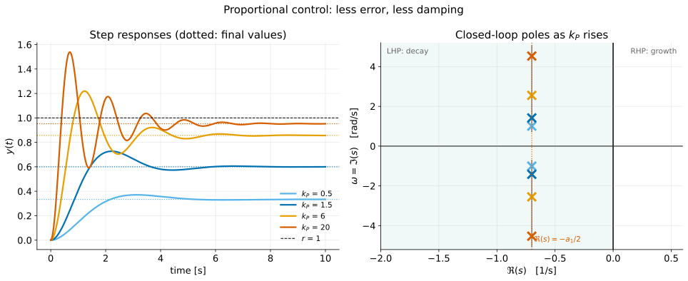
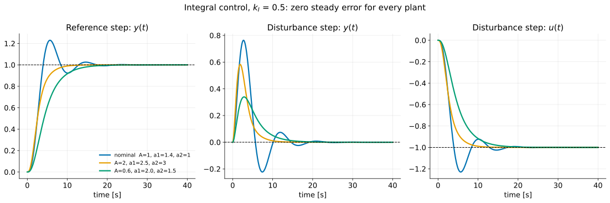
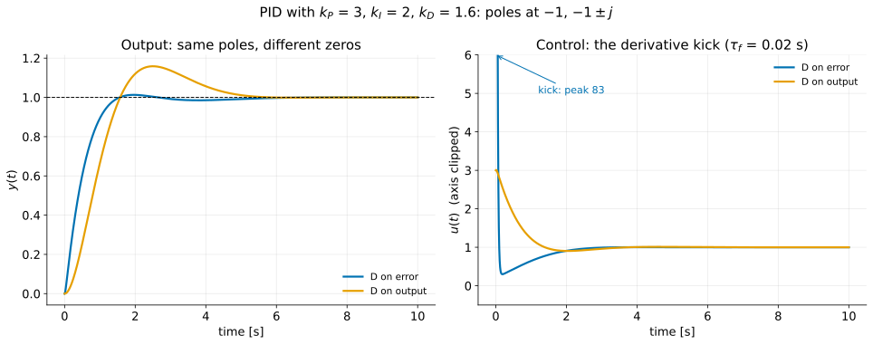
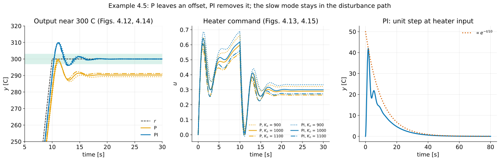
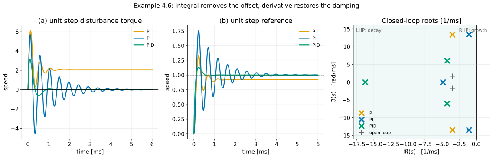

# A First Analysis of Feedback II — The Three-Term Controller: P, I, D, PI and PID

**Student lecture notes — FPE 8th ed., Sections 4.3.1 through 4.3.5**

The proportional–integral–derivative (PID) controller is the most widely used feedback law in engineering practice. Each of its three terms responds to a different feature of the error: its present size, its accumulated history, and its trend. These notes take the terms one at a time on a single plant, measure each with the Final Value Theorem, and then combine them.

**Prerequisites:** [the basic equations of feedback](feedback-properties_student.md). From Chapter 3: the Final Value Theorem in [Convolution and transfer functions](convolution-impulse-response_student.md), second-order specifications in [Time-domain specifications](time-domain-specs_student.md), and Routh's criterion in [Stability](stability_student.md).

**Source:** Franklin, Powell & Emami-Naeini, *Feedback Control of Dynamic Systems*, 8th ed. Example, equation and figure numbers follow the textbook. Numbered sections and § references refer to these notes unless labelled as textbook sections.

**Course order:** system type and error constants (textbook §4.2) come in the next lecture, [Steady-state error and system type](system-type_student.md). Every steady-state result here is derived directly from the Final Value Theorem. Integrator windup, derivative filtering and tuning rules are in [PID tuning and implementation](pid-tuning_student.md).

## Learning objectives

After studying this lecture, you should be able to:

1. Write the P, I, D, PI and PID control laws in the time domain and as transfer functions, and state what signal each term responds to.
2. For proportional control of a second-order plant, derive the closed-loop characteristic equation and explain why, in the underdamped region, $k_P$ changes the natural frequency but not the envelope decay rate.
3. Use the Final Value Theorem to find the steady-state output, error and control for step references and step disturbances under P and under I control.
4. Explain why integral control gives zero steady-state error to constant references and disturbances despite plant parameter changes, provided the DC gain remains nonzero and the closed loop remains internally stable (all internal modes decay).
5. Find the range of integral gain that keeps an integral or PI loop stable, using Routh's criterion.
6. Explain why derivative control is not used alone, interpret it as prediction, and state its noise liability.
7. Compare the derivative in the forward path with the derivative on the measured output (Fig. 4.10): same poles, different zeros, and no derivative kick.
8. Work Example 4.5: compare open-loop, P and PI control of a thermal plant for offset, speed and robustness to gain error, and identify what a stable pole-zero cancellation hides.
9. Choose PID gains to place the three closed-loop roots of a second-order plant by matching coefficients.
10. Use the Final Value Theorem to find disturbance errors for P, PI, PD and PID in Examples 4.6–4.8, as a preview of system type.

## Notation and assumptions

| Symbol | Meaning |
|---|---|
| $G(s)$ | plant; in §§2–4 the second-order motor model $A/(s^2+a_1s+a_2)$ of Eq. (4.58) |
| $D_c(s)$ | controller (the textbook writes $D_{cl}$ when it sits in the forward path of Fig. 4.2) |
| $R,\ Y,\ U,\ E,\ W$ | reference, output, control, error $E=R-Y$, disturbance at the plant input |
| $k_P,\ k_I,\ k_D$ | proportional, integral and derivative gains |
| $T_I=k_P/k_I,\ T_D=k_D/k_P$ | integral (reset) time and derivative time |
| $a(s)$ | closed-loop characteristic polynomial, $1+D_cG=0$ cleared of fractions |
| $\mathcal T(s)$ | closed-loop transfer function $Y/R$ |

Sensor noise is set to zero throughout. LHP and RHP mean the left and right half planes.

---

## 1. The three-term controller {#section-1}

### 1.1 The law {#section-1-1}

$$
\boxed{
D_c(s)=k_P+\frac{k_I}{s}+k_Ds
\tag{4.55}
}
$$

In the time domain, with $e=r-y$,

$$
u(t)=k_Pe(t)+k_I\int_{t_0}^{t}e(\tau)\,d\tau+k_D\dot e(t).
\tag{4.74}
$$

Industrial controllers and tuning tables often write the same law with one overall gain and two times:

$$
D_c(s)=k_P\left(1+\frac{1}{T_Is}+T_Ds\right),
\qquad T_I=\frac{k_P}{k_I},\quad T_D=\frac{k_D}{k_P}.
$$

$T_I$ and $T_D$ have units of time whatever the units of $k_P$.

The controller was developed by trial and error long before root locus, frequency response or state-space methods. Proportional feedback came first; integral action was added to remove steady offsets; a derivative term was added to improve poor transient response.

### 1.2 Where it sits {#section-1-2}

*Fig. 4.2: the controller acts on $E=R-Y$; its output $U$ adds to a disturbance $W$ at the plant input.*

From [Feedback properties](feedback-properties_student.md), with no sensor noise,

$$
Y=\frac{D_cG}{1+D_cG}R+\frac{G}{1+D_cG}W,
\qquad
U=\frac{D_c}{1+D_cG}R-\frac{D_cG}{1+D_cG}W .
$$

Every steady-state result below is one of these four transfer functions evaluated at $s=0$.

### 1.3 The Final Value Theorem as a measuring instrument {#section-1-3}

For a step of size $r_0$ (or $w_0$), and **provided the closed loop is stable**,

$$
y(\infty)=\lim_{s\to0}s\,\mathcal T(s)\frac{r_0}{s}=\mathcal T(0)\,r_0 .
$$

For a ramp of slope $v_0$ the output does not settle; compute the error instead, $e(\infty)=\lim_{s\to0}s\,\dfrac{E}{R}(s)\dfrac{v_0}{s^2}$. The stability condition is essential: the theorem gives a meaningless number for an unstable loop.

---

## 2. Proportional control {#section-2}

### 2.1 One knob {#section-2-1}

$$
u(t)=k_Pe(t),
\qquad
D_c(s)=k_P .
\tag{4.56–4.57}
$$

The controller has no dynamics; it is an amplifier with an adjustable gain. For a motor with non-negligible inductance the plant is second order,

$$
G(s)=\frac{A}{s^2+a_1s+a_2},
\tag{4.58}
$$

and the characteristic equation $1+k_PG=0$ becomes

$$
\boxed{
s^2+a_1s+a_2+k_PA=0
\tag{4.60}
}
$$

Matching it to $s^2+2\zeta\omega_ns+\omega_n^2$:

$$
\omega_n=\sqrt{a_2+k_PA},
\qquad
2\zeta\omega_n=a_1\ \ (\text{fixed}),
\qquad
\sigma=\zeta\omega_n=\frac{a_1}{2}\ \ (\text{fixed}).
$$

The gain reaches the constant term only. It sets how fast the response oscillates, not how fast its envelope decays.

This holds while the closed loop is **underdamped**, $a_2+Ak_P>a_1^2/4$; the roots are $-a_1/2\pm\sqrt{a_1^2/4-(a_2+Ak_P)}$. In the overdamped region the two real roots move with $k_P$ (for $G=1/(s^2+3s+2)$: $-1.887,\,-1.113$ at $k_P=0.1$, merging at $-1.5$ when $k_P=0.25$). The motor model, with $a_1^2/4=0.49<a_2=1$, is underdamped for every $k_P>0$. What stays fixed is the exponential **envelope** decay rate, so the settling-time *estimate* $4.6/\sigma$ does not change; the exact settling time still shifts somewhat.

### 2.2 Steady-state error and damping {#section-2-2}

Take $A=1$, $a_1=1.4$, $a_2=1$, so $G(0)=1$. With $\mathcal T=k_PG/(1+k_PG)$, the loop is stable for every $k_P>-1$ (the quadratic then has positive coefficients), and the step response settles at

$$
y(\infty)=\frac{k_PG(0)}{1+k_PG(0)},
\qquad
e(\infty)=\frac{1}{1+k_PG(0)},
\qquad
u(\infty)=k_Pe(\infty).
$$

*Fig. 4.7: step responses for $k_P=1.5$ and $k_P=6$.*

**Worked check:**

| | $k_P=1.5$ | $k_P=6$ |
|---|---|---|
| $a(s)$ | $s^2+1.4s+2.5$ | $s^2+1.4s+7$ |
| $\omega_n$ | $\sqrt{2.5}=1.581$ | $\sqrt7=2.646$ |
| $\zeta=0.7/\omega_n$ | 0.443 | 0.265 |
| poles | $-0.7\pm1.418j$ | $-0.7\pm2.551j$ |
| $y(\infty)=k_P/(1+k_P)$ | 0.600 | 0.857 |
| $e(\infty)=1/(1+k_P)$ | 0.400 | 0.143 |
| $u(\infty)=k_Pe(\infty)$ | 0.600 | 0.857 |
| overshoot above $y(\infty)$ | 21.2% | 42.2% |

*Working.* From $M_p=e^{-\pi\zeta/\sqrt{1-\zeta^2}}$: at $\zeta=0.443$, $\pi\zeta=1.392$ and $\sqrt{1-0.196}=0.897$, so $M_p=e^{-1.552}=0.212$. At $\zeta=0.265$, $M_p=e^{-0.833/0.964}=e^{-0.863}=0.422$. The simulated peaks, $0.727$ at $2.22$ s and $1.219$ at $1.23$ s, match the figure. Note that $u(\infty)=y(\infty)/G(0)$: the steady control is whatever the plant needs to hold that output.

Quadrupling the gain cuts the error by a factor of 2.8 and doubles the overshoot. Both pole pairs have real part $-0.7$, so the settling-time estimate $4.6/\sigma=4.6/0.7=6.6$ s is the same for every gain. The exact 1% settling times, measured to each final value, are 5.55 s and 6.45 s: the envelope is fixed, but where the oscillation last leaves the band is not. On this plant, proportional gain buys accuracy and oscillation, but no envelope decay rate.

### 2.3 A step disturbance {#section-2-3}

With $D_c=k_P$,

$$
\frac{Y}{W}=\frac{G}{1+k_PG},
\qquad
\frac{U}{W}=-\frac{k_PG}{1+k_PG}.
$$

For a unit step $w$, $y(\infty)=G(0)/(1+k_PG(0))=1/(1+k_P)$: 0.4 at $k_P=1.5$ and 0.143 at $k_P=6$. The control settles at $-k_P/(1+k_P)$, so the plant sees $u+w=1/(1+k_P)$. The controller cancels part of the disturbance and cannot cancel the rest, because it needs an error to push back.

$$
\boxed{
\text{Proportional control needs a nonzero error to produce a nonzero steady control.}
}
$$

### 2.4 Beyond second order {#section-2-4}

On higher-order plants, raising $k_P$ can add damping to some poles while removing it from others, and for enough gain a plant of order three or more usually goes unstable. The stability lecture found such a gain limit with Routh's criterion; root locus (Part IV) draws the whole picture.

#### Check your understanding

> A plant has $G(0)=1$. What proportional gain gives 1% steady-state error to a step? What damping do you expect on the motor model?

$1/(1+k_P)=0.01$ gives $k_P=99$. Then $\omega_n=\sqrt{100}=10$ and $\zeta=0.07$, about 80% overshoot. Accuracy by gain alone is expensive.

---

## 3. Integral control {#section-3}

### 3.1 A controller with a memory {#section-3-1}

$$
u(t)=k_I\int_{t_0}^{t}e(\tau)\,d\tau,
\qquad
D_c(s)=\frac{k_I}{s}.
\tag{4.62–4.63}
$$

The control at time $t_1$ is $k_I$ times the net area under the error curve up to $t_1$. It depends on the whole history of the error, not only on its present value.

*Fig. 4.8: the error of the integral loop analysed below, with $k_I=0.5$. When the error returns to zero, the area it left behind — and so the control — remains.*

The controller has infinite gain at DC: $|D_c(j\omega)|=k_I/\omega\to\infty$ as $\omega\to0$. From [Feedback properties](feedback-properties_student.md), a large loop gain means a small error, so zero steady-state error is the expected result.

### 3.2 Reference step {#section-3-2}

Same plant, $G(0)=1$. Multiplying numerator and denominator by $s$,

$$
\frac{E}{R}=\frac{s}{s+k_IG},
\qquad
\frac{U}{R}=\frac{k_I}{s+k_IG},
\qquad
\frac{Y}{R}=\frac{k_IG}{s+k_IG}.
\tag{4.64–4.65}
$$

For a unit step, and provided the loop is stable,

$$
\boxed{
y(\infty)=\frac{k_IG(0)}{0+k_IG(0)}=1,
\qquad
e(\infty)=\frac{0}{0+k_IG(0)}=0,
\qquad
u(\infty)=\frac{k_I}{0+k_IG(0)}=\frac{1}{G(0)}
}
\tag{4.66–4.67}
$$

For a plant with finite, nonzero $G(0)$, the error is zero **for any nonzero $k_I$ that keeps the loop internally stable**, whereas proportional control always left an error. The steady control is the inverse DC gain of the plant.

### 3.3 Disturbance step {#section-3-3}

$$
\frac{Y}{W}=\frac{sG}{s+k_IG},
\qquad
\frac{U}{W}=-\frac{k_IG}{s+k_IG},
\tag{4.68}
$$

$$
\boxed{
y(\infty)=0,
\qquad
u(\infty)=-\frac{k_IG(0)}{0+k_IG(0)}=-1
}
\tag{4.69}
$$

The controller ends up producing exactly $-w$: the disturbance is cancelled, not merely attenuated.

*Fig. 4.9: unit step disturbance with $k_I=0.5$.*

**Worked check:** with $k_I=0.5$ the closed-loop polynomial is $s(s^2+1.4s+1)+0.5=s^3+1.4s^2+s+0.5$, with roots $-0.905$ and $-0.247\pm0.701j$. The roots sum to $-0.905-0.494=-1.399\approx-1.4$ ✓. For the disturbance step, the output peaks at $0.764$ at $t=2.71$ s and $u$ dips to $-1.229$ at $5.67$ s before settling at $-1$. The reference error of Fig. 4.8 reaches its minimum, $-0.229$, at the same $5.67$ s. That is no coincidence: comparing (4.65) and (4.68), $U/W=-Y/R$ exactly, so the disturbance-step control mirrors the reference-step output, whose peak is $1.229$.

### 3.4 Why the error must vanish {#section-3-4}

The Final Value Theorem gives the result; a one-line argument gives the reason. Suppose the closed loop is internally stable (all internal modes decay), so every signal settles to a constant under constant inputs. The integrator's output $u$ then settles, so its derivative goes to zero. But that derivative *is* $k_Ie$:

$$
\dot u=k_Ie\quad\Longrightarrow\quad
u\to\text{const}\ \Longrightarrow\ \dot u\to0\ \Longrightarrow\ e\to0 .
$$

The argument never mentions $A$, $a_1$, $a_2$, the size of $r$ or $w$, or where $w$ enters. The textbook calls this property **robust**: plant parameter changes do not affect it, provided the loop stays stable.

**Qualification [beyond the book]:** a plant zero at the origin can cancel the controller integrator. For $G=s/(s+1)$ and $D_c=k_I/s$, with $k_I>0$, $E/R=(s+1)/(s+1+k_I)$, so a unit reference step leaves $e_{ss}=1/(1+k_I)$. The output settles, but the control ramps without bound: the loop is not internally stable. The zero-error argument requires the controller state to settle too.

*Three plants with DC gains 1, 2/3 and 0.4 under the same $k_I=0.5$. All three reach zero error and reject the disturbance; the steady control is $1/G(0)$ for each: 1, 1.5 and 2.5.*

### 3.5 The price {#section-3-5}

**Stability.** The integrator adds a pole at the origin and raises the loop order to three:

$$
a(s)=s^3+a_1s^2+a_2s+Ak_I .
$$

The Routh array's first column is $1,\ a_1,\ (a_1a_2-Ak_I)/a_1,\ Ak_I$, so

$$
\boxed{0<k_I<\frac{a_1a_2}{A}}
$$

For $A=1$, $a_1=1.4$, $a_2=1$, this is $0<k_I<1.4$. At $k_I=1.4$, $a(s)=(s+1.4)(s^2+1)$: the pair sits at $\pm j$.

**Speed.** At $k_I=0.5$ the dominant pair has $\sigma=0.247$, about three times slower than the proportional loop's $0.7$; the 1% settling time is 16.5 s. An integrator responds to area, and area takes time to accumulate.

**Ramps.** A ramp reference still leaves a constant error (§5.3); [Steady-state error and system type](system-type_student.md) classifies this.

**Saturation.** Real actuators saturate. While $u$ is held at its limit, the integrator keeps integrating the error — *integrator windup* — and the result can be a large overshoot. Practical integral control always includes anti-windup, covered in [PID tuning and implementation](pid-tuning_student.md).

---

## 4. Derivative control {#section-4}

### 4.1 Rate feedback {#section-4-1}

$$
u(t)=k_D\dot e(t),
\qquad
D_c(s)=k_Ds.
\tag{4.70–4.71}
$$

Derivative feedback, also called **rate feedback**, is used to increase damping: more stability, faster transients and less overshoot.

### 4.2 Never used alone {#section-4-2}

A derivative controller carries no information about where the output should end up. If $e$ is constant, however large, then $u=0$.

**Worked check:** with $D_c=k_Ds$ on the motor model, $\mathcal T=\dfrac{Ak_Ds}{s^2+(a_1+Ak_D)s+a_2}$. The loop is stable for $k_D>-a_1/A$, and $\mathcal T(0)=0$: a step reference leaves the output at **zero** in steady state. The derivative has added damping ($a_1\to a_1+Ak_D$) and done nothing else, so it must be paired with P or I.

**Anticipation.** Combined with proportional action, the derivative acts as a prediction:

$$
k_Pe(t)+k_D\dot e(t)=k_P\bigl[e(t)+T_D\dot e(t)\bigr]\approx k_P\,e(t+T_D).
$$

PD control is proportional control acting on a linear extrapolation of the error $T_D$ seconds ahead. When the error is falling quickly, the controller eases off before the error reaches zero, which reduces overshoot. The extrapolation is only good when the error is smooth over $T_D$.

**Noise.** A differentiator's gain $k_D\omega$ grows without bound with frequency, and sensor noise is high-frequency. Practical derivatives are filtered, $k_Ds/(\tau_fs+1)$; see [PID tuning and implementation](pid-tuning_student.md).

### 4.3 Where to put the derivative {#section-4-3}

*Fig. 4.10: (a) derivative on the measured output only; (b) derivative on the error.*

In (b) the derivative acts on $e=r-y$; in (a) it acts on the measurement only, like a tachometer on a motor shaft. The loop from $y$ back to $y$ is the same, so the **characteristic equation is identical**. The reference enters differently, so the **zeros of $Y/R$ differ**.

**Example.** On the motor model with $k_P=3$, $k_I=2$, $k_D=1.6$ (chosen in §6.2), both structures have

$$
a(s)=s^3+3s^2+4s+2=(s+1)(s^2+2s+2),
$$

with poles at $-1$ and $-1\pm j$, and

$$
\text{(b)}\ \ \frac{Y}{R}=\frac{1.6s^2+3s+2}{a(s)},
\qquad\qquad
\text{(a)}\ \ \frac{Y}{R}=\frac{3s+2}{a(s)}.
$$

| Structure | Zeros of $Y/R$ | Overshoot | Peak time |
|---|---|---|---|
| (b) D on error | $-0.938\pm0.609j$ | 1.5% | 2.00 s |
| (a) D on output | $-0.667$ | 16.4% | 2.50 s |

In (b), a step in $r$ is differentiated and the control contains an impulse $k_D\delta(t)$. With a derivative filter $\tau_f=0.02$ s this becomes a spike of $k_D/\tau_f+k_P=1.6/0.02+3=83$ at $t=0^+$, against $u(0^+)=k_P=3$ in (a). This is the **derivative kick**, which structure (a) avoids. In this example the kick-free structure overshoots more, because it has lost the numerator's $s^2$ term. Moving the derivative protects the actuator; it does not automatically improve the output response.

### 4.4 The three terms compared {#section-4-4}

| Term | Responds to | Steady-state effect | Dynamic effect |
|---|---|---|---|
| P | $e(t)$ | error $1/(1+k_PG(0))$ to a unit step | faster, less damped (on the second-order plant) |
| I | $\int e$ | zero error to constant $r$ and $w$, for a plant with $G(0)\ne0$, if internally stable | slower; destabilising if $k_I$ is large |
| D | $\dot e$ | none | damping; amplifies noise |

Each term fixes something the others leave undone. The rest of the lecture combines them.

---

## 5. PI control and Example 4.5 {#section-5}

### 5.1 The law {#section-5-1}

$$
u(t)=k_Pe(t)+k_I\int_{t_0}^{t}e(\tau)\,d\tau,
\qquad
D_c(s)=k_P+\frac{k_I}{s}=\frac{k_P\left(s+k_I/k_P\right)}{s}.
\tag{4.72–4.73}
$$

PI is a pole at the origin and a **zero at $-k_I/k_P=-1/T_I$**. The integrator gives zero steady-state error to constant inputs; the proportional term gives a faster response than integral action alone. Example 3.34 in the stability lecture was a PI loop, and its stability region was found with Routh's criterion.

### 5.2 Example 4.5: a thermal system {#section-5-2}

Two thermal masses coupled by conduction:

$$
G(s)=\frac{K_o}{(\tau_1s+1)(\tau_2s+1)}=\frac{100}{(s+1)(s+0.1)},
\qquad
\tau_1=1\ \text{s},\ \ \tau_2=10\ \text{s},\ \ K_o=1000 .
$$

The reference ramps at $30^\circ$C/s to $300^\circ$C, reached at $t=10$ s, and then holds. The goals are negligible overshoot and robustness to errors in $K_o$, $\tau_1$ and $\tau_2$.

**Open loop.** Apply $u=300/K_o=0.3$.

The response settles to 1% in $t_s=47.1$ s, set by the slow pole, with zero error — only if $K_o$ is exactly 1000. A 5% gain error gives $315^\circ$C: a 5% output error.

**P control, $k_P=0.03$.** The characteristic polynomial is $(s+1)(10s+1)+30=10s^2+11s+31$, or $s^2+1.1s+3.1$, so $\omega_n=\sqrt{3.1}=1.761$ and $\zeta=1.1/(2\times1.761)=0.312$ (the textbook rounds to 0.3). The closed-loop DC gain is $30/31$, so the output settles at $290.3^\circ$C, an offset of $300/31=9.68^\circ$C.

**Worked check:** with $K_o=900$ and $1100$ the DC gains are $27/28$ and $33/34$, so the offsets are $300/28=10.71$ and $300/34=8.82^\circ$C. A ±10% plant-gain change moves the output by about ±1°C instead of the ±30°C of open loop — the sensitivity reduction of [Feedback properties](feedback-properties_student.md). The outputs are nearly indistinguishable; the control signals are not, because the controller does the compensating.

**PI control, $k_P=0.03$, $k_I=0.003$.**

$$
D_c(s)=\frac{0.03\,(s+0.1)}{s},
\qquad
D_cG=\frac{3}{s(s+1)},
\qquad
\mathcal T(s)=\frac{3}{s^2+s+3}.
$$

The controller zero at $-0.1$ cancels the slow plant pole. The reference response is a standard second-order one with $\omega_n=\sqrt3=1.732$, $\zeta=1/(2\sqrt3)=0.289$ and poles $-0.5\pm1.658j$.

**Worked check:** the 1% settling time (band $300\pm3^\circ$C) is 13.44 s; with $K_o=900$ and $1100$ it is 13.62 and 13.27 s. The peak is $309.9^\circ$C, a 3.3% overshoot. The offset is zero for all three gains, and the steady heater command is $300/K_o$: 0.333, 0.300 and 0.273. A $K_o$ error does not spoil the cancellation, because $K_o$ does not move the pole at $-0.1$; an error in $\tau_2$ would.

### 5.3 Tracking the ramp {#section-5-3}

With $E/R=1/(1+D_cG)=\dfrac{s(s+1)}{s^2+s+3}$ and $R=30/s^2$,

$$
e_{\text{ramp}}=\lim_{s\to0}s\cdot\frac{s(s+1)}{s^2+s+3}\cdot\frac{30}{s^2}=\frac{30}{3}=10^\circ\text{C}.
$$

The simulated lag at $t=10$ s is $9.97^\circ$C; the P loop lags by about $20^\circ$C at the same instant. The PI loop tracks a step with zero error and a ramp with a constant lag. [Steady-state error and system type](system-type_student.md) calls the number 3 the velocity constant.

### 5.4 What the cancellation hides {#section-5-4}

The pole at $-0.1$ was cancelled in $D_cG$, not removed from the plant. For a disturbance at the heater input,

$$
\frac{Y}{W}=\frac{G}{1+D_cG}
=\frac{100}{(s+1)(s+0.1)}\cdot\frac{s(s+1)}{s^2+s+3}
=\frac{100\,s}{(s+0.1)(s^2+s+3)} .
$$

The slow pole returns. For a unit step at the heater input the final value is still zero, but the output peaks at $42.0^\circ$C at 1.79 s, is $12.8^\circ$C at 10 s, $1.71^\circ$C at 30 s (4.1% of the peak) and $0.085^\circ$C at 60 s. The tail decays like $e^{-t/10}$, the plant's own time constant.

This is the stable counterpart of the cancellation trap in the stability lecture. A cancelled stable pole is legitimate, but it is not gone: the reference cannot excite it, and the disturbance can. Cancelling a slow pole makes tracking fast and leaves disturbance rejection slow. The full characteristic polynomial is $(s+0.1)(s^2+s+3)$.

---

## 6. PID control {#section-6}

### 6.1 Three gains, three roots {#section-6-1}

$$
u(t)=k_Pe(t)+k_I\int_{t_0}^{t}e(\tau)\,d\tau+k_D\dot e(t),
\qquad
D_c(s)=k_P+\frac{k_I}{s}+k_Ds.
\tag{4.74–4.75}
$$

On the motor model, $1+GD_c=0$ multiplied by $s$ gives

$$
\boxed{
s^3+(a_1+Ak_D)s^2+(a_2+Ak_P)s+Ak_I=0
\tag{4.77}
}
$$

Each gain sets one coefficient: $k_D$ the $s^2$ coefficient (minus the sum of the roots), $k_P$ the $s^1$ coefficient, and $k_I$ the constant. With three free parameters, the three roots can in principle be placed anywhere. Without $k_D$, the roots must sum to $-a_1$ whatever $k_P$ and $k_I$ are; that is why PID, not PI, is needed for arbitrary dynamics on a second-order plant.

### 6.2 Coefficient matching {#section-6-2}

Choose the desired roots, expand them into $s^3+\alpha_1s^2+\alpha_2s+\alpha_3$, and read off

$$
\boxed{
k_D=\frac{\alpha_1-a_1}{A},
\qquad
k_P=\frac{\alpha_2-a_2}{A},
\qquad
k_I=\frac{\alpha_3}{A}
}
$$

**Worked check:** place the roots at $-1$ and $-1\pm j$ for $A=1$, $a_1=1.4$, $a_2=1$. $(s+1)^2+1=s^2+2s+2$, and $(s+1)(s^2+2s+2)=s^3+3s^2+4s+2$. So $k_D=3-1.4=1.6$, $k_P=4-1=3$ and $k_I=2$ — the gains used in §4.3. This procedure places the poles but not the zeros, and the zeros affect overshoot (see [Time-domain specifications](time-domain-specs_student.md)).

Very fast roots require large gains. A large $k_D$ amplifies sensor noise and produces a large derivative kick, so the actuator and sensor limit how far left the roots can go. Root locus (Part IV) and state feedback (Part VI) develop the same pole-placement idea.

---

## 7. Example 4.6: PID control of motor speed {#section-7}

A DC motor with the parameters of textbook Example 2.15, scaled so that time is in **milliseconds**:

$$
J_m=1.13\times10^{-2},\quad b=0.028,\quad L_a=10^{-1},\quad R_a=0.45,\quad K_t=K_e=0.067 .
\tag{4.78}
$$

With speed $\Omega$ as output, armature voltage $V_a$ as control and load torque $W$,

$$
\Omega=\frac{K_t}{M(s)}V_a+\frac{L_as+R_a}{M(s)}W,
\qquad
M(s)=(J_ms+b)(L_as+R_a)+K_tK_e .
$$

Numerically $M(s)=0.00113s^2+0.007885s+0.017089$, with open-loop poles at $-3.489\pm1.718j$ ms$^{-1}$. The gains are

$$
k_P=3,\qquad k_I=15,\qquad k_D=0.3,
\tag{4.79}
$$

with unused gains set to zero for P and PI. The textbook gives both $k_I$ and $k_D$ units of seconds; relative to $k_P$, $k_I$ has units of inverse time and $k_D$ of time. In the scaled time, $T_I=k_P/k_I=0.2$ ms and $T_D=k_D/k_P=0.1$ ms.

**Final values under P.** At $s=0$ the closed-loop denominator is $bR_a+K_tK_e+K_tk_P=0.0126+0.00449+0.201=0.2181$, so

$$
\Omega_r(\infty)=\frac{K_tk_P}{0.2181}=\frac{0.201}{0.2181}=0.922,
\qquad
\Omega_w(\infty)=\frac{R_a}{0.2181}=\frac{0.45}{0.2181}=2.06 .
$$

These are the steady P levels in Fig. 4.16. With PI or PID, the integrator forces them to exactly 1 and 0 (§3.4).

**Worked check:** closed-loop roots, in ms$^{-1}$:

| Controller | Roots | $\zeta$ of the pair | peak, reference step | peak, disturbance step |
|---|---|---|---|---|
| P | $-3.49\pm13.45j$ | 0.251 | 1.330 | 6.10 |
| PI | $-4.87$, $-1.06\pm13.48j$ | 0.078 | 1.755 | 5.70 |
| PID | $-16.26$, $-4.25\pm6.05j$ | 0.575 | 1.126 | 3.16 |

The P pair keeps the open-loop real part, $-3.49$, for the same reason as in §2.2: $M(s)$ is second order and $k_P$ adds only to its constant term. Adding the integrator drags the pair toward the imaginary axis ($\zeta$ falls from 0.25 to 0.08), which is the extra ringing in Fig. 4.16. Adding the derivative restores the damping while keeping zero steady-state error.

---

## 8. Disturbance errors: Examples 4.7 and 4.8 {#section-8}

The textbook works these examples in the language of system type (§4.2), which is the next lecture. The Final Value Theorem gives the same results directly.

### 8.1 Example 4.7: DC motor position, P and PI {#section-8-1}

*Fig. 4.6: the motor of Example 4.7 (the textbook's text refers to Fig. 4.4, but the motor diagram is Fig. 4.6). Example 4.7 adds a sensor gain $h$ in place of the unity feedback.*

The plant is $A/[s(\tau s+1)]$, with the disturbance torque entering through $B/A$ at the plant input. With $R=0$ the error is $e=-y$:

$$
\text{P:}\quad \frac{E}{W}=-\frac{B}{\tau s^2+s+Ak_Ph},
\qquad\qquad
\text{PI:}\quad \frac{E}{W}=-\frac{Bs}{\tau s^3+s^2+Ahk_Ps+Ahk_I}.
\tag{4.82}
$$

Under P, a unit step torque gives

$$
\boxed{e(\infty)=-\frac{B}{Ak_Ph}}
$$

a constant offset, even though the plant contains an integrator. The plant's integrator sits after the disturbance, so it helps track the reference but does not reject a constant torque. For a constant reference $r_0$ with $W=0$, however, the stable loop has $Y/R\to1/h$, so $y(\infty)=r_0/h$ and the system error is $r_0(1-1/h)$. Thus $h\ne1$ makes it Type 0 for reference inputs despite the plant integrator; zero step error requires $h=1$ (see [Steady-state error and system type §6](system-type_student.md#section-6), where $H(0)=1$).

The textbook's part (a) prints $-B/Ak_P$, omitting $h$. Under PI, a unit step torque gives $e(\infty)=0$, and a unit ramp torque $W=1/s^2$ gives

$$
\boxed{e(\infty)=\lim_{s\to0}s\cdot\frac{-Bs}{\tau s^3+s^2+Ahk_Ps+Ahk_I}\cdot\frac1{s^2}=-\frac{B}{Ahk_I}}
\tag{4.85}
$$

Both results require stability. Routh on $\tau s^3+s^2+Ahk_Ps+Ahk_I$ requires positive gains and $k_P>\tau k_I$.

### 8.2 Example 4.8: satellite attitude, PD and PID {#section-8-2}

The plant is $1/(Js^2)$, with the disturbance torque $W$ at its input. With $R=0$ and $e=-y$,

$$
\text{PD:}\quad \frac{E}{W}=-\frac{1}{Js^2+k_Ds+k_P},
\qquad\qquad
\text{PID:}\quad \frac{E}{W}=-\frac{s}{Js^3+k_Ds^2+k_Ps+k_I}.
\tag{4.86, 4.88}
$$

The textbook prints (4.86) and (4.88) without the leading minus sign; since $E=-Y$ when $R=0$, the sign belongs there, as it does in (4.82). The magnitudes agree with the textbook.

| Controller | Unit step torque | Unit ramp torque | Stability condition |
|---|---|---|---|
| PD | $e(\infty)=-1/k_P$ | unbounded | $k_P,k_D>0$ |
| PID | $e(\infty)=0$ | $e(\infty)=-1/k_I$ | $k_Dk_P>Jk_I$ (Routh) |

Pure P is absent for a reason: $Js^2+k_P$ has roots at $\pm j\sqrt{k_P/J}$, so proportional control alone leaves the satellite oscillating forever. The derivative is what makes this loop stable.

The satellite under PD tracks a step command with zero error, because the plant's two integrators lie between the controller and the output, yet it holds a constant angle error under a constant torque. Whether a loop has zero steady-state error depends on **which input** is applied and **where the integrators are** relative to it. [Steady-state error and system type](system-type_student.md) organises this into system type.

---

## 9. Summary {#section-9}

The table below gives typical effects on well-behaved plants, not guarantees: Example 4.6 showed integral action reducing damping, and higher-order plants can break the pattern.

| Increase | Rise time | Overshoot | Settling time | Steady-state error to a step | Stability margin |
|---|---|---|---|---|---|
| $k_P$ | decreases | increases | small change | decreases (never zero with P alone if $G(0)$ is finite) | usually decreases |
| $k_I$ | decreases | increases | increases | **eliminated** | decreases |
| $k_D$ | small change | decreases | decreases | no effect | usually increases (until noise and lag dominate) |

$$
\boxed{
\begin{array}{l}
\text{P: accuracy for damping.}\\
\text{I: zero constant error if internally stable and }G(0)\ne0\text{; costs speed and stability.}\\
\text{D: damping; says nothing about the final value; amplifies noise.}\\
\text{PID on a second-order plant: three gains place three roots.}
\end{array}}
$$

---

## 10. Looking ahead {#section-10}

Proportional action pushes back in proportion to the error, but on a plant with finite DC gain it needs an error to keep pushing. A plant that already contains an integrator, such as a motor driven to a position, can reach a constant reference with zero error under P alone. Integral action removes constant errors without knowledge of the plant, at a cost in speed and stability, and needs anti-windup on real actuators. Derivative action adds damping, cannot set a final value on its own, and amplifies noise. The next lecture replaces example-by-example error calculations with a classification — system type — based on counting integrators. The lecture after that covers tuning from experiments, anti-windup, feedforward and practical derivative filtering.

---

## Review questions

1. Proportional control of the motor model cannot change the decay rate $\sigma=a_1/2$. Name a physical change to the motor that would, and say which coefficient it moves.
2. The argument in §3.4 says an integrator forces $e\to0$ whenever the loop settles. Give two ways the loop can fail to settle in practice, one linear and one nonlinear.
3. A household thermostat is an on-off device with no integrator, yet a house does not sit 2°C below the setpoint. How does it regulate? (Think about switching and hysteresis.) Does the temperature converge to zero error, or does it cycle? What would you need to add to get true zero steady-state error?
4. In Example 4.5 the PI zero was placed on the slow plant pole. What happens to the reference and disturbance responses if the true $\tau_2$ is 12 s instead of 10?
5. With the derivative on the output (Fig. 4.10a), the step response of §4.3 overshoots more than with the derivative on the error. When would you still choose (a)?
6. PID can place three roots anywhere on a second-order plant. What limits how far left you can put them?
7. The satellite of Example 4.8 tracks a step command with zero error under PD, but not a step torque. Explain the difference without equations.

## Optional practice

Optional practice from FPE, 8th edition; these are study suggestions, not an assignment.

| Problem | Topic |
|---|---|
| 4.34 | P, PD and PI to stabilise a given loop |
| 4.35 | P for a damping target, PI for no overshoot, PID for settling time |
| 4.36 | Liquid-level control: P, PI, PD and PID against time specifications |
| 4.37 | Process control: PI and PID against rise time, overshoot and peak time |
| 4.38 | Multiple-integrator plants $1/s^n$ |
| 4.39(d–e) | Generator speed: PD, then removing a disturbance error |
| 4.42 | DC motor speed with PI: place the closed-loop roots |
| Review Questions 4.8–4.10 | Objectives of integral and derivative control; derivative in the feedback path |

## Chapter 4 student notes

- [The basic equations of control](feedback-properties_student.md)
- [The three-term controller: P, I, D, PI and PID](pid-control_student.md)
- [Steady-state error and system type](system-type_student.md)
- [Tuning, realising and feeding forward the PID](pid-tuning_student.md)
