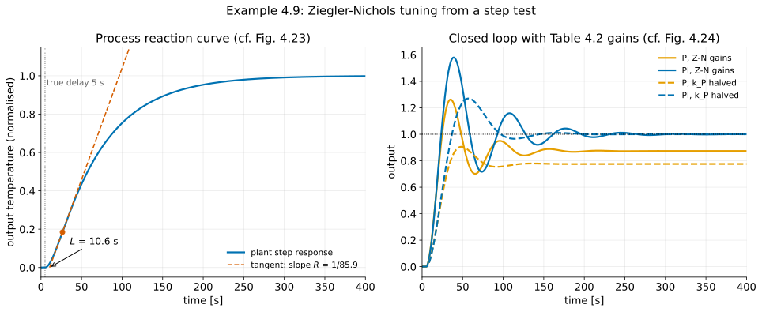
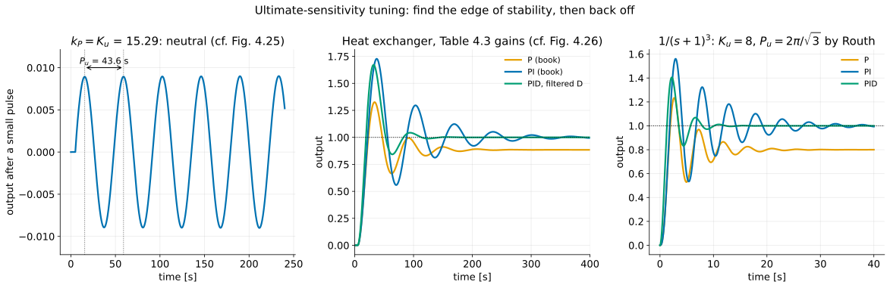
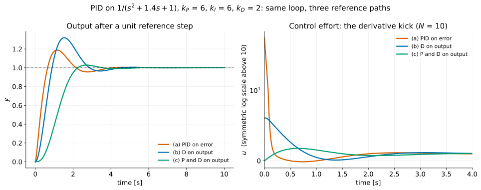
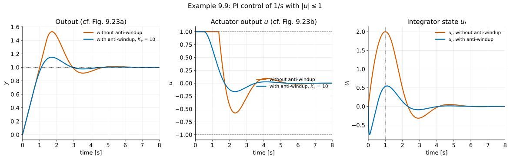
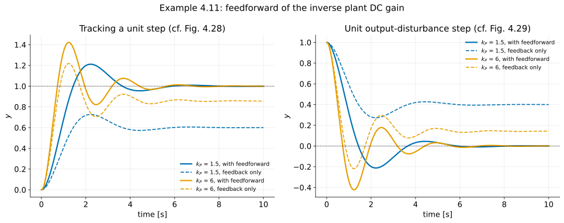

# A First Analysis of Feedback IV — Tuning, Realising and Feeding Forward the PID
## FPE 8th ed., Sections 4.3.6, 4.4 and 9.3.1

**Audience:** Fourth-year undergraduate mechanical engineering (ME 404)

**Source:** Franklin, Powell & Emami-Naeini, *Feedback Control of Dynamic Systems*, 8th ed., §4.3.6 (Ziegler–Nichols tuning), §4.4 (feedforward by plant model inversion), §4.5 (a pointer only) and §9.3.1 (integrator antiwindup, Example 9.9). Worked examples and figure numbers are the book's. The treatment of the filtered derivative and setpoint weighting follows Åström & Murray, *Feedback Systems*, 2nd ed., §§11.3–11.5 (AM). Additions of my own are marked **[beyond the book]**.

**Prerequisites:** [Feedback properties](feedback-properties_instructor.md), [PID control](pid-control_instructor.md) and [System type](system-type_instructor.md) of this series. Routh's criterion and the imaginary-axis crossing are in [Stability and Routh's criterion](stability_instructor.md).

**Duration:** 75 minutes.

**Book figures:** figure numbers refer to the source chapters at

```text
references/documents/Franklin, Powell, Emami-Naeimi - 8th Ed./4 - A First Analysis of Feedback.pdf
references/documents/Franklin, Powell, Emami-Naeimi - 8th Ed./complete.pdf        (Chapter 9 material)
```

Chapter 4 page cues use the PDF viewer's 1-based page numbers (120 pages). Chapter 9 cues refer to `complete.pdf` (3129 pages). Extracted figures are in `book-figures/`. **Tables 4.2 and 4.3 are missing from the supplied PDF**: their captions print, but the table bodies do not. The standard Ziegler–Nichols values are given in §5.3 and §7.1 below. The book's own worked numbers in Examples 4.9 and 4.10 confirm every entry they use. **[beyond the book]** Classroom checks and teaching prompts are instructor additions. Demo paths are relative to `demos/`; the demonstration index is in §17.

**Notation:**

| Symbol | Meaning |
|---|---|
| $G(s)$, $D_c(s)$ | plant and controller (compensator) |
| $R,\ Y,\ E,\ U,\ W$ | reference, output, error $R-Y$, control, disturbance |
| $k_P,\ k_I,\ k_D$ | proportional, integral and derivative gains |
| $T_I,\ T_D$ | integral (reset) time and derivative time: $D_c=k_P\left(1+\frac{1}{T_Is}+T_Ds\right)$, so $k_I=k_P/T_I$, $k_D=k_PT_D$ |
| $R,\ L$ | slope and apparent lag of the process reaction curve (§5) — context separates this $R$ from the reference |
| $K_u,\ P_u$ | ultimate gain and ultimate period |
| $T_f,\ N$ | derivative filter time constant, $T_f=T_D/N$ |
| $b$ | setpoint weight on the proportional term |
| $u_c,\ u,\ u_{\max}$ | controller demand, saturated actuator output, actuator limit |
| $K_a$ | antiwindup feedback gain |

---

# Part 0 — Planning

## 1. Teaching strategy

[PID control](pid-control_instructor.md) produced the three terms of the PID. This lecture turns that formula into a controller a technician could commission on a real machine. Three questions organise it:

| Question | Answer in this lecture | Book |
|---|---|---|
| **What numbers do I type in?** | Ziegler–Nichols: one step test, or one experiment at the edge of stability | §4.3.6 |
| **What does the formula leave out?** | The derivative needs a filter and should not act on the reference; the integrator must stop charging when the actuator saturates | Fig. 4.10, §9.3.1, **[AM 11.3–11.5]** |
| **Can the reference do some of the work?** | Yes: feed forward the effort the model says is needed, and let feedback correct the rest | §4.4 |

The unifying idea is that **the loop is not the whole controller.** Tuning sets the feedback path. Derivative placement, setpoint weighting and feedforward change only how the reference enters. Anti-windup changes only what happens when the linear model stops being true. Students leave [PID control](pid-control_instructor.md) believing a PID is the formula $k_P+k_I/s+k_Ds$. They should leave this lecture knowing that four controllers with that formula can respond to a setpoint step very differently.

The framing line:

> **The PID formula fits on one line. A PID that works on a real machine needs four more decisions: the gains, where the derivative acts, what happens at the actuator's limit, and how much of the job the reference does on its own.**

Four moments to protect:

1. **§5.4** — quarter decay is exactly 50% overshoot for the standard second-order pair. The classical tuning target is far more aggressive than students expect.
2. **§7.3** — the ultimate-gain experiment *is* Routh's imaginary-axis crossing from Chapter 3, done with the plant instead of a pencil.
3. **§10.3** — windup worked by hand: the integrator reaches exactly 2 at exactly $t=1$ s, and the actuator stays pinned for a further 0.366 s after the output has passed the target.
4. **§9.3** — three implementations of the same PID with the same poles give overshoots of 19%, 32% and 3%.

---

## 2. Learning objectives

By the end of this lecture students should be able to:

1. Read the slope $R$ and lag $L$ from a process reaction curve and apply the Ziegler–Nichols step-response rules (Table 4.2).
2. Show that a quarter decay ratio corresponds to $\zeta\approx0.215$ and to 50% overshoot for the standard second-order pair.
3. Describe the ultimate-sensitivity experiment, apply the rules of Table 4.3, and compute $K_u$ and $P_u$ with Routh's criterion for a delay-free plant.
4. Explain why Ziegler–Nichols settings are a starting point rather than a design, and what "detuning" means.
5. Explain derivative kick, and compare the derivative on the error with the derivative on the measured output (Fig. 4.10). Show that both give the same closed-loop poles but different zeros.
6. Write the filtered derivative $k_Ds/(1+sT_f)$ and compute the kick it produces, $k_P(1+N)$.
7. Use setpoint weighting to separate the response to the reference from the response to disturbances.
8. Explain integrator windup, trace Example 9.9 by hand, and derive the first-order lag that the antiwindup loop produces during saturation (Fig. 9.21d).
9. Design DC-gain feedforward for tracking and for a measured disturbance (Example 4.11), and compute the residual error when the model's DC gain is wrong.

---

## 3. Suggested lecture flow (75 minutes)

| Time | Topic | Section |
|---:|---|---|
| 0–4 min | Recap: three terms, but no numbers | §4 |
| 4–16 min | Reaction curve, Table 4.2, quarter decay | §5 |
| 16–24 min | Example 4.9, heat exchanger | §6 |
| 24–34 min | Ultimate sensitivity; Routh link; Example 4.10 | §7 |
| 34–37 min | Beyond Z–N: automated tuners and detuning | §8 |
| 37–50 min | Realising the PID: kick, filter, setpoint weighting | §9 |
| 50–62 min | Windup and antiwindup, Example 9.9 | §10 |
| 62–71 min | Feedforward, Example 4.11 | §11 |
| 71–75 min | Digital pointer; closing | §12 |

**Prepare as slides:** Figs. 4.18, 4.19, 4.20, 4.23–4.26, 4.10, 9.20, 9.21, 9.23 and 4.27–4.29, plus the two Z–N tables. Write on the board: the quarter-decay calculation (§5.4), the Routh $K_u$ calculation (§7.3), the windup timeline (§10.3) and the reduction to Fig. 9.21(d) (§10.4).

**If you are short of time,** reduce §6 and §7.2 to the demo figures, and fold §8 into a sentence. Do not compress §10.3, and do not skip §9.3: it is the only place students see that the reference path is a design choice of its own.

### Runnable demonstrations

```
cd demos
uv run python ch4/l4_demo1_reaction_curve.py --show
uv run python ch4/l4_demo3_antiwindup.py --show
uv run python ch4/l4_demo4_derivative_kick.py --show
```

**Run Demos 1, 3 and 4 live.** Demo 1 does the tangent construction on the heat-exchanger model. Demo 3 is windup, which students remember. Demo 4 shows same poles, different zeros, with the control effort on a log scale. Demos 2 and 5 work as slides. Demo 3 takes about 8 s to run, because it integrates the nonlinear loop with a small time step.

**Heat-exchanger model [beyond the book].** Chapter 4 supplies only measured curves. The demos use $G(s)=e^{-5s}/[(10s+1)(60s+1)]$, the model FPE gives for the same heat exchanger in Example 7.42 and Problem 6.66. It reproduces the book's measured ultimate gain to three figures (15.29 against 15.3), so the demo figures track the book's.

### Teaching scope

Use the demos for the live examples; the checks also work on the board. In a 75-minute session, keep to the protected moments in §1. Assign the remaining calculations (§6 table, §11.3 model error) as follow-up reading.

---

# Part I — The lecture

## 4. Opening

### Instructor script

> Last time we built the PID: a term that reacts to the present error, one that remembers the past, and one that anticipates the future. We saw what each does to the poles, to the steady-state error and to the system type.
>
> We never said what numbers to use.
>
> In 1942 that was the real problem. There were thousands of pneumatic PID controllers in refineries and paper mills, each with three knobs, and nobody on the plant floor had a transfer function. Ziegler and Nichols, two engineers at Taylor Instruments, gave the operators a recipe: run one experiment on the process, read two numbers off a chart recorder, and look the knob settings up in a table.
>
> Today: that recipe, why it works, how aggressive it is — and then the three things you must add to the textbook formula before it survives contact with a real actuator.

---

## 5. Tuning from a step test (§4.3.6)

### 5.1 The process reaction curve


> **[ FIG 4.18 ]** — PDF p. 59 *(slide)*

Many process plants, such as heat exchangers, tanks and paper machines, respond to a step with an S-shaped curve: a flat start, a steepest point, then a slow approach to a new level. Ziegler and Nichols approximated every such curve by a **first-order lag plus a time delay**:

$$
\frac{Y(s)}{U(s)}=\frac{Ae^{-st_d}}{\tau s+1}
\tag{4.91}
$$

Two numbers are read off the curve. Draw the tangent at the inflection point (the steepest point):

- its **slope** is the reaction rate $R=A/\tau$. For a test step of size $\Delta u$, normalise: $R=\text{max slope}/\Delta u$. Students applying Table 4.2 to raw test data routinely forget this;
- its **intercept with the time axis** gives the apparent lag $L=t_d$.

**Say:** "Nobody believes this plant is really first order with a delay. The model is a way of reducing a curve to two numbers: how fast the plant responds, and how long it takes to start. Everything difficult about controlling a process is in the ratio of those two."

### 5.2 Why these two numbers [beyond the book]

The lag $L$ is an *effective* delay used by the tuning approximation, not necessarily a literal dead time. The heat exchanger in §6 has a true delay of 5 s, yet the tangent gives $L\approx10.6$ s, because its lags also slow the start of the curve. $L$ is a rough time scale for the loop, and $1/L$ a rough bandwidth scale, not a strict limit on its response. The slope $R$ is the plant's gain at the frequencies that matter for the loop. On the steep part of the curve, a unit input step gives an output rate of $R$ per second. A controller of gain $k_P$ therefore moves the output at a rate proportional to $k_PR$, and the loop gain over one lag time is proportional to $k_PRL$. Fixing $k_PRL$ fixes the character of the transient. That is why every row of Table 4.2 is a constant divided by $RL$.

### 5.3 Table 4.2: the step-response rules

The controller is written in the process-control (ISA "standard") form

$$
D_c(s)=k_P\left(1+\frac{1}{T_Is}+T_Ds\right),
\tag{4.92}
$$

with $k_I=k_P/T_I$ and $k_D=k_PT_D$. Table 4.2 (tuning for a decay ratio of 0.25):

| Controller | $k_P$ | $T_I$ | $T_D$ |
|---|---|---|---|
| P | $\dfrac{1}{RL}$ | — | — |
| PI | $\dfrac{0.9}{RL}$ | $\dfrac{L}{0.3}$ | — |
| PID | $\dfrac{1.2}{RL}$ | $2L$ | $0.5L$ |

**Source note [beyond the book]:** the body of Table 4.2 is missing from the supplied PDF (p. 61 prints only the caption). The entries above are Ziegler and Nichols' published values. The P and PI rows are confirmed by the book's own arithmetic in Example 4.9.

Two patterns to point out. Adding integral action *lowers* $k_P$ (from 1 to 0.9), because the integrator adds phase lag and costs stability margin. Adding derivative action *raises* it (to 1.2), because the derivative adds phase lead and buys margin back. That is the qualitative story of [PID control](pid-control_instructor.md), now with numbers attached.

### 5.4 Quarter decay, and what it means


> **[ FIG 4.19 ]** — PDF p. 61 *(slide)*

The rules were chosen so that the closed-loop transient decays to a quarter of its amplitude in one period. The book says this corresponds to $\zeta=0.21$.

> **Teaching check [beyond the book]:** For the standard underdamped pair, the envelope is $e^{-\zeta\omega_nt}$ and the period is $2\pi/\omega_d$. One period's decay is therefore
>
> $$
> e^{-\zeta\omega_n\cdot2\pi/\omega_d}=e^{-2\pi\zeta/\sqrt{1-\zeta^2}}=\tfrac14 .
> $$
>
> Take logs: $2\pi\zeta/\sqrt{1-\zeta^2}=\ln4$, so $\zeta/\sqrt{1-\zeta^2}=\ln4/(2\pi)=0.2206$. Squaring and solving gives $\zeta=0.2206/\sqrt{1+0.2206^2}=0.2155$ ✓.
>
> Now the overshoot. From [Time-domain specifications](time-domain-specs_instructor.md), $M_p=e^{-\pi\zeta/\sqrt{1-\zeta^2}}$. The exponent is **exactly half** of the one above, so
>
> $$
> \boxed{M_p=\sqrt{1/4}=\tfrac12}
> $$
>
> **Quarter decay is 50% overshoot.** The overshoot is itself a half-period decay (from the final value to the first peak), and two half-periods make a quarter.

#### Ask the class

> Would you accept 50% overshoot on the position of a robot arm? On the temperature of a chemical reactor? On the level in a tank?

The honest answer is "rarely". Ziegler and Nichols were tuning for fast *disturbance* recovery in process plants, where the setpoint changes rarely and a lively loop was considered acceptable. Treat quarter decay as a historical target, and be ready to detune.

---

## 6. Example 4.9: the heat exchanger, from a step test


> **[ FIG 4.23 ]** — PDF p. 66 *(slide)*

From the curve, the book reads $R\simeq1/90$ per second and $L\simeq13$ s. Table 4.2 then gives

$$
\text{P: } k_P=\frac{1}{RL}=\frac{90}{13}=6.92,
\qquad
\text{PI: } k_P=\frac{0.9}{RL}=6.23,\quad T_I=\frac{L}{0.3}=\frac{13}{0.3}=43.3\ \text{s}.
$$

**Source correction [beyond the book]:** PDF p. 66 prints $k_P=6.22$ for the PI case; $0.9\times90/13=6.2308$, which rounds to 6.23. The same line writes the integral time as $T_1$; it is $T_I$. Neither affects the figure.


> **[ FIG 4.24 ]** — PDF p. 67 *(slide: (a) the Z–N gains, (b) $k_P$ halved)*

Read the figure with the class:

- **P leaves an offset.** The plant is Type 0 with $G(0)=1$, so the closed-loop final value is $k_P/(1+k_P)=6.92/7.92=0.874$, an error of $1/(1+k_P)=0.126$. That is the error constant $K_p=k_P$ from [Steady-state error and system type](system-type_instructor.md) at work.
- **PI removes it**, as the integrator must (Type 1), at the cost of a larger overshoot.
- **Both are oscillatory.** That is the quarter-decay target, as promised in §5.4.
- **Halving $k_P$** (Fig. 4.24b) nearly removes the oscillation and makes the P offset larger: $3.46/4.46=0.776$.

> **[ DEMO 1 ]** — `ch4/l4_demo1_reaction_curve.py` *(live)*
>
> **Teaching check [beyond the book]:** On the model $e^{-5s}/[(10s+1)(60s+1)]$, the tangent construction gives $R=1/85.9$ and $L=10.64$ s, against the book's $1/90$ and 13 s read by eye. The true delay is only 5 s: the other 5.6 s of $L$ is the lag of the two thermal time constants, disguised as dead time. With the book's gains the simulated loop has decay ratios of 0.20 (P) and 0.27 (PI), close to the quarter-decay target. The peaks are 1.26 and 1.58, against about 1.27 and 1.62 in Fig. 4.24(a).



#### Say out loud

> Notice what the model's own tangent gives: $k_P=8.07$, not 6.92. The rules are sensitive to how you draw a line on a chart. That is one more reason the Ziegler–Nichols numbers are where you start, not where you finish.

---

## 7. Tuning at the edge of stability (§4.3.6, continued)

### 7.1 The ultimate-sensitivity experiment


> **[ FIG 4.20 ]** — PDF p. 62


> **[ FIG 4.21 ]** — PDF p. 63

Turn off the integral and derivative terms. Raise $k_P$ until the loop just sustains an oscillation. Record the gain, $K_u$ (the **ultimate gain**), and the period of the oscillation, $P_u$ (the **ultimate period**). The book adds that $P_u$ should be measured at the smallest amplitude possible, because at large amplitude the actuator saturates and the loop is no longer linear.

**[beyond the book]** **When the experiment works.** It needs a finite positive gain at which a complex pair of closed-loop poles reaches the imaginary axis. Not every plant has one. The model in [PID control](pid-control_instructor.md), $G=1/(s^2+1.4s+1)$, gives $s^2+1.4s+1+k_P$, which is stable for every $k_P>0$, so it has no $K_u$ or $P_u$ and Table 4.3 cannot be applied to it. A boundary crossed at $\omega=0$ (a real pole through the origin) gives no finite period either. Many process plants, with delay or multiple lags, do have the required phase crossing, which is why the method suits them. For example, a positive-gain cascade of three or more stable first-order lags without zeros always has a finite $K_u$. Counting lags alone is not a test, though: left-half-plane zeros add phase lead, and $G=(s+0.1)^2/(s+1)^3$ has three lags but is stable for every $k_P>0$ (its Routh condition is $8+3.59k_P+0.2k_P^2>0$). Ask the class before revealing it.

When it applies, use Table 4.3:

| Controller | $k_P$ | $T_I$ | $T_D$ |
|---|---|---|---|
| P | $0.5K_u$ | — | — |
| PI | $0.45K_u$ | $\dfrac{P_u}{1.2}$ | — |
| PID | $0.6K_u$ | $\dfrac{P_u}{2}$ | $\dfrac{P_u}{8}$ |

**Source note [beyond the book]:** the body of Table 4.3 is also missing from the supplied PDF (p. 63). The values above are Ziegler and Nichols'. The P and PI rows are confirmed by Example 4.10.

The P row says "use half the gain that makes the loop oscillate". In the language of Chapter 6, that is a **gain margin of 2**. This is the first time students see a stability margin, and it is worth naming.

### 7.2 Example 4.10: the heat exchanger again


> **[ FIG 4.25 ]** — PDF p. 68

The book measures $K_u=15.3$ and $P_u=42$ s. Table 4.3 gives

$$
\text{P: } k_P=0.5\times15.3=7.65,
\qquad
\text{PI: } k_P=0.45\times15.3=6.885,\quad T_I=\frac{42}{1.2}=35\ \text{s}.
$$


> **[ FIG 4.26 ]** — PDF pp. 69–70

The responses resemble Example 4.9's, and again halving $k_P$ tames them (Fig. 4.26b).

**Source qualification [beyond the book]:** PDF p. 63 says the step-response method "generally suggests gains that are higher than the ultimate sensitivity method". The book's own heat-exchanger examples show the reverse: $k_P=6.92$ against 7.65 for P, and 6.23 against 6.885 for PI. Treat the remark as a loose heuristic. Both methods give gains within about 10% of each other here, which is the more useful observation.

> **[ DEMO 2 ]** — `ch4/l4_demo2_ultimate_gain.py` *(slide)*
>
> **Teaching check [beyond the book]:** On the model, the loop oscillates when the phase of $G(j\omega)$ reaches $-180^\circ$: $5\omega+\tan^{-1}10\omega+\tan^{-1}60\omega=\pi$. This gives $\omega_u=0.1443$ rad/s, $K_u=1/|G(j\omega_u)|=15.29$ and $P_u=2\pi/\omega_u=43.6$ s. The simulated pulse response at $k_P=K_u$ swings by $\pm0.009$, the amplitude in Fig. 4.25. The book's 42 s was read from a plot and is 4% short. The PI loop with the book's gains peaks at 1.73.



### 7.3 The same experiment, done by Routh [beyond the book]

This is the payoff from Chapter 3. For a plant without delay, the ultimate gain is the boundary of Routh's stable range, and the ultimate period comes from the auxiliary polynomial *([Stability and Routh’s criterion §10](stability_instructor.md#section-10))*. Routh does not always return one: for the plant in [PID control](pid-control_instructor.md), $1/(s^2+1.4s+1)$, every first-column entry stays positive for all $k_P>0$, which *proves* there is no ultimate gain. On the board, for $G(s)=1/(s+1)^3$ with $D_c=K$:

$$
1+\frac{K}{(s+1)^3}=0
\quad\Longrightarrow\quad
s^3+3s^2+3s+(1+K)=0 .
$$

$$
\begin{array}{c|cc}
s^3 & 1 & 3\\
s^2 & 3 & 1+K\\
s^1 & \dfrac{9-(1+K)}{3}=\dfrac{8-K}{3} & \\
s^0 & 1+K &
\end{array}
$$

The $s^1$ entry vanishes at $\boxed{K_u=8}$. The $s^2$ row then gives the auxiliary polynomial $3s^2+9=0$, so $s=\pm j\sqrt3$:

$$
\omega_u=\sqrt3=1.732\ \text{rad/s},
\qquad
\boxed{P_u=\frac{2\pi}{\sqrt3}=3.628\ \text{s}} .
$$

Check: at $K=8$ the cubic is $s^3+3s^2+3s+9=s^2(s+3)+3(s+3)=(s+3)(s^2+3)$ ✓.

Table 4.3 then gives PID gains $k_P=4.8$, $T_I=1.814$ s and $T_D=0.453$ s. Demo 2's right-hand panel shows the result: overshoots of 54% (P, about a final value of 0.8), 56% (PI) and 41% (PID).

#### Instructor script

> In Chapter 3 we used Routh to find where a loop goes unstable, and I told you the point was that it works with the gain left as a symbol. Here is the engineering version. Ziegler and Nichols' second experiment finds the same boundary by walking the real plant up to it. Routh does it with a pencil, if you have a model. The experiment does it without a model, if you are willing to make the plant oscillate.
>
> Which would you rather do to a 50-ton steel furnace?

---

## 8. After Ziegler–Nichols (§4.3.6, end)


> **[ FIG 4.22 ]** — PDF p. 65 *(one slide, briefly)*

The book lists successors (Cohen–Coon, Chien–Hrones–Reswick, Åström–Hägglund) and points to model-based tuners such as Matlab's `pidTuner`, which trade performance against robustness. Three points to make:

1. **Z–N is a starting point.** Both examples in the book end by detuning $k_P$ by 50%, and operators routinely fine-tune by hand.
2. **[beyond the book]** AM §11.3 names two severe drawbacks of the Ziegler–Nichols rules: they use too little process information, and the loops they produce lack robustness. The improved rules AM quotes (Eq. 11.10, after Åström and Hägglund) use more information, such as a first-order-plus-time-delay model or the static gain $K$ alongside $K_u$ and $P_u$, and typically give *lower* gains. In AM's Example 11.4 the modified rule raises the stability margin from 0.31 to 0.61. They are still taught because they are simple, because they show that a controller can be tuned from an experiment without a model, and because every tool that followed was built on the same experiments.
3. **The ultimate-gain experiment is dangerous**, and relay auto-tuning is the standard way around it; AM §11.3 notes it is built into many commercial PID controllers. A relay of amplitude $d$ in the loop drives the plant into a small limit cycle at approximately the ultimate period. If the output amplitude is $a$, the first harmonic of the relay's square wave gives $K_u\approx4d/(\pi a)$. The relay amplitude sets the size of the oscillation, so the plant never runs at the stability boundary with a linear gain.

---

## 9. Realising the PID: where the derivative acts (Fig. 4.10; AM §11.5)

### 9.1 Derivative kick

The ideal derivative $k_Ds$ applied to the error differentiates the reference. A unit step in $r$ puts an impulse $k_D\delta(t)$ into $u$. No actuator can deliver that. What actually happens is that the amplifier saturates for a moment and the mechanism takes a jolt, which is why the effect is called **derivative kick**. [PID control](pid-control_instructor.md) noted that $k_Ds$ is also improper: it has more zeros than poles, so its gain grows without bound at high frequency and it amplifies sensor noise.

The book's remedy is on PDF p. 44: move the derivative into the feedback path.


> **[ FIG 4.10 ]** — PDF p. 45 *(slide: both halves together)*

On the board, with the derivative acting on the output:

$$
U=\Big(k_P+\frac{k_I}{s}\Big)E-k_DsY
\quad\Longrightarrow\quad
\frac{Y}{R}=\frac{G\,(k_P+k_I/s)}{1+G\,(k_P+k_I/s+k_Ds)} .
$$

The denominator is identical to the forward-path version (Fig. 4.10b). **The closed-loop poles, the disturbance response and the noise response do not change. Only the zeros from $R$ to $Y$ change.** For $G=A/(s^2+a_1s+a_2)$, clearing fractions gives

$$
\frac{Y}{R}\Big|_{\text{D on error}}=\frac{A(k_Ds^2+k_Ps+k_I)}{\Delta(s)},
\qquad
\frac{Y}{R}\Big|_{\text{D on output}}=\frac{A(k_Ps+k_I)}{\Delta(s)},
$$

with $\Delta(s)=s^3+(a_1+Ak_D)s^2+(a_2+Ak_P)s+Ak_I$, which is Eq. (4.77).

### 9.2 The filtered derivative [beyond the book: AM §11.5]

In practice the derivative is always filtered:

$$
k_Ds\;\longrightarrow\;\frac{k_Ds}{1+sT_f},
\qquad
T_f=\frac{T_D}{N},
$$

with $N$ typically between 5 and 20 **[AM §11.5]**. The high-frequency gain of the derivative term is now bounded, at $k_D/T_f=k_PN$. The filter adds one fast pole near $-1/T_f$. The book's footnote on PDF p. 57 says the same: in practice the derivative term "would have a high-frequency pole".

> **Teaching check [beyond the book]:** With the filtered derivative on the error, a unit reference step gives
>
> $$
> u(0^+)=k_P+\frac{k_D}{T_f}=k_P+k_P N=k_P(1+N).
> $$
>
> With $k_P=6$ and $N=10$ that is 66: an eleven-fold kick instead of an infinite one. With the derivative on the output, $u(0^+)=k_P=6$.

### 9.3 Setpoint weighting [beyond the book: AM §11.5]

Generalise once more. Let the reference enter the proportional and derivative terms with weights $b$ and $c$:

$$
u=k_P\,(b\,r-y)+k_I\!\int_0^t(r-y)\,d\tau+k_D\,(c\,\dot r-\dot y).
$$

The integral term must always see the true error $r-y$; otherwise the steady state would be wrong. The choice $c=0$ is standard, and $b$ between 0 and 1 is a design parameter. With $b=c=0$ the controller is sometimes called I-PD. AM Eq. (11.15) writes the weights as $\beta$ and $\gamma$. It uses $b$ in its pseudocode, notes that $\gamma$ is normally zero, and shows in Example 11.7 that the weights change only the response to the reference.

> **[ DEMO 4 ]** — `ch4/l4_demo4_derivative_kick.py` *(live; this is the moment to slow down)*
>
> Plant $G=1/(s^2+1.4s+1)$ (Eq. 4.58 with $a_1=1.4$, $a_2=A=1$), gains $k_P=6$, $k_I=6$, $k_D=2$, filter $N=10$. The characteristic polynomial with the ideal derivative is $s^3+3.4s^2+7s+6$, with roots $-1.435$ and $-0.982\pm1.793j$. With the filter the roots are $-27.74$, $-1.504$ and $-1.076\pm1.776j$, so the filter moves the dominant pair slightly.
>
> | Implementation | $u(0^+)$ | overshoot | 10–90% rise | zeros $R\to Y$ |
> |---|---:|---:|---:|---|
> | (a) PID on error ($b=c=1$) | 66 | 18.9% | 0.47 s | $-1.409\pm0.861j$ |
> | (b) D on output ($b=1$, $c=0$) | 6 | 31.9% | 0.61 s | $-1$, $-30$ |
> | (c) P and D on output ($b=c=0$) | 0 | 2.9% | 1.32 s | $-30$ |
>
> The zero at $-30$ in (b) and (c) is the filter pole reappearing as a numerator factor. The zero at $-1$ in (b) is $-k_I/k_P$.



#### Say out loud

> Moving the derivative removed the kick, and the overshoot got *worse*. That is not a contradiction. With the filter cleared ($T_f=1/30$), the reference numerator changed from $(k_D+k_PT_f)s^2+(k_P+k_IT_f)s+k_I=2.2s^2+6.2s+6$, with zeros at $-1.41\pm0.86j$, to $(k_Ps+k_I)(1+sT_f)$, with a slow real zero at $-k_I/k_P=-1$ (and the fast one at $-30$). That zero is slow and close to the dominant poles, and a slow LHP zero adds overshoot, exactly as in [Time-domain specifications](time-domain-specs_instructor.md). Take the proportional path away as well and the zero goes too: almost no overshoot, but a rise nearly three times slower.
>
> The feedback loop is the same in all three. If a disturbance hits, all three respond identically. **The reference path is a separate design decision.** That is what "two degrees of freedom" means.

---

## 10. Integrator windup and antiwindup (§9.3.1)

This material sits in Chapter 9 (nonlinear systems) of the book, but it belongs with PID: the syllabus lists it here, and [PID control](pid-control_instructor.md) promised it.

### 10.1 What goes wrong


> **[ FIG 9.20 ]** — `complete.pdf` p. 1526

Every actuator has limits: a valve is fully open, a motor driver at its supply voltage, a control surface on its stops. While the actuator is saturated, $u=u_{\max}$ no matter what the controller demands, so **the feedback loop is open**. The integrator does not know this. It keeps integrating the error, so the demand $u_c$ keeps growing, and when the output finally reaches the setpoint the integrator holds a large stored value that must be discharged by an error of the *opposite* sign. That is a large overshoot. The book puts it in one sentence: in open loop, the integrator "is an unstable element … and must be stabilised when saturation occurs."

### 10.2 The antiwindup loop


> **[ FIG 9.21(a, b) ]** — `complete.pdf` pp. 1527–1528

Feed the difference between the demand and the actual actuator output back into the integrator's input, through a gain $K_a$ (Fig. 9.21b):

$$
\dot u_I=k_I\big[e-K_a(u_c-u)\big],
\qquad
u_c=k_Pe+u_I,
\qquad
u=\operatorname{sat}(u_c).
$$

When the actuator is not saturated, $u_c=u$ and the extra term vanishes: **antiwindup is invisible to linear analysis.** It acts only when the loop has been opened by saturation. The book's boxed statement on p. 1529 is the definition to remember: *the purpose of the antiwindup is to provide local feedback to stabilise the controller only when the main loop is opened by signal saturation.*

**[beyond the book]** This scheme is widely known as **back-calculation**. AM §11.4 (Fig. 11.11) writes it as $\dot u_I=k_Ie+k_{aw}(u-u_c)$. Comparing with the form above gives $k_{aw}=k_IK_a$. AM advises choosing $k_{aw}$ as a multiple of $k_I$: large enough to reset the integrator quickly, but not so large that measurement noise triggers resets. Its cruise-control example uses a $k_{aw}$ an order of magnitude above $k_I$. Example 9.9's $K_a=10$ is exactly that, $k_{aw}=4\cdot10=40$. The other common scheme, **conditional integration** or clamping, refines the book's "if $|u|=u_{\max}$, $k_I=0$" for digital controllers. Freeze the integrator only while the actuator is saturated *and* the error would push the integrator further into saturation: for $k_I>0$, when $(u_c-u)\,e>0$. Integration that brings the demand back inside the limits must be allowed, or an integrator that has already wound up can never unwind.

### 10.3 Example 9.9, worked by hand

Plant $G=1/s$, controller $D_c=2+4/s$ ($k_P=2$, $k_I=4$), $|u|\le1$, unit reference step.

**Without antiwindup.** At $t=0^+$, $e=1$ and $u_c=2$, so $u=1$: saturated. The plant integrates a constant 1, so $y=t$ and $e=1-t$. Meanwhile

$$
u_I(t)=4\int_0^t(1-\tau)\,d\tau=4t-2t^2 ,
$$

which reaches its maximum $u_I=2$ at $t=1$, exactly when $y$ crosses the setpoint. But $u_c=2(1-t)+u_I$ is still above 1, so the actuator stays pinned. Put $x=t-1$. Then $u_I=2-2x^2$ and $u_c=-2x+2-2x^2$, and saturation ends when $u_c=1$:

$$
2x^2+2x-1=0
\quad\Longrightarrow\quad
x=\frac{\sqrt3-1}{2}=0.366,
\qquad
t=1.366\ \text{s}.
$$

For 0.366 s after the output has passed the target, the plant is still being driven at full effort. That is windup, and the result is 53% overshoot.

**Source correction [beyond the book]:** `complete.pdf` p. 1531 says $u_I$ "reaches its maximum value of 2.0 at $t=1.1$ sec". It is exactly $t=1$: during saturation $y=t$, so the error changes sign at $t=1$, which is when $\dot u_I=4e$ changes sign.

**With antiwindup, $K_a=10$.** The overshoot drops from 53% to 15%, the actuator leaves saturation at $t=0.525$ s instead of 1.366 s (the book says 0.52 s, "almost a factor of 3" sooner — the ratio is 2.6), and $u_I$ immediately goes *negative*. At $t=0^+$, $u_c-u=2-1=1$, so $\dot u_I=4(1-10)<0$: the antiwindup loop is already pulling the integrator back while the plant accelerates.

**Source qualification [beyond the book]:** with antiwindup, the book reads the error zero crossings as about $t=1.2$ and $2.8$ s; simulation gives $1.10$ and $2.92$ s. Fig. 9.24, which the text uses for these readings, is missing from the supplied PDF.


> **[ FIG 9.23 ]** — `complete.pdf` pp. 1533–1534

> **[ DEMO 3 ]** — `ch4/l4_demo3_antiwindup.py` *(live, ~8 s)*
>
> | $K_a$ | overshoot | leaves saturation | max $u_I$ | min $u$ |
> |---:|---:|---:|---:|---:|
> | 0 | 52.9% | 1.366 s | 2.000 | $-0.578$ |
> | 1 | 17.8% | 0.762 s | 0.651 | $-0.194$ |
> | 10 | 14.9% | 0.525 s | 0.547 | $-0.163$ |
> | 100 | 14.9% | 0.503 s | 0.546 | $-0.163$ |
>
> Diminishing returns beyond $K_a\approx10$: once the integrator is held near its steady value during saturation, a stronger antiwindup loop cannot do much more.



### 10.4 Why the integrator becomes a lag (Fig. 9.21c, d)


> **[ FIG 9.21(c, d) ]** — `complete.pdf` p. 1528

While saturated, $u=u_{\max}$ is a constant, so it only shifts the operating point. Transform the incremental dynamics:

$$
sU_I=k_IE-k_IK_a(k_PE+U_I)
\quad\Longrightarrow\quad
U_I=\frac{k_I(1-K_ak_P)}{s+K_ak_I}\,E .
$$

Then

$$
\frac{U_c}{E}=k_P+\frac{k_I(1-K_ak_P)}{s+K_ak_I}
=\frac{k_Ps+k_PK_ak_I+k_I-K_ak_Pk_I}{s+K_ak_I}
=\boxed{\frac{k_Ps+k_I}{s+K_ak_I}} .
$$

The integrator's pole at the origin has moved to $-K_ak_I$. For Example 9.9 that is $-40$, a lag with time constant 0.025 s. **During saturation the controller is a stable, fast lag, so it cannot run away.** The numerator is still the PI zero $k_Ps+k_I$.

---

## 11. Feedforward by plant model inversion (§4.4)

### 11.1 The idea

Integral action removes steady error but, as [PID control](pid-control_instructor.md) showed, it costs damping. There is a cheaper way to handle a *known* input. If we know the reference, we can compute the effort needed to hold the output there and apply it directly, leaving feedback only the job of correcting the difference between the model and the plant. The simplest version inverts only the plant's DC gain:


> **[ FIG 4.27 ]** — PDF pp. 72–73

- **Tracking (a):** $U=D_cE+G^{-1}(0)R$.
- **Disturbance rejection (b):** here $W$ is an **output disturbance**, added after the plant; say so at once, since [Feedback properties](feedback-properties_instructor.md), [PID control](pid-control_instructor.md), and [Steady-state error and system type](system-type_instructor.md) put $W$ at the plant input. If it is *measured*, $U=D_cE-G^{-1}(0)W$. For an input disturbance, direct cancellation is simply $U=D_cE-W$, with no $G^{-1}(0)$.

### 11.2 Example 4.11

Plant Eq. (4.58) with $a_1=1.4$, $a_2=1$, $A=1$, so $G(s)=1/(s^2+1.4s+1)$ and $G^{-1}(0)=1$; $D_c=k_P$ with $k_P=1.5$ and $6$.

**(a) Tracking.** $Y=G\,[k_P(R-Y)+R]$, so

$$
\frac{Y}{R}=\frac{(1+k_P)G}{1+k_PG}=\frac{1+k_P}{s^2+1.4s+1+k_P},
\qquad
\frac{Y}{R}\Big|_{s=0}=\frac{1+k_P}{1+k_P}=1 .
$$

**(b) Output disturbance, $R=0$.** $Y=W+G\,[k_P(-Y)-W]$, so

$$
\frac{Y}{W}=\frac{1-G}{1+k_PG}=\frac{s^2+1.4s}{s^2+1.4s+1+k_P},
\qquad
\frac{Y}{W}\Big|_{s=0}=0 .
$$


> **[ FIG 4.28 ]** — PDF p. 75


> **[ FIG 4.29 ]** — PDF p. 77

**The denominator has not changed.** Feedforward alters only the numerator, so the closed-loop poles are those of the plain proportional loop. With the class, read the overshoots straight off the characteristic polynomial $s^2+1.4s+(1+k_P)$:

> **Teaching check [beyond the book]:** $k_P=1.5$: $\omega_n=\sqrt{2.5}=1.581$, $\zeta=1.4/(2\times1.581)=0.443$, $M_p=e^{-\pi(0.443)/0.897}=21.2\%$. $k_P=6$: $\omega_n=\sqrt7=2.646$, $\zeta=0.265$, $M_p=42.2\%$. These are the peaks of 1.21 and 1.42 in Fig. 4.28. Here the numerator of $Y/R$ is a constant, so the standard formula applies exactly. The disturbance responses in Fig. 4.29 start at 1 (an output disturbance passes straight through) and undershoot to $-0.212$ and $-0.422$: the same two numbers, because $(s^2+1.4s)/\Delta=1-(1+k_P)/\Delta$.
>
> Without feedforward, the Type 0 loop leaves steady errors of $1/(1+k_P)$: 0.4 and 0.143 ([Steady-state error and system type](system-type_instructor.md)).

> **[ DEMO 5 ]** — `ch4/l4_demo5_feedforward.py` *(slide)*



### 11.3 What if the model is wrong? [beyond the book]

The book notes that DC-gain feedforward only fixes the steady state, and that full inversion of $G(s)$ would be needed to fix the transient. The more important caveat is that the correction depends on the model. Let the true DC gain be $G(0)$ and the model's be $\hat G(0)$. Then

$$
e_{ss}=\frac{1-G(0)/\hat G(0)}{1+k_PG(0)} .
$$

> **Teaching check:** With a 20% model error, $G(0)=1.2$ and $\hat G(0)=1$. At $k_P=1.5$: $e_{ss}=(1-1.2)/(1+1.8)=-0.071$, against $+0.357$ for feedback alone. At $k_P=6$: $-0.024$ against $+0.122$.

The feedforward removes most of the error, and feedback divides the remainder by $1+k_PG(0)$, which is $1/S(0)$ in the notation of [Feedback properties](feedback-properties_instructor.md). Feedforward and feedback are partners: **feedforward does the work the model can predict; feedback cleans up what it cannot.** Integral action is what makes the residual exactly zero.

---

## 12. Digital implementation (§4.5), and closing

§4.5 is a one-paragraph pointer: real controllers are programs, and a continuous $D_c(s)$ has to be turned into a difference equation (Appendix W4.5, Chapter 8). Two lessons from today carry straight over. Antiwindup becomes an `if` statement on the integrator. The filtered derivative becomes a first-order digital filter whose time constant must be long compared with the sample period.

### Closing script

> We started with a formula and three knobs. Here is what it takes to make it a controller.
>
> You need numbers. Ziegler and Nichols get them from one experiment — a step test or an oscillation at the edge of stability — and aim for quarter decay, which is 50% overshoot for a standard second-order response. Treat those numbers as a starting point, and expect to detune.
>
> You need to decide how the reference enters. The derivative should see the measurement, not the setpoint, and it needs a filter. The proportional term may see only part of the setpoint. None of this changes the loop's poles; all of it changes what the customer sees after a setpoint change.
>
> You need to respect the actuator. When it saturates the loop is open, and the integrator must be told to stop.
>
> And if you know what is coming, feed it forward and let feedback handle the surprises.
>
> That completes Chapter 4's first analysis of feedback. From here on we design the loop itself: the root locus next, then frequency response. Every method will produce a $D_c(s)$; everything we did today still has to be done to it before it runs on hardware.

---

# Part II — Materials

## 13. One-board summary

```text
   ZIEGLER-NICHOLS          Dc = kP (1 + 1/(TI s) + TD s)

     step test  (slope R, lag L)        ultimate gain  (Ku, Pu)
       P    kP = 1/(RL)                   P    kP = 0.5 Ku
       PI   kP = 0.9/(RL)  TI = L/0.3     PI   kP = 0.45 Ku  TI = Pu/1.2
       PID  kP = 1.2/(RL)  TI = 2L        PID  kP = 0.6 Ku   TI = Pu/2
                           TD = 0.5L                         TD = Pu/8

     target: quarter decay  <=>  zeta = 0.215  <=>  50% overshoot
             (standard 2nd-order step response)
     Ku, Pu without a plant: Routh s^1 row = 0, auxiliary polynomial
         1/(s+1)^3:  Ku = 8,  Pu = 2 pi / sqrt(3) = 3.63 s
     then DETUNE (the book halves kP in both examples)

   REALISING THE PID          same loop, different reference path
     u = kP(b r - y) + kI INT(r - y) + kD(c r' - y')
     filtered D: kD s/(1 + s TD/N), N ~ 5-20       kick = kP(1 + N)
     D on output (c = 0): no kick; poles unchanged, zeros change

   ANTIWINDUP                 saturation opens the loop
     uI' = kI [ e - Ka (uc - u) ]      invisible unless saturated
     while saturated: uc/e = (kP s + kI)/(s + Ka kI)   -- a lag
     Ex. 9.9: 53% -> 15% overshoot; sat. ends 1.366 s -> 0.525 s

   FEEDFORWARD                model does the predictable part
     U = Dc E + G^-1(0) R          DC gain R->Y = 1, poles unchanged
     U = Dc E - G^-1(0) W (W measured)
     model error: e_ss = (1 - G(0)/Ghat(0)) / (1 + kP G(0))
```

## 14. Discussion questions

1. For a standard second-order response, quarter decay means 50% overshoot. Why was this acceptable for a 1940s refinery? Name a mechanical system where it would be unacceptable, and one where a lively disturbance response matters more than setpoint overshoot.
2. Both Ziegler–Nichols methods need only two numbers from the plant. What information about the plant do they throw away, and when would that matter?
3. The ultimate-gain experiment deliberately drives the plant to the edge of instability. What could go wrong on a real machine? How does relay auto-tuning avoid the worst of it?
4. Moving the derivative to the output removed the kick but *increased* the overshoot in Demo 4. Explain this using zero locations. What would you change to get neither?
5. Setpoint weighting changes the response to $r$ but not to $w$. Why is that the right property for a controller that must both track and regulate?
6. Windup is a nonlinear phenomenon. Why can a linear analysis of the closed loop never predict it? What does the linear analysis tell you about antiwindup?
7. Feedforward and integral action both remove steady-state error for a constant reference. Compare what each costs, and what each depends on.
8. The feedforward in Example 4.11 inverts only $G(0)$. What would full inversion $G^{-1}(s)$ require, and why is it impossible for a plant with a time delay or an RHP zero?
9. Does having three stable lag poles guarantee a finite ultimate gain? For $G(s)=(s+0.1)^2/(s+1)^3$, derive the characteristic polynomial under proportional negative feedback and use Routh's criterion to test all $k_P>0$. The left-half-plane zeros add phase lead; how does the result differ from $G=1/(s+1)^3$? Would a real pole crossing at $\omega=0$ supply a finite oscillation period?

**Worked answer [beyond the book]:** the characteristic equation is $(s+1)^3+k_P(s+0.1)^2=0$, or

$$
p(s)=s^3+(3+k_P)s^2+(3+0.2k_P)s+(1+0.01k_P).
$$

All coefficients are positive for $k_P>0$. The remaining cubic Routh condition is

$$
(3+k_P)(3+0.2k_P)-(1+0.01k_P)=8+3.59k_P+0.2k_P^2>0.
$$

Thus every positive gain is stable and no finite $K_u$ exists, whereas $1/(s+1)^3$ has $K_u=8$. A crossing at $\omega=0$ has no finite period and cannot supply $P_u$.

## 15. Homework and follow-up problems

| Problem | Topic | Why this one |
|---|---|---|
| 4.46 | Z–N from a paper machine's step and impulse data | Both methods from measured curves |
| 4.47 | Z–N for a paper-machine transfer function | Compare the rules with a model in hand |
| 4.48 | Feedforward for DC motor tracking and disturbance | Direct follow-up to Example 4.11 |
| 4.27 | Cruise control: feedforward against feedback | Model-error sensitivity, as in §11.3 |
| Review Questions 4.10, 4.11 | Derivative in the feedback path; tuning rules | Short written answers |

**Suggested additional exercises [beyond the book]:**

1. Use Routh to find $K_u$ and $P_u$ for $G=1/[s(s+1)(s+2)]$, apply Table 4.3, and simulate. (Answer: $K_u=6$, $\omega_u=\sqrt2$, $P_u=4.44$ s.)
2. Modify `l4_demo3_antiwindup.py` to implement conditional integration (set $\dot u_I=0$ while saturated and $(u_c-u)\,e>0$) and compare it with back-calculation. Then try the naive version that freezes whenever $|u_c|>u_{\max}$, and explain what goes wrong.
3. In `l4_demo4_derivative_kick.py`, sweep the setpoint weight $b$ from 0 to 1 and find the value that minimises the 2% settling time.

## 16. Instructor cautions

1. **Tables 4.2 and 4.3 are missing from the supplied PDF.** Put the values on a slide yourself (§5.3, §7.1).
2. **$R$ is overloaded.** In §4.3.6 it is the reaction-curve slope; everywhere else it is the reference. Say so once.
3. **Z–N is not a design method.** Present the rules as a way to get a stable, working loop from an experiment, and then detune. Students who remember only the tables will ship 50% overshoot.
4. **The two derivative placements have the same poles.** Students often think the feedback-path derivative is "a different controller". It is the same loop with a different reference path, and Demo 4 shows the consequence.
5. **Antiwindup is not in the linear model.** A student simulating with `step()` on a transfer function will never see windup. Show Demo 3, and make sure they know the loop must be simulated with the saturation in it.
6. **The book's Example 9.9 timings are read from a plot.** The exact $t=1$ and $t=1.366$ s make the better board calculation.
7. **Feedforward needs a measured disturbance.** Fig. 4.27(b) assumes $W$ is measured. An unmeasured disturbance can only be handled by feedback.

## 17. Demonstration index

| # | Script | Section | What it settles | Use |
|---|---|---|---|---|
| 1 | `l4_demo1_reaction_curve.py` | §6 | The tangent construction on the heat-exchanger model ($R=1/85.9$, $L=10.6$ s against the book's $1/90$, 13 s); Z–N P/PI responses with decay ratios of 0.20 and 0.27. | **live** |
| 2 | `l4_demo2_ultimate_gain.py` | §7 | Model $K_u=15.29$ (book 15.3), $P_u=43.6$ s (book 42 s); Table 4.3 responses; Routh gives $K_u=8$, $P_u=2\pi/\sqrt3$ for $1/(s+1)^3$. | slide |
| 3 | `l4_demo3_antiwindup.py` | §10 | Example 9.9: 53% → 15% overshoot; saturation ends at 1.366 s → 0.525 s; $u_I$ peaks at exactly 2 at $t=1$. | **live** |
| 4 | `l4_demo4_derivative_kick.py` | §9 | Same poles, three reference paths: kick 66 / 6 / 0; overshoot 18.9% / 31.9% / 2.9%. | **live** |
| 5 | `l4_demo5_feedforward.py` | §11 | Example 4.11: zero steady error with the same poles; residual error with a 20% DC-gain model error. | slide |

## 18. Where this lecture sits

| Lecture | Book sections | Content |
|---|---|---|
| [Feedback properties](feedback-properties_instructor.md) | 4.1 | The basic equations of control; sensitivity; noise and the cost of feedback |
| [PID control](pid-control_instructor.md) | 4.3.1–4.3.5 | Proportional, integral and derivative actions |
| [Steady-state error and system type](system-type_instructor.md) | 4.2 | Steady-state error, system type, error constants |
| **This lecture** | **4.3.6, 4.4, 4.5, 9.3.1** | **Ziegler–Nichols tuning, realising the PID, antiwindup, feedforward** |
| Next | Chapter 5 | The root locus: seeing where the poles go as a gain varies |
