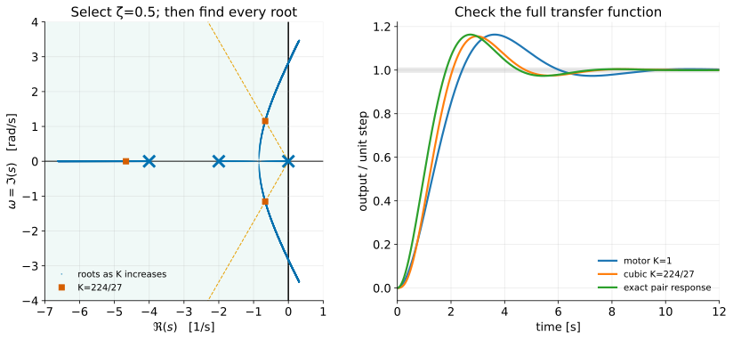

# The Root-Locus Design Method II — Reading the Locus and Selecting Gain

**Student lecture notes — FPE 8th ed., Sections 5.2.3 and 5.3**

The root locus answers a feasibility question: can a single adjustable gain give the required poles? A design must then pass a second test: do those poles, together with the zeros and other modes, give the required response?

**Prerequisites:** [I — Root-locus construction](root-locus-construction_student.md), [time-domain specifications](time-domain-specs_student.md), and [system type](system-type_student.md).

**Sources:** FPE 8th ed., §§5.2.3 and 5.3, checked against the 7th ed.; Nise 7th ed., §§8.6–8.7, for transient-response design and higher-order verification; Ogata, *Modern Control Engineering*, 5th ed., §6–3 for MATLAB root loci and §6–5 for design preliminaries and dominant-pole assumptions. The normalized motor continues FPE Example 5.1. The cubic calculations are **[course examples]**.

## Learning objectives

1. Convert damping, overshoot, and settling requirements into candidate pole regions.
2. Find a gain where the locus intersects a damping-ratio ray.
3. Check every closed-loop root, zeros, steady-state error, and actual transient response.
4. Recognize when gain adjustment cannot meet the specifications.

## Notation and assumptions

Use negative unity feedback, $L=KL_0$, with $G$ the plant and $D_c$ the controller. Write an upper LHP pole as $s=-\sigma+j\omega_d$ with $\sigma>0$. Then $\omega_n=|s|$ and $\zeta=\sigma/\omega_n$. Pole coordinates use seconds. Rise time means **10–90% of the final value**; settling time means **last entry into a ±1% band**, following the earlier course notes and FPE. Fractional overshoot $M_p$ is measured relative to the final value; percent overshoot is $100M_p$.

---

## 1. Translate the specifications into geometry {#section-1}

For the standard second-order transfer function with no finite zero,

$$
\mathcal T_2(s)=\frac{\omega_n^2}{s^2+2\zeta\omega_ns+\omega_n^2},
\qquad
s=-\zeta\omega_n\pm j\omega_n\sqrt{1-\zeta^2},
$$

$$
\omega_n=\sqrt{\sigma^2+\omega_d^2},\qquad
\zeta=\frac{\sigma}{\sqrt{\sigma^2+\omega_d^2}}.
$$

A constant damping ratio is a ray making angle $\cos^{-1}\zeta$ with the **negative real axis**. Larger $\zeta$ lies closer to that axis. Constant $\omega_n$ is a circle centered at the origin. Constant $\sigma$ is a vertical line.

For $0<\zeta<1$,

$$
M_p=e^{-\pi\zeta/\sqrt{1-\zeta^2}},\qquad
\zeta_{\min}=\frac{-\ln M_{p,\max}}{\sqrt{\pi^2+(\ln M_{p,\max})^2}}.
$$

Ten percent overshoot gives $\zeta_{\min}\approx0.591$. The common estimates

$$
t_s\approx\frac{4.6}{\zeta\omega_n}=\frac{4.6}{\sigma},
\qquad t_r\approx\frac{1.8}{\omega_n}
$$

are design starting points, not exact constraints for arbitrary systems. The 10–90% rise approximation is useful over a moderate damping range, not near every damping ratio. A settling target $t_s\le2$ s suggests poles to the left of $\Re s=-2.3$.

For the standard underdamped pair, a sufficient envelope-based settling bound is

$$
t_{s,\mathrm{env}}=
\frac{-\ln\!\left(0.01\sqrt{1-\zeta^2}\right)}{\zeta\omega_n}.
$$

The actual last band entry can be earlier. If additional poles or zeros contribute significantly, even this two-pole envelope is no longer the response envelope.

## 2. First ask whether gain alone can work {#section-2}

For the normalized motor,

$$
\mathcal T=\frac K{s^2+s+K},\qquad
\omega_n=\sqrt K,\qquad \zeta=\frac1{2\sqrt K}.
$$

For all underdamped gains, $\sigma=\zeta\omega_n=1/2$. Increasing $K$ makes the rise faster but lowers damping. It cannot move the complex pair into $\Re s<-1/2$.

A target $\zeta=0.5$ gives $K=1$ and poles $-0.5\pm0.8660j$. The exact second-order overshoot is $16.30\%$; the $4.6/\sigma$ settling estimate is 9.2 s (the actual 1% settling time is about 8.78 s). A target pole $-2+2j$ cannot be reached with proportional gain: it fails the angle condition whatever positive magnitude is assigned to $K$.

If the requirement is at most 10% overshoot, $\zeta\ge0.591$ implies $K\lesssim0.716$ in the underdamped range. The overdamped gains $0<K\le1/4$ also meet that overshoot bound, but are slower. A time-response specification should therefore be checked on the feasible part of the locus, not optimized by gain in isolation.

## 3. Intersect a damping ray with a cubic locus {#section-3}

Continue the plant

$$
G(s)=\frac1{s(s+2)(s+4)},\qquad D_c=K,
$$

and request a pole pair with $\zeta=1/2$. Write

$$
s=-\alpha+j\sqrt3\alpha,\qquad \alpha>0.
$$

Substitute into $s^3+6s^2+8s+K=0$. Separating real and imaginary parts gives

$$
\Re P=8\alpha^3-12\alpha^2-8\alpha+K,
\qquad
\Im P=\sqrt3\alpha(8-12\alpha).
$$

The imaginary part must vanish for a real gain. Excluding $\alpha=0$ gives $\alpha=2/3$. The real part then gives

$$
\boxed{K=\frac{224}{27}=8.2963},\qquad
\boxed{s_{1,2}=-\frac23\pm j\frac{2\sqrt3}{3}}.
$$

This calculation is the angle condition expressed algebraically. The magnitude condition independently gives $K=|s(s+2)(s+4)|=224/27$ at either target pole.

### All roots at the same gain

The sum of the roots is $-6$, so the remaining root is

$$
s_3=-6-\left(-\frac43\right)=-\frac{14}{3}.
$$

The exact factorization is

$$
s^3+6s^2+8s+\frac{224}{27}
=\left(s+\frac{14}{3}\right)
\left(s^2+\frac43s+\frac{16}{9}\right).
$$

All poles are in the LHP and $K<48$, consistent with the Routh interval from Lecture I. The third pole decays seven times faster than the pair, making a second-order approximation plausible for much of the response.

## 4. Check the complete step response {#section-4}

The exact transfer function factors as

$$
\mathcal T(s)=
\underbrace{\frac{16/9}{s^2+(4/3)s+16/9}}_{\text{candidate dominant pair}}
\underbrace{\frac{14/3}{s+14/3}}_{\text{additional lag}}.
$$

The second factor has unit DC gain, so the approximation retains the correct final value. It still changes the early transient.

| Quantity | Exact pair response | Complete cubic |
|---|---:|---:|
| Overshoot | $16.30\%$ | $15.54\%$ |
| 10–90% rise time | $1.228$ s | $1.296$ s |
| 1% settling time | $6.586$ s | $6.803$ s |

Both columns use the complete response of the stated model, evaluated on a dense time grid and rounded. The additional pole lengthens the rise and settling times. Separately, the familiar design estimates give $t_r\approx1.8/\omega_n=1.35$ s and $t_s\approx4.6/\sigma=6.9$ s for the pair; their approximation error should not be mistaken for the effect of the third pole.



For a simple pole $p_i$, a term $r_i e^{p_i t}$ appears in the response, with amplitude set by the **residue** $r_i$. In partial fractions of the unit-step response,

$$
\frac{\mathcal T(s)}s=\frac1s+\sum_i\frac{r_i}{s-p_i}.
$$

A slow pole with a tiny residue may scarcely affect a reference step; it may matter much more in another input-output path. A zero near a pole can make that residue small. This is why the rule “other poles five times farther left” is a useful screening rule, not a proof. Do not cancel an unstable mode to justify a design.

## 5. Check steady-state tracking too {#section-5}

This loop is Type 1 and is internally stable at the selected gain. Therefore

$$
K_v=\lim_{s\to0}sL(s)=\frac K8=\frac{28}{27}\ \mathrm{s}^{-1},
\qquad e_{ss,\mathrm{step}}=0,
\qquad e_{ss,\mathrm{unit\ ramp}}=\frac1{K_v}=\frac{27}{28}.
$$

Suppose the ramp-error target is $e_{ss}\le0.2$ for unit slope. That requires $K_v\ge5$, hence $K\ge40$. The gain selected for $\zeta=0.5$ does not meet it. In fact the pair's damping is already very small at $K=40$, and instability follows at $K=48$.

A compensator can change the locus and low-frequency gain independently enough to resolve some such conflicts. That is the purpose of the next two lectures. Physical limits, noise, unmodeled modes, and actuator saturation still constrain the design.

## 6. A reproducible design procedure {#section-6}

1. Derive the correct signed loop and characteristic equation.
2. Convert specifications to an approximate target region.
3. Intersect that region with the locus; determine a candidate gain.
4. Recompute **every** pole at that gain, and check stability.
5. Form the complete $Y/R$, retaining relevant zeros and other modes.
6. Check step response, error constants, disturbance response, and control effort as required.
7. If the specifications conflict, change controller structure rather than repeatedly adjusting the same gain.

```matlab
s = tf('s');
G = 1/(s*(s+2)*(s+4));
K = 224/27;
T = feedback(K*G,1);            % Negative unity feedback
pole(T)
zero(T)
step(T); grid on
stepinfo(T,'SettlingTimeThreshold',0.01) % Course 1% band; default rise is 10-90%
Kv = K/8;
ramp_error = 1/Kv
```

Run `l2_demo1_gain_design.py` for the numerical comparison. The [demo guide](demos/ch5/guide.md) explains the Python tools and includes a MATLAB script covering the series.

## 7. Mechanical interpretation {#section-7}

For a joint position servo, a pole pair specifies how small tracking errors oscillate and decay. Raising gain may stiffen the apparent joint response without adding enough damping. A motor lag, a flexible link, or sensor dynamics adds poles and can cause a branch to turn toward instability.

FPE §5.3 uses satellite attitude and flexible structures to emphasize this effect. For a flexible mode, inspect the departure direction as well as the low-frequency servo pair. A root locus for a rigid-body approximation cannot reveal a mode omitted from that model.

## Review questions

1. Which direction from the origin corresponds to $\zeta=0.5$ in the upper LHP?
2. At $K=224/27$, why must the cubic's real pole be $-14/3$?
3. Does matching $\zeta$ guarantee matching overshoot when the closed-loop numerator changes?
4. If a slow pole nearly cancels a zero in $Y/R$, what else should be checked?
5. For the cubic, compute the gain required for unit-ramp error $0.1$. Can proportional control stably achieve it?

## Optional practice

Apply the same sequence to a different damping ray in Nise 7th ed. §8.6. Use §8.7 to compare the resulting higher-order response with its dominant-pair estimate. State the approximation and verify it numerically.

**Previous:** [I — Construction](root-locus-construction_student.md). **Next:** [III — PD and lead compensation](root-locus-lead-pd_student.md).
