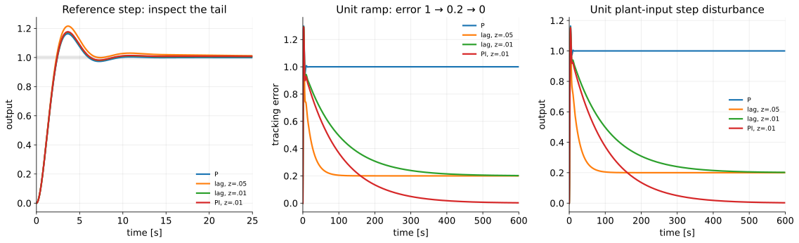
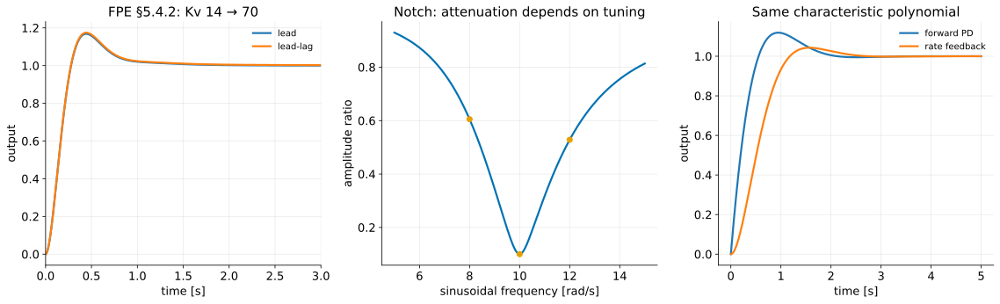

# The Root-Locus Design Method IV — Lag, PI, and Design Extensions

<!--hidden-->

**Audience:** Fourth-year mechanical engineering, ME404.

**Duration:** One 105-minute scheduled meeting: about 75 minutes of core development plus 30 minutes of guided problem work or extensions. This follows the syllabus meeting length; the topic map's hours are a planning guide. Four such meetings cover this series.

# Teaching plan

**Theme:** Accuracy improvement and the modes it introduces.

Protect the two complete designs and the separate disturbance path. Treat the other methods as extensions; they may be assigned as reading if guided design practice needs the final block.

The numbered lecture sections below match the student version, including the examples, assumptions, and numerical values. Complete instructor derivations and review answers follow the lecture. Keep this file outside the public chapter list.

| Time | Activity |
|---|---|
| 0–10 min | Unit-ramp accuracy requirement and gain-only tradeoff |
| 10–35 min | Lag candidate, full polynomial, and revision |
| 35–55 min | PI design, Routh condition, and final values |
| 55–75 min | Reference versus disturbance tails; compare lag and PI |
| 75–105 min | Optional lag–lead, notch, and rate-feedback exercises |

**Preparation:** Open the lecture's figures and runnable scripts in `demos/ch5/`. Use `--show` for an interactive figure; run without it to regenerate SVG and PNG. The demo guide includes MATLAB and Python instructions. Symbolic and independent numerical checks are in `verify_designs.py`.

---

**Instructor lecture notes — FPE 8th ed., Sections 5.4.2–5.4.3; PI supplement and feedback extension**

Lead and PD mainly address transient behavior. Lag and PI address low-frequency tracking and disturbance rejection. They add dynamics, so their benefit must be checked against changes in the transient response.

**Prerequisites:** [III — PD and lead design](root-locus-lead-pd_instructor.md), [system type and error constants](system-type_instructor.md), and [PID implementation](pid-tuning_instructor.md).

**Sources:** FPE 8th ed., §§5.4.2–5.4.3, checked against the 7th ed.; §5.6.2 for successive loop closure. Nise 7th ed., §9.2, supplies the explicit PI versus lag comparison, with §§9.4–9.5 for combined and feedback compensation. Ogata 5th ed., §§6–7 and 6–8, supplements lag and lag–lead design. Our motor lag and PI designs are **[course examples]**; §6 uses FPE's own lead–lag values. The notch and rate-feedback calculations are **[course extensions]**, not complete flexible-robot designs.

## Learning objectives

1. Design a lag pole-zero pair for a specified error-constant improvement.
2. Design a PI controller and verify its increased system type and stability.
3. Check the slow mode in both reference and disturbance responses.
4. Explain the roles of lag–lead, notch, and feedback compensation.
5. Recognize where a pole-zero cancellation or an approximate design argument needs further validation.

## Notation and assumptions

Negative unity position feedback, normalized $G=1/[s(s+1)]$, and seconds throughout. Plant-input disturbance $W$ adds to the actuator command, so $Y=G(U+W)$. With $R=0$, $E=-Y$. Use $L=D_cG$, $S=1/(1+L)$, $\mathcal T=L/(1+L)$. In $D_c=K(s+z)/(s+p)$, $z,p>0$ are positive parameters and the actual locations are $-z,-p$. Lag has $z>p$; PI has $p=0$ and $z>0$. Settling times use the course’s 1% band.

---

## 1. Specify the accuracy improvement {#section-1}

The baseline controller is $D_c=1$. Its poles are $-0.5\pm0.8660j$, with $16.30\%$ overshoot, and

$$
K_v=\lim_{s\to0}sD_cG=1\ \mathrm{s}^{-1}.
$$

For a ramp of slope $v$, $e_{ss}=v/K_v$. We seek a factor-five reduction for unit slope: from 1 to at most 0.2. We would like to keep the early transient reasonably close to the baseline. This is a tracking specification plus a transient preference; we will measure the change rather than assume it is zero.

Raising the proportional gain to 5 would meet $K_v=5$, but gives $\zeta=1/(2\sqrt5)=0.224$ and about 48.6% overshoot. Instead, raise the gain near $s=0$ while keeping the compensator close to unity near the original pair.

## 2. Full lag design {#section-2}

Choose

$$
D_c(s)=K\frac{s+z}{s+p},\qquad z>p>0.
$$

At zero frequency $D_c(0)=Kz/p$; for $|s|\gg z,p$, $D_c(s)\approx K$. Thus with $K=1$, choose $z/p=5$.

### First candidate and angle check

Take $z=0.05$, $p=0.01$. At the old pole $s_d=-0.5+0.8660j$,

$$
\arg(s_d+0.05)-\arg(s_d+0.01)\approx-2.04^\circ.
$$

This is small but not zero. The old pair is no longer exactly on the new locus. If the gain were retuned, the exact error-constant improvement would be $(K_{new}/K_{old})(z/p)$, not simply $z/p$.

For $K=1$, the characteristic equation is

$$
s(s+1)(s+0.01)+(s+0.05)=0,
$$

$$
P=s^3+1.01s^2+1.01s+0.05.
$$

Its roots are $-0.05208$ and $-0.47896\pm0.85482j$. Stability follows independently from the cubic Routh conditions: all coefficients are positive and $1.01(1.01)>0.05$.

The error constant is exactly $K_v=5$, hence the unit-ramp error is exactly 0.2. However, the reference step has about **21.56% overshoot** and **28.32 s settling time (1%)**, compared with 16.30% and about 8.8 s initially. A small angular change was not enough to preserve the transient.

### Revised lag design

Move both locations five times closer to the origin, retaining the ratio:

$$
\boxed{D_c(s)=\frac{s+0.01}{s+0.002}}.
$$

The characteristic polynomial is

$$
\boxed{P=s^3+1.002s^2+1.002s+0.01}.
$$

The poles are approximately $-0.010081$ and $-0.49596\pm0.86373j$. Routh gives $1.002^2>0.01$, so the loop is stable. $K_v$ remains exactly 5. The angle perturbation at the original pair is about $-0.40^\circ$.

The reference step now overshoots **17.38%** and enters its 1% band for the last time at about **12.0 s**. This is faster than the first lag candidate’s 28.32 s, but slower than the baseline’s roughly 8.8 s. The accuracy improvement still costs some settling time, even though the early response remains close to baseline.

This design meets the specified ramp accuracy and keeps the early transient close to baseline. If there were a strict 16.3% overshoot limit, further redesign would be needed.

## 3. Why the small pole still matters {#section-3}

For a lag controller on this motor,

$$
P=s(s+1)(s+p)+K(s+z),\qquad
\frac YR=\frac{K(s+z)}P,\qquad
\frac YW=\frac{s+p}P.
$$

The slow closed-loop pole lies near $-z$, so its reference-step residue is small because $Y/R$ has a nearby zero. The disturbance path has a different zero, at $-p$. It need not suppress that mode by the same amount.

For the first candidate, the slow-pole term in the unit reference step is approximately

$$
0.04369e^{-0.05208t}.
$$

That term alone remains larger than 1% for roughly 28.3 s. The full settling time depends on its sum with the oscillatory terms. In the revised design the slow pole has an approximately 99 s time constant, even though the reference step enters its 1% band much earlier.

For a unit step disturbance at the plant input,

$$
y_{ss}=\lim_{s\to0}\frac{G}{1+D_cG}=\frac1{D_c(0)}=0.2,
\qquad e_{ss}=-0.2.
$$

The ramp-tracking error and disturbance response approach their final values slowly. Simulate long enough to see that approach; a short reference-step plot is insufficient.



## 4. Full PI design {#section-4}

To eliminate the unit-ramp error, increase the loop type from 1 to 2. Nise §9.2 makes this distinction explicit: lag improves an error constant; PI adds an integrator. Nise calls PI an “ideal integral compensator.”

Use

$$
D_c(s)=K\frac{s+z}{s}=K+\frac{Kz}s,
\qquad k_P=K,\quad k_I=Kz.
$$

Choose $K=1$, $z=0.01$ to keep the added zero near the added pole at the origin:

$$
\boxed{D_c(s)=1+\frac{0.01}s},\qquad
\boxed{P=s^3+s^2+s+0.01}.
$$

### Stability before final values

For general $K,z>0$,

$$
P=s^3+s^2+Ks+Kz,
\qquad
\begin{array}{c|cc}
s^3&1&K\\
s^2&1&Kz\\
s^1&K(1-z)&0\\
s^0&Kz&0
\end{array}.
$$

With the motor pole normalized to $-1\ \mathrm{s}^{-1}$, stability requires $K>0$ and $0<z<1\ \mathrm{s}^{-1}$. For a motor denominator $s(s+a)$, the corresponding condition is $0<z<a$, not a universal numerical bound of one.

Our selected poles are approximately $-0.010101$ and $-0.49495\pm0.86315j$, all stable. The angle perturbation at the old pair is about $-0.50^\circ$.

### Tracking and disturbance checks

There are two uncancelled loop poles at the origin:

$$
L(s)=\frac{K(s+z)}{s^2(s+1)},\qquad K_a=\lim_{s\to0}s^2L=Kz=0.01\ \mathrm{s}^{-2}.
$$

Thus steady-state errors to step and ramp references are zero. A unit parabolic reference $r=t^2/2$ gives $e_{ss}=1/K_a=100$; zero ramp error is not perfect tracking of every trajectory.

For the plant-input step disturbance,

$$
\frac YW=\frac{s}{s^3+s^2+s+0.01},\qquad y_{ss}=0.
$$

The disturbance is eventually rejected, but the slow mode still takes about 100 s per time constant. The unit reference step overshoots **17.66%** and has about **12.76 s** 1% settling time. As with lag, the reference transient can look fast while disturbance rejection is slow.

The result assumes no saturation. The integral state can wind up under actuator limits; use the antiwindup techniques developed in [PID implementation](pid-tuning_instructor.md).


The closeups show only the branches near the origin. At $K=1$, the complex pair lies outside each window; the marked square is the slow real root.

## 5. Lag versus PI {#section-5}

| Feature | Lag $K(s+z)/(s+p)$ | PI $K(s+z)/s$ |
|---|---|---|
| Pole-zero relation | $z>p>0$ | $z>0$, pole at origin |
| Loop type | unchanged, absent cancellation | increases by one, absent cancellation |
| DC controller gain | finite, $Kz/p$ | unbounded |
| Unit-ramp error on this motor | $p/(Kz)$ | zero when stable |
| Step plant-input disturbance | finite offset $p/(Kz)$ | zero eventual offset when stable |
| Main check | slow tails and phase perturbation | stability, slow rejection, saturation |

Taking $p\to0$ at fixed $z,K$ connects lag to PI, but the long-time behavior changes: the finite DC gain becomes an integrator. Setting **both** $p=z=0$ cancels the intended factor and leaves proportional control; that does not increase the type.

## 6. Extension: lag–lead, using Franklin's design {#section-6}

FPE §5.4.2 starts from the revised lead of Example 5.11:

$$
D_{lead}=91\frac{s+2}{s+13},\qquad K_v=\frac{91\cdot2}{13}=14.
$$

To obtain $K_v=70$, the book adds $(s+0.05)/(s+0.01)$:

$$
D_c=91\frac{(s+2)(s+0.05)}{(s+13)(s+0.01)}.
$$

The full characteristic polynomial is

$$
P=s^4+14.01s^3+104.14s^2+186.68s+9.1.
$$

Its roots are approximately $-0.050140$, $-2.3967$, and $-5.7816\pm6.5038j$. All are in the LHP. The computed reference step has about 17.47% overshoot and 0.190 s rise time, preserving the original 20% and 0.3 s requirements. Unit-ramp error is $1/70$.

The two sections are designed for different purposes, but they interact. Verify the combined system after adding the second section. “Lead first, lag second” is a practical sequence, not a theorem that the first design remains unchanged.

## 7. Extension: a notch for a flexible mode {#section-7}

FPE §5.4.3 treats an additional lightly damped mechanical mode: its Eq. (5.74) plant has a troublesome resonance near 50 rad/s. Our 10 rad/s filter below is a simpler illustration, not the book’s numerical design. A controller designed for a rigid model may excite that mode. One option is a notch filter with a conjugate pair of zeros near the troublesome frequency and a more heavily damped pole pair:

$$
D_N(s)=\frac{s^2+2\zeta_z\omega_f s+\omega_f^2}
{s^2+2\zeta_p\omega_f s+\omega_f^2},\qquad
0<\zeta_z<\zeta_p.
$$

For a stable filter, substituting $s=j\omega$ gives the gain applied to a sinusoid at frequency $\omega$; this is the frequency-response idea already introduced with harmonic forcing. At $\omega=\omega_f$,

$$
|D_N(j\omega_f)|=\frac{\zeta_z}{\zeta_p},\qquad
D_N(0)=1,\qquad D_N(\infty)=1.
$$

For $\omega_f=10\ \mathrm{rad/s}$, $\zeta_z=0.03$, $\zeta_p=0.30$,

$$
D_N(s)=\frac{s^2+0.6s+100}{s^2+6s+100}.
$$

It transmits 10% of a 10 rad/s sinusoid's amplitude. At 8 and 12 rad/s its amplitude ratios are approximately 0.605 and 0.528. A shifted resonance can therefore greatly reduce its effectiveness.

This calculation explains a notch; it does not establish closed-loop stability for an unspecified flexible plant. Include the flexible dynamics, inspect the complete root locus and departure directions, and check plausible frequency variation. Do not rely on exact cancellation of an uncertain lightly damped plant pole; never use cancellation of an unstable pole as a stability argument.

## 8. Extension: feedback compensation and successive loop closure {#section-8}

A velocity sensor can provide damping inside a position loop. Let

$$
u=K(r-y)-k_v\dot y,\qquad G=\frac1{s(s+1)}.
$$

Substituting into $Y=GU$ gives

$$
[s(s+1)+k_vs+K]Y=KR,
\qquad
\boxed{\frac YR=\frac K{s^2+(1+k_v)s+K}}.
$$

Choose $K=8$, $k_v=3$. The poles are again $-2\pm2j$, but $Y/R=8/(s^2+4s+8)$ has no PD reference zero. The step overshoot is the standard pair's 4.32%.

Equivalently, first close the velocity loop:

$$
G_{inner}=\frac{G}{1+k_vsG}
=\frac1{s(s+1+k_v)},
$$

then use $K$ in the outer position loop. This is **successive loop closure** (FPE §5.6.2). Include the actual sensor and filter dynamics before treating this ideal derivative feedback as a realizable design.



## 9. MATLAB and demonstrations {#section-9}

```matlab
s = tf('s');
G = 1/(s*(s+1));
Dlag = (s+0.01)/(s+0.002);
Dpi = (s+0.01)/s;
Tlag = feedback(Dlag*G,1);
Tpi = feedback(Dpi*G,1);
pole(Tlag), pole(Tpi)
step(Tlag,Tpi); grid on
% A long horizon exposes the slow disturbance response:
t = (0:0.02:1000)';
figure; step(feedback(G,Dlag),feedback(G,Dpi),t); grid on
% feedback(G,D) is G/(1+G*D), the plant-input disturbance path.
```

Run `l4_demo1_lag_pi.py` for the full designs and `l4_demo2_extensions.py` for the optional extensions. See the [demo guide](demos/ch5/guide.md).

## Review questions

1. Why does the ratio $z/p$ improve $K_v$ without increasing system type?
2. Why must the gain correction be included if a lag design retunes $K$?
3. Can a 99 s time constant coexist with a 12.0 s reference-step settling time at 1%?
4. For $G=1/[s(s+a)]$, derive the PI stability condition and interpret it physically.
5. Does zero steady-state ramp error imply small error throughout a finite move?
6. Why does velocity feedback have a different reference numerator from forward-path PD?
7. Why is a notch filter's attenuation at the nominal mode frequency insufficient to establish robustness?

## Optional practice

For the lag design, sweep $z$ while holding $z/p=5$, and compare reference-step overshoot, last 1% band entry, and time to approach the final ramp error. For PI, sweep $z$ toward the Routh boundary. Use Nise 7th ed. §9.2 and Ogata 5th ed. §6–7 for additional examples; Ogata §6–8 covers lag–lead.

**Previous:** [III — PD and lead](root-locus-lead-pd_instructor.md). **Next course topic:** frequency response, Bode plots, and design margins in Part V.

# Instructor derivations and teaching material

## Board derivation A — General lag characteristic equation and Routh test

For the motor $G=1/[s(s+a)]$ with $a>0$ and lag $D_c=K(s+z)/(s+p)$,

$$
1+\frac{K(s+z)}{s(s+a)(s+p)}=0,
$$

$$
P=s^3+(a+p)s^2+(ap+K)s+Kz.
$$

The Routh array is

$$
\begin{array}{c|cc}
s^3&1&ap+K\\
s^2&a+p&Kz\\
s^1&\dfrac{(a+p)(ap+K)-Kz}{a+p}&0\\
s^0&Kz&0
\end{array}.
$$

With positive $a,p,z,K$, stability requires

$$
(a+p)(ap+K)>Kz.
$$

For $a=1,K=1,z=5p$, this becomes $(1+p)^2>5p$, or $p^2-3p+1>0$. Both selected small $p$ values satisfy it. Do not conclude that every positive lag pole-zero choice is stable.

The revised design's cubic is $s^3+1.002s^2+1.002s+0.01$. At the former motor pole, evaluate the lag angle using $\operatorname{atan2}$:

$$
\phi_{lag}=\operatorname{atan2}(0.866025,-0.49)
-\operatorname{atan2}(0.866025,-0.498)\approx-0.398^\circ.
$$

The first candidate uses $-0.45$ and $-0.49$, giving about $-2.045^\circ$. These are not zero, so the original pole cannot remain exactly fixed with a purely positive scalar gain.

## Board derivation B — Error constants and the distinct disturbance path

For the general lag motor,

$$
S=\frac{s(s+a)(s+p)}P,\qquad
\mathcal T=\frac{K(s+z)}P,\qquad GS=\frac{s+p}P.
$$

For a unit ramp, $R=1/s^2$, so

$$
e_{ss}=\lim_{s\to0}sS\frac1{s^2}
=\lim_{s\to0}\frac{(s+a)(s+p)}P=\frac{ap}{Kz}.
$$

For a unit plant-input disturbance step,

$$
y_{ss}=\lim_{s\to0}s(GS)\frac1s=\frac p{Kz}.
$$

These happen to be numerically equal when $a=1$ in our normalized model, but they describe responses to different physical inputs. A unit reference ramp specifies a slope; a unit disturbance step specifies an actuator-input amplitude. Restore their physical scales before comparing dimensional errors. With $R=0$, $e_{ss}=-y_{ss}$.

For a simple closed-loop pole $q$, the reference-step and disturbance-step residues are respectively

$$
r_R=\frac{K(q+z)}{qP'(q)},\qquad
r_W=\frac{q+p}{qP'(q)},
\qquad P'=3s^2+2(a+p)s+(ap+K).
$$

These formulas follow from multiplying the partial fraction by $s-q$ and taking $s\to q$; no complex contour theorem is used. At a small slow root, approximate $P(q)\approx(ap+K)q+Kz$, giving

$$
q\approx-\frac{Kz}{ap+K}.
$$

For the revised design this is $-0.00998$, close to the full root about $-0.01008$. It lies near the reference zero $-z$, so $r_R$ is small. The disturbance zero at $-p$ does not make the same cancellation. Print the exact residues with `verify_designs.py` and use the long-horizon demo.

**Teaching caution:** The slowest pole's time constant is not the same thing as a given output's last 1% band-entry time. The reference zero changes the amplitude of that mode, and the tolerance band measures absolute error relative to the final value. For example, the revised lag’s slow reference-step residue is only 0.008145, less than 1%, despite its 99 s time constant. As a band-sensitivity illustration only, using 2% instead gives about 5.84 s for the revised lag versus 8.08 s for the baseline: the positive tail shifts which oscillatory excursion last touches that wider band. The course’s 1% convention instead gives 12.0 s versus about 8.8 s, so use the same band whenever comparing designs.

## Board derivation C — PI stability, type, and disturbance rejection

Set $p=0$, keeping $z>0$. Then

$$
P=s^3+as^2+Ks+Kz.
$$

The Routh first column is

$$
1,\quad a,\quad \frac{K(a-z)}a,\quad Kz.
$$

Thus $K>0$ and $0<z<a$ give stability. At $z=a$,

$$
P=(s+a)(s^2+K),
$$

so the pair is imaginary. Although the PI zero cancels the motor's stable pole in the loop transfer function at this boundary, the remaining double-integrator loop still has no damping. A cancellation does not rescue stability.

For the stable case,

$$
S=\frac{s^2(s+a)}P,\qquad GS=\frac sP.
$$

Using $R=1/s$, $1/s^2$, and $1/s^3$ for the unit step, ramp, and $t^2/2$ parabola,

$$
e_{ss,step}=\lim_{s\to0}\frac{s^2(s+a)}P=0,
$$

$$
e_{ss,ramp}=\lim_{s\to0}\frac{s(s+a)}P=0,
$$

$$
e_{ss,parabola}=\lim_{s\to0}\frac{s+a}P=\frac a{Kz}=\frac1{K_a}.
$$

Likewise $y_{ss,Wstep}=\lim_{s\to0}s/P=0$. All final-value applications rely on the previously established stability. For $a=K=1,z=0.01$, $K_a=0.01$, so the parabolic error is 100. The price of the very small integral gain is slow correction, even though eventual step and ramp errors vanish.

## Worked extension A — Franklin lead–lag expansion and stability

The combined loop numerator is

$$
91(s+2)(s+0.05)=91s^2+186.55s+9.1.
$$

The uncompensated denominator including controller poles is

$$
s(s+1)(s+13)(s+0.01)
=s^4+14.01s^3+13.14s^2+0.13s.
$$

Their sum gives the quartic in §6. For $s^4+As^3+Bs^2+Cs+D$, the Routh first column is

$$
1,\ A,\ b_1=\frac{AB-C}{A},\ c_1=\frac{b_1C-AD}{b_1},\ D.
$$

Here $A=14.01$, $B=104.14$, $C=186.68$, $D=9.1$, so $b_1\approx90.815$ and $c_1\approx185.276$, both positive. This independently confirms the numerical roots. The low-frequency constant is

$$
K_v=\frac{91\cdot2\cdot0.05}{13\cdot0.01}=70.
$$

FPE's warning about a slow disturbance transient remains relevant even when the reference-step overshoot and rise requirements still pass. No exact pole-zero cancellation is performed in the demos.

## Worked extension B — The notch at and away from resonance

Substitute $s=j\omega$ into the filter:

$$
D_N(j\omega)=
\frac{(\omega_f^2-\omega^2)+j2\zeta_z\omega_f\omega}
{(\omega_f^2-\omega^2)+j2\zeta_p\omega_f\omega}.
$$

Taking magnitudes by $|x+jy|=\sqrt{x^2+y^2}$ yields

$$
|D_N(j\omega)|^2=
\frac{(\omega_f^2-\omega^2)^2+(2\zeta_z\omega_f\omega)^2}
{(\omega_f^2-\omega^2)^2+(2\zeta_p\omega_f\omega)^2}.
$$

At $\omega=\omega_f$ the real terms vanish, leaving $\zeta_z/\zeta_p=0.1$. At 8 rad/s, the ratio is $\sqrt{(36^2+4.8^2)/(36^2+48^2)}=0.6053$; at 12 it is $\sqrt{((-44)^2+7.2^2)/((-44)^2+72^2)}=0.5284$. The filter poles are $-3\pm j\sqrt{91}$ and zeros $-0.3\pm j\sqrt{99.91}$, all in the LHP.

**Scope:** This is a filter calculation illustrating FPE §5.4.3's sensitivity to mode frequency. It is not FPE's noncollocated flexible-plant example. A notch changes phase as well as magnitude; a root-locus check with the actual plant remains necessary.

## Worked extension C — Rate feedback and the reference numerator

With $U=K(R-Y)-k_vsY$,

$$
Y=GKR-G(K+k_vs)Y,
$$

$$
\frac YR=\frac{KG}{1+G(K+k_vs)}
=\frac K{s^2+(1+k_v)s+K}.
$$

With a forward PD $U=(K+k_vs)(R-Y)$ the denominator is identical but the numerator becomes $K+k_vs$. For $K=8,k_v=3$, rate feedback therefore gives

$$
y(t)=1-e^{-2t}(\cos2t+\sin2t),
$$

whose first peak is at $\pi/2$ s and overshoot $e^{-\pi}=4.321\%$. It demands a finite $u(0^+)=8$ for the ideal position plant and measurement-derivative arrangement. Measurement noise still passes through the derivative; filter it in a realizable implementation.

## Review-question answers

1. A finite lag pole is not at the origin, so the number of loop integrators is unchanged. Its finite DC gain multiplies the error constant.
2. The error constant is proportional to both $K$ and $z/p$. Changing either changes the improvement.
3. Yes. The slow reference-step residue can already be below 1% while the associated mode persists in other responses. For the revised lag the slow residue is 0.008145, so a 99 s time constant is compatible with the 12.0 s reference-step settling time.
4. Routh gives $K>0$, $0<z<a$. Excessively strong integral action relative to proportional action ($z=k_I/k_P$) costs stability.
5. No. The zero final value says nothing by itself about peak tracking error, move duration, or actuator saturation.
6. Derivative on output does not differentiate the reference; it changes the denominator while leaving numerator $K$.
7. A shifted mode sees different magnitude and phase. Stability also depends on the full plant and loop, not the filter alone.

## Instructor cautions, sources, and demonstrations

FPE 7th ed. §5.4.2 (printed pp. 270–272) and 8th ed. §5.4.2 support the same lead–lag example and the slow-disturbance warning. Nise §9.2 supplies the explicit type-increasing PI construction. Ogata §§6–7 and 6–8 provide the lag and lag–lead design sequence. Nise §9.5 and FPE §5.6.2 motivate the feedback extension.

Use `l4_demo1_lag_pi.py` live. Ask students to compare its 25 s reference window with its 600 s error and disturbance windows. The simulation runs to 1000 s. Use `l4_demo2_extensions.py` for supplementary reading or the final practice block; the core lecture should protect the two full lag/PI designs.
