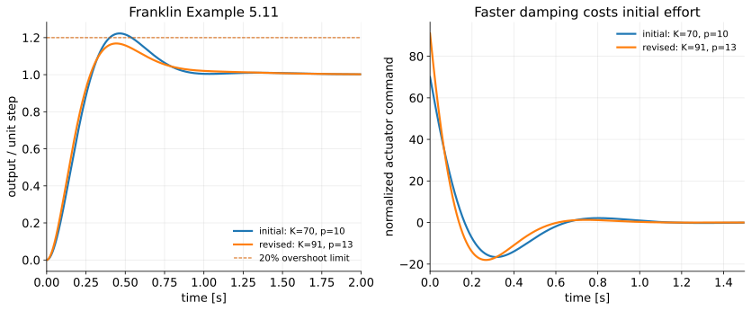

# The Root-Locus Design Method III — PD and Lead Compensation

<!--hidden-->

**Audience:** Fourth-year mechanical engineering, ME404.

**Duration:** One 105-minute scheduled meeting: about 75 minutes of core development plus 30 minutes of guided problem work or extensions. This follows the syllabus meeting length; the topic map's hours are a planning guide. Four such meetings cover this series.

# Teaching plan

**Theme:** Reshaping the locus with a zero and a pole.

Protect the PD versus lead comparison. Do not describe the selected pair as guaranteeing the overshoot. Keep the actuator-demand discussion concrete: an ideal PD impulse versus the lead finite initial command.

The numbered lecture sections below match the student version, including the examples, assumptions, and numerical values. Complete instructor derivations and review answers follow the lecture. Keep this file outside the public chapter list.

| Time | Activity |
|---|---|
| 0–10 min | Target pair and the gain-only impossibility |
| 10–30 min | Angle deficiency, PD zero, and magnitude gain |
| 30–50 min | Lead pole and gain; factor the cubic |
| 50–65 min | Same pair, different response; filter and effort |
| 65–75 min | Franklin Example 5.11 design iteration |
| 75–105 min | Alternative-zero design and numerical verification |

**Preparation:** Open the lecture's figures and runnable scripts in `demos/ch5/`. Use `--show` for an interactive figure; run without it to regenerate SVG and PNG. The demo guide includes MATLAB and Python instructions. Symbolic and independent numerical checks are in `verify_designs.py`.

---

**Instructor lecture notes — FPE 8th ed., Section 5.4.1**

When gain alone cannot reach the desired pole region, add controller dynamics. A PD zero changes the root-locus geometry; a lead compensator keeps that useful effect while limiting the controller's high-frequency gain.

**Prerequisites:** [II — Gain selection](root-locus-gain-design_instructor.md), [PID control](pid-control_instructor.md), and [derivative implementation](pid-tuning_instructor.md).

**Sources:** FPE 8th ed., §5.4.1 and Example 5.11, checked against the 7th ed. Nise 7th ed., §9.3, supplies the explicit PD-to-lead design progression; Ogata 5th ed., §6–6, supplies the angle-deficiency construction and the requirement to verify the full response. The exact $-2\pm2j$ design is a **[course example]** on FPE's normalized motor plant. FPE Example 5.11 retains its own parameters and specifications in §6.

## Learning objectives

1. Determine the angle a controller must contribute at a target pole.
2. Design a PD zero and gain, then a finite-pole lead compensator.
3. Verify the complete characteristic polynomial and response.
4. Distinguish controller gain, DC gain, derivative gain, and high-frequency gain.
5. Explain the tradeoff between pole placement, tracking, noise, and control effort.

## Notation and assumptions

Negative unity feedback; $L=D_cG=KL_0$. In $D_c=K(s+z)/(s+p)$, the **locations** are $-z$ and $-p$, with $z,p>0$. Lead has $p>z$. These positive parameters differ from the signed locations $z_i,p_i$ in Lecture I. All models are continuous-time and linear, with no actuator saturation in the plotted responses. Time is in seconds and signals are normalized. Settling times use the course’s 1% band.

---

## 1. Start with a pole-placement request {#section-1}

For $G=1/[s(s+1)]$, request $s_d=-2+2j$ and its conjugate. Thus

$$
\omega_n=\sqrt8,\qquad \zeta=\frac1{\sqrt2},\qquad
(s-s_d)(s-\overline{s_d})=s^2+4s+8.
$$

The motor's proportional-gain locus has its complex branches at $\Re s=-1/2$ and cannot reach this point. At $s_d$, the pole-vector angles are

$$
\arg(s_d)=135^\circ,\qquad
\arg(s_d+1)=116.565^\circ.
$$

The plant phase is $-251.565^\circ$. To obtain $-180^\circ$, the controller must contribute

$$
\boxed{\phi_c=71.565^\circ}.
$$

This is the **angle deficiency**: the angle needed to put this particular point on the compensated locus. It is not a phase margin, which will be defined using sinusoidal frequency response in Part V.

The standard no-zero second-order formula predicts $4.32\%$ overshoot for this pair. Treat that as a prediction to test, not as the guaranteed overshoot of the compensated system.

## 2. Full PD design {#section-2}

Let $D_c=K(s+z)=k_Ds+k_P$. A single zero must supply $71.565^\circ$, so

$$
\arg(s_d+z)=71.565^\circ,\qquad
\frac2{z-2}=\tan71.565^\circ=3.
$$

Consequently $z=8/3$. The magnitude condition gives

$$
K=\frac{|s_d(s_d+1)|}{|s_d+8/3|}
=\frac{\sqrt{40}}{\sqrt{40/9}}=3.
$$

Hence

$$
\boxed{D_c(s)=3s+8},\qquad k_D=3,\quad k_P=8.
$$

Check by expanding the characteristic equation:

$$
s(s+1)+3s+8=s^2+4s+8.
$$

Coefficient matching gives the same result: $1+k_D=4$ and $k_P=8$. Root-locus geometry explains where the zero belongs; coefficient matching provides an independent check for this low-order model.

### What response did we actually design?

$$
\mathcal T_{PD}(s)=\frac{3s+8}{s^2+4s+8}.
$$

The numerator is not 8. For a unit step,

$$
Y(s)=\frac1s+\frac{-s-1}{s^2+4s+8},
$$

so

$$
\boxed{y(t)=1-e^{-2t}\cos2t+\frac12e^{-2t}\sin2t},\qquad t\ge0.
$$

Differentiating gives $\dot y=e^{-2t}(3\cos2t+\sin2t)$. The first maximum occurs at $2t_p=\pi-\tan^{-1}3$, giving approximately **11.91% overshoot**, not 4.32%. The controller zero changes the modal amplitudes even though the poles are exactly right.

### Why an ideal PD is incomplete as hardware

Its magnitude grows without bound as frequency increases. Differentiating a noisy measurement can demand large actuator commands. Differentiating a step reference also demands an impulse: for this example the impulse area in $u$ is $k_D=3$ times the step amplitude. Derivative on the measured output avoids that reference impulse but still needs filtering for noise. Recall the implementation discussion in Chapter 4.

## 3. Full lead design by the angle condition {#section-3}

Choose a finite-pole controller

$$
D_c(s)=K\frac{s+z}{s+p},\qquad p>z>0.
$$

There are many solutions: after choosing a zero, solve for a pole and then the gain. Choose $z=2$ for straightforward geometry. At $s_d=-2+2j$, the zero vector is $2j$, of angle $90^\circ$. The controller pole must remove the excess angle:

$$
\arg(s_d+p)=90^\circ-71.565^\circ=18.435^\circ.
$$

Thus

$$
\frac2{p-2}=\tan18.435^\circ=\frac13
\quad\Longrightarrow\quad p=8.
$$

The magnitude condition now gives

$$
K=\frac{|s_d(s_d+1)(s_d+8)|}{|s_d+2|}
=\frac{\sqrt{40}\sqrt{40}}2=20.
$$

Therefore

$$
\boxed{D_c(s)=20\frac{s+2}{s+8}}.
$$

Check the gain including every factor. Numerically $G(s_d)(s_d+2)/(s_d+8)=-1/20$; the selected gain makes the loop exactly $-1$.

## 4. Verify the remaining pole and the complete response {#section-4}

Clearing denominators gives

$$
P(s)=s(s+1)(s+8)+20(s+2)
=s^3+9s^2+28s+40
=(s+5)(s^2+4s+8).
$$

The additional pole is $-5$. It is only 2.5 times farther left than the target pair, and the zero at $-2$ is nearby; a pure second-order approximation is not justified without checking. The full response is

$$
\mathcal T_{lead}(s)=\frac{20(s+2)}{(s+5)(s^2+4s+8)},
$$

$$
y(t)=1+\frac{12}{13}e^{-5t}
-\frac{25}{13}e^{-2t}\cos2t
+\frac5{13}e^{-2t}\sin2t.
$$

Numerical evaluation gives:

| Controller / reference path | Overshoot | 10–90% rise | 1% settling |
|---|---:|---:|---:|
| Proportional $D_c=8$ | $56.88\%$ | $0.417$ s | $9.181$ s |
| Forward-path PD $3s+8$ | $11.91\%$ | $0.410$ s | $1.913$ s |
| Lead $20(s+2)/(s+8)$ | $16.45\%$ | $0.449$ s | $2.089$ s |
| Rate feedback with $k_P=8,k_D=3$ | $4.32\%$ | $0.760$ s | $2.329$ s |

Rate feedback means derivative on the measured output rather than on the error; it is developed in Lecture IV’s extension. Its numerator is 8. Equal pole pairs do not mean equal step responses.

For the lead, $K_v=\lim_{s\to0}sD_cG=D_c(0)=5$, so the unit-ramp error is $0.2$. For the PD, $K_v=8$ and the ramp error is $0.125$. Both track a constant reference with zero steady-state error when stable.


## 5. What does the lead pole buy? {#section-5}

For our lead design,

$$
D_c(0)=K\frac zp=5,\qquad
\lim_{|s|\to\infty}D_c(s)=K=20.
$$

The high-frequency gain is finite, but it is not zero. To see the filtered derivative explicitly, rewrite a general lead as

$$
D_c(s)=K\frac zp+K\left(1-\frac zp\right)\frac{s}{s+p}
=k_P+\frac{k_Ds}{1+s/p},
$$

$$
k_P=\frac{Kz}{p},\qquad k_D=\frac{K(p-z)}{p^2}.
$$

Here $k_P=5$, $k_D=1.875$, and the derivative filter time constant is $1/8$ s. These are not the ideal PD's gains; the lead was redesigned to recover the target roots after adding a pole.

With sensor noise $N$, $U/N=-D_c/(1+D_cG)$. Because this plant tends to zero at high frequency, the noise-to-command gain approaches $-20$. A unit reference step demands $u(0^+)=20$. Include sensor noise and actuator limits in any physical implementation.

Moving a lead pole farther left while holding $K$ fixed does **not** preserve its low-frequency gain. To approach a fixed ideal PD $k_D(s+z)$, use $D_c=k_Dp(s+z)/(s+p)$ and let $p$ grow. Its high-frequency gain then grows as $k_Dp$.

## 6. Franklin Example 5.11: iterate against actual specifications {#section-6}

FPE requests at most **20% overshoot** and at most **0.3 s rise time** for the same $G=1/[s(s+1)]$. These are different requirements from our exact pole-placement exercise.

The book first estimates a useful target region, then tries

$$
D_{c,1}=70\frac{s+2}{s+10}.
$$

Its characteristic polynomial and poles are

$$
P_1=s^3+11s^2+80s+140,
\qquad s=-2.3449,\ -4.3276\pm6.4013j.
$$

The complex pair has $\zeta\approx0.560$, but the full response overshoots **22.27%**. The initial design fails the overshoot requirement.

FPE moves the compensator pole and changes the gain:

$$
\boxed{D_{c,2}=91\frac{s+2}{s+13}},\qquad
P_2=s^3+14s^2+104s+182.
$$

Now the poles are $-2.3855$ and $-5.8072\pm6.5245j$. The full response gives **16.86% overshoot** and **0.1895 s 10–90% rise time**, meeting both requirements. Its 1% settling time is about 1.395 s. The first design’s rise time was 0.1953 s and 1% settling time 1.433 s. Here overshoot, rise time, and 1% settling time all improve; the initial command demand increases from 70 to 91, as the figure below shows.

The real pole lies closer to the imaginary axis than the pair in both designs. Its nearby zero reduces its reference-step contribution without removing it. The simulation, not a declaration that the pair is “dominant,” closes the design argument.



## 7. MATLAB and lecture demonstrations {#section-7}

```matlab
s = tf('s');
G = 1/(s*(s+1));
D = 20*(s+2)/(s+8);
rlocus((s+2)/(s*(s+1)*(s+8))); grid on  % Varied gain is K
T = feedback(D*G,1);
pole(T)
stepinfo(T,'SettlingTimeThreshold',0.01)
step(T); grid on
UoverR = feedback(D,G);                % D/(1+D*G)
figure; step(UoverR); grid on
```

Run `l3_demo1_pd_lead.py` for the exact geometry design and `l3_demo2_franklin.py` for Example 5.11. See the [demo guide](demos/ch5/guide.md). The Python scripts print the actual poles and response metrics, then save the figures.

## Review questions

1. Why is the required angle $71.565^\circ$, rather than the magnitude of the plant's principal phase angle?
2. In $D_c=K(s+z)$, which parameter is the proportional gain?
3. Why did adding the lead pole require redesigning the gain?
4. The lead and PD share $-2\pm2j$. Why do they overshoot differently?
5. What changes in the reference transfer function when the derivative acts on the measurement?
6. Does finite high-frequency gain make a lead compensator immune to noise?

## Optional practice

Keep the target $-2+2j$, choose another zero location, and use Ogata 5th ed. §6–6's angle-deficiency procedure to find a valid lead pole. Find the gain and remaining pole, then compare the complete response and initial control demand. Not every arbitrary zero choice produces a finite real pole with $p>z>0$. For this target, $z>8/3$ gives less than the required $71.565^\circ$ from the zero alone, so adding a real pole cannot supply the missing positive angle. For example, $z=3$ supplies only $63.435^\circ$. At $z=8/3$, the required pole angle is zero: the finite-pole construction reaches its ideal-PD limit.

**Previous:** [II — Gain selection](root-locus-gain-design_instructor.md). **Next:** [IV — Lag, PI, and extensions](root-locus-lag-pi_instructor.md).

# Instructor derivations and teaching material

## Board derivation A — General single-stage lead construction

For a target $s_d=-\sigma+j\omega_d$ in the upper LHP, compute the unwrapped plant angle using pole and zero vectors. Let $\phi$ be the positive controller angle needed to reach an odd multiple of $180^\circ$. For a chosen zero parameter $z>0$,

$$
\theta_z=\operatorname{atan2}(\omega_d,z-\sigma),\qquad
\theta_p=\theta_z-\phi.
$$

A real pole with positive parameter $p$ must satisfy

$$
p=\sigma+\omega_d\cot\theta_p.
$$

Check $0<\theta_p<180^\circ$, $p>z>0$, and the original angle condition. If the computed $p$ is inadmissible, change the zero or controller structure; do not retain a numerically real but physically unintended pole. Then use

$$
K=\frac1{\left|G(s_d)(s_d+z)/(s_d+p)\right|}.
$$

A single lead stage need not supply every requested angle at every zero choice. The geometry provides a feasibility test as well as a construction.

For our example, $s_d(s_d+1)=-2-6j$, whose argument is $-108.435^\circ$ or $251.565^\circ$. Therefore $\arg G=-251.565^\circ$ modulo $360^\circ$. Keep the unwrapped pole-vector sum visible to avoid mistaking the principal $108.435^\circ$ angle for the angle deficiency. The needed positive angle is $71.565^\circ$.

## Board derivation B — PD response and its overshoot

For $D_c=3s+8$,

$$
\frac{3s+8}{s(s^2+4s+8)}
=\frac1s+\frac{-s-1}{s^2+4s+8}
=\frac1s-\frac{s+2}{(s+2)^2+4}+\frac1{(s+2)^2+4}.
$$

Using the elementary Laplace pairs gives the step response in §2. Differentiate explicitly:

$$
\frac{d}{dt}[-e^{-2t}\cos2t]=e^{-2t}(2\cos2t+2\sin2t),
$$

$$
\frac{d}{dt}[\tfrac12e^{-2t}\sin2t]=e^{-2t}(\cos2t-\sin2t).
$$

Adding gives $\dot y=e^{-2t}(3\cos2t+\sin2t)$. Its first positive zero is

$$
t_p=\frac{\pi-\tan^{-1}3}{2}=0.9463\ \mathrm{s}.
$$

At that point $\cos2t_p=-1/\sqrt{10}$ and $\sin2t_p=3/\sqrt{10}$, so

$$
M_p=e^{-2t_p}\frac{1+3/2}{\sqrt{10}}
=\frac{\sqrt{10}}4e^{-(\pi-\tan^{-1}3)}\approx0.11913.
$$

This is an analytic overshoot check independent of the numerical plot. The ideal PD command follows $u=8e+3\dot e$. A reference step gives a jump in $e$ before the strictly proper plant output can jump, so $3\dot e$ contains $3\delta(t)$. Its area is 3; plotting a finite peak would misrepresent the ideal model.

## Board derivation C — Lead response by coefficient matching

For the selected $D_c=20(s+2)/(s+8)$,

$$
Y(s)=\frac{20(s+2)}{s(s+5)(s^2+4s+8)}
=\frac1s+\frac A{s+5}+\frac{Bs+C}{s^2+4s+8}.
$$

The coefficient at $s=-5$ is

$$
A=\frac{20(-3)}{(-5)(25-20+8)}=\frac{12}{13}.
$$

The $1/s$ coefficient at large $s$ gives $1+A+B=0$, so $B=-25/13$. The $1/s^2$ coefficient gives $-5A+C-4B=0$, so $C=-40/13$. Rewrite

$$
Bs+C=-\frac{25}{13}(s+2)+\frac{10}{13}.
$$

Inverting produces the expression in §4. Check

$$
y(0)=1+\frac{12}{13}-\frac{25}{13}=0,
\qquad
\dot y(0)=-\frac{60}{13}+\frac{50}{13}+\frac{10}{13}=0.
$$

The zero initial slope agrees with a finite initial motor command and the plant's relative degree two. The step response's real-pole residue is $12/13$, so that pole is not negligible merely because it lies to the left of the pair.

## Board derivation D — Filtered derivative and actuator command

Start with

$$
K\frac{s+z}{s+p}=K\left[\frac zp+\left(1-\frac zp\right)\frac{s}{s+p}\right].
$$

Since $s/(s+p)=(s/p)/(1+s/p)$, identify $k_P=Kz/p$, $k_D=K(p-z)/p^2$, and $T_f=1/p$. For $K=20,z=2,p=8$, this is $5+1.875s/(1+s/8)$.

The reference-to-command path is

$$
\frac UR=\frac{D_c}{1+D_cG}
=\frac{20(s+2)s(s+1)}{s(s+1)(s+8)+20(s+2)}.
$$

For a unit step, $u(0^+)=\lim_{s\to\infty}s[U/R]/s=20$. For this position plant, the final command is zero for a constant reference because idealized viscous load needs no torque at rest; this does not imply zero command for a constant external load.

With noise $N$ added to the position measurement, $U=D_c(R-Y-N)$, so $U/N=-D_cS$. Its high-frequency limit is $-20$. The lead caps differentiation; it does not remove noise amplification.

## Franklin Example 5.11 — Validation details

With $D_c=K(s+2)/(s+p)$,

$$
P=s^3+(p+1)s^2+(p+K)s+2K,\qquad
Y(s)=\frac{K(s+2)}{sP(s)}.
$$

Substituting $(K,p)=(70,10)$ and $(91,13)$ gives the two polynomials in §6. Routh requires $(p+1)(p+K)>2K$ with positive coefficients. The two checks are $11(80)>140$ and $14(104)>182$, so both candidates are stable.

The 7th edition prints the design on pp. 267–271 (Example 5.11 followed by lag); the 8th edition uses the same Example 5.11 parameters in §5.4.1. Both explain why checking the full step response matters. Recomputed overshoot agrees with the book's approximate 17% for the revised design.

**Numerical qualification:** The 7th edition (p. 269) describes rise time as worsening in the iteration. The 8th edition says the revised design meets both specifications without making that comparison. With the explicitly defined 10–90% measure and the stated transfer functions, our computations give 0.1953 s initially and 0.1895 s after revision. Preserve the computed values and the definition; do not infer metrics from a printed curve. Using the course’s 1% band, settling time also improves, from 1.433 s to about 1.395 s. This is recorded as a definition-specific numerical discrepancy, not a claim about all rise-time conventions.

## Review-question answers

1. The controller must bring the total loop angle to an odd multiple of $180^\circ$. Summing pole-vector angles gives $-251.565^\circ$ and the missing positive angle is $71.565^\circ$.
2. $k_P=Kz$; $k_D=K$. The root-locus scalar is not always the proportional gain.
3. The pole changes both phase and magnitude at the target. The old gain cannot generally preserve the target roots.
4. PD adds a zero; lead adds a zero and another pole. Those change the residues and hence the complete response.
5. With derivative on output, $Y/R=k_P/[s^2+(1+k_D)s+k_P]$ for this motor. With derivative on error the numerator is $k_Ds+k_P$.
6. No. The controller can still have a large finite noise gain; actuator effort and unmodeled dynamics remain design checks.

**Optional-practice solution:** Choose $z=2.2$ at $s_d=-2+2j$. The angle construction gives $p=76/7\approx10.857$ and magnitude gives $K=200/7\approx28.571$. The polynomial factors as $(s+55/7)(s^2+4s+8)$. For a failed choice, $z=3$ gives $\theta_z=\tan^{-1}(2/1)=63.435^\circ$ and $\theta_p=-8.130^\circ$, impossible for a vector from a real pole to the upper-half-plane target. The threshold is $z=8/3$: equality is the ideal-PD limit with the pole at infinity; larger $z$ gives no admissible finite real lead pole. `verify_designs.py` checks the successful factorization and this angle limit.

## Demonstration index

| Script | Purpose | Teaching cue |
|---|---|---|
| `l3_demo1_pd_lead.py` | Exact pole placement and four complete responses | Predict which numerator gives the standard 4.32% overshoot |
| `l3_demo2_franklin.py` | FPE's iteration and control demand | Ask which specifications were actually imposed |

Reserve the final class exercise for designing a different zero. Keep the ideal PD step-command impulse as an analytic discussion; do not simulate it as an arbitrary finite spike.
