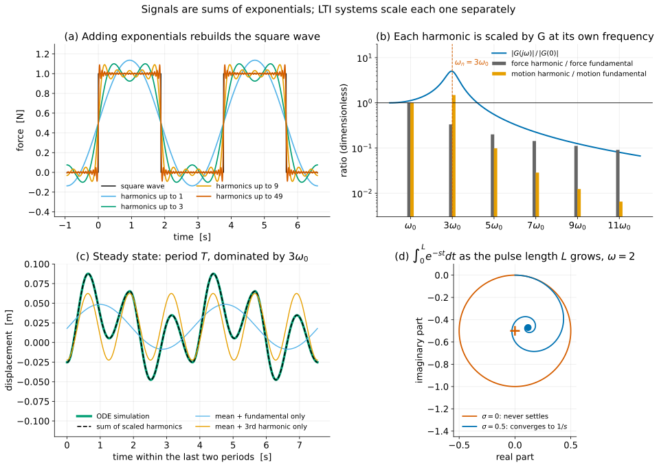

# Addendum A to *From Physical Models to the Laplace Transform*
## Signals Built from Exponentials: Fourier Series, Periodic Forcing, and the Road to $e^{-\sigma t}$

**Attaches to:** `lecture_0.0.8.md`, between §17 and §18. It uses the forced spring-mass-damper and $G(s)$ of §8, the conjugate-pair argument of §7.5, and the switched-heater pair $\mathcal L\{1\}=1/s$ of §20.1.

**Syllabus:** topics 2a–2b, and the opening of topic 7, in `references/syllabus-topics.md`.

**Primary goal:** Earn the claim §18 currently asserts in one line, that a general signal is a combination of exponentials. Students should leave able to say *why* knowing $G(s)$ for a single exponential is enough to predict the response to a square wave, a pulse or a step, and *why* the Laplace transform needs the factor $e^{-\sigma t}$.

**Duration:** About 30 minutes, run as one block immediately before §18. §A.3 gives a shorter route.

**Notation added in this addendum:**

| Symbol | Meaning |
|---|---|
| $T$ | period of a periodic signal (not temperature, which is §5 only) |
| $\omega_0=2\pi/T$ | fundamental frequency |
| $n\omega_0$ | frequency of harmonic $n$ (write it this way to distinguish it from natural frequency $\omega_n$) |
| $U_n$ | complex amplitude of the $n$th harmonic of the input $u(t)$ |
| $X_n$ | complex amplitude of the $n$th harmonic of the response |
| $N$ | highest harmonic kept in a partial sum |

Here $U_n,X_n$ are complex Fourier coefficients; $U(s),X(s)$ will denote transforms, which are continuous spectral weights rather than amplitudes of isolated frequencies. We use $n$ for harmonic indices, reserving $k$ for stiffness and $c$ for damping.

---

# Part 0 — Planning

## A.1 The gap this fills

Every forced calculation in Part I uses an input that is itself an exponential, $Fe^{st}$. §18 names the limitation honestly: *"Real inputs are steps, pulses, ramps, noise."* It then asks whether a general signal can be represented as a combination of exponentials, answers "that is exactly what the Laplace transform does," and writes down the integral.

The answer is correct, but the step from one exponential to the Laplace integral is taken on trust. Three things are missing:

1. **Superposition carries the result from one exponential to many.** This is what makes $G(s)$ worth knowing.
2. **Familiar non-exponential signals really are sums of exponentials.** A square wave is the natural first case because it is a step that switches on and off repeatedly.
3. **Separate two limits: first isolate a fixed-duration pulse by increasing its repetition period, then lengthen that pulse into a step.** The finite pulse has a Fourier integral; the step needs the weight $e^{-\sigma t}$ for its ordinary transform integral to converge. This motivates the real part of $s$ and §18's region of convergence.

With these in place, §18's inversion formula stops being a formula to "show and move past." It becomes the continuous version of a sum students have already built by hand.

## A.2 Learning objectives

By the end of this addendum, students should be able to:

1. State the finite-sum superposition result for exponential inputs away from poles: if $u=\sum_n U_ne^{s_nt}$, the particular response is $\sum_n G(s_n)U_ne^{s_nt}$. Say which two properties of the model it needs.
2. Obtain the real steady-state response to $A\cos(\omega t)$ from $G(j\omega)$.
3. Compute the Fourier coefficients of a square wave by projection, and write it as a sum of exponentials and as a sum of sines.
4. Predict the steady-state response of a spring-mass-damper to a square wave, harmonic by harmonic. Explain why a harmonic near a pole can dominate the output.
5. Describe what "well-behaved" means for a Fourier series, and what happens at a jump (Gibbs).
6. Distinguish a finite narrow pulse train from its ideal impulse-train limit, whose Fourier coefficients are all equal.
7. Show that $\int_0^\infty e^{-j\omega t}\,dt$ does not converge, and that $\int_0^\infty e^{-\sigma t}e^{-j\omega t}\,dt=1/s$ does for $\sigma>0$.
8. Explain why transfer functions work, and choose harmonic sums for periodic steady state or transform pairs and partial fractions for rational switched-input examples.

## A.3 Suggested flow

| Time | Topic | Section |
|---:|---|---|
| 0–2 min | The limitation: every input so far was an exponential | §A.4 |
| 2–6 min | Superposition; two exponentials make a cosine | §A.5 |
| 6–12 min | Square-wave series; quote coefficients and outline projection | §A.6 |
| 12–20 min | Driving the spring-mass-damper with a square wave | §A.7 |
| 20–30 min | Fixed pulse to Fourier integral; step and weighting | §A.9 |

§A.8 is optional reading or a two-minute extension. Allow extra time to derive all the square-wave coefficients on the board.

Then go straight into §18, using the replacement opening in §A.11.

**Run Demo 9 live** (`demos/demo9_square_wave_harmonics.py`, about 4 s). Panel (c) settles a claim students should doubt: the ODE simulation knows nothing about harmonics, yet it matches the harmonic sum.

**Shorter route (about 18 minutes).** Spend about 3 minutes on §A.5, 7 on the quoted square-wave series and response (§A.6–§A.7), and 8 on the step integral, weighting and inversion (§A.9.2–§A.9.4). Assign the full sum-to-integral construction (§A.9.1) and §A.8 as reading.

---

# Part I — Teaching sequence

## A.4 Opening: the limitation we have been living with

### Instructor script

> Every forced problem so far had an input of the form $Fe^{st}$. We chose the rate, we got back $G(s)Fe^{st}$, and the whole calculation was one line of algebra.
>
> That is a strong result about a weak class of inputs. Nobody pushes on a machine with $e^{st}$. They switch a motor on. They hit it. They run it through a cycle.
>
> So before we build anything new, I want to ask whether the result we already have can reach those inputs. It can, and it needs only one more property of the model.

## A.5 Superposition, and two exponentials make a cosine

### A.5.1 Many exponentials in, many exponentials out

The spring-mass-damper $m\ddot x+c\dot x+kx=f$ is **linear**: if $x_1$ answers $f_1$ and $x_2$ answers $f_2$, then $\alpha x_1+\beta x_2$ answers $\alpha f_1+\beta f_2$. The coefficients $m,c,k$ are **constant**, and that is what lets §8 cancel $e^{st}$ from both sides.

Combine the two properties with §8's result, one exponential at a time:

$$
\boxed{
u(t)=\sum_n U_n\,e^{s_nt}
\quad\Longrightarrow\quad
x_p(t)=\sum_n G(s_n)\,U_n\,e^{s_nt}
}
$$

Each exponential passes through on its own and is multiplied by the value of $G$ at its own rate. Nothing mixes. This holds directly for finite sums provided no $s_n$ lands exactly on a pole, as in §8. Extending it to an infinite series requires convergence. For the square wave and the stable spring-mass-damper with $m>0$, $k>0$, $c>0$, it gives the periodic steady-state response. The complete response also includes the homogeneous terms needed to meet the initial conditions.

#### Ask the class

> Suppose the spring were nonlinear, with a force $kx+k_3x^3$. Drive it with $\cos\omega t$. Why can't one amplitude-independent LTI transfer function describe its full response?

Expected reasoning: $\cos^3\omega t=\tfrac34\cos\omega t+\tfrac14\cos3\omega t$. To show this with exponentials, write $\theta=\omega t$ and cube Euler's form with the binomial theorem:

$$
\cos^3\theta=\left(\frac{e^{j\theta}+e^{-j\theta}}2\right)^3
=\frac{e^{3j\theta}+3e^{j\theta}+3e^{-j\theta}+e^{-3j\theta}}8
=\frac{2\cos3\theta+6\cos\theta}8 .
$$

Multiplying exponentials *adds* their rates, so $e^{j\theta}\cdot e^{j\theta}\cdot e^{j\theta}$ produces $e^{3j\theta}$. A frequency that was never in the input appears in the output. The exponentials no longer pass through separately, so no single complex number per frequency can describe the system. Linearity is what keeps them apart. A transfer function can still describe a specified linearization about an operating point.

### A.5.2 Two exponentials make a cosine

This is the smallest case of the box above. Euler's identity splits a cosine into a conjugate pair:

$$
A\cos\omega t=\frac A2e^{j\omega t}+\frac A2e^{-j\omega t}.
$$

Each term passes through $G$ separately:

$$
x_p(t)=\frac A2G(j\omega)e^{j\omega t}+\frac A2G(-j\omega)e^{-j\omega t}.
$$

For a real model, $G(-j\omega)=\overline{G(j\omega)}$. $G$ is a ratio of polynomials with real coefficients, and conjugating $s$ in such a polynomial conjugates its value. For example, $G(-j\omega)=1/(k-m\omega^2-jc\omega)$, which is the conjugate of $G(j\omega)=1/(k-m\omega^2+jc\omega)$.

The two terms are therefore conjugates, and their sum is real. This is the §7.5 argument again, now applied to a forced response. The sum is twice the real part of the first term: $x_p=\Re\{AG(j\omega)e^{j\omega t}\}$. Write $G(j\omega)=|G(j\omega)|e^{j\angle G(j\omega)}$. Then $AG(j\omega)e^{j\omega t}=A|G(j\omega)|e^{j(\omega t+\angle G(j\omega))}$, whose real part is the cosine below:

$$
\boxed{
A\cos\omega t
\quad\Longrightarrow\quad
x_p(t)=A\,|G(j\omega)|\cos\!\big(\omega t+\angle G(j\omega)\big)
}
$$

The same holds with $\sin$ in place of $\cos$. This is the "one free sentence" at the end of §8, now derived. Magnitude is the amplitude ratio, angle is the phase shift.

### Instructor script

> §7.5 said a complex mode is bookkeeping and a conjugate pair is physics. The same is true of inputs. A real cosine is a pair of complex exponentials. The system scales each one, the results are still conjugates, and the output is real.
>
> Now the question is how far this goes. Two exponentials give a cosine. What do two hundred give?

## A.6 A square wave is a sum of exponentials

### A.6.1 The signal

Take a force that switches between $0$ and $1$ N:

$$
u(t)=
\begin{cases}
1, & 0<t<T/2\\
0, & T/2<t<T
\end{cases}
\qquad\text{repeated with period }T.
$$

Say what it is physically: a step that switches off, waits, and switches on again. In §A.9 we will vary the pulse duration and repetition period separately to reach a single pulse and then a step.

### A.6.2 The claim

A periodic signal contains only exponentials that repeat with the same period, so only the harmonics $n\omega_0$ can appear:

$$
\boxed{
u(t)=\sum_{n=-\infty}^{\infty}U_n\,e^{jn\omega_0t},
\qquad
\omega_0=\frac{2\pi}{T}
}
$$

### A.6.3 Finding the amplitudes by projection

The harmonics are orthogonal over one period:

$$
\frac1T\int_0^Te^{jn\omega_0t}\,e^{-jl\omega_0t}\,dt=
\begin{cases}1,&n=l\\0,&n\neq l\end{cases}
$$

When $n\neq l$, the integrand turns a whole number of times around the unit circle and averages to zero. Explicitly, with $p=n-l\neq0$ and $\omega_0T=2\pi$,

$$
\frac1T\int_0^Te^{jp\omega_0t}\,dt=\frac{e^{jp\omega_0T}-1}{jp\omega_0T}=\frac{e^{j2\pi p}-1}{j2\pi p}=0,
$$

while for $p=0$ the integrand is 1 and the average is 1. Multiply the series by $e^{-jl\omega_0t}$ and average over a period. Every term except $n=l$ vanishes:

$$
\boxed{
U_n=\frac1T\int_0^Tu(t)\,e^{-jn\omega_0t}\,dt
}
$$

Read this as *how much of $e^{jn\omega_0t}$ the signal contains*.

For the square wave, the integral runs only over the "on" half. For $n\ne0$, use $\omega_0T=2\pi$:

$$
U_n=\frac1T\int_0^{T/2}e^{-jn\omega_0t}\,dt
=\frac1T\left[\frac{e^{-jn\omega_0t}}{-jn\omega_0}\right]_0^{T/2}
=\frac{1-e^{-jn\omega_0T/2}}{jn\omega_0T}
=\frac{1-e^{-jn\pi}}{jn\omega_0T}
=\frac{1-(-1)^n}{j2\pi n}.
$$

Here $\omega_0T/2=\pi$, $e^{-jn\pi}=(-1)^n$, and $\omega_0T=2\pi$ in the denominator. The numerator $1-(-1)^n$ is 2 for odd $n$ and 0 for even $n$.

Compute the mean separately: $U_0=(1/T)\int_0^{T/2}1\,dt=1/2$. Thus

$$
\boxed{
U_0=\tfrac12,
\qquad
U_n=\frac{1}{j\pi n}\ \ (n\text{ odd}),
\qquad
U_n=0\ \ (n\text{ even},\ n\neq0)
}
$$

$U_0$ is the average force, $\tfrac12$ N. The even harmonics vanish because the "on" and "off" halves are the same length.

### A.6.4 Back to real form

Pair positive $n$ with $-n$ exactly as in §A.5.2. For positive odd $n$, $U_{-n}=1/(j\pi(-n))=-U_n$, so

$$
U_ne^{jn\omega_0t}+U_{-n}e^{-jn\omega_0t}
=\frac{1}{j\pi n}\left(e^{jn\omega_0t}-e^{-jn\omega_0t}\right)
=\frac{1}{j\pi n}\cdot2j\sin n\omega_0t
=\frac{2}{\pi n}\sin n\omega_0t ,
$$

using $e^{j\theta}-e^{-j\theta}=2j\sin\theta$. Therefore

$$
\boxed{
u(t)=\frac12+\frac2\pi\left(\sin\omega_0t+\frac13\sin3\omega_0t+\frac15\sin5\omega_0t+\cdots\right)
}
$$

> **[ DEMO 9, panel (a) ]** — `demo9_square_wave_harmonics.py` *(live)*
>
> **Show:** the partial sums up to harmonics 1, 3, 9 and 49 laid over the square wave.
> **Point at:** the first table in the terminal. The $U_n$ computed by numerically integrating the projection formula agree with $1/(j\pi n)$ for odd $n$ and zero for nonzero even $n$, to numerical precision. The script integrates only over the on interval, avoiding quadrature across jumps.
> **Say:** "One sine is a poor square wave. Three is recognisable. By forty-nine the only visible error is right at the corners."

### A.6.5 What happens at the corners, in one sentence

Near a jump, the partial sums overshoot. Adding harmonics narrows the oscillations, but the overshoot approaches about 8.949% of the jump and does not tend to zero. At the jump itself the series converges to the midpoint. Demo 9 reports peaks of $1.1366$, $1.0912$ and $1.0895$ for $N=1$, $9$ and $199$. This is the **Gibbs phenomenon**. Name it and move on.

**What "well-behaved" means.** The series converges to $u(t)$ wherever $u$ is continuous, and to the midpoint of each jump, when three conditions hold over one period: $u$ is absolutely integrable, has finitely many maxima and minima, and has finitely many finite jumps. These **Dirichlet conditions** are sufficient for the piecewise-smooth periodic waveforms used here; they are not necessary conditions for every Fourier representation. Ideal impulses require a generalized interpretation (§A.8).

### Instructor script

> The square wave has corners, and every exponential is perfectly smooth. It still took only a sum of them to build the corners, and the formula for how much of each one to use was an average.
>
> Hold on to that formula. In ten minutes it becomes the Laplace transform.

## A.7 Driving the spring-mass-damper with a square wave

### A.7.1 The response, harmonic by harmonic

Apply the §A.5.1 box to the series. Each harmonic's amplitude is multiplied by $G$ at its own frequency:

$$
X_n=G(jn\omega_0)\,U_n,
\qquad
G(s)=\frac1{ms^2+cs+k}.
$$

In real form: the $n=0$ term is $G(0)U_0=G(0)/2$. For positive odd $n$, pair $X_n$ with $X_{-n}=\overline{X_n}$ as in §A.5.2. Write $U_n=\frac{1}{\pi n}e^{-j\pi/2}$ and $G(jn\omega_0)=|G|e^{j\angle G}$. Then

$$
X_ne^{jn\omega_0t}+X_{-n}e^{-jn\omega_0t}
=2\Re\{X_ne^{jn\omega_0t}\}
=\frac{2}{\pi n}|G|\cos\!\left(n\omega_0t+\angle G-\tfrac\pi2\right)
=\frac{2}{\pi n}|G|\sin\!\left(n\omega_0t+\angle G\right).
$$

Summing,

$$
\boxed{
x_{ss}(t)=\frac{G(0)}2+\sum_{n=1,3,5,\ldots}\frac2{\pi n}\,\big|G(jn\omega_0)\big|\sin\!\big(n\omega_0t+\angle G(jn\omega_0)\big)
}
$$

The subscript "ss" means steady state. Remark 1 of §8 still applies: the complete response adds the free modes, and they decay here because $m>0$, $k>0$ and $c>0$.

### A.7.2 Numbers that make the point

Use $m=1$ kg, $c=1$ N·s/m, $k=25$ N/m. Then:
- $\omega_n=\sqrt{k/m}=5$ rad/s;
- $\zeta=c/(2\sqrt{mk})=1/10=0.1$;
- the roots of $s^2+s+25$ give poles at $-0.5\pm j\sqrt{25-0.25}=-0.5\pm j4.975$.

Pick the period so that the **third** harmonic lands on the natural frequency: $3\omega_0=5$ gives $\omega_0=5/3$ rad/s, and $T=2\pi/\omega_0=3.770$ s.

**How each row is computed.** At $s=j\omega$, $G(j\omega)=\dfrac{1}{(k-m\omega^2)+jc\omega}$. So $|G|=1/\sqrt{(k-m\omega^2)^2+c^2\omega^2}$ and $\angle G=-\operatorname{atan2}(c\omega,\ k-m\omega^2)$. The force amplitude is $2/(\pi n)$, and the motion amplitude is the product.
- *$n=1$:* $\omega=1.667$, $k-m\omega^2=25-2.778=22.222$, $c\omega=1.667$. So $|G|=1/\sqrt{493.83+2.78}=0.04487$, $\angle G=-\arctan(1.667/22.222)=-4.3^\circ$, and the motion amplitude is $0.6366\times0.04487=0.02857$.
- *$n=3$:* $\omega=5$, $k-m\omega^2=0$, so $G=1/(j5)$. Then $|G|=0.2$ and $\angle G=-90^\circ$, giving $0.2122\times0.2=0.04244$.
- *$n=5$:* $k-m\omega^2=25-69.44=-44.44$ is negative, so the phase passes $-90^\circ$ toward $-180^\circ$.

| Harmonic $n$ | $n\omega_0$ [rad/s] | force amplitude [N] | $\lvert G\rvert$ [m/N] | $\angle G$ | motion amplitude [m] |
|---:|---:|---:|---:|---:|---:|
| 0 | 0 | 0.5000 | 0.04000 | $0^\circ$ | 0.02000 |
| 1 | 1.667 | 0.6366 | 0.04487 | $-4.3^\circ$ | 0.02857 |
| 3 | 5.000 | 0.2122 | 0.20000 | $-90.0^\circ$ | **0.04244** |
| 5 | 8.333 | 0.1273 | 0.02211 | $-169.4^\circ$ | 0.00282 |
| 7 | 11.667 | 0.0909 | 0.00895 | $-174.0^\circ$ | 0.00081 |
| 9 | 15.000 | 0.0707 | 0.00499 | $-175.7^\circ$ | 0.00035 |

For positive odd $n$, $|U_n|=1/(\pi n)$ is one complex coefficient; the real sine amplitude in the table is $2|U_n|$. For $n=0$ the amplitude column holds the mean value. Ask students to explain $G(0)/2=0.02$ m as the static spring deflection under the mean force of $0.5$ N.

Read the table in two passes:

1. **The input's harmonics fall off as $1/n$.** The third harmonic of the force is one third the size of the fundamental.
2. **The output's third harmonic is 1.49 times its fundamental** ($0.04244/0.02857=1.486$). The third harmonic lies near the resonance peak. At $3\omega_0=\omega_n$, the gain is exactly $1/(c\omega_n)=0.2$ m/N. The third harmonic is the largest component, but the fundamental remains substantial: the output still has fundamental frequency $\omega_0$ and period $T$.

For this force-to-displacement transfer function, $|G(j\omega)|^{-2}=(k-m\omega^2)^2+c^2\omega^2$. Its minimum gives, for $0<\zeta<1/\sqrt2$,

$$
\omega_r=\omega_n\sqrt{1-2\zeta^2},\qquad
|G(j\omega_r)|=\frac1{c\omega_n\sqrt{1-\zeta^2}}.
$$

**Derivation.** Let $w=\omega^2$ and $f(w)=(k-mw)^2+c^2w$. Setting $f'(w)=-2m(k-mw)+c^2=0$ gives $w=\dfrac km-\dfrac{c^2}{2m^2}$. With $c=2\zeta\omega_nm$, this is $w=\omega_n^2-2\zeta^2\omega_n^2$, so $\omega_r=\omega_n\sqrt{1-2\zeta^2}$. This requires $1-2\zeta^2>0$, i.e. $\zeta<1/\sqrt2$; otherwise the minimum of $f$ is at $\omega=0$ and there is no peak. At the minimum, $k-mw=c^2/(2m)$, so

$$
f=\frac{c^4}{4m^2}+c^2\left(\frac km-\frac{c^2}{2m^2}\right)=\frac{c^2k}{m}-\frac{c^4}{4m^2}=c^2\omega_n^2\left(1-\frac{c^2}{4mk}\right)=c^2\omega_n^2(1-\zeta^2),
$$

and $|G(j\omega_r)|=1/\sqrt f$.

Here $\omega_r=5\sqrt{0.98}=4.94975$ rad/s and the peak is $1/(1\cdot5\sqrt{0.99})=0.201008$ m/N. The peak frequency, natural frequency $5$ rad/s, and imaginary part of the poles $4.97494$ rad/s are distinct.

Above the resonance, $|G|$ falls as roughly $1/(m\omega^2)$, so the output's harmonics fall as roughly $1/n^3$: a $1/n$ force coefficient times a $1/n^2$ gain. These absolutely summable displacement coefficients give a smooth reconstruction: displacement and velocity are continuous. Acceleration jumps when the force switches, so its Fourier reconstruction can still exhibit Gibbs oscillations.

> **[ DEMO 9, panels (b) and (c) ]** *(live)*
>
> **Show:** panel (b) first. Its frequency axis is linear and its vertical axis logarithmic. The blue curve is $|G(j\omega)|/|G(0)|$; grey force and orange motion harmonics are each normalized by their own fundamental amplitude. All plotted quantities are dimensionless, with different reference values. The orange bar at $3\omega_0$ is 1.49 times the one at $\omega_0$.
> **Then show:** panel (c). The green curve is an ODE solve from rest over 20 periods, integrated half-period by half-period across the switching instants. The dashed curve is the harmonic sum up to $n=399$. Beneath them, the thin curves show the mean plus the fundamental alone, and the mean plus the third harmonic alone.
> **Point at:** `max |simulation - harmonic sum| = 9.30e-08 m`, against a peak-to-peak motion of $0.135$ m. At the comparison window's start, the dimensionless transient envelope factor is $e^{-0.5(18T)}=e^{-0.5\times67.86}=e^{-33.93}\approx1.8\times10^{-15}$; this is a reduction factor, not a displacement error.
> **Say:** "The simulation never heard of a harmonic. It just integrated Newton's law. At the sampled times, it agrees with the truncated sum of scaled exponentials to less than $10^{-7}$ m."
> **Qualification:** the discrepancy includes numerical integration and Fourier truncation errors; sampled agreement illustrates the identity rather than proving it.
> **Why live:** students accept superposition as algebra. They believe it when two unrelated computations sit on top of each other.

#### Ask the class

> Keep the same plant, but make the damping zero and leave $\omega_0=5/3$. Which terms in the sum survive, and what goes wrong with the one that doesn't?

The nonresonant harmonics retain sinusoidal particular solutions, with gains changed by removing damping. In the real sine series the third harmonic is resonant (both $n=+3$ and $n=-3$ in the complex series). Its equation is

$$
\ddot x+25x=\frac{2}{3\pi}\sin5t,\qquad
\boxed{x_{p,3}(t)=-\frac{t}{15\pi}\cos5t.}
$$

The forcing amplitude is the $n=3$ sine coefficient, $2/(3\pi)$. Indeed, $(D^2+25)(t\cos5t)=-10\sin5t$. To see this:
- $\frac{d}{dt}(t\cos5t)=\cos5t-5t\sin5t$.
- $\frac{d^2}{dt^2}(t\cos5t)=-5\sin5t-5\sin5t-25t\cos5t=-10\sin5t-25t\cos5t$.
- Adding $25t\cos5t$ leaves $-10\sin5t$.
- Similarly, $(D^2+25)(t\sin5t)=10\cos5t$.

With the trial $t(a\cos5t+b\sin5t)$, matching $-10a\sin5t+10b\cos5t=\frac{2}{3\pi}\sin5t$ gives $a=-\frac{1}{15\pi}$ and $b=0$. The same-exponential trial fails because $G(j5)$ is undefined, as in §20.1's follow-up. The resonant response grows without bound; there is no bounded periodic steady state, and homogeneous oscillations no longer decay. Kreyszig 11.3 treats resonance on a harmonic of periodic forcing.

## A.8 Narrow pulses and the ideal impulse limit

Replace the square wave with a train of pulses of width $\varepsilon<T$ and height $1/\varepsilon$, each of unit area, arriving every $T$ seconds. Projection gives

$$
U_n=\frac1T\int_0^\varepsilon\frac1\varepsilon e^{-jn\omega_0t}\,dt
=\frac1T e^{-jn\omega_0\varepsilon/2}
\operatorname{sinc}\!\left(\frac{n\omega_0\varepsilon}{2}\right),
\qquad \operatorname{sinc}(z)=\frac{\sin z}{z},\quad \operatorname{sinc}(0)=1.
$$

**Derivation.** Let $x=n\omega_0\varepsilon/2$. The integral is $\dfrac{1}{T\varepsilon}\cdot\dfrac{1-e^{-j2x}}{jn\omega_0}$. Factor out the midpoint phase: $1-e^{-j2x}=e^{-jx}(e^{jx}-e^{-jx})=e^{-jx}\cdot2j\sin x$. Then

$$
U_n=\frac{1}{T\varepsilon}\cdot\frac{2j\sin x}{jn\omega_0}\,e^{-jx}
=\frac1T\cdot\frac{\sin x}{n\omega_0\varepsilon/2}\,e^{-jx}
=\frac1Te^{-jx}\operatorname{sinc}x .
$$

The phase $e^{-jx}$ is the delay to the pulse's centre at $t=\varepsilon/2$. For $n=0$, $U_0=\frac1T\int_0^\varepsilon\frac1\varepsilon\,dt=\frac1T$ directly.

For **each fixed $n$**, $x\to0$ and $\operatorname{sinc}x\to1$, so $U_n\to1/T$ as $\varepsilon\to0$. A finite pulse has approximately equal coefficients only when $|n\omega_0\varepsilon|\ll1$; higher-frequency coefficients decay and have zeros. The limit is not uniform over all harmonics.

The ideal unit-impulse train has coefficients $1/T$ at every harmonic. Its Fourier series represents a distribution, not an ordinary pointwise-convergent function.

### Instructor script

> A periodic unit-impulse train has equal Fourier coefficients. For our stable plant, its periodic response has coefficients $G(jn\omega_0)/T$.
>
> A single unit impulse from rest produces the impulse response $h(t)$. Its Laplace transform is $G(s)$; for this stable plant, its Fourier transform is $G(j\omega)$.
>
> The impulse response characterises a linear time-invariant system's zero-state input-output behavior. The next lecture develops this by adding up shifted impulses.

## A.9 From a finite pulse to a step: why $e^{-\sigma t}$

### A.9.1 From a sum to an integral: keep pulse duration fixed

Stretching the 50%-duty square wave does approach a step at each fixed nonzero time, but its coefficients $U_0=1/2$ and $U_n=1/(j\pi n)$ for odd $n$ do **not** shrink with $T$. That limit alone cannot justify turning its Fourier series into an ordinary Fourier integral.

Instead, let $p_L(t)=1$ on $0<t<L$ and zero elsewhere. Hold $L$ fixed and repeat the pulse with period $T>L$, calling the periodic signal $p_{L,T}$. Its coefficients are

$$
P_{n,T}=\frac1T\int_0^L e^{-jn\omega_0t}\,dt
=\frac1T P_L(jn\omega_0),\qquad \omega_0=\frac{2\pi}{T},
$$

where

$$
P_L(j\omega)=\int_0^Le^{-j\omega t}\,dt=\frac{1-e^{-j\omega L}}{j\omega}\quad(\omega\ne0),
\qquad P_L(0)=L.
$$

The integral over one period only sees the pulse, because $p_{L,T}=0$ on $L<t<T$. So the coefficient is $1/T$ times the isolated pulse's integral evaluated at the harmonic frequency.

Now $TP_{n,T}$ samples one fixed function of frequency. Increasing $T$ separates pulses without changing their shape. With $\Delta\omega=2\pi/T$, write $1/T=\Delta\omega/(2\pi)$ in $p_{L,T}=\sum_nP_{n,T}e^{jn\omega_0t}$. The series is

$$
p_{L,T}(t)=\frac1{2\pi}\sum_{n=-\infty}^{\infty}
P_L(jn\Delta\omega)e^{jn\Delta\omega t}\,\Delta\omega.
$$

On a finite frequency interval this has the form of a Riemann sum. Fourier inversion for this piecewise-smooth, integrable pulse gives the corresponding isolated-pulse representation:

$$
\boxed{
p_L(t)=\frac1{2\pi}\lim_{\Omega\to\infty}
\int_{-\Omega}^{\Omega}P_L(j\omega)e^{j\omega t}\,d\omega
}
$$

The inverse is a **symmetric improper integral**: it gives the pulse at continuity points and $1/2$ at either jump. The Riemann-sum picture motivates the formula; passing to unbounded frequencies requires the Fourier inversion theorem, not just shrinking harmonic spacing.

More generally, for suitable integrable signals,

$$
U(j\omega)=\int_{-\infty}^{\infty}u(t)e^{-j\omega t}\,dt,
\qquad
u(t)=\frac1{2\pi}\lim_{\Omega\to\infty}
\int_{-\Omega}^{\Omega}U(j\omega)e^{j\omega t}\,d\omega,
$$

with sufficient regularity such as piecewise smoothness and the same midpoint convention. Only **after isolating the pulse** do we let $L\to\infty$ to obtain a step. This second limit is the problem to examine next.

### A.9.2 The step breaks it

Now try the step itself, $u(t)=1$ for $t\ge0$:

$$
U(j\omega)=\int_0^\infty e^{-j\omega t}\,dt
=\lim_{t_f\to\infty}\frac{1-e^{-j\omega t_f}}{j\omega},\qquad \omega\ne0.
$$

The limit does not exist. As $t_f$ grows, the partial integral runs around a circle of radius $1/|\omega|$ centred on $1/(j\omega)$, forever. To see the circle, write the partial integral as $\dfrac1{j\omega}-\dfrac{e^{-j\omega t_f}}{j\omega}$: a fixed centre plus a term of constant magnitude $1/|\omega|$ whose angle keeps turning. Problem A4 asks for this. At $\omega=0$, the partial integral equals $t_f$ and diverges linearly.

**Why it fails.** The step never decays, so there is always more signal to integrate, and $e^{-j\omega t}$ keeps turning. A ramp is worse, and $e^{2t}$ from §18 is worse still.

**Instructor note (optional):** Fourier-series coefficients integrate over one finite period; even a periodic constant has a Fourier series. Switching off is not required. The step has a generalized Fourier transform, $\pi\delta(\omega)+\operatorname{PV}(1/(j\omega))$, where PV denotes principal value, but that distribution-theory extension is outside this lesson.

### A.9.3 The fix: weight by $e^{-\sigma t}$

Multiply by a decaying exponential before transforming. This weight is chosen for convergence; it is not the plant's decay rate. For a pulse of duration $L$, as $L\to\infty$,

$$
\int_0^L e^{-(\sigma+j\omega)t}\,dt=\frac{1-e^{-(\sigma+j\omega)L}}{\sigma+j\omega}\;\longrightarrow\;\frac1{\sigma+j\omega},\qquad \sigma>0.
$$

The limit exists because $|e^{-(\sigma+j\omega)L}|=e^{-\sigma L}|e^{-j\omega L}|=e^{-\sigma L}\to0$. The turning factor still turns, but the decaying factor shrinks the circle to a point. Thus any $\sigma>0$ makes the step integral converge:

$$
\int_0^\infty e^{-\sigma t}e^{-j\omega t}\,dt
=\int_0^\infty e^{-(\sigma+j\omega)t}\,dt
=\frac1{\sigma+j\omega}.
$$

Name the combination $s=\sigma+j\omega$:

$$
\boxed{
\int_0^\infty1\cdot e^{-st}\,dt=\frac1s,
\qquad\Re(s)>0
}
$$

This is the pair used in §20.1 to switch on the heater.

> **[ DEMO 9, panel (d) ]** *(live, or as a slide)*
>
> **Show:** the partial integral $\int_0^{t_f}e^{-st}dt$ traced in the complex plane as $t_f$ runs from 0 to 40 s, with $\omega=2$ rad/s.
> **Point at:** the red circle for $\sigma=0$. At $t_f=5$, 10, 20 and 40 s it is at four unrelated points, and it never settles. The blue spiral for $\sigma=0.5$ reaches $0.1176-0.4706j=1/(0.5+2j)$ by $t_f=40$. To check: $\dfrac{1}{0.5+2j}=\dfrac{0.5-2j}{0.25+4}=\dfrac{0.5-2j}{4.25}$. By $t_f=40$, the remaining error factor is $e^{-20}\approx2\times10^{-9}$.
> **Say:** "Same integrand, one extra factor. Without it the step has no Fourier transform defined by this ordinary improper integral. With it, the step is $1/s$."

### A.9.4 The weight comes back out

For the ordinary signals here, define the **causal extension** $u(t)=0$ for $t<0$, and its Laplace transform

$$
U(s)=\int_0^\infty u(t)e^{-st}\,dt.
$$

Choose $\sigma$ so that $u(t)e^{-\sigma t}$ is absolutely integrable, and assume sufficient regularity for Fourier inversion, such as piecewise smoothness. Its Fourier transform is then $U(\sigma+j\omega)$, because

$$
\int_{-\infty}^{\infty}\left[u(t)e^{-\sigma t}\right]e^{-j\omega t}\,dt=\int_0^\infty u(t)e^{-(\sigma+j\omega)t}\,dt=U(\sigma+j\omega),
$$

using $u=0$ for $t<0$. Apply the §A.9.1 Fourier inversion to the weighted signal, so at continuity points

$$
u(t)e^{-\sigma t}=\frac1{2\pi}\lim_{\Omega\to\infty}
\int_{-\Omega}^{\Omega}U(\sigma+j\omega)e^{j\omega t}\,d\omega.
$$

Undo the weight by multiplying both sides by $e^{+\sigma t}$. Since $\sigma$ is fixed, it can go inside the integral, where $e^{\sigma t}e^{j\omega t}=e^{(\sigma+j\omega)t}=e^{st}$. Now change variables to $s=\sigma+j\omega$. On the vertical line $\sigma$ is constant, so $ds=j\,d\omega$, i.e. $d\omega=ds/j$. The limits $\omega=\pm\Omega$ become $s=\sigma\pm j\Omega$, and the prefactor becomes $\frac1{2\pi}\cdot\frac1j$:

$$
\boxed{
u(t)=\frac1{2\pi j}\lim_{\Omega\to\infty}
\int_{\sigma-j\Omega}^{\sigma+j\Omega}U(s)e^{st}\,ds
}
$$

This is §18's inversion formula, interpreted by symmetric frequency truncation. At a jump it recovers the midpoint of the two one-sided limits; the step's value at zero is therefore $1/2$ under inversion, regardless of its assigned endpoint value.

The vertical line contains exponentials $e^{(\sigma+j\omega)t}$: the transform uses $e^{-\sigma t}$, while reconstruction uses $e^{+\sigma t}$. A step requires $\sigma>0$; sufficiently decaying signals can allow $\sigma=0$ or negative $\sigma$.

To pass this representation through a causal LTI system using convolution, choose the line in a **common convergence region** for the input and the system's causal impulse response, with sufficient convergence to interchange the integrals. Avoiding isolated poles alone is not enough. For our stable plant and a step, any $\sigma>0$ lies in both regions.

### A.9.5 The other standard inputs

The same weight handles the rest of the familiar inputs:

| Input | Convergence or idealization | Transform |
|---|---|---|
| Impulse $\delta(t)$ | A single ideal impulse has a flat transform; no decay weight is needed. | $1$ for every $s$ |
| Step $1(t)$ | The signal never decays | $1/s$, $\ \Re(s)>0$ |
| Ramp $t\,1(t)$ | The signal grows without bound | $1/s^2$, $\ \Re(s)>0$ |
| $e^{2t}\,1(t)$ | The signal grows exponentially | $1/(s-2)$, $\ \Re(s)>2$ |

For the impulse row, use the parent lecture's $0^-$ convention: $\mathcal L\{\delta(t)\}=\int_{0^-}^\infty\delta(t)e^{-st}\,dt=1$, including the impulse at zero. For ordinary signals, writing 0 as the lower limit has the same effect.

The last column is §18's remark on convergence: the weight has to beat the signal's growth.

The ramp is Problem A5. For the exponential, $\int_0^\infty e^{2t}e^{-st}\,dt=\int_0^\infty e^{-(s-2)t}\,dt=\dfrac1{s-2}$. This is the step result with $s$ replaced by $s-2$, so it needs $\Re(s-2)>0$, i.e. $\Re(s)>2$. In general, a signal growing like $e^{at}$ needs $\sigma>a$.

## A.10 Two ways to take a signal apart

Close with a board that the next lecture (`lecture_ch3_L1`) will complete:

| | Build from impulses | Build from exponentials |
|---|---|---|
| Building block | a shifted impulse $\delta(t-\tau)$ | an exponential $e^{st}$ |
| What the system returns | $h(t-\tau)$, a different shape | $G(s)e^{st}$ as a particular response, away from poles |
| How the pieces combine | convolution, an integral over time | multiplication by $G(s)$, one frequency at a time |
| Where it appears | L1 §4–§5 | this addendum and §18–§20 |

Both describe the same LTI system, with the convergence conditions of §A.9.4 when using inverse integrals. The exponential entry is a particular response: switching an exponential on at zero generally also produces natural-mode transients, even from rest. Convolution with $h$ gives the complete zero-state response; nonzero initial conditions add a zero-input response. Scaling exponentials is what makes the transform algebra simple.

---

# Part II — Handoff and support material

## A.11 Replacement opening for §18

The instructor script in §18 asks the question this addendum has just answered. Replace it with:

> Every time we tried an exponential, differentiation became multiplication, and every system scaled the exponential by $G(s)$.
>
> We have now seen that this reaches much further than exponential inputs. A square wave is a sum of exponentials on the imaginary axis, and the spring-mass-damper scaled each one separately. Separating fixed-duration pulses gave us the Fourier-integral picture. Lengthening a single pulse into a step then made the ordinary transform integral fail to converge. The decay weight $e^{-\sigma t}$ restored convergence, and undoing that weight gave the Laplace inversion formula.
>
> Integrate the weighted signal against each exponential from switch-on onward, and you get its Laplace transform.

Then continue from "Define $X(s)=\ldots$" unchanged. Point 2 under *Two things to say about this integral* can now refer back: "We derived this in §A.9.4."

## A.12 Board summary

$$
\boxed{
\text{linear, constant coefficients}
\;\Rightarrow\;
\sum_nU_ne^{s_nt}\ \longmapsto\ \sum_nG(s_n)U_ne^{s_nt}
}
$$

$$
\boxed{
\text{periodic}
\;\Rightarrow\;
u=\sum_nU_ne^{jn\omega_0t},
\qquad
U_n=\frac1T\int_0^Tu\,e^{-jn\omega_0t}\,dt
}
$$

$$
\boxed{
\begin{aligned}
&\text{fixed-duration pulse, }T\to\infty
\;\Rightarrow\;\text{Fourier integral}\\
&L\to\infty:\quad\text{step's ordinary transform diverges}\\
&\text{step weighted by }e^{-\sigma t}
\;\Rightarrow\;1/s,\quad\sigma>0
\end{aligned}
}
$$

$$
\boxed{
\begin{aligned}
&\text{periodic steady state: harmonic sums}\\
&\text{rational switched responses: partial fractions}
\end{aligned}
}
$$

The first box gives finite-sum particular responses away from poles. The periodic box uses the convergence and midpoint qualifications of §A.6; the pulse limit uses Fourier inversion as in §A.9.1.

## A.13 Instructor cautions

1. **Choose the computation method for the input.** Harmonic sums are useful for periodic steady-state responses, as §A.7 demonstrates. For rational switched-input examples such as the heater in §20.1, partial fractions and transform pairs give a short calculation. The Fourier picture explains why transfer functions apply to both.
2. **A Fourier series describes a signal that has always been periodic.** For our stable plant, its sum through $G$ gives the *steady state*. If the square wave is switched on at $t=0$, the complete response also contains the free modes (§8, remark 1). Demo 9 waits 18 periods for them to decay.
3. **Keep Gibbs to one sentence.** It is a fact about partial sums at a discontinuity. The displacement here has rapidly decaying harmonics and is continuous, as is velocity. Acceleration jumps with the force and can exhibit Gibbs oscillations in its Fourier reconstruction.
4. **$\sigma$ in the transform is a weight, not the plant's decay rate.** Both live on the real axis of the same $s$-plane, which is the point of §18's closing sentence. Choosing $\sigma=0.5$ in §A.9.3 ensures convergence for the step; it says nothing about the plant. Positive $\sigma$ is required for that input, not for every signal. Introduce this distinction when weighting first appears.
5. **Resonance at $c=0$ is a failure of a trial form, not an infinite displacement.** This uses the same language as §20.1's follow-up.
6. **The $\cos^3$ question in §A.5.1 is worth its minute.** Without it, students treat superposition as a property of signals rather than of the system.

## A.14 Discussion questions

1. The square wave's even harmonics vanish. What change to the signal would make them appear, and what would they do to the spring-mass-damper response?
2. A triangle wave is the running integral of a square wave with its mean removed. Without computing any integrals, how do its harmonic amplitudes fall off with $n$? Why does a smoother signal need fewer harmonics?
3. Why does the spring-mass-damper's output contain much less of the high harmonics than its input does? Where in $G(s)$ does that come from?
4. The impulse has a flat spectrum, and the step's transform is $1/s$. What does the ratio of the two say about how a step is built from an impulse?
5. If the region of convergence for a signal is $\Re(s)>2$, can its transform be evaluated at $s=j\omega$? What does that say about whether the signal has a Fourier integral?

## A.15 Problems

**Problem A1 — a symmetric square wave.** Let $v(t)=\pm1$, with $+1$ on the first half period. Write $v$ in terms of the 0/1 square wave $u$ of §A.6, and use the result to find the $V_n$ without integrating.

*Answer:* $v=2u-1$, so $V_0=0$, $V_n=2/(j\pi n)$ for odd $n$, and $V_n=0$ for even $n\neq0$. The coefficients are linear in the signal. Scaling by 2 doubles every $U_n$, and subtracting the constant 1 changes only the $n=0$ coefficient: $V_0=2(\tfrac12)-1=0$.

**Problem A2 — move the resonance.** Using the plant of §A.7.2, set $\omega_0=5$ rad/s so that the *fundamental* sits on $\omega_n$. Find the motion amplitudes of harmonics 1, 3 and 5, and compare with the table in §A.7.2.

*Answer:* $0.1273$, $0.00106$ and $0.00021$ m. The working uses $|G(j\omega)|=1/\sqrt{(25-\omega^2)^2+\omega^2}$:
- $n=1$, $\omega=5$: $|G|=1/5=0.2$, and $0.6366\times0.2=0.1273$.
- $n=3$, $\omega=15$: $|G|=1/\sqrt{200^2+15^2}=1/200.56=0.00499$, and $0.2122\times0.00499=0.00106$.
- $n=5$, $\omega=25$: $|G|=1/\sqrt{600^2+25^2}=1/600.5=0.00167$, and $0.1273\times0.00167=0.00021$.

The fundamental now dominates by a factor of about 120 ($0.1273/0.00106$). Close to the resonance, the output is nearly a pure sinusoid at the forcing frequency, however square the force.

**Problem A3 — undamped periodic forcing.** Set $c=0$ in §A.7.2, keeping $\omega_0=5/3$. Show that every term of the formal harmonic particular-response sum in real sine form is still defined except one. Find the particular solution for that term and explain why no bounded periodic steady state exists.

*Answer:* Only the real third harmonic fails (indices $\pm3$ in the complex series). For $\ddot x+25x=2\sin5t/(3\pi)$, the trial $t(a\cos5t+b\sin5t)$ gives $a=-1/(15\pi)$ and $b=0$, hence $x_{p,3}=-t\cos5t/(15\pi)$. Its envelope grows linearly. Other harmonics retain sinusoidal particular solutions with changed gains, while homogeneous oscillations do not decay.

**Problem A4 — the circle.** For real $\omega\ne0$, show that $I(t_f)=\int_0^{t_f}e^{-j\omega t}\,dt$ satisfies $\big|I(t_f)-1/(j\omega)\big|=1/|\omega|$ for every $t_f$. Then show that $\int_0^{t_f}e^{-st}\,dt\to1/s$ when $\Re(s)>0$.

*Answer:* $I-1/(j\omega)=-e^{-j\omega t_f}/(j\omega)$, whose magnitude is $1/|\omega|$. At $\omega=0$, $I(t_f)=t_f$ diverges linearly. With $\Re(s)=\sigma>0$, $|e^{-st_f}|=e^{-\sigma t_f}\to0$.

**Problem A5 — the ramp.** Compute $\int_0^\infty t\,e^{-st}\,dt$ by parts, stating exactly where $\Re(s)>0$ is used.

*Answer:* $1/s^2$. The condition is used in the boundary term $\big[-t\,e^{-st}/s\big]_0^\infty$, which vanishes when $t\,e^{-\sigma t}\to0$, and in the remaining integral $\int_0^\infty e^{-st}\,dt=1/s$, whose convergence also requires $\Re(s)>0$.

**Problem A6 — a nonlinear spring.** A mass on a spring with force $kx+k_3x^3$ is driven by $F\cos\omega t$. Assume a small response $x\approx X\cos\omega t$ and substitute. Identify the term that no single-frequency response can balance.

*Answer:* $k_3X^3\cos^3\omega t$ contains $\tfrac14k_3X^3\cos3\omega t$. A third harmonic is forced, so no single amplitude-independent LTI transfer function describes the full nonlinear model. A specified linearization can have a transfer function.

## A.16 Demonstration

`demos/demo9_square_wave_harmonics.py` follows the conventions of Demos 1–8. It takes `--show` and `--no-save`, prints an annotated narrative, and writes `figures/demo9_square_wave_harmonics.png` and `.svg`. `run_all.py` picks it up automatically.

| What it checks | Where | What the script reports |
|---|---|---|
| The projection formula gives the square-wave coefficients | §A.6.3 | quadrature over the on interval agrees with the analytical odd coefficients and zero coefficients at nonzero even indices to numerical precision |
| Gibbs overshoot does not tend to zero | §A.6.5 | peaks $1.1366$, $1.1002$, $1.0912$, $1.0896$, $1.0895$ for $N=1,3,9,49,199$ |
| A harmonic near a pole dominates | §A.7.2 | output 3rd harmonic is $1.49\times$ the fundamental |
| The ODE response is the sum of scaled harmonics | §A.7.2 | $\max\lvert\text{simulation}-\text{sum}\rvert=9.3\times10^{-8}$ m at sampled times, against $0.135$ m peak-to-peak |
| The step's Fourier integral never settles, and $e^{-\sigma t}$ fixes it | §A.9.2–§A.9.3 | partial integrals at $t_f=5,10,20,40$ s; $\sigma=0.5$ converges to $0.1176-0.4706j$ |

If this addendum is merged into the lecture, add this row to the §39 index and the `demos/README.md` table:

| # | Script | Cue at | Shows | Live? |
|---|---|---|---|---|
| 9 | `demo9_square_wave_harmonics.py` | §A.6–§A.9 | A square wave built from harmonics, each scaled by $G$; the step's integral needing $e^{-\sigma t}$ | **live** |

## A.17 Reading

| Source | Sections | Use |
|---|---|---|
| Oppenheim, Willsky & Nawab | 1.3; 3.2; 3.3–3.4; 3.8 | exponential signals; LTI response to exponentials; Fourier series and convergence; Fourier series through LTI systems |
| Oppenheim, Willsky & Nawab | 4.1; 9.1 | the aperiodic limit (§A.9.1); Laplace as weighted Fourier (§A.9.3–§A.9.4) |
| Kreyszig, *Advanced Engineering Mathematics*, 10th ed. | 11.1–11.3 | Fourier series; periodically forced mass-spring systems and resonance on a harmonic (§A.7) |
| Kreyszig, 10th ed. | 11.7 | the Fourier integral |
