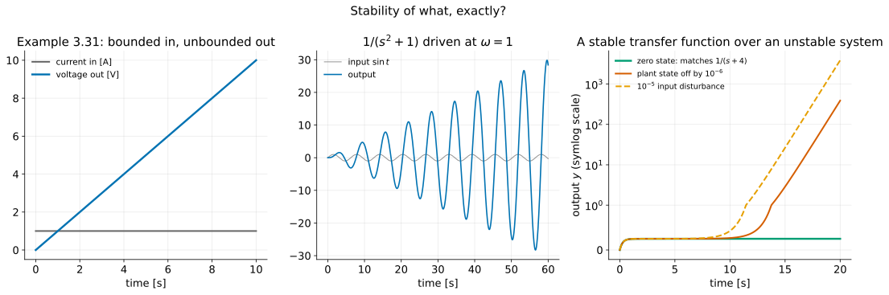
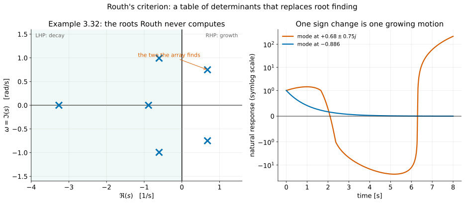
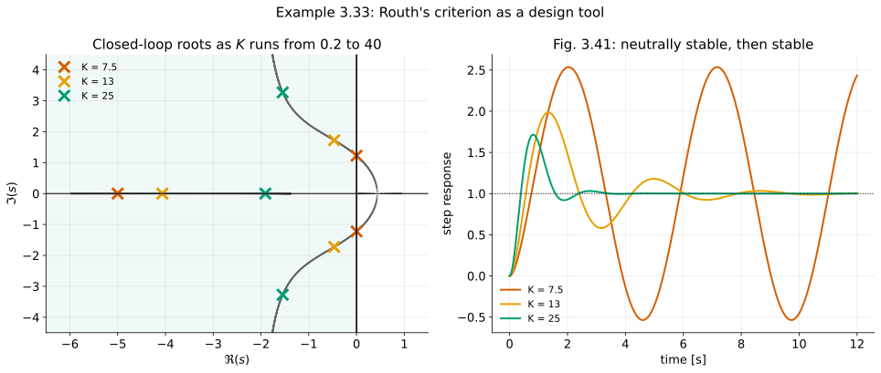
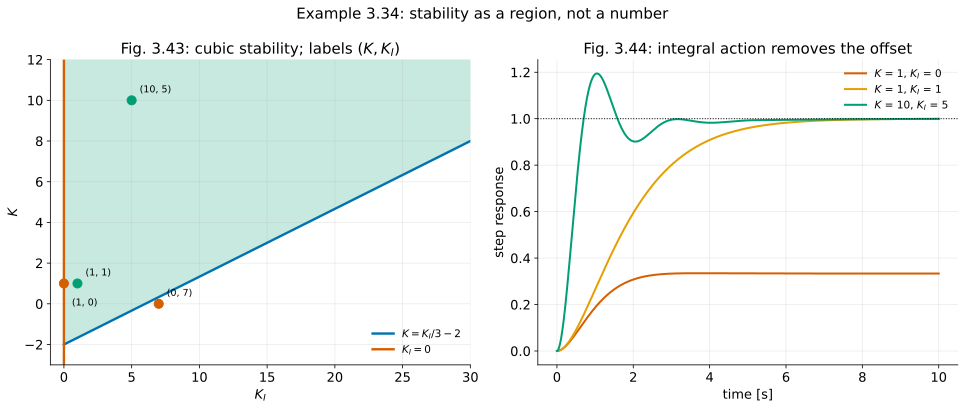

# Dynamic Response IV — Stability, Routh's Criterion, and Closing the Chapter

**Student lecture notes — FPE 8th ed., Sections 3.6 through 3.9**

Stability determines whether natural motion decays and whether bounded forcing produces a bounded output. These are different questions when internal modes are hidden from a transfer function. Routh’s criterion tests a characteristic polynomial and gives stability ranges with controller gains left as symbols.

**Prerequisites:** [L1](convolution-impulse-response_student.md), [L2](block-diagrams_student.md), and [L3](time-domain-specs_student.md).

**Source:** Franklin, Powell & Emami-Naeini, *Feedback Control of Dynamic Systems*, 8th ed. Example and equation numbers follow the textbook. Numbered sections and § references refer to these notes unless labelled as textbook sections.

## Learning objectives

After studying this lecture, you should be able to:

1. State the stability condition for an LTI system in terms of the roots of its characteristic polynomial.
2. Define BIBO stability, prove the sufficiency of $\int|h|<\infty$, and explain the sign-matching input argument for necessity.
3. Show that a capacitor driven by a current source is not BIBO stable, and connect that to its pole at the origin.
4. Distinguish asymptotic stability, neutral stability and instability, including the case of repeated imaginary-axis poles.
5. Explain why a pole-zero cancellation can hide an unstable mode, and where that mode reappears.
6. Apply the necessary condition on the coefficients of $a(s)$, and say why it is not sufficient.
7. Build a Routh array and count right half-plane roots from the sign changes in its first column.
8. Use Routh's criterion to find the range of a single gain that stabilises a loop (Example 3.33).
9. Use it with two parameters to find a stable region in a parameter plane (Example 3.34).
10. Explain what system identification and amplitude/time scaling are for, and where the book puts them.

## Notation and assumptions

| Symbol | Meaning |
|---|---|
| $a(s)$ | characteristic polynomial, $s^n+a_1s^{n-1}+\cdots+a_n$ |
| $p_i$ | roots of the full characteristic polynomial (internal modes), before transfer-function cancellation |
| $h(t)$ | impulse response |
| BIBO | bounded input, bounded output |
| $K,\ K_I$ | proportional and integral controller gains |

LHP and RHP mean the left and right half planes. Internal stability refers to the complete physical realisation; BIBO stability refers to a specified input-output map from zero initial state.

---

## 1. Why stability needs a separate test {#section-1}

Final-value calculations and settling-time estimates require the relevant transients to decay. Feedback changes pole locations, so stability must be checked for the actual interconnection and controller gains. A symbolic stability test can identify an entire allowable gain range.

---

## 2. Stability, and the first version of the test {#section-2}

### 2.1 The statement {#section-2-1}

$$
\boxed{
\begin{array}{c}
\text{A finite-dimensional LTI realisation is asymptotically stable}\\
\text{if and only if all roots of its full characteristic polynomial}\\
\text{have strictly negative real parts.}
\end{array}}
$$

Three cases:

| Poles | Free response | Name |
|---|---|---|
| All strictly in the LHP | decays to zero | asymptotically stable |
| Any in the RHP | grows | unstable |
| Simple $j\omega$ modes, all remaining modes strictly in the LHP | bounded, with persistent constants or oscillations | neutrally stable |

Failure of asymptotic stability does not necessarily mean growing free motion. Neutral systems have bounded free responses but need not have bounded forced responses. In the RHP case, some initial conditions may fail to excite the growing mode; instability means that not every small initial perturbation remains bounded.

### 2.2 BIBO stability {#section-2-2}

A different question, asked from zero initial state: *does every bounded input produce a bounded output?* First assume a causal, strictly proper rational system so that its impulse response is an ordinary function.

Start from convolution. If $|u|\le M$ then

$$
|y(t)|=\left|\int h(\tau)u(t-\tau)\,d\tau\right|
\le M\int_{-\infty}^{\infty}|h(\tau)|\,d\tau ,
$$

so the output is bounded whenever $\int|h|$ is. For necessity, fix a finite observation time $T$ and choose one bounded causal test input

$$
u_T(t)=
\begin{cases}
\operatorname{sgn}h(T-t),&0\le t\le T\\
0,&\text{otherwise}.
\end{cases}
$$

Then at that observation time

$$
y_T(T)=\int_0^T|h(\tau)|\,d\tau.
$$

If the absolute integral diverges, these outputs can be made arbitrarily large with inputs bounded by 1: no uniform bounded-input gain exists. This is the finite-horizon version of the book's sign-matching argument in Eq. (3.84). This is a family of test inputs indexed by a fixed observation time $T$, rather than one waveform whose definition changes during the experiment. The resulting criterion is

$$
\boxed{
\text{BIBO stable}
\iff
\int_{-\infty}^{\infty}|h(\tau)|\,d\tau<\infty
\tag{3.85}
}
$$

Matching a bounded input to the sign of the reversed impulse response maximises the output at a chosen time. The capacitor and resonant oscillator below provide fixed bounded inputs whose outputs grow without bound.

For a proper model with direct feedthrough, $h(t)=D\delta(t)+h_r(t)$; use finite $D$ and $\int_0^\infty|h_r|<\infty$, rather than treating $|\delta|$ as an ordinary function. For causal proper rational systems the criterion is equivalent to all **uncancelled transfer-function poles** lying strictly in the LHP.

### 2.3 Example 3.31: the capacitor {#section-2-3}

Current in, voltage out. Transform $C\dot v=i$ with $v(0^-)=0$ to get $CsV(s)=I(s)$. The transfer function is therefore $V/I=1/(Cs)$, and since $1/s\leftrightarrow1(t)$, $h(t)=1(t)/C$. The book uses the normalised case $C=1$, giving

$$
\int_{-\infty}^{\infty}|h(\tau)|\,d\tau=\int_0^\infty d\tau=\infty .
$$

Not BIBO stable. Physically obvious: hold a constant current into a capacitor and the voltage climbs forever. The transfer function is $1/s$ — one pole, on the imaginary axis, at the origin.

$$
\boxed{
\text{BIBO stability requires }\textbf{every}\text{ pole strictly inside the LHP}
}
$$

**Worked check:** For a 1 F capacitor at rest, a 1 A constant current gives $v(t)=t$ volts. For $H(s)=1/(s^2+1)$ and $u(t)=\sin t\,1(t)$, verify $y(t)=(\sin t-t\cos t)/2$. Both bounded inputs produce unbounded outputs, despite the absence of RHP poles.

*Working.* The capacitor: $V=\frac1s\cdot\frac1s=\frac1{s^2}$, so $v=t$. The resonance: $Y=\frac{1}{s^2+1}\cdot\frac{1}{s^2+1}=\frac{1}{(s^2+1)^2}$, a *repeated* pole pair at $\pm j$. This is not in the elementary table, so use property 9 of the properties table in L1 §6 ($tf\leftrightarrow-dF/ds$) on the cosine. $\mathcal L\{t\cos t\}=-\frac{d}{ds}\frac{s}{s^2+1}=\frac{s^2-1}{(s^2+1)^2}$. Write $\frac{1}{(s^2+1)^2}=\frac12\left[\frac{1}{s^2+1}-\frac{s^2-1}{(s^2+1)^2}\right]$; the check is $\frac{(s^2+1)-(s^2-1)}{2(s^2+1)^2}=\frac{1}{(s^2+1)^2}$. Inverting gives $y=\tfrac12(\sin t-t\cos t)$. The $t\cos t$ term grows linearly: forcing at the pole frequency makes the input's poles coincide with the plant's.



---

## 3. Internal stability {#section-3}

### 3.1 The characteristic equation, before any cancellation {#section-3-1}

$$
a(s)=s^n+a_1s^{n-1}+\cdots+a_n=0
\tag{3.86}
$$

For distinct roots the free response is

$$
y(t)=\sum_{i=1}^{n}K_ie^{p_it}
\tag{3.88}
$$

and it decays for every set of initial conditions if and only if

$$
\boxed{
\Re\{p_i\}<0\quad\text{for all }i
\tag{3.89}
}
$$

This is **internal asymptotic stability**, provided $a(s)$ represents the full physical realisation or interconnection. In state-space language it is $\det(sI-A)$. An arbitrarily unreduced fraction is not enough: multiplying a transfer function by $(s-1)/(s-1)$ does not establish that a physical unstable state exists. The book's “before cancellation” warning means retain actual internal dynamics when deriving the characteristic equation.

### 3.2 The imaginary axis, carefully {#section-3-2}

| Poles on the axis | Free response |
|---|---|
| One simple pole at the origin | a constant that never decays |
| A simple conjugate pair at $\pm j\omega_1$ | constant-amplitude oscillation |
| **Repeated** poles on the axis | $te^{\pm j\omega_1t}$ terms: **unbounded** |

A double integrator has two poles at zero and free motion $y(t)=y(0)+\dot y(0)t$. A nonzero initial velocity gives an unbounded ramp. The satellite in L1 §10 is a physical example.

$$
\boxed{
\text{simple on the axis} \Rightarrow \text{neutrally stable}
\qquad
\text{repeated on the axis} \Rightarrow \text{unstable}
}
$$

**Scope:** the repeated-pole statement above applies to the scalar ODE/transfer-pole setting. For a general state-space realisation, repeated imaginary-axis eigenvalues can still give bounded free motion if they are semisimple (no nontrivial Jordan blocks). For example, $A=0_{2\times2}$ gives two constant states; a double integrator has a Jordan block and gives a ramp. Neutrality also requires no RHP modes.

### 3.3 The cancellation trap {#section-3-3}

Cancellation can conceal internal dynamics:

> *If a zero were to cancel a pole in the RHP for the transfer function, the corresponding $K_i$ would equal zero in the output, but the unstable transient would appear in some internal variable.*

Consider a unity negative-feedback loop with plant and controller

$$
G(s)=\frac{1}{s-1}
\qquad\qquad
C(s)=\frac{s-1}{s+3}
$$

The controller's zero cancels the plant's unstable pole:

$$
C(s)G(s)=\frac{s-1}{s+3}\cdot\frac{1}{s-1}=\frac{1}{s+3} .
$$

With unity feedback, multiply the numerator and denominator by $s+3$:

$$
T(s)=\frac{CG}{1+CG}=\frac{1/(s+3)}{1+1/(s+3)}=\frac{1}{(s+3)+1}=\frac{1}{s+4} .
$$

A stable first-order input-output transfer function. It does not certify the internal stability of the interconnection.

Realise the loop with states and look at the eigenvalues. With $x_p$ the plant state ($y=x_p$) and $x_c$ the controller state:

*Step 1: split the controller.* Long division gives $\dfrac{s-1}{s+3}=1+\dfrac{-4}{s+3}$, because $(s+3)-4=s-1$. The controller is therefore a direct gain of 1 plus a first-order lag with input $e$:

$$
\dot x_c=-3x_c+e,
\qquad
u=e-4x_c .
$$

Check: $X_c=E/(s+3)$, so $U=\left(1-\dfrac4{s+3}\right)E$ ✓.

*Step 2: write the loop.* The error is $e=r-y=r-x_p$, and the plant $1/(s-1)$ is $\dot x_p=x_p+u$. Substituting,

$$
\dot x_p=x_p+(r-x_p)-4x_c=r-4x_c,
\qquad
\dot x_c=-3x_c+r-x_p .
$$

The $x_p$ terms cancel in the first equation. That is the cancellation, seen in the time domain. Collecting into $\dot x=Ax+Br$:

$$
A=\begin{bmatrix}0&-4\\-1&-3\end{bmatrix}
$$

*Step 3: eigenvalues.*

$$
\det(sI-A)=\det\begin{bmatrix}s&4\\1&s+3\end{bmatrix}=s(s+3)-4=s^2+3s-4=(s+4)(s-1) .
$$

$$
\boxed{
\text{eigenvalues of }A: \quad -4 \quad\text{and}\quad +1
}
$$

The full characteristic polynomial $(s+4)(s-1)$ is also what you get by keeping the cancelled factor: $(s-1)(s+3)+(s-1)=(s-1)(s+4)$.

The mode at $+1$ is not in $T(s)$. It is in the system.

**Worked check:** With a unit reference step and zero initial state, $y(t)=(1-e^{-4t})/4$. With $x_p(0)=\epsilon$, $x_c(0)=0$, add $\epsilon(4e^t+e^{-4t})/5$. For $\epsilon=10^{-6}$ the total output is about 0.268 at 10 s and 388.38 at 20 s. The growing mode is observable at $y$ but cannot be excited by $r$ from rest.

*Working.* The eigenvectors are $(A-I)v=0\Rightarrow v_{+1}=(4,-1)$ and $(A+4I)v=0\Rightarrow v_{-4}=(1,1)$. Expand the initial state: $(\epsilon,0)=a(4,-1)+b(1,1)$ gives $b=a$ and $5a=\epsilon$, so $a=b=\epsilon/5$. The first component is $x_p=\frac{\epsilon}{5}(4e^{t}+e^{-4t})$. The input $B=(1,1)^T$ is itself the $-4$ eigenvector, which is why $r$ never excites $e^{t}$. At $t=10$: $0.25+0.8\times10^{-6}e^{10}=0.25+0.0176=0.268$. At $t=20$: $0.25+0.8\times10^{-6}e^{20}=0.25+388.13=388.38$.

The cancelled mode is **uncontrollable from $r$** but **observable at $y$**: reference inputs from rest cannot excite it, while an initial perturbation can appear in the measured output. State-space analysis develops these concepts further.

---

## 4. Routh's criterion {#section-4}

### 4.1 A necessary coefficient condition {#section-4-1}

$$
\boxed{
\text{A necessary condition for stability: every coefficient of }a(s)\text{ is present and positive.}
}
$$

The reason is one line: a stable polynomial factors into terms $(s+\sigma)$ and $(s^2+2\zeta\omega_ns+\omega_n^2)$ with all coefficients positive, and a product of polynomials with positive coefficients has positive coefficients.

In more detail: a real root $p=-\sigma$ with $\sigma>0$ gives the factor $(s+\sigma)$. A complex pair $-\sigma\pm j\omega_d$ gives $(s+\sigma)^2+\omega_d^2=s^2+2\sigma s+(\sigma^2+\omega_d^2)$, again with all coefficients positive. Multiplying such factors only adds products of positive numbers, so no coefficient can be zero or negative. For example, $(s+1)(s^2+s+1)=s^3+2s^2+2s+1$.

**A missing or negative coefficient rules out all roots being strictly in the LHP**, for this monic real polynomial. A missing coefficient alone does not prove a RHP root: $s^2+1$ has only imaginary-axis roots. Check whether the result is neutral or growing before calling its free response unstable.

It is *not* sufficient. Example 3.32 is the counterexample, and it is next.

### 4.2 The array {#section-4-2}

For $a(s)=s^n+a_1s^{n-1}+\cdots+a_n$, write two rows by taking alternate coefficients:

```text
   s^n  |   1     a2     a4    ...
 s^(n-1)|   a1    a3     a5    ...
 s^(n-2)|   b1    b2     b3    ...
 s^(n-3)|   c1    c2     c3    ...
   ...
   s^0  |   *
```

with

$$
b_1=\frac{a_1a_2-a_3}{a_1},
\qquad
b_2=\frac{a_1a_4-a_5}{a_1},
\qquad
c_1=\frac{b_1a_3-a_1b_2}{b_1},
\qquad\dots
$$

Each entry is a $2\times2$ determinant of the two rows above, divided by the first element of the row immediately above, with a sign flip. The determinant always uses the first column of the two rows above, together with the column one to the right of the entry being computed:

$$
b_1=-\frac{1}{a_1}\det\begin{bmatrix}1&a_2\\a_1&a_3\end{bmatrix}=-\frac{a_3-a_1a_2}{a_1}=\frac{a_1a_2-a_3}{a_1} .
$$

Missing entries at the right-hand end of a row are treated as zero. Then:

$$
\boxed{
\begin{array}{c}
\text{All roots are strictly in the LHP iff the ordinary array has a positive first column.}\\[4pt]
\text{The number of RHP roots equals the number of \textbf{sign changes} in that column.}
\end{array}}
$$

A pattern $+,-,+$ counts as **two** sign changes.

These statements assume the ordinary array is defined, with no zero pivots or zero rows. Handle those cases as in §7 before counting signs; an auxiliary-polynomial replacement alone must not be used to certify strict stability of the original polynomial.

**Practical note from the book:** any row may be multiplied or divided by a positive constant to keep the arithmetic clean.

### 4.3 Example 3.32 {#section-4-3}

$$
a(s)=s^6+4s^5+3s^4+2s^3+s^2+4s+4
$$

Every coefficient is present and positive, so the necessary coefficient condition is satisfied. The Routh array gives the stronger test:

| row | | | | |
|---|---:|---:|---:|---:|
| $s^6$ | 1 | 3 | 1 | 4 |
| $s^5$ | 4 | 2 | 4 | 0 |
| $s^4$ | 2.5 | 0 | 4 | |
| $s^3$ | 2 | $-2.4$ | 0 | |
| $s^2$ | 3 | 4 | | |
| $s^1$ | $-5.0667$ | 0 | | |
| $s^0$ | 4 | | | |

**Row by row.** The first two rows are the alternate coefficients: $1,3,1,4$ from $s^6,s^4,s^2,s^0$ and $4,2,4,0$ from $s^5,s^3,s^1$. Each later entry is computed as

$$
\frac{(\text{first-column pivot above})\times(\text{entry two rows up, one column right})-(\text{first-column entry two rows up})\times(\text{entry above, one column right})}{\text{first-column pivot above}} .
$$

The rows work out as follows:

$$
s^4:\quad
\frac{4\cdot3-1\cdot2}{4}=\frac{10}{4}=2.5,
\qquad
\frac{4\cdot1-1\cdot4}{4}=0,
\qquad
\frac{4\cdot4-1\cdot0}{4}=4 .
$$

$$
s^3:\quad
\frac{2.5\cdot2-4\cdot0}{2.5}=2,
\qquad
\frac{2.5\cdot4-4\cdot4}{2.5}=\frac{-6}{2.5}=-2.4,
\qquad
\frac{2.5\cdot0-4\cdot0}{2.5}=0 .
$$

$$
s^2:\quad
\frac{2\cdot0-2.5\cdot(-2.4)}{2}=\frac{6}{2}=3,
\qquad
\frac{2\cdot4-2.5\cdot0}{2}=4 .
$$

$$
s^1:\quad
\frac{3\cdot(-2.4)-2\cdot4}{3}=\frac{-7.2-8}{3}=-\frac{15.2}{3}=-5.0667 .
$$

$$
s^0:\quad
\frac{(-5.0667)\cdot4-3\cdot0}{-5.0667}=4 .
$$

The last entry always equals the constant coefficient $a_n$, which is a quick check on the arithmetic. The $s^4$ row contains a zero, but not in its first column, so the ordinary array is still defined.

First column: $1,\ 4,\ 2.5,\ 2,\ 3,\ -5.0667,\ 4$. The sign goes $+\to-$ between $s^2$ and $s^1$, and $-\to+$ between $s^1$ and $s^0$. **Two sign changes**, so two roots in the right half plane.

**Worked check:** Numerical roots of Example 3.32 are approximately $-3.2644,-0.8858,-0.6046\pm0.9935j,+0.6797\pm0.7488j$. Their sum is $-4$, and there are two RHP roots. The textbook’s printed $+0.7797$ is a typo; the correct real part is $+0.6797$.

The sum-of-roots check catches the typo. For a monic polynomial, the roots sum to $-a_1=-4$. The real parts give $-3.2644-0.8858+2(-0.6046)+2(0.6797)=-4.1502-1.2092+1.3594=-4.0000$ ✓. With $+0.7797$ the sum would be $-3.8$ ✗.

#### Check your understanding

> Routh gives a count, not locations. When is a count enough?

Whenever the question is a yes-or-no about stability, or a *boundary* in a parameter. That is the next two examples.



---

## 5. Example 3.33: the range of stabilising gain {#section-5}

**Textbook correction:** Use the plant $G(s)=(s+1)/[s(s-1)(s+6)]$, consistent with Example 3.33’s worked polynomial. The diagram’s printed factor $s+1$ in the denominator should be $s-1$.

Proportional gain $K$ around the plant $\dfrac{s+1}{s(s-1)(s+6)}$. Note the plant is already unstable, with a pole at $+1$.

The characteristic equation is $1+KG=0$. Multiply through by the plant denominator:

$$
1+K\frac{s+1}{s(s-1)(s+6)}=0
\quad\Longrightarrow\quad
s(s-1)(s+6)+K(s+1)=0 .
$$

Expand: $(s-1)(s+6)=s^2+5s-6$, so $s(s-1)(s+6)=s^3+5s^2-6s$. Adding $Ks+K$ gives

$$
\boxed{s^3+5s^2+(K-6)s+K=0}
$$

*The coefficient test first.* The coefficients require $K-6>0$ and $K>0$, so $K>6$ is necessary. Routh will tighten this.

The array. The first two rows are $1,\ K-6$ and $5,\ K$. Then

$$
s^1:\ \frac{5(K-6)-1\cdot K}{5}=\frac{4K-30}{5},
\qquad
s^0:\ \frac{\frac{4K-30}{5}\cdot K-5\cdot0}{\frac{4K-30}{5}}=K .
$$

$$
\begin{array}{c|cc}
s^3 & 1 & K-6\\
s^2 & 5 & K\\
s^1 & \dfrac{4K-30}{5} & \\
s^0 & K &
\end{array}
$$

Both $K$-dependent entries must be positive:

$$
\frac{4K-30}{5}>0
\quad\text{and}\quad
K>0
\qquad\Longrightarrow\qquad
\boxed{K>7.5}
$$

The first inequality gives $4K>30$, so $K>7.5$. That implies $K>0$ and the necessary condition $K>6$. The interval $6<K\le7.5$ is exactly the region where the coefficient test passes but the system is not stable. For $0<K<7.5$, the first column reads $+,+,-,+$: two sign changes, so two RHP roots.

Routh’s criterion answers the stability question for an entire family of systems with $K$ left symbolic. A numerical root calculation checks a selected value of $K$; the inequalities derive the boundary for all values.

**Worked check:** At $K=7.5$, the polynomial is $s^3+5s^2+1.5s+7.5$. Group the terms: $s^2(s+5)+1.5(s+5)=(s+5)(s^2+1.5)$. The imaginary poles are $\pm j\sqrt{1.5}=\pm1.225j$, so the free response is neutral and the system is not BIBO stable. At $K=13$ the roots are approximately $-4.065,-0.468\pm1.726j$; at $K=25$, $-1.908,-1.546\pm3.273j$. The pair's damping ratio increases from about 0.261 to 0.427. Using $\zeta=\sigma/\sqrt{\sigma^2+\omega_d^2}$: $0.468/\sqrt{0.219+2.979}=0.468/1.788=0.261$ and $1.546/\sqrt{2.390+10.711}=1.546/3.620=0.427$. Still, the zero and third pole mean that damping ratio alone does not determine overshoot; compute the full response to determine overshoot.



---

## 6. Example 3.34: two parameters, and a region {#section-6}

Use a PI controller $C(s)=K+K_I/s$ in unity negative feedback around the plant $G(s)=1/[(s+1)(s+2)]$.

First write the controller over a common denominator: $K+\dfrac{K_I}{s}=\dfrac{Ks+K_I}{s}$. Then multiply the characteristic equation through by $s(s+1)(s+2)$:

$$
1+\frac{Ks+K_I}{s}\cdot\frac{1}{(s+1)(s+2)}=0
\quad\Longrightarrow\quad
s(s+1)(s+2)+Ks+K_I=0 .
$$

Expand: $(s+1)(s+2)=s^2+3s+2$, so $s(s^2+3s+2)=s^3+3s^2+2s$. Adding $Ks+K_I$ gives

$$
\boxed{s^3+3s^2+(2+K)s+K_I=0}
$$

The closed-loop transfer function has the same denominator: $T=\dfrac{CG}{1+CG}=\dfrac{Ks+K_I}{s^3+3s^2+(2+K)s+K_I}$, with a zero at $-K_I/K$.

Array. The first two rows are $1,\ 2+K$ and $3,\ K_I$. Then

$$
s^1:\ \frac{3(2+K)-1\cdot K_I}{3}=\frac{6+3K-K_I}{3},
\qquad
s^0:\ K_I .
$$

$$
\begin{array}{c|cc}
s^3 & 1 & 2+K\\
s^2 & 3 & K_I\\
s^1 & \dfrac{6+3K-K_I}{3} & \\
s^0 & K_I &
\end{array}
$$

The first column is $1,\ 3,\ \frac{6+3K-K_I}{3},\ K_I$. For all of it to be positive, the last entry needs $K_I>0$, and the third needs $6+3K-K_I>0$, i.e. $3K>K_I-6$, i.e. $K>K_I/3-2$:

$$
\boxed{
K_I>0
\qquad\text{and}\qquad
K>\frac{K_I}{3}-2
}
$$

In the $(K,K_I)$ plane the second condition is the region below the straight line $K_I=3K+6$, which has slope 3 and $K_I$-intercept 6. The first condition is the region above the $K$ axis. Their intersection is the allowable region (textbook Fig. 3.43).

**Worked check:** At $K=K_I=1$, $T(s)=(s+1)/(s+1)^3=1/(s+1)^2$, with unit final value. The denominator is $s^3+3s^2+3s+1=(s+1)^3$ by the binomial theorem, and $T(0)=K_I/K_I=1$ for any stable $K_I>0$, which is the integrator doing its job. Routh: $6+3-1=8>0$ ✓. At $K=10,K_I=5$, the polynomial is $s^3+3s^2+12s+5$ ($6+30-5=31>0$ ✓), the roots are approximately $-0.462,-1.269\pm3.036j$, and the zero is at $-K_I/K=-0.5$. Check: the roots sum to $-0.462-2.538=-3.000=-a_1$ ✓. The imaginary part is approximately 3.036, correcting the textbook’s value near 3.3. Treat $K_I=0$ separately, as explained below.

**Boundary case $K_I=0$.** The cubic becomes $s[s^2+3s+(2+K)]$. If the PI integrator state is retained, it has a neutral mode and the full realisation is not asymptotically stable. If the integral term is removed and the controller is implemented as a pure gain, the physical closed loop is second order and is stable for $K>-2$. In that case $T=\dfrac{K}{(s+1)(s+2)+K}=\dfrac{K}{s^2+3s+2+K}$; a second-order polynomial is stable iff all its coefficients are positive, so $2+K>0$. At $K=1$, $T=1/(s^2+3s+3)$ has final value $T(0)=1/3$. The zero at the origin cancels in that input-output transfer; it is not an uncancelled transfer pole. Distinguish controller implementation from an algebraic factor introduced by multiplying through by $s$.



*PI stability region:* the shaded set has $K_I>0$ and $K>K_I/3-2$; both boundary lines are excluded for strict stability of the full cubic. The $K_I=0$ response shown at right uses a controller implemented as a pure proportional gain. Stable PI cases shown reach a unit final value; the pure-gain case at $K=1$ reaches $1/3$.

#### Check your understanding

> Could you have found that straight line by computing roots?

Numerical roots can confirm selected points; the symbolic inequalities give the entire region and its straight-line boundary.

---

## 7. Special cases and further topics {#section-7}

The following extensions explain how to handle special cases and connect the analysis to measured models.

**Special cases [procedures beyond the chapter's printed treatment].** Appendix W3.6.3 gives the full treatment. Two rules are useful now:

- If the first element is zero but the row is not all zero, replace that element by $\epsilon>0$, continue, and count signs as $\epsilon\to0^+$.
- If an entire row is zero, form an auxiliary polynomial from the row immediately above, replace the zero row by its derivative's coefficients, and continue. Also examine the auxiliary roots: symmetry about the origin can mean imaginary-axis pairs **or** real pairs $\pm a$, so a zero row does not by itself imply neutrality.

At the $K=7.5$ boundary of Example 3.33, the $s^1$ row vanishes, since $(4\cdot7.5-30)/5=0$. The row above ($s^2$: $5,\ 7.5$) gives the auxiliary polynomial $A(s)=5s^2+7.5$, with roots $s^2=-1.5$, so $s=\pm j\sqrt{1.5}$. Its derivative is $dA/ds=10s$, so replace the zero row by $10$. The completed first column is $1,5,10,7.5$, with no sign changes, so there are no RHP roots. The auxiliary roots are the imaginary pair. The remaining root is $-5$, from dividing the cubic by $s^2+1.5$, confirming bounded free oscillation but neither asymptotic nor BIBO stability.

**Kharitonov's theorem (1978).** For a real fixed-degree polynomial family whose coefficients vary independently within specified intervals (with a leading coefficient bounded away from zero), robust strict stability can be checked using four particular endpoint polynomials. This is a pointer to robust control, not a recipe for arbitrary correlated or changing-order uncertainty.

**System identification (textbook §3.7).** Building a model from measured data rather than from first principles. The frequency-response measurement of L1 §4 is the simplest version: drive with sinusoids, record amplitude ratio and phase, and you have $H(j\omega)$ without ever writing an equation of motion. Details in Appendix W3.7.

**Amplitude and time scaling (textbook §3.8).** When model quantities span many orders of magnitude, rescale both signal amplitudes and time, then translate results back to physical units. For example, $\hat y=y/y_{\rm ref}$ is amplitude scaling and $\hat t=t/t_{\rm ref}$ is time scaling. The one-sided transform rule is $\mathcal L\{f(at)\}=F(s/a)/a$ for $a>0$. The printed chapter points to Appendix W3.8 for the details; time scaling alone is not the whole topic.

---

## 8. Historical perspective {#section-8}

The textbook’s historical discussion connects these methods to the development of operational calculus and transform methods.

**Oliver Heaviside** developed operational methods that treated differential equations algebraically. **Pierre-Simon Laplace** and **Joseph Fourier** give their names to the transform methods used here. Fourier methods represent signals through sinusoidal components; Laplace methods add exponential weighting and are especially useful for transient and initial-value problems.

The textbook also highlights Gardner and Barnes’s 1942 work in spreading Laplace-transform methods among engineers.

---

## 9. Chapter summary {#section-9}

The book's summary, with the qualifications developed in these lectures. Here $Y=GU$ assumes zero initial state; the time specifications assume the unit-gain zero-free standard pair with $0<\zeta<1$, and $t_s$ uses a 1% band:

$$
\boxed{
\mathcal L\{f\}=\int_{0^-}^{\infty}f(t)e^{-st}\,dt
\qquad
\mathcal L\{\dot f\}=sF(s)-f(0^-)
\qquad
Y(s)=G(s)U(s)
}
$$

$$
\boxed{
\text{final value } \lim_{t\to\infty}y=\lim_{s\to0}sY(s)
\ \ \text{(all poles of }sY\text{ in the LHP)}
\qquad
\text{feedback } \frac{G_1}{1+G_1G_2}
}
$$

$$
\boxed{
t_r\simeq\frac{1.8}{\omega_n}
\qquad
M_p=e^{-\pi\zeta/\sqrt{1-\zeta^2}}
\qquad
t_s\simeq\frac{4.6}{\zeta\omega_n}
}
$$

$$
\boxed{
\begin{array}{l}
\text{Single real LHP zero in the standard family} \rightarrow \text{more overshoot}\\
\text{Single real RHP zero in that family} \rightarrow \text{initial inverse response}\\
\text{Extra real LHP pole in that family} \rightarrow \text{slower rise}\\
\text{Internal asymptotic stability} \rightarrow \text{all internal modes strictly in the LHP}
\end{array}}
$$

### The book's review questions

Use these questions to check the connections across all four lectures:

- What is a transfer function, and what must be true of a system for one to exist?
- State the Final Value Theorem. What is its most common use in control?
- Given $\zeta$ and $\omega_n$, estimate the rise time, the overshoot and the settling time.
- What is the most noticeable effect of a right half-plane zero on a step response?
- What is the main use of Routh's criterion?

---

## 10. Looking ahead {#section-10}

The four lectures connect physical differential equations, convolution, transfer functions, pole geometry, response specifications, and stability. Poles describe visible natural rates; zeros and input signals determine how modes are excited. Internal stability requires the complete physical model. These tools prepare for feedback design, where controller parameters are chosen to produce the desired response.

---

## Review questions

1. The capacitor is not BIBO stable, yet capacitors are in every circuit you own. In what sense is the analysis useful and in what sense is it beside the point?
2. Give a system that is neutrally stable but harmless, and one that is neutrally stable and dangerous. What distinguishes them?
3. The cancelled unstable mode in §3.3 never appears in $T(s)$. Name three physical events that would excite it in a real machine.
4. Routh's test gives a count of RHP roots, not their locations. Design a situation where the count alone is exactly what you need, and one where it is useless.
5. Example 3.33 required $K>7.5$ to stabilise an already-unstable plant. Is there an upper limit on $K$ here, and is that typical?
6. In Example 3.34, increasing $K_I$ at fixed $K$ eventually loses stability. How does the added integrator alter the dynamics? Why is this not a claim that integral action is always destabilising?
7. Kharitonov's theorem reduces an independent interval-coefficient family to four endpoint polynomials. Which uncertainty assumptions must hold before applying it to measured coefficients?

## Optional practice

Optional practice from FPE, 8th edition; these are study suggestions, not an assignment.

| Problem | Topic |
|---|---|
| 3.51 | Time to double for unstable modes |
| 3.52 | Unity-feedback stability via Routh |
| 3.53 | Count RHP roots of given polynomials |
| 3.54, 3.55 | Ranges of a parameter for stability |
| 3.56 | Magnetic levitation with feedback |
| 3.58 | Require all poles to lie left of a specified negative real part |
| 3.59 | Constraints on two gains and an allowable region |
| Review Questions 3.10–3.12 | Stability, Routh, system identification |

## Chapter 3 student notes

- [L1: Convolution and transfer functions](convolution-impulse-response_student.md)
- [L2: Block diagrams and pole locations](block-diagrams_student.md)
- [L3: Specifications and zeros](time-domain-specs_student.md)
- [L4: Stability and Routh’s criterion](stability_student.md)
