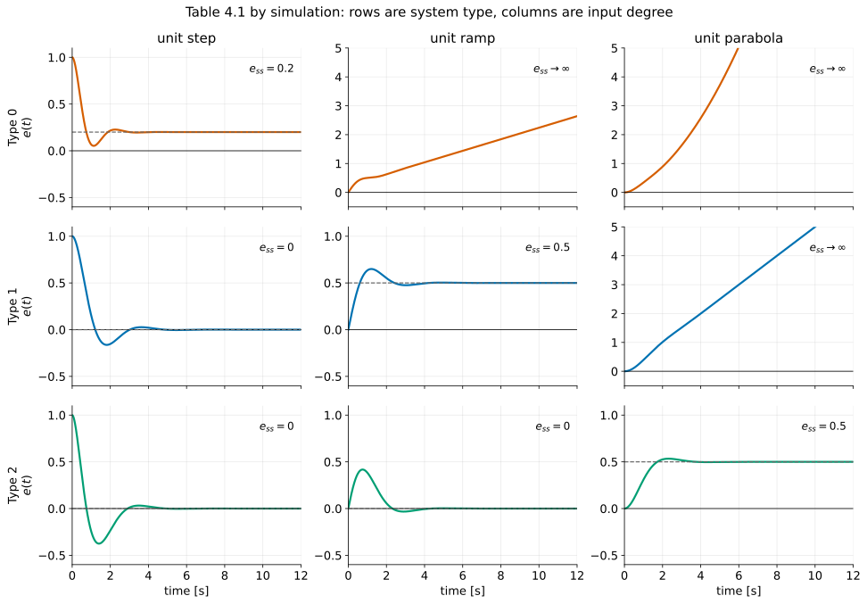
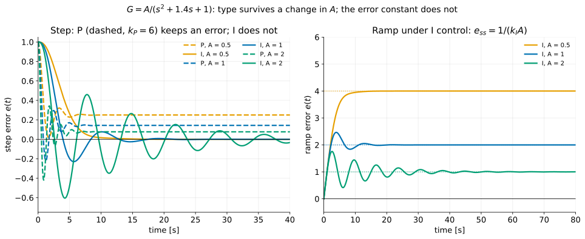
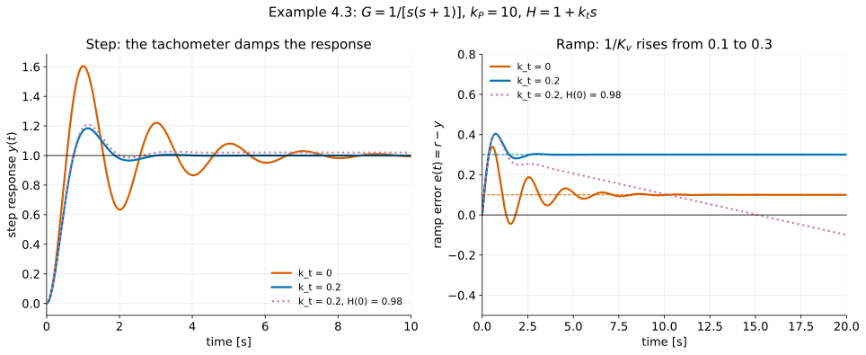
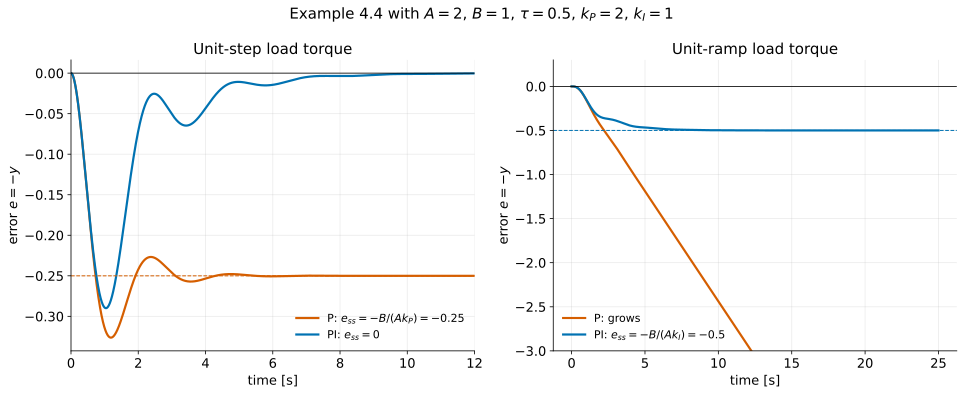

# A First Analysis of Feedback III — Steady-State Error and System Type

**Student lecture notes — FPE 8th ed., Section 4.2**

A feedback loop's steady-state accuracy to steps, ramps and parabolas is decided by an integer, the system type. For unity feedback and a reference input, the type is the number of integrators in the loop. Gains only set the size of a constant error. This lecture derives that result from the Final Value Theorem, extends it to loops with sensor dynamics and to disturbance inputs, and shows what raising the type costs.

**Prerequisites:** [L1: The Basic Equations of Control](feedback-properties_student.md) and [L2: PID Control](pid-control_student.md). From Chapter 3: the Final Value Theorem ([Ch. 3 L1 §8](convolution-impulse-response_student.md#section-8)) and Routh's criterion ([Ch. 3 L4 §4](stability_student.md#section-4)).

**Source:** Franklin, Powell & Emami-Naeini, *Feedback Control of Dynamic Systems*, 8th ed. Example, equation and figure numbers follow the textbook. Numbered sections and § references refer to these notes unless labelled as textbook sections. Material marked **[beyond the book]** is not in the printed chapter.

## Learning objectives

After studying this lecture, you should be able to:

1. Explain why polynomial inputs (step, ramp, parabola) are the right test signals for steady-state accuracy, and name the "position, velocity, acceleration" convention.
2. Derive the steady-state error of a stable unity-feedback loop to $t^k/k!$ from the Final Value Theorem, Eqs. (4.28)–(4.35).
3. Define system type and the error constants $K_p$, $K_v$, $K_a$, and reproduce Table 4.1 from the single formula $e_{ss}=\lim_{s\to0}s^n/(s^n+K_n)\cdot1/s^k$.
4. Determine type and error constant for the P and PI speed-control loops (Examples 4.1, 4.2) and for the P and I loops of L2.
5. Explain why type is robust to parameter changes in unity feedback while error constants are not.
6. Compute steady-state error with sensor dynamics from $1-\mathcal T(s)$, Eqs. (4.39)–(4.45), and explain why $H(0)=1$ matters (Example 4.3).
7. Classify a loop by type with respect to a disturbance, Eqs. (4.46)–(4.48), and identify which integrators count (Example 4.4).
8. Compute $K_v$ from closed-loop poles and zeros (Truxal's formula), and interpret $1/K_v$ as the area under the step error.
9. Explain the cost of raising type: each added integrator makes stability harder, and must usually come with a zero.

## Notation and assumptions

| Symbol | Meaning |
|---|---|
| $G,\ D_c,\ H$ | plant, controller, sensor. The book writes $D_{cl}$ for the controller in §4.2.1 and $D_c$ from Eq. (4.39) on; they are the same block |
| $R,\ W,\ V$ | reference, plant disturbance, sensor noise |
| $E=R-Y$ | **system error**: reference minus output, *not* the signal entering the controller |
| $S=\dfrac{1}{1+GD_c},\ \mathcal T=\dfrac{GD_c}{1+GD_c}$ | sensitivity and complementary sensitivity (L1) |
| $n$ | system type |
| $k$ | degree of the polynomial input $r(t)=t^k/k!$ |
| $K_n$ | $\lim_{s\to0}s^nGD_c(s)$; $K_p=K_0$, $K_v=K_1$, $K_a=K_2$ |
| $T_w,\ K_{n,w}$ | disturbance-to-error transfer function and its error constant |
| $k_P,\ k_I,\ k_D,\ k_t$ | proportional, integral, derivative, tachometer gains |

Every steady-state result in this lecture assumes that the closed loop is stable. An unstable loop has no steady state.

---

## 1. Why polynomial inputs {#section-1}

Real references are rarely steps. Over the time a loop takes to respond, though, most of them look like a low-degree polynomial.

*Fig. 4.3 — The elevation angle of an antenna tracking a satellite (PDF p. 21).*

The middle of the S-curve in Fig. 4.3 is nearly a straight line, a **ramp**. An elevator moving between floors at constant speed is also a ramp. A constant setpoint or a constant load is a **step**, and a constant-acceleration command is a **parabola**. The book writes the family as

$$
r(t)=\frac{t^k}{k!}\,1(t)
\qquad\Longleftrightarrow\qquad
R(s)=\frac{1}{s^{k+1}},
$$

and uses mechanical names whatever the physical units:

| $k$ | $r(t)$ | $R(s)$ | name |
|---:|---|---|---|
| 0 | $1(t)$ | $1/s$ | position (step) |
| 1 | $t$ | $1/s^2$ | velocity (ramp) |
| 2 | $t^2/2$ | $1/s^3$ | acceleration (parabola) |

The $1/k!$ makes every transform exactly $1/s^{k+1}$, because $\mathcal L\{t^k\}=k!/s^{k+1}$.

---

## 2. The error to a polynomial input {#section-2}

### 2.1 Unity feedback, reference only {#section-2-1}

*Fig. 4.2 — The unity-feedback loop of L1 (PDF p. 4).*

With $W=V=0$, L1's Eq. (4.8) gives

$$
E=\frac{1}{1+GD_c}R=SR .
\tag{4.27}
$$

With $R=1/s^{k+1}$, the Final Value Theorem gives

$$
e_{ss}=\lim_{s\to0}sE(s)=\lim_{s\to0}s\,\frac{1}{1+GD_c}\,\frac{1}{s^{k+1}} .
\tag{4.28–4.30}
$$

### 2.2 Separate the integrators from everything else {#section-2-2}

The limit depends on how $GD_c$ behaves as $s\to0$, which is set by its poles at the origin. Pull them out:

$$
GD_c(s)=\frac{GD_{co}(s)}{s^n},
\qquad
GD_{co}(0)=K_n\ \text{finite and nonzero}.
\tag{4.33}
$$

Substitute, and multiply the numerator and denominator by $s^n$:

$$
e_{ss}
=\lim_{s\to0}\frac{s}{1+GD_{co}(s)/s^n}\cdot\frac{1}{s^{k+1}}
=\lim_{s\to0}\frac{s^n}{s^n+K_n}\cdot\frac{1}{s^k}.
\tag{4.35}
$$

$$
\boxed{
e_{ss}=\lim_{s\to0}\frac{s^n}{s^n+K_n}\,\frac{1}{s^k}
=\begin{cases}
0, & n>k\\[2pt]
\dfrac{1}{1+K_0}, & n=k=0\\[6pt]
\dfrac{1}{K_n}, & n=k\ge1\\[6pt]
\infty, & n<k
\end{cases}}
$$

- $n>k$: the numerator carries $s^{n-k}\to0$, and the denominator tends to $K_n$. The error is zero.
- $n=k=0$: the $s^0$ terms are 1, giving $1/(1+K_0)$.
- $n=k\ge1$: the $s^n$ cancel, and $s^n+K_n\to K_n$. The error is $1/K_n$.
- $n<k$: a factor $1/s^{k-n}$ is left over, and the error grows without bound.

**Qualification:** in the last case the Final Value Theorem's hypothesis fails, since $sE(s)$ keeps a pole at the origin. "$e_{ss}=\infty$" is shorthand for "the error grows like $t^{k-n}$". The leftover $1/s^{k-n+1}$ term in the partial-fraction expansion inverts to a polynomial of degree $k-n$ in $t$.

The answer depends on one integer, $n$, compared with another, $k$. The gain enters only on the diagonal $n=k$, where it sets the size of a constant error.

---

## 3. System type and the error constants {#section-3}

### 3.1 Definitions {#section-3-1}

The integer $n$ is the **type** of the system. For a unity-feedback loop and a reference input, it is the number of poles of $GD_c$ at $s=0$, counting the controller's and the plant's together. Equivalently, a Type $k$ system follows a polynomial of degree $k$ with a nonzero constant error.

The constants on the diagonal are the **position**, **velocity** and **acceleration** error constants:

$$
\boxed{
K_p=\lim_{s\to0}GD_c(s),\qquad
K_v=\lim_{s\to0}sGD_c(s),\qquad
K_a=\lim_{s\to0}s^2GD_c(s)
}
\tag{4.36–4.38}
$$

Each is finite and nonzero only for its own type. A Type 1 system has $K_p=\infty$ and $K_a=0$.

**Units.** $K_p$ is dimensionless. $K_v$ has units of 1/s, because $1/K_v$ is the error, in output units, per unit of ramp rate (output units per second). $K_a$ has units of 1/s².

### 3.2 Table 4.1 {#section-3-2}

The body of Table 4.1 is missing from the 8th-edition PDF (PDF p. 26). The table below follows from Eq. (4.35):

| Type | step ($k=0$) | ramp ($k=1$) | parabola ($k=2$) |
|---|:---:|:---:|:---:|
| **Type 0** | $\dfrac{1}{1+K_p}$ | $\infty$ | $\infty$ |
| **Type 1** | $0$ | $\dfrac{1}{K_v}$ | $\infty$ |
| **Type 2** | $0$ | $0$ | $\dfrac{1}{K_a}$ |

**Source correction:** PDF p. 24 says a Type 0 system's error grows without bound "if the input should be a polynomial of degree higher than 1". It already grows for a ramp, which has degree 1: read "degree 1 or higher".

### 3.3 The table, measured {#section-3-3}

Three stable unity-feedback loops, one of each type:

| Loop | $GD_c$ | constant | closed-loop characteristic polynomial |
|---|---|---|---|
| Type 0 | $\dfrac{4}{(s+1)(0.5s+1)}$ | $K_p=4$ | $s^2+3s+10$ |
| Type 1 | $\dfrac{2}{s(0.5s+1)}$ | $K_v=2$ | $s^2+2s+4$ |
| Type 2 | $\dfrac{2(s+1)}{s^2(0.2s+1)}$ | $K_a=2$ | $s^3+5s^2+10s+10$ |

**Worked check:** the diagonal predictions are $1/(1+4)=0.2$, $1/2=0.5$ and $1/2=0.5$. Simulation at $t=30$ s gives 0.2000, 0.5000 and 0.5000. Above the diagonal, the Type 0 ramp error at 30 s is 6.24, close to $t/(1+K_p)=6$ plus a constant, and the Type 1 parabola error is 15.0, close to $t/K_v=15$. For the Type 2 cubic, Routh's $s^1$ entry is $(5\cdot10-10)/5=8>0$, so it is stable, with roots $-2.651,\ -1.175\pm1.547j$. Without the zero at $-1$ the polynomial would be $s^3+5s^2+10$, which has no $s$ term and so cannot be stable (§10).

*Fig. 4.4 — A Type 1 system tracking a ramp: the output runs at the same slope, a constant $1/K_v$ behind (PDF p. 25).*

The output in Fig. 4.4 follows at *the same speed* as the ramp. If it fell behind in speed, the error would grow, and the loop's integrator would respond until the speeds matched. In steady state the *input* to that integrator must be constant, so that its output ramps. Where that integrator sits changes the physical picture:

- **Integrator in the plant, P control** (a motor driven to a position): a constant error gives a constant control effort, which the plant turns into a constant output speed. The error is just large enough, $1/K_v$ per unit ramp rate, for $k_Pe$ to command that speed.
- **Integrator in the controller** (PI on a plant with finite DC gain): $\dot u=k_Ie$ in steady state, so a constant error makes the control effort *ramp* at a constant rate. The error is just large enough to ramp $u$ at the rate the plant needs to follow the reference.

In both cases the error is constant, but it is the integrator's input, not its output, that it holds fixed.

---

## 4. Examples 4.1 and 4.2: speed control with P and PI {#section-4}

The speed-control plant of §4.1 is $G(s)=\dfrac{A}{\tau s+1}$.

### 4.1 Example 4.1: proportional control {#section-4-1}

With $D_c=k_P$, $GD_c=\dfrac{k_PA}{\tau s+1}$ has no pole at $s=0$: **Type 0**, with

$$
\boxed{K_p=k_PA}
\qquad
e_{ss,\text{step}}=\frac{1}{1+k_PA}.
$$

### 4.2 Example 4.2: proportional plus integral {#section-4-2}

With $D_c=k_P+k_I/s=(k_Ps+k_I)/s$,

$$
GD_c=\frac{A(k_Ps+k_I)}{s(\tau s+1)},
$$

which has one pole at the origin: **Type 1**, and

$$
\boxed{K_v=\lim_{s\to0}s\cdot\frac{A(k_Ps+k_I)}{s(\tau s+1)}=Ak_I .}
$$

The velocity constant depends on $k_I$ but not on $k_P$: at $s=0$ the integral term dominates.

**Worked check:** take $A=1$, $\tau=10$ s. A 2% step error under P control needs $1/(1+k_P)=0.02$, so $k_P=49$. Under PI with $k_I=0.5$, a unit-ramp speed command leaves a speed error $1/(Ak_I)=2$. The PI characteristic polynomial $10s^2+(1+k_P)s+k_I$ is second order, and so it is stable whenever all its coefficients are positive: $k_P>-1$ and $k_I>0$.

---

## 5. The L2 examples, re-read — and the robustness of type {#section-5}

### 5.1 Proportional control of the second-order plant {#section-5-1}

In [L2](pid-control_student.md) a proportional loop was closed around FPE Eq. (4.58),

$$
G(s)=\frac{A}{s^2+a_1s+a_2},\qquad a_1=1.4,\ a_2=1,\ A=1 .
$$

$GD_c=k_PG$ has no integrator, so the loop is **Type 0** with $K_p=k_PG(0)=k_P$:

| $k_P$ | $K_p$ | $e_{ss,\text{step}}=1/(1+K_p)$ | $y_{ss}$ |
|---:|---:|---:|---:|
| 1.5 | 1.5 | 0.4000 | 0.600 |
| 6 | 6 | 0.1429 | 0.857 |

These are the final values in Fig. 4.7.

*Fig. 4.7 — Proportional control of the L2 plant with $k_P=1.5$ and $6$ (PDF p. 38).*

### 5.2 Integral control of the same plant {#section-5-2}

With $D_c=k_I/s$ and $k_I=0.5$, the loop is **Type 1** with $K_v=k_IG(0)=0.5$. The step error is zero, as L2 found, and a unit ramp leaves an error $1/K_v=2$.

### 5.3 Type is robust; error constants are not {#section-5-3}

Now let the plant gain $A$ vary, with $k_P=6$ for P control and $k_I=0.5$ for I control:

| $A$ | P: $e_{ss,\text{step}}=1/(1+6A)$ | I: $e_{ss,\text{step}}$ | I: $e_{ss,\text{ramp}}=1/(k_IA)$ |
|---:|---:|---:|---:|
| 0.5 | 0.2500 | 0 | 4 |
| 1 | 0.1429 | 0 | 2 |
| 2 | 0.0769 | 0 | 1 |

The zero step error under I control survives every change of $A$. It comes from the pole of $D_c$ at $s=0$, and changing $A$ cannot move that pole. Every error constant, on the other hand, is a product of loop gains and moves with $A$.

Robustness of type still needs a stable loop. The I-control characteristic polynomial is $s^3+1.4s^2+s+k_IA$. Routh's $s^1$ entry $(1.4-k_IA)/1.4$ requires $k_IA<1.4$, i.e. $A<2.8$. At $A=2$ the slowest pole pair has real part $-0.079$, and the response rings for tens of seconds.

$$
\boxed{
\begin{array}{c}
\text{In unity feedback, system type is a robust property:}\\
\text{it survives any parameter change that keeps the loop stable}\\
\text{and does not remove the integrators.}
\end{array}}
$$

In practice, a specification of "zero error to a constant setpoint" can be *guaranteed* with an integrator. A specification of "ramp error below 0.5" can only be guaranteed by designing for the worst-case gain.

---

## 6. A sensor in the loop {#section-6}

### 6.1 The system error is not the actuating error {#section-6-1}

*Fig. 4.5 — Feedback through a sensor $H(s)$ (PDF p. 28).*

With a sensor $H(s)$, the controller acts on $R-H(Y+V)$, the **actuating error**. The **system error** is still $E=R-Y$. With $W=V=0$,

$$
\frac{Y}{R}=\mathcal T(s)=\frac{GD_c}{1+GD_cH},
\qquad
E=\bigl[1-\mathcal T(s)\bigr]R .
\tag{4.39–4.42}
$$

If every pole of $sE(s)$ is in the LHP, the Final Value Theorem with $R=1/s^{k+1}$ gives

$$
\boxed{
e_{ss}=\lim_{s\to0}\frac{1-\mathcal T(s)}{s^k}
}
\tag{4.45}
$$

The loop is **Type $k$** if this limit is a nonzero constant. This definition needs no integrator counting and works for any structure. When $H=1$, $1-\mathcal T=S$ and it reduces to Eq. (4.35).

With $k=0$, the step error is $1-\mathcal T(0)$. So a system of Type 1 or higher has **closed-loop DC gain exactly 1**, and conversely.

### 6.2 Example 4.3: tachometer feedback {#section-6-2}

$$
G(s)=\frac{1}{s(\tau s+1)},\qquad D_c=k_P,\qquad H(s)=1+k_ts .
$$

The sensor adds a shaft-speed signal to the position signal. The error is

$$
E=R-\frac{D_cG}{1+HD_cG}R=\frac{1+(H-1)D_cG}{1+HD_cG}\,R .
$$

With $H-1=k_ts$, multiply the numerator and denominator by $s(\tau s+1)$:

$$
1-\mathcal T(s)=\frac{s(\tau s+1)+k_tk_Ps}{s(\tau s+1)+(1+k_ts)k_P}.
$$

For $k=0$ the numerator vanishes at $s=0$ and the denominator tends to $k_P$, so the step error is zero. For $k=1$, divide the numerator by $s$:

$$
e_{ss}=\lim_{s\to0}\frac{(\tau s+1)+k_tk_P}{s(\tau s+1)+(1+k_ts)k_P}=\frac{1+k_tk_P}{k_P}
\qquad\Longrightarrow\qquad
\boxed{\text{Type 1},\quad K_v=\frac{k_P}{1+k_tk_P}}
$$

Any positive $k_t$ lowers $K_v$ below the unity-feedback value $k_P$.

### 6.3 The trade-off, in numbers {#section-6-3}

The characteristic polynomial is $\tau s^2+(1+k_tk_P)s+k_P$: the tachometer adds only to the damping term. With $\tau=1$ and $k_P=10$, so that $\omega_n=\sqrt{10}=3.162$ and $\zeta=(1+k_tk_P)/(2\omega_n)$:

| $k_t$ | characteristic polynomial | $\zeta$ | overshoot | $K_v$ | ramp error |
|---:|---|---:|---:|---:|---:|
| 0 | $s^2+s+10$ | 0.158 | 60.5% | 10 | 0.1 |
| 0.2 | $s^2+3s+10$ | 0.474 | 18.4% | 3.33 | 0.3 |

$\mathcal T=10/[s^2+(1+10k_t)s+10]$ has no zero, because $H$ is in the feedback path, so the standard overshoot formula $e^{-\pi\zeta/\sqrt{1-\zeta^2}}$ applies exactly. Tripling $1+k_tk_P$ triples $\zeta$ and also triples $1/K_v$. As the book puts it, "there is a trade-off between improving stability and reducing steady-state error."

**$H(0)$ must equal 1.** The tachometer term vanishes at $s=0$, so $H(0)=1$ and Type 1 survives. Suppose instead the *position* sensor has a 2% gain error, $H(s)=0.98(1+k_ts)$. The loop still contains the plant's integrator, but

$$
\mathcal T(0)=\frac{1}{H(0)}=\frac{1}{0.98}=1.0204,
\qquad
e_{ss,\text{step}}=1-\frac{1}{0.98}=-\frac{1}{49}=-0.0204 ,
$$

and the ramp error drifts at $-0.0204$ per unit of ramp. By Eq. (4.45) the loop is now Type 0.

$$
\boxed{
\text{With a sensor in the loop, the output follows }R/H(0)\text{, and the loop can only be as accurate as the sensor.}
}
$$

The book's robustness claim in §5.3 was for the *unity* feedback structure. With a sensor, type depends on $H(0)=1$ holding exactly, which is a calibration rather than a structural fact. An integrator guarantees that the *measured* output matches the reference; it cannot detect a wrong measurement.

---

## 7. Type for regulation and disturbance rejection {#section-7}

### 7.1 The disturbance-to-error transfer function {#section-7-1}

With $R=0$ the system error is $E=-Y$, and

$$
\frac{E(s)}{W(s)}=-\frac{Y(s)}{W(s)}=T_w(s).
\tag{4.46}
$$

Pull out the zeros of $T_w$ at the origin,

$$
T_w(s)=s^nT_{o,w}(s),\qquad T_{o,w}(0)=\frac{1}{K_{n,w}},
\tag{4.47}
$$

and apply the Final Value Theorem to a disturbance $w=t^k/k!$:

$$
e_{ss}=\lim_{s\to0}\left[sT_w(s)\frac{1}{s^{k+1}}\right]=\lim_{s\to0}\left[T_{o,w}(s)\frac{s^n}{s^k}\right].
\tag{4.48}
$$

If $n>k$ the error is zero, if $n<k$ it is unbounded, and if $n=k$ the loop is **Type $k$ with respect to $W$**, with $e_{ss}=1/K_{n,w}$.

**Source correction:** Eq. (4.48) on PDF p. 32 labels the result $y_{ss}$, and the preceding text says that with zero reference "the output is the error". Since $T_w=E/W$ the limit is $e_{ss}$, and with $R=0$ the error is the *negative* of the output.

### 7.2 Which integrators count {#section-7-2}

For a disturbance at the plant input, $T_w=-G/(1+GD_c)$. Write $G=G_o/s^{n_G}$ and $D_c=D_o/s^{n_D}$, with $G_o(0)$ and $D_o(0)$ finite and nonzero, and multiply the numerator and denominator by $s^{n_G+n_D}$:

$$
T_w=-\frac{G_o\,s^{n_D}}{s^{n_G+n_D}+G_oD_o}
\qquad\Longrightarrow\qquad
T_w\approx-\frac{s^{n_D}}{D_o(0)}\quad\text{as }s\to0\quad(n_G+n_D>0) .
$$

The approximation needs at least one integrator in the loop, so that $s^{n_G+n_D}\to0$ in the denominator. If neither block has an integrator, the $1$ survives and

$$
T_w(0)=-\frac{G_o(0)}{1+G_o(0)D_o(0)} .
$$

The loop is still Type 0 with respect to $W$. In magnitude $|T_w(0)|\,/\,|1/D_o(0)|=|L(0)/(1+L(0))|$, so for a positive DC loop gain the error is smaller than $1/D_o(0)$ suggests. It need not be otherwise: the unstable plant $G=1/(s-1)$ stabilised by $D_c=2$ gives $T_w=-1/(s+1)$ and an error of $-1$, twice $1/D_o(0)$. For $G=1/(s+1)$ and $D_c=1$, a unit-step disturbance leaves $e_{ss}=-1/2$, not $-1$.

$$
\boxed{
\begin{array}{c}
\text{Type with respect to the reference} = n_G+n_D \quad(\text{unity feedback})\\[4pt]
\text{Type with respect to a disturbance at the plant input} = n_D
\end{array}}
$$

In general, **only the integrators between the error signal and the point where the disturbance enters count.** Integrators downstream of the entry point integrate the disturbance along with everything else. This answers the exercise in §4.1.3 of the textbook: a constant bias $w$ is rejected if $D_c$ has a pole at $s=0$, but not if only $G$ does.

---

## 8. Example 4.4: a DC motor with a load torque {#section-8}

*Fig. 4.6 — Motor $A/[s(\tau s+1)]$ with a load torque entering through $B/A$. The $-1.0$ block into a $(+,+)$ summer is ordinary negative unity feedback (PDF p. 33).*

With $R=0$, the plant input is $D_c(-Y)+(B/A)W$, so

$$
Y=\frac{A}{s(\tau s+1)}\Bigl[-D_cY+\tfrac{B}{A}W\Bigr]
\quad\Longrightarrow\quad
T_w=-\frac{Y}{W}=-\frac{B}{s(\tau s+1)+AD_c}.
$$

### 8.1 (a) Proportional control, $D_c=k_P$ {#section-8-1}

$$
T_w=-\frac{B}{s(\tau s+1)+Ak_P},
\qquad n=0,
\qquad K_{0,w}=-\frac{Ak_P}{B}.
$$

**Type 0 to the disturbance.** A unit-step torque leaves $e_{ss}=-B/(Ak_P)$. The same loop is Type 1 to the reference, since $GD_c=Ak_P/[s(\tau s+1)]$ contains the motor's integrator. **System type depends on which input is being considered.**

### 8.2 (b) PI control, $D_c=k_P+k_I/s$ {#section-8-2}

Multiply the denominator through by $s$:

$$
T_w=-\frac{Bs}{s^2(\tau s+1)+(k_Ps+k_I)A},
\qquad n=1,
\qquad K_{1,w}=-\frac{Ak_I}{B}.
\tag{4.51–4.53}
$$

**Type 1 to the disturbance.** A step torque is rejected completely, and a unit-ramp torque leaves

$$
\boxed{e_{ss}=-\frac{B}{Ak_I}}
\tag{4.54}
$$

### 8.3 In numbers {#section-8-3}

With $A=2$, $B=1$, $\tau=0.5$, $k_P=2$, $k_I=1$:

| | (a) P | (b) PI |
|---|---|---|
| characteristic polynomial | $0.5s^2+s+4$ | $0.5s^3+s^2+4s+2$ |
| closed-loop poles | $-1\pm2.646j$ | $-0.556,\ -0.722\pm2.584j$ |
| type to $R$ | 1, $K_v=4$ | 2, $K_a=2$ |
| type to $W$ | 0 | 1 |
| unit-step torque | $e_{ss}=-0.25$ | $0$ |
| unit-ramp torque | grows | $e_{ss}=-0.5$ |

For (b), Routh's $s^1$ entry is $(1\cdot4-0.5\cdot2)/1=3>0$, so the loop is stable.

Under P control the shaft settles displaced by 0.25, so that the proportional term $k_P\cdot0.25=0.5$ cancels the torque's contribution $(B/A)\cdot1=0.5$ at the plant input. Under PI the integrator supplies that 0.5 itself, and the error returns to zero. The motor's own integrator integrates the torque, disturbance included: it is on the wrong side of the disturbance to reject it.

---

## 9. $K_v$ from the closed loop: error area and Truxal's formula {#section-9}

The textbook refers to Truxal's formula (PDF p. 35) and defers it to Appendix W4.2.2.1. Both results below follow from Eq. (4.45). **[beyond the book]**

### 9.1 $1/K_v$ is the area under the step error {#section-9-1}

For a stable loop with $\mathcal T(0)=1$, the step error has transform $E(s)=[1-\mathcal T(s)]/s$. The area under a decaying signal is its transform evaluated at $s=0$, so

$$
\boxed{
\int_0^\infty e_{\text{step}}(t)\,dt=\lim_{s\to0}\frac{1-\mathcal T(s)}{s}=\frac{1}{K_v}
}
$$

For a Type 1 loop, the area between the reference step and the response equals the error to a unit ramp.

For Type 2, $1/K_v=0$, so the net area is zero. For a strictly proper loop the step error starts at $e(0^+)=1$, so it must go negative somewhere to cancel that positive area: **the step response of a stable Type 2 system always overshoots** (FPE Problem 4.28).

### 9.2 Truxal's formula {#section-9-2}

Near $s=0$ a Type 1 loop has $1-\mathcal T(s)\approx s/K_v$, so $\mathcal T(0)=1$ and $\mathcal T'(0)=-1/K_v$. Take the logarithmic derivative of $\mathcal T(s)=K\prod(s-z_j)/\prod(s-p_i)$ at $s=0$:

$$
\frac{\mathcal T'(0)}{\mathcal T(0)}=\sum_j\frac{1}{0-z_j}-\sum_i\frac{1}{0-p_i}
\quad\Longrightarrow\quad
\boxed{
\frac{1}{K_v}=\sum_i\frac{1}{-p_i}-\sum_j\frac{1}{-z_j}
}
$$

where $p_i$ and $z_j$ are the **closed-loop** poles and zeros. The pole sum needs no root-finding: $\sum_i1/(-p_i)=a_{n-1}/a_n$, the ratio of the last two coefficients of the closed-loop denominator.

**Worked check:** for the PI loop of [Ch. 3 Example 3.34](stability_student.md#section-6) at $K=10$, $K_I=5$, directly $K_v=\lim_{s\to0}s\cdot\dfrac{10s+5}{s(s+1)(s+2)}=5/2=2.5$. By Truxal, the closed-loop denominator $s^3+3s^2+12s+5$ gives $12/5=2.4$, and the closed-loop zero at $-0.5$ gives $1/0.5=2$. So $1/K_v=0.4$ and $K_v=2.5$ ✓. The slow pole at $-0.462$ alone contributes 2.166. It nearly cancels the zero in the step response, yet the pair carries 0.166 of the 0.400. For the Type 2 loop of §3.3, $10/10=1$ from the poles and $1/1=1$ from the zero give $1/K_v=0$ ✓. Its step error has zero net area and dips to $-0.375$: a 37.5% overshoot.

A slow closed-loop pole-zero pair near the origin, a *dipole*, can change the error constant a great deal while leaving the transient almost unchanged. Lag compensation in Chapter 5 is built on this.

---

## 10. The price of type {#section-10}

Each integrator raises the type by one, and also adds a pole at the origin to the loop. **[beyond the book]**

**Pure integral control on a plant that already integrates.** With $G=1/[s(s+1)]$ and $D_c=k_I/s$, the characteristic polynomial is

$$
s^2(s+1)+k_I=s^3+s^2+0\cdot s+k_I .
$$

The coefficient of $s$ is missing, so the loop is unstable for every $k_I>0$. At $k_I=1$ the roots are $-1.466$ and $+0.233\pm0.793j$.

**Add a zero: PI control.** With $D_c=(k_Ps+k_I)/s$,

$$
s^3+s^2+k_Ps+k_I=0,
\qquad
s^1\text{ entry: }k_P-k_I ,
$$

so the loop is stable iff $k_P>k_I>0$, and it is then Type 2 with $K_a=k_I$. At $k_P=k_I=1$ the polynomial is $(s+1)(s^2+1)$, with a neutral pair at $\pm j$. At $k_P=2$, $k_I=1$ the roots are $-0.570$ and $-0.215\pm1.307j$: stable, but lightly damped.

Each integrator adds an order of accuracy and takes away stability margin. The zero that comes with PI, or the $(s+1)$ in the Type 2 loop of §3.3, buys the margin back. Example 4.3 showed the same trade from the other side: there, damping cost accuracy.

---

## 11. Summary {#section-11}

$$
\boxed{
\begin{array}{ll}
\text{Unity feedback, reference:} & e_{ss}=\lim\limits_{s\to0}\dfrac{s^n}{s^n+K_n}\dfrac{1}{s^k},\quad n=\text{integrators in }GD_c\\[10pt]
\text{Any structure:} & e_{ss}=\lim\limits_{s\to0}\dfrac{1-\mathcal T(s)}{s^k}\\[10pt]
\text{Disturbance:} & e_{ss}=\lim\limits_{s\to0}\dfrac{T_w(s)}{s^k},\quad\text{only upstream integrators count}
\end{array}}
$$

| Type | step | ramp | parabola |
|---|:---:|:---:|:---:|
| 0 | $1/(1+K_p)$ | $\infty$ | $\infty$ |
| 1 | 0 | $1/K_v$ | $\infty$ |
| 2 | 0 | 0 | $1/K_a$ |

- Type is robust to parameter changes in unity feedback; error constants are not.
- With a sensor, the output follows $R/H(0)$: type needs $H(0)=1$.
- The same loop can have different types for the reference and for a disturbance.
- $1/K_v$ equals the area under the step error, and Truxal's formula gives it from the closed-loop poles and zeros.
- Every added integrator costs stability margin and usually needs a zero.

---

## Review questions

1. A temperature controller has zero steady-state error to a constant setpoint. What does that tell you about its type, and what does it *not* tell you about its response to a slowly rising setpoint?
2. Fig. 4.3 is an S-curve, not a ramp. Over what time window is a ramp model of it justified, and what does the loop do near the ends of the S?
3. Why is it acceptable to say "$e_{ss}=\infty$" for a Type 0 loop tracking a ramp, when the Final Value Theorem's hypothesis fails? What is the precise statement?
4. The tachometer in Example 4.3 improves damping at the cost of $K_v$. Propose a controller that improves damping *without* lowering $K_v$, and say what it costs instead.
5. Your position sensor has a 0.5% gain error. An integrator in the controller does not remove the resulting output error. Why not, and what would?
6. In Example 4.4, where would you have to put an integrator to reject a ramp load torque, and what does §10 say that would cost?
7. Truxal's formula says a slow closed-loop pole contributes heavily to $1/K_v$. Why, physically, does a slow mode make the ramp error large?
8. Give a mechanical system in which a disturbance enters *downstream* of the controller's integrator but upstream of the plant's. Which type does it see?

## Optional practice

Optional practice from FPE, 8th edition; these are study suggestions, not an assignment.

| Problem | Topic |
|---|---|
| Review Questions 4.4–4.7 | Units of error constants; type for reference and for disturbance |
| 4.6 | DC motor with tachometer feedback |
| 4.8 | Tracking error, type and error coefficient with a sensor |
| 4.9 | What must $H$ satisfy to keep Type 1? |
| 4.12, 4.13 | Type and constants from a closed-loop transfer function; stable *and* Type 1 |
| 4.15 | Satellite attitude: type to reference and to disturbance torque |
| 4.17 | Three disturbance entry points, three types |
| 4.19, 4.21 | Type obtained by parameter matching is not robust |
| 4.28 | A Type 2 step response must overshoot |

## Chapter 4 student notes

- [L1: The basic equations of control](feedback-properties_student.md)
- [L2: The three-term controller: P, I, D, PI and PID](pid-control_student.md)
- [L3: Steady-state error and system type](system-type_student.md)
- [L4: Tuning, realising and feeding forward the PID](pid-tuning_student.md)
