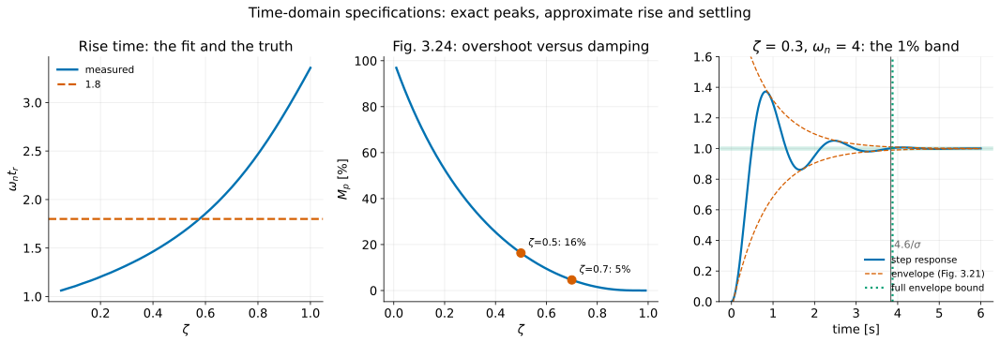
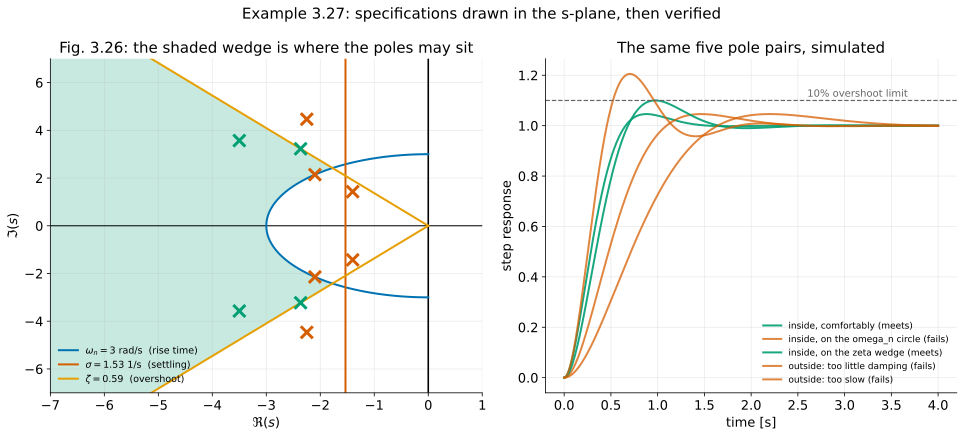
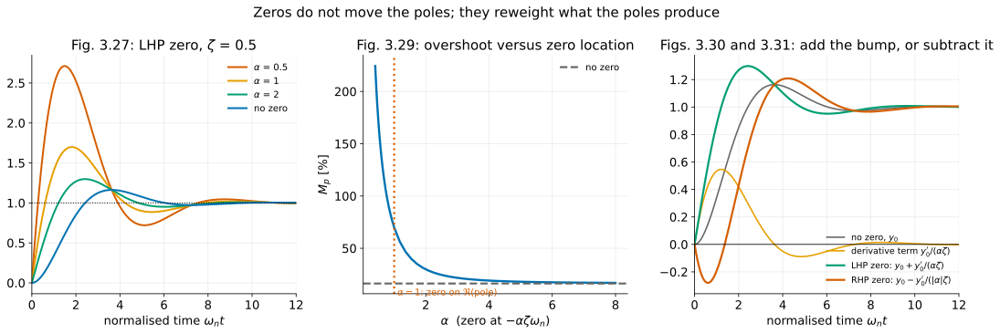
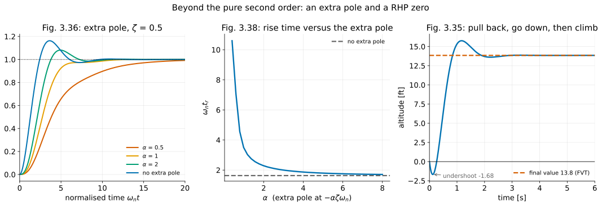

# Dynamic Response III — Time-Domain Specifications and the Effects of Zeros

**Student lecture notes — FPE 8th ed., Sections 3.4 and 3.5**

Rise time, overshoot, and settling time turn a response sketch into measurable requirements. For a standard second-order system, these requirements suggest a region for the poles. Zeros and additional poles change the response, so the resulting estimates must be checked against the complete model.

**Prerequisites:** [L2: Block diagrams and pole locations](block-diagrams_student.md), especially the standard second-order form and pole geometry.

**Source:** Franklin, Powell & Emami-Naeini, *Feedback Control of Dynamic Systems*, 8th ed. Example and equation numbers follow the textbook. Numbered sections and § references refer to these notes unless labelled as textbook sections.

## Learning objectives

After studying this lecture, you should be able to:

1. Define $t_r$, $t_p$, $M_p$ and $t_s$ off a step-response plot, and state the convention each definition depends on.
2. Derive $t_p=\pi/\omega_d$ and $M_p=e^{-\pi\zeta/\sqrt{1-\zeta^2}}$ from the second-order step response.
3. Explain why $t_s\simeq4.6/\sigma$ is an approximate decay-time rule, distinguish it from a conservative envelope bound, and explain why $t_r\simeq1.8/\omega_n$ is a fit.
4. Convert a set of specifications into $\omega_n$, $\zeta$ and $\sigma$ bounds, and shade the allowable region of the $s$-plane (Example 3.27).
5. Give the first-order results: $M_p=0$, $t_r=\ln9/\sigma$, $t_s=\ln100/\sigma$ for a 1% band.
6. Explain how a zero near a pole reduces that mode's coefficient, using the cover-up formula (Eqs. 3.78–3.79).
7. Decompose the step response of a system with a zero into $y_0+\dot y_0/(\alpha\sigma)$ in physical time, and use it to predict increased overshoot for a LHP zero and initial undershoot for a RHP zero.
8. State the factor-of-four rule for both zeros and extra poles, and the direction of each effect.
9. Recognise nonminimum-phase behaviour in a physical system and explain the mechanism (Example 3.30).
10. Judge when the second-order estimates may be used on a higher-order plant, and verify the judgement by simulation.

## Notation and assumptions

| Symbol | Meaning |
|---|---|
| $t_r$ | rise time, from 10% to 90% of the final value |
| $t_p$ | peak time |
| $M_p$ | overshoot, as a fraction of the final value |
| $t_s$ | settling time, to within 1% here (2% and 5% are also used) |
| $\sigma=\zeta\omega_n$ | distance of the pole from the imaginary axis; positive for a stable pole |
| $\alpha$ | normalised zero (or extra-pole) location: the zero sits at $s=-\alpha\zeta\omega_n=-\alpha\sigma$ |

Unless stated otherwise, transfer functions describe causal LTI systems from zero initial state. Add the zero-input response for nonzero initial conditions. LHP and RHP mean the left and right half planes.

The decay rate $\sigma$ is positive for a stable pole: $s=-\sigma\pm j\omega_d$. It is the negative of the pole’s real part.

---

## 1. From response shapes to specifications {#section-1}

A response specification states measurable limits, such as a maximum rise time, overshoot, or settling time. The first task is to convert these limits into pole-location constraints. The second is to check how accurately the standard second-order model represents the complete response.

---

## 2. The four specifications {#section-2}

### 2.1 Definitions {#section-2-1}

| Quantity | Definition |
|---|---|
| **Rise time** $t_r$ | time to get to the vicinity of the new setpoint; the book uses 10% to 90% |
| **Settling time** $t_s$ | time for the transient to decay and stay inside a band; 1% here |
| **Overshoot** $M_p$ | for the positive unit-step responses here, the maximum excess over the final value, divided by the final value |
| **Peak time** $t_p$ | time at which that maximum occurs |

Rise time and settling time depend on the chosen convention. Here rise time means 10% to 90% of the final value, and settling time uses a 1% band. Compare measurements and predictions only when their conventions agree.

### 2.2 Rise time {#section-2-2}

The 10–90% rise time of the standard second-order response depends on damping. A commonly used approximation for moderate damping is

$$
\boxed{
t_r\simeq\frac{1.8}{\omega_n}
\tag{3.68}
}
$$

**Worked check:** Compute the 10% and 90% crossings of the standard step response. The products $\omega_nt_r$ are approximately 1.10, 1.64, 2.13, and 3.36 at $\zeta=0.1,0.5,0.7,1$, respectively. The value 1.8 is attained near $\zeta=0.58$; it is a rough fit, not a bound.

A pair placed exactly on the approximate $\omega_n$ boundary can fail a rise-time requirement. Example 3.27 below shows this explicitly.

### 2.3 Overshoot and peak time {#section-2-3}

For zero initial state, unit DC gain, $\omega_n>0$, and $0<\zeta<1$, the step response of the standard second-order system is

$$
y(t)=1-e^{-\sigma t}\left(\cos\omega_dt+\frac{\sigma}{\omega_d}\sin\omega_dt\right)
\tag{3.69}
$$

(derived in L2 by integrating the impulse response). The identity $A\sin\alpha+B\cos\alpha=C\cos(\alpha-\beta)$ compresses it. Here the bracket has $B=1$ and $A=\sigma/\omega_d=\zeta/\sqrt{1-\zeta^2}$, so

$$
C=\sqrt{1+\frac{\zeta^2}{1-\zeta^2}}=\frac{1}{\sqrt{1-\zeta^2}},
\qquad
\cos\beta=\frac BC=\sqrt{1-\zeta^2},
\qquad
\sin\beta=\frac AC=\zeta .
$$

Hence $\beta=\sin^{-1}\zeta$, the same angle $\theta$ as in the L2 pole geometry (Fig. 3.18), and

$$
\boxed{
y(t)=1-\frac{e^{-\sigma t}}{\sqrt{1-\zeta^2}}\cos(\omega_dt-\beta),
\qquad
\beta=\sin^{-1}\zeta
\tag{3.70}
}
$$

**Textbook correction:** The denominator of Eq. (3.70) is $\sqrt{1-\zeta^2}$, not $\sqrt{1-\zeta}$.

Differentiate Eq. (3.69) with the product rule. The derivative of $-e^{-\sigma t}$ is $+\sigma e^{-\sigma t}$, and the bracket differentiates to $-\omega_d\sin\omega_dt+\sigma\cos\omega_dt$:

$$
\dot y(t)=\sigma e^{-\sigma t}\left(\cos\omega_dt+\frac{\sigma}{\omega_d}\sin\omega_dt\right)
-e^{-\sigma t}\left(-\omega_d\sin\omega_dt+\sigma\cos\omega_dt\right).
$$

The two cosine terms, $+\sigma\cos$ and $-\sigma\cos$, cancel, and the algebra collapses to

$$
\dot y(t)=e^{-\sigma t}\left(\frac{\sigma^2}{\omega_d}+\omega_d\right)\sin\omega_dt
=\frac{\omega_n^2}{\omega_d}e^{-\sigma t}\sin\omega_dt ,
$$

using $\sigma^2+\omega_d^2=\omega_n^2$. This is the impulse response, Eq. (3.66), as it must be.

**Everything except $\sin\omega_dt$ is strictly positive**, so nonzero-time extrema occur at $\omega_dt=k\pi$. Odd $k$ give maxima and even $k$ minima. The first peak is at $\omega_dt_p=\pi$:

$$
\boxed{
t_p=\frac{\pi}{\omega_d}
\tag{3.71}
}
$$

Substituting $\omega_dt_p=\pi$ into Eq. (3.69), $\cos\pi=-1$ and $\sin\pi=0$:

$$
y(t_p)=1-e^{-\sigma\pi/\omega_d}(-1+0)=1+e^{-\sigma\pi/\omega_d} .
$$

The final value is 1, so the overshoot is $M_p=e^{-\sigma\pi/\omega_d}$. Finally, $\sigma/\omega_d=\zeta\omega_n/(\omega_n\sqrt{1-\zeta^2})=\zeta/\sqrt{1-\zeta^2}$:

$$
\boxed{
M_p=e^{-\zeta\pi/\sqrt{1-\zeta^2}},
\qquad 0<\zeta<1
\tag{3.72}
}
$$

At $\zeta=0$, the same peak formula gives a 100% excursion above the equilibrium value, but the response never settles and has no final-value limit. For $\zeta\ge1$, the zero-free standard step response is monotone: $M_p=0$ and there is no finite overshoot peak time.

Two useful rounded values, worth memorising, follow. At $\zeta=0.5$ the exponent is $\pi(0.5)/0.866=1.814$, and $e^{-1.814}=0.163$. At $\zeta=0.7$ it is $\pi(0.7)/0.714=3.079$, and $e^{-3.079}=0.046$:

$$
\boxed{
\zeta=0.5 \Rightarrow M_p=16\%
\qquad\qquad
\zeta=0.7 \Rightarrow M_p=5\%
}
$$

#### Check your understanding

> $M_p$ depends on $\zeta$ alone. Not on $\omega_n$. Why should that be?

Because $\omega_n$ only scales time. Two systems with the same $\zeta$ have the same step response shape, one played faster than the other. Overshoot is a property of the shape.

Algebraically, $\sigma t=\zeta(\omega_nt)$ and $\omega_dt=\sqrt{1-\zeta^2}(\omega_nt)$. Eq. (3.69) is therefore a function of $\zeta$ and the normalised time $\omega_nt$ only. The peak *height* depends on $\zeta$ alone, and the peak *time* scales as $1/\omega_n$.

### 2.4 Settling time {#section-2-4}

The textbook uses the exponential decay rate to estimate the 1% settling time. Dropping the oscillatory phase and the envelope prefactor gives

$$
e^{-\sigma t_s}=0.01
\quad\Longrightarrow\quad
\sigma t_s=-\ln0.01=\ln100=4.605
\quad\Longrightarrow\quad
\boxed{
t_s\simeq\frac{4.6}{\zeta\omega_n}=\frac{4.6}{\sigma}
\tag{3.73}
}
$$

**Qualification:** Eq. (3.70) gives the full bound

$$
|y(t)-1|\le\frac{e^{-\sigma t}}{\sqrt{1-\zeta^2}},\qquad
t_{s,\mathrm{env}}=\frac{-\ln\!\left(\epsilon\sqrt{1-\zeta^2}\right)}{\sigma},
\qquad 0<\zeta<1.
$$

The bound follows from Eq. (3.70) because $|\cos(\cdot)|\le1$. To get $t_{s,\mathrm{env}}$, set the bound equal to $\epsilon$ and take logs: $e^{-\sigma t}=\epsilon\sqrt{1-\zeta^2}$, so $\sigma t=-\ln(\epsilon\sqrt{1-\zeta^2})$. For a tolerance $\epsilon=0.01$, the response stays in the band once $t\ge t_{s,\mathrm{env}}$. The actual settling time is the last band crossing and can be earlier. The shorter rule $4.6/\sigma$ is **not a guaranteed upper bound**. Near critical damping the sinusoidal envelope bound is very loose; use the actual response. At $\zeta=1$, the step response is $1-(1+\omega_nt)e^{-\omega_nt}$ (L2), which approaches 1 monotonically from below. Setting the error $(1+x)e^{-x}=0.01$ with $x=\omega_nt$ gives a transcendental equation. Its root is $x\approx6.64$ (Newton's method from $x=6$ gives 6.49, 6.63, 6.64; or use `fsolve`), so $t_s\approx6.64/\omega_n$, not $4.6/\omega_n$. The factor $(1+x)$ is what the pure-exponential rule misses.

**Worked check:** At $\zeta=0.7$, $\omega_n=4$ rad/s, the actual 1% settling time is approximately 1.644 s, slightly later than $4.6/\sigma=1.643$ s. The corrected envelope bound above is approximately 1.765 s. Arithmetic: $\sigma=0.7\times4=2.8$ s$^{-1}$, $4.6/2.8=1.643$ s, $\sqrt{1-0.49}=0.714$, and $-\ln(0.00714)/2.8=4.942/2.8=1.765$ s. Thus the textbook estimate is not guaranteed conservative.

### 2.5 The first-order case {#section-2-5}

For $H(s)=\dfrac{\sigma}{s+\sigma}$ the step response is

$$
y(t)=\left(1-e^{-\sigma t}\right)1(t)
\tag{3.77}
$$

(the first-order step response of L2, scaled to unit DC gain). Each specification follows by solving $y(t)=$ level:

- **Overshoot.** $\dot y=\sigma e^{-\sigma t}>0$, so $y$ rises monotonically to 1 and never exceeds it: $M_p=0$.
- **Rise time.** $1-e^{-\sigma t}=p$ gives $t=-\ln(1-p)/\sigma$. So $t_{10}=-\ln0.9/\sigma=0.105/\sigma$ and $t_{90}=-\ln0.1/\sigma=2.303/\sigma$. The difference is $t_r=(\ln10-\ln\tfrac{10}{9})/\sigma=\ln9/\sigma=2.197/\sigma$.
- **Settling time.** The error is $e^{-\sigma t}$ exactly, with no oscillation and no prefactor. It reaches 0.01 at $t_s=\ln100/\sigma=4.605/\sigma$.

In summary,

$$
\boxed{
M_p=0,
\qquad
t_r=\frac{\ln9}{\sigma}\approx\frac{2.2}{\sigma},
\qquad
t_s=\frac{\ln100}{\sigma}\approx\frac{4.6}{\sigma},
\qquad
\tau=\frac1\sigma
}
$$

The first-order 10–90% result is exact: the two crossing times are $-\ln(0.9)/\sigma$ and $-\ln(0.1)/\sigma$, whose difference is $\ln9/\sigma$. The second-order factor 1.8 is a fit.

---

## 3. Design synthesis: specifications become a region {#section-3}

Invert the three formulas to obtain an **approximate design region**. Here $t_r,t_s,M_p$ denote the specified upper limits; only the overshoot constraint is exact for the standard underdamped pair:

$$
\boxed{
\omega_n\ge\frac{1.8}{t_r}
\qquad
\zeta\ge\zeta(M_p)
\qquad
\sigma\ge\frac{4.6}{t_s}
\tag{3.74–3.76}
}
$$

Each is a geometric constraint:

For $0<M_p<1$, the exact damping bound is

$$
\zeta\ge\frac{-\ln M_p}{\sqrt{\pi^2+(\ln M_p)^2}}.
$$

**Derivation.** Take logs of Eq. (3.72) and write $L=-\ln M_p>0$:

$$
\frac{\pi\zeta}{\sqrt{1-\zeta^2}}=L
\quad\Longrightarrow\quad
\pi^2\zeta^2=L^2(1-\zeta^2)
\quad\Longrightarrow\quad
\zeta^2(\pi^2+L^2)=L^2
\quad\Longrightarrow\quad
\zeta=\frac{L}{\sqrt{\pi^2+L^2}} .
$$

Squaring is safe because both sides are positive for $0<\zeta<1$. $M_p$ decreases as $\zeta$ increases, so "$M_p\le$ spec" becomes "$\zeta\ge$ this value".

**The other two bounds** follow directly from Eqs. (3.68) and (3.73). $t_r\simeq1.8/\omega_n\le t_r^{\rm spec}$ gives $\omega_n\ge1.8/t_r^{\rm spec}$, and $t_s\simeq4.6/\sigma\le t_s^{\rm spec}$ gives $\sigma\ge4.6/t_s^{\rm spec}$.

**Why each is the stated shape (the pole geometry of L2).** $\omega_n$ is the pole's distance from the origin, so a lower bound on it excludes a disc. $\zeta=\sin\theta$ with $\theta$ measured from the imaginary axis, so a lower bound on $\zeta$ is a lower bound on $\theta$: a wedge about the negative real axis. $\sigma$ is the distance from the imaginary axis, so a lower bound on it is a half-plane to the left of a vertical line.

| Bound | Region in the $s$-plane |
|---|---|
| $\omega_n\ge$ | outside a circle of that radius |
| $\zeta\ge$ | inside a wedge, measured by the angle $\theta=\sin^{-1}\zeta$ from the imaginary axis |
| $\sigma\ge$ | to the left of a vertical line |

### 3.1 Example 3.27 {#section-3-1}

Requirements: $t_r\le0.6$ s, $M_p\le10\%$, $t_s\le3$ s. The approximate constraints give:

$$
\omega_n\ge\frac{1.8}{0.6}=3\ \text{rad/s},
\qquad
\zeta\ge0.6,
\qquad
\sigma\ge\frac{4.6}{3}=1.53\ \text{s}^{-1} .
$$

The approximate settling constraint is redundant in this example: $\sigma=\zeta\omega_n\ge0.6\times3=1.8>1.53$. This does not remove the need to verify the actual settling and rise times.

**Precision and units:**

- The exact 10% overshoot bound is $\zeta\ge0.591155\ldots$; using $0.6$ rounds the bound slightly upward. From the formula above, $L=-\ln0.1=2.303$, so $\zeta=2.303/\sqrt{9.870+5.302}=2.303/3.895=0.591$. The corresponding wedge half-angle is $\theta=\sin^{-1}0.591=36.2^\circ$.
- The decay rate $\sigma$ has units of inverse seconds, not seconds.

**Worked check:** Place the poles at $\zeta=0.7$, $\omega_n=3$ rad/s. They satisfy the approximate design region: $\omega_n=3\ge3$, $\zeta=0.7\ge0.591$, and $\sigma=2.1\ge1.53$. Yet the actual 10–90% rise time is about 0.709 s, which is $\omega_nt_r\approx2.13$ from §2.2 divided by $\omega_n=3$, exceeding 0.6 s. The overshoot constraint is exact for the standard pair; the rise-time circle and settling-time line require verification.

---

*Checking the design region:* the shaded area is the approximate allowable region, using the exact 10% damping bound $\zeta\ge0.591155\ldots$. Unlike the textbook figure’s excluded-region shading, shading here means allowable. The pair on the $\omega_n=3$ circle at $\zeta=0.7$ meets the approximate bounds but fails the actual rise-time requirement.

## 4. Zeros, first pass: they reweight the modes {#section-4}

The residue at a simple pole is the transfer function with that pole’s factor removed, evaluated at the pole. A nearby zero reduces this residue and weakens the corresponding mode; exact cancellation removes its contribution from this input-output transfer function.

The book's pair of examples, normalised to the same DC gain:

$$
H_1(s)=\frac{2}{(s+1)(s+2)}=\frac{2}{s+1}-\frac{2}{s+2}
\tag{3.78}
$$

$$
H_2(s)=\frac{2(s+1.1)}{1.1(s+1)(s+2)}=\frac{2/11}{s+1}+\frac{18/11}{s+2}
\tag{3.79}
$$

**The residues, by cover-up.** Both transfer functions have $H(0)=1$: $2/(1\cdot2)=1$ and $2(1.1)/(1.1\cdot1\cdot2)=1$. The 1.1 in the denominator of $H_2$ is there to make that true.

$$
H_1:\quad
\left.\frac{2}{s+2}\right|_{s=-1}=\frac{2}{1}=2,
\qquad
\left.\frac{2}{s+1}\right|_{s=-2}=\frac{2}{-1}=-2 .
$$

$$
H_2:\quad
\left.\frac{2(s+1.1)}{1.1(s+2)}\right|_{s=-1}=\frac{2(0.1)}{1.1(1)}=\frac{0.2}{1.1}=\frac{2}{11},
\qquad
\left.\frac{2(s+1.1)}{1.1(s+1)}\right|_{s=-2}=\frac{2(-0.9)}{1.1(-1)}=\frac{1.8}{1.1}=\frac{18}{11} .
$$

The factor $(s+1.1)$ evaluated at the pole $s=-1$ is $0.1$. That small number is the whole effect.

$$
\boxed{
\text{the coefficient of }e^{-t}\text{ fell from }2\text{ to }2/11\approx0.18
}
$$

because the zero at $-1.1$ nearly cancels the pole at $-1$. Put the zero exactly at $-1$ and the term vanishes entirely.

#### Check your understanding

> If a zero can switch a mode off, is a pole-zero cancellation a good way to get rid of a mode you dislike?

Cancellation removes the mode from this transfer function. A mode present in the physical realisation can remain internally; Example 3.29 and L4 explain why that distinction matters.

---

## 5. The normalised family {#section-5}

To study zeros systematically, put the zero at $s=-\alpha\zeta\omega_n=-\alpha\sigma$ and normalise:

$$
\boxed{
H(s)=\frac{(s/\alpha\zeta\omega_n)+1}{(s/\omega_n)^2+2\zeta(s/\omega_n)+1}
\tag{3.80}
}
$$

For $\alpha>0$, **read $\alpha$ as the ratio of the zero's distance from the imaginary axis to the pair's distance $\sigma$**. Large $\alpha$ means a relatively distant LHP zero. $\alpha=1$ means equal real parts, not coincidence with either complex pole. Negative $\alpha$ puts the zero in the RHP. Assume $0<\zeta<1$ in this family.

**Worked check:** For $\zeta=0.5$, compare the zero-free overshoot (16.3%) with $\alpha=4,2,1,0.5$: approximately 19.1%, 29.8%, 69.9%, and 171%. A nearby zero can change the response substantially even though the poles are fixed.

**The factor-of-four rule:** explicitly check a real LHP zero whose distance from the imaginary axis is less than about four times $\sigma$ ($\alpha\lesssim4$). A more distant zero is a candidate for neglect, subject to a response check. It is not an error bound: at $\alpha=4$, overshoot still rises from 16.3% to 19.1% in this example.

---

## 6. Why: the derivative decomposition {#section-6}

A zero’s effect follows directly from the differentiation property of the Laplace transform.

Set $\omega_n=1$. Eq. (3.80) becomes

$$
H(s)=\frac{\dfrac{s}{\alpha\zeta}+1}{s^2+2\zeta s+1} .
$$

The numerator is a sum of two terms, so split the fraction into two terms over the same denominator:

$$
\boxed{
H(s)=\underbrace{\frac{1}{s^2+2\zeta s+1}}_{H_0(s)}
+\frac{1}{\alpha\zeta}\underbrace{\frac{s}{s^2+2\zeta s+1}}_{sH_0(s)}
\tag{3.81}
}
$$

The second term is a constant times $s$ times the first. With a step input, $Y=H/s$, so $Y=Y_0+\frac1{\alpha\zeta}sY_0$ with $Y_0=H_0/s$. By the differentiation property (property 5 in the L1 properties table), $\mathcal L\{\dot y_0\}=sY_0-y_0(0^-)=sY_0$, because the system starts at rest. Multiplication by $s$ is differentiation. Therefore, in the time domain,

$$
\boxed{
y(t)=y_0(t)+\frac{1}{\alpha\zeta}\,\dot y_0(t)
}
$$

where $y_0$ is the step response of the zero-free system.

With physical time and arbitrary $\omega_n$, the coefficient is $1/(\alpha\zeta\omega_n)=1/(\alpha\sigma)$. The displayed $1/(\alpha\zeta)$ form uses $\omega_n=1$ (or differentiation with respect to normalised time). The zero initial value of $y_0$ is what permits $sY_0=\mathcal L\{\dot y_0\}$ without an initial-condition term.

**Worked check:** Use the analytical derivative $\dot y_0=h_0$ to check $y=y_0+\dot y_0/(\alpha\zeta)$ when $\omega_n=1$. This avoids mistaking finite-difference error for failure of the identity.

---

## 7. Right half-plane zeros {#section-7}

Continue with $\omega_n=1$. Let $\alpha<0$, so the zero sits at $s=+|\alpha|\sigma$. The numerator becomes $1-s/(|\alpha|\zeta)$ and

$$
\boxed{
y(t)=y_0(t)-\frac{1}{|\alpha|\zeta}\dot y_0(t)
}
$$

**The hump is subtracted.** Early on, when $\dot y_0$ is largest, the response is pushed *down* — often below zero.

$$
\boxed{
\text{One real RHP zero added to this standard pair}
\ \Rightarrow\
\text{the step response starts out in the wrong direction}
}
$$

This is **nonminimum-phase** behaviour. Here $\dot y(0^+)=1/(\alpha\zeta)<0$ in normalised units, which proves the initial reversal.

*Derivation of the initial slope.* Differentiate the decomposition: $\dot y=\dot y_0+\frac1{\alpha\zeta}\ddot y_0$. For the zero-free pair, $\dot y_0=h_0$, which has $h_0(0^+)=0$ by Eq. (3.66) because $\sin0=0$. Its derivative at $0^+$ is $\ddot y_0(0^+)=\omega_n^2=1$, from differentiating Eq. (3.66) or from the initial value theorem, $\lim_{s\to\infty}s^2H_0(s)=1$. So $\dot y(0^+)=0+\frac1{\alpha\zeta}\cdot1=1/(\alpha\zeta)$, which is negative for $\alpha<0$. In general, having RHP zeros does not always mean the step response's first motion is backwards; other zeros and the relative degree matter. For example, two real RHP zeros can give an initially positive response followed by an inverse excursion. The prerequisite notes discuss the corresponding unstable zero dynamics.

**Worked check:** For $\zeta=0.5$, $\omega_n=1$ and $\alpha=-1,-2,-4$, the minimum step-response values are approximately $-0.752,-0.280,-0.091$. The early negative excursion grows as the positive real zero approaches the origin.

### 7.1 Comparing RHP-zero overshoot {#section-7-1}

The book's summary says a RHP zero "will depress the overshoot". Read carefully, because the comparison matters:

| Comparison | Result |
|---|---|
| RHP zero at $\alpha=-2$ versus LHP zero at $\alpha=+2$ | 20.9% versus 29.8% — **depressed** |
| RHP zero at $\alpha=-2$ versus no zero at all | 20.9% versus 16.3% — **raised** |

For this family, against the same-distance LHP zero the statement holds. Against the zero-free system it does not: subtracting the derivative term *after* the peak, where $\dot y_0<0$, pushes the response up. The reliable lesson here is inverse response and a performance limitation, not a universal decrease in overshoot.

### 7.2 Example 3.28: the zero moving through the poles {#section-7-2}

$$
H(s)=\frac{24}{z}\cdot\frac{s+z}{(s+4)(s+6)},
\qquad z=1,\dots,6
$$

The factor $24/z$ makes the DC gain unity: $H(0)=\frac{24}{z}\cdot\frac{z}{4\cdot6}=1$. For a unit step,

$$
Y(s)=\frac{24}{z}\cdot\frac{s+z}{s(s+4)(s+6)}=\frac{C_0}{s}+\frac{C_4}{s+4}+\frac{C_6}{s+6} .
$$

Cover up each factor:

$$
C_0=\frac{24}{z}\cdot\frac{z}{(4)(6)}=1,
\qquad
C_4=\frac{24}{z}\cdot\frac{z-4}{(-4)(2)}=-\frac{3(z-4)}{z}=\frac{12}{z}-3,
\qquad
C_6=\frac{24}{z}\cdot\frac{z-6}{(-6)(-2)}=\frac{2(z-6)}{z}=2-\frac{12}{z} .
$$

So the step response is

$$
y(t)=1+\left(\frac{12}{z}-3\right)e^{-4t}+\left(2-\frac{12}{z}\right)e^{-6t} .
$$

*Check:* $y(0)=1+\frac{12}{z}-3+2-\frac{12}{z}=0$ for every $z$ ✓.

The coefficients and peak overshoots are

| $z$ | coeff. of $e^{-4t}$ | coeff. of $e^{-6t}$ | overshoot |
|---:|---:|---:|---:|
| 1 | $+9.000$ | $-10.000$ | 108% |
| 2 | $+3.000$ | $-4.000$ | 25% |
| 3 | $+1.000$ | $-2.000$ | 3.7% |
| 4 | $0$ | $-1.000$ | 0 |
| 5 | $-0.600$ | $-0.400$ | 0 |
| 6 | $-1.000$ | $0$ | 0 |

**The overshoot column, by hand.** Write $c_4$ and $c_6$ for the two coefficients. A peak needs $\dot y=-4c_4e^{-4t}-6c_6e^{-6t}=0$. Dividing by $e^{-6t}$ gives $e^{2t_p}=-\dfrac{6c_6}{4c_4}$. This has a positive solution only when $c_4>0>c_6$ and $-6c_6>4c_4$, which is the case $z<4$. Let $r=e^{-2t_p}=-\dfrac{2c_4}{3c_6}$. Then $e^{-4t_p}=r^2$, $e^{-6t_p}=r^3$, and $y(t_p)=1+c_4r^2+c_6r^3$:

| $z$ | $c_4,\ c_6$ | $r$ | $t_p=-\tfrac12\ln r$ | $y(t_p)$ |
|---:|---|---:|---:|---|
| 1 | $9,\ -10$ | $\tfrac35$ | 0.255 s | $1+9(0.36)-10(0.216)=2.08$ |
| 2 | $3,\ -4$ | $\tfrac12$ | 0.347 s | $1+\tfrac34-\tfrac48=1.25$ |
| 3 | $1,\ -2$ | $\tfrac13$ | 0.549 s | $1+\tfrac19-\tfrac2{27}=1.037$ |

These reproduce 108%, 25% and 3.7%. For $4\le z\le6$ both coefficients are $\le0$, so $y<1$ for all $t>0$ and there is no overshoot.

The table shows three distinct cases:

1. **$z=4$ and $z=6$:** a common factor cancels, its residue is *exactly* zero, and the input-output response is first order. If a physical second-order realisation retains that mode, it is hidden from this transfer function; the reduced transfer function alone does not establish its internal presence.
2. **$z=5$, between the poles:** both coefficients are negative, the response approaches its final value from below, and there is no overshoot at all.
3. **$z\le3$:** the zero is nearer the origin than either pole, the coefficients grow and take opposite signs, and the overshoot runs away.

### 7.3 Example 3.29: complex zeros near lightly damped poles {#section-7-3}

$$
H(s)=\frac{(s+\alpha)^2+\beta^2}{(s+1)\left[(s+0.1)^2+1\right]}
$$

with the poles at $-0.1\pm j$ and the zeros placed at $-\alpha\pm j\beta$ for $(\alpha,\beta)=(0.1,1.0)$, $(0.25,1.0)$ and $(0.5,1.0)$.

Exact cancellation is sensitive to uncertainty in the pole location:

> *In practice, the locations of the lightly damped poles are not known precisely, and exact cancellation is not really possible.*

The stated transfer function has DC gain $H(0)=\dfrac{\alpha^2+\beta^2}{1\cdot(0.1^2+1)}=\dfrac{\alpha^2+\beta^2}{1.01}$. For the three cases this is $1.01/1.01=1.00$, $1.0625/1.01=1.052$ and $1.25/1.01=1.238$. For a common unit final value, compare $H(s)/H(0)$ rather than the unnormalised models. Placing compensator zeros near a resonance can attenuate its response, but exact cancellation is sensitive to modelling error. L4 treats unstable cancellations.

---

## 8. Example 3.30: an aeroplane that descends when you pull up {#section-8}

$$
\boxed{
\frac{h(s)}{\delta_e(s)}=\frac{30(s-6)}{s(s^2+4s+13)}
}
$$

Altitude $h$ from elevator angle $\delta_e$, for a Boeing 747. A zero at $s=+6$, from $s-6=0$. Poles at $s=0$ and at the roots of $s^2+4s+13$, which are $s=\frac{-4\pm\sqrt{16-52}}{2}=-2\pm3j$.

### 8.1 Physical mechanism {#section-8-1}

In this sign convention, an upward elevator deflection is negative. It initially pushes the tail downward, producing both a downward force and a nose-up moment. Before the aircraft has rotated, the downward force makes it sink. As the nose rises, the wing angle of attack and lift increase, and the aircraft climbs. For the impulse input considered below, it eventually reaches a new altitude. This inverse response comes from the input-output geometry.

### 8.2 The numbers {#section-8-2}

Final value, for the negative unit impulse $\delta_e(t)=-\delta(t)$, whose transform is $\Delta_e(s)=-1$:

$$
h(\infty)=\lim_{s\to0}s\cdot\frac{30(s-6)(-1)}{s(s^2+4s+13)}=\frac{30\times(-6)\times(-1)}{13}=+13.8 .
$$

The $s$ in front cancels the integrator pole, leaving $\dfrac{-30(s-6)}{s^2+4s+13}$ evaluated at $s=0$: $\dfrac{-30(-6)}{13}=\dfrac{180}{13}=13.85$.

**The initial dip, from the transform.** The altitude transform is $H_{\rm alt}(s)=\dfrac{-30(s-6)}{s(s^2+4s+13)}$, which has relative degree 2. The initial value theorem gives $h(0^+)=\lim_{s\to\infty}sH_{\rm alt}=0$ and $\dot h(0^+)=\lim_{s\to\infty}s^2H_{\rm alt}=-30$. The aircraft starts at the reference altitude and moves **down** at first, as the physical mechanism in §8.1 predicts.

**Note why an impulse gives a finite final value:** the pole at the origin integrates, and the integral of an impulse is a constant. A step input would give an altitude that increases forever.

For this input, $s$ times the altitude-output transform has poles $-2\pm3j$, so the Final Value Theorem applies even though the altitude plant has an integrator and is not BIBO stable. After scaling, the altitude impulse response equals the step response of a second-order pair with a RHP zero. Match $s^2+4s+13$ to $s^2+2\zeta\omega_ns+\omega_n^2$. This gives $\omega_n=\sqrt{13}=3.61$ rad/s, $2\zeta\omega_n=4$ so $\zeta=2/\sqrt{13}=0.555$, and $\sigma=\zeta\omega_n=2$, agreeing with the real part of the roots.

The estimates in the table follow:

- $t_r\simeq1.8/3.606=0.50$ s.
- For overshoot, $\sqrt{1-\zeta^2}=\sqrt{9/13}=3/\sqrt{13}$, so the exponent is $\pi\zeta/\sqrt{1-\zeta^2}=\pi\cdot\tfrac{2}{3}=2.094$ and $M_p=e^{-2.094}=0.123$.
- $t_s\simeq4.6/2=2.30$ s.

| Quantity | Estimate | Source | Complete-model response |
|---|---|---|---|
| $t_r$ | 0.50 s | $1.8/\omega_n$ | 0.43 s |
| $M_p$ | 12.3% | Eq. (3.72), using $\zeta=2/\sqrt{13}$ | 13.8% |
| $t_s$ | 2.30 s | $4.6/\sigma$ | 2.54 s |

The complete-model values use the negative unit elevator impulse. The 12.3% estimate evaluates Eq. (3.72) for the zero-free pair; the textbook’s approximate 14% estimate is read from its overshoot chart. The model’s nonzero RHP zero explains why the pair-only estimates differ from the response.

**Worked check:** For the negative unit elevator impulse, verify $h(\infty)=180/13\approx13.846$ and an initial minimum near $-1.68$. The altitude transform is $\frac{180}{13}\frac{1-s/6}{s}\frac{13}{s^2+4s+13}$. To see this, factor $-30(s-6)=180(1-s/6)$ and split $180=\frac{180}{13}\cdot13$. After scaling, this impulse response is exactly the step response of the second-order pair with a RHP zero: $1/s$ is the step, and the rest is a unit-DC-gain pair with the zero at $+6$. This explains why the second-order estimates are useful here.

---

## 9. Extra poles {#section-9}

Add a real pole at $-\alpha\zeta\omega_n$ to the standard pair:

$$
\boxed{
H(s)=\frac{1}{\left(\dfrac{s}{\alpha\zeta\omega_n}+1\right)\left[\left(\dfrac{s}{\omega_n}\right)^2+2\zeta\dfrac{s}{\omega_n}+1\right]}
\tag{3.82}
}
$$

$$
\boxed{
\text{an extra LHP pole increases the rise time; a LHP zero decreases it}
}
$$

**Worked check:** For $\zeta=0.5$, the normalised 10–90% rise times with an added pole at $-\alpha\sigma$ are approximately 1.87, 2.29, 3.46, and 8.49 for $\alpha=4,2,1,0.5$, compared with 1.64 without the extra pole. Even $\alpha=4$ changes rise time by about 14%.

Use the same factor-of-four heuristic to identify extra poles worth checking, not to certify that more distant poles have no effect. Approximation accuracy depends on modal residues, zeros, and the required tolerance as well as pole separation.

---

## 10. Summary {#section-10}

For the standard family studied here:

At $\zeta=0.3$, Eq. (3.72) gives 37.23% overshoot, rounded to 37% below.

$$
\boxed{
\begin{array}{l}
\textbf{1.}\ \text{Second order, no zeros: }
t_r\simeq1.8/\omega_n,\quad
M_p\approx5\%,16\%,37\%\ \text{at }\zeta=0.7,0.5,0.3,\quad
t_s\simeq4.6/\sigma\\[6pt]
\textbf{2.}\ \text{A nearby real LHP zero increases overshoot in the standard family}\\[6pt]
\textbf{3.}\ \text{A real RHP zero in that family causes inverse response; compare peaks explicitly}\\[6pt]
\textbf{4.}\ \text{An extra real LHP pole slows the rise; factor 4 is a heuristic, not a bound}
\end{array}}
$$

Specifications suggest a radius, angle, and distance from the imaginary axis for a dominant pole pair. Zeros change modal amplitudes, and extra poles add dynamics. Check the complete response before accepting a design, especially near a specification boundary. A RHP zero and a RHP pole are different: the stable plant $(1-s)/(s+1)^2$ has an inverse response because of its zero at $+1$.

---

## Review questions

1. $M_p$ depends on $\zeta$ alone while $t_r$ and $t_s$ depend on $\omega_n$ and $\sigma$. What does that say about which specification you should negotiate with a customer first?
2. A pole pair sits exactly on the $\omega_n=1.8/t_r$ circle at $\zeta=0.9$ and fails the rise-time requirement. Has the design method failed?
3. Example 3.28 has the zero exactly on a pole for $z=4$. If you built that system and pushed on it, would the missing mode be gone?
4. Two plants have identical poles. One has a zero at $-1$, the other at $+1$. Which is harder to control, and what in the step response tells you so?
5. The 747 climbs to a finite altitude after an impulsive elevator input but would climb forever after a step. Which pole is responsible, and what does that mean for the pilot?
6. When would you deliberately place a compensator zero near a lightly damped pole, given Example 3.29's warning?

## Optional practice

Optional practice from FPE, 8th edition; these are study suggestions, not an assignment.

| Problem | Topic |
|---|---|
| 3.16 | DC gain and final value of a second-order system |
| 3.30, 3.31 | Feedback parameters and attainable pole regions |
| 3.25, 3.26 | Choosing gain and pole location for a unity-feedback system |
| 3.27 | Peak time requirement |
| 3.28, 3.29 | Dynamics dominated by a complex pair; multiple specifications |
| 3.36 | Initial-condition response and logarithmic decrement |
| 3.37 | Ideal pitch response, aircraft |
| 3.38 | Approximating higher-order systems by second-order ones |
| 3.39, 3.42 | Modal response form, settling time, and overshoot estimates |
| 3.41 | Sketch a step response, then compare with Matlab |

## Chapter 3 student notes

- [L1: Convolution and transfer functions](convolution-impulse-response_student.md)
- [L2: Block diagrams and pole locations](block-diagrams_student.md)
- [L3: Specifications and zeros](time-domain-specs_student.md)
- [L4: Stability and Routh’s criterion](stability_student.md)
